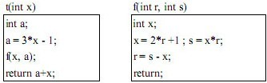

# Markdown语法速记及演练

-------------------

## 标题

# 一级标题

一级标题（方式二，下方任意数量=）
============

## 二级标题

二级标题（方式二，下方任意数量-）
------------

### 三级标题
#### 四级标题
##### 五级标题
###### 六级标题
####### 没有七级标题
###符号后应有空格

--------------

## 段落


段落一后面回车数次至少空一行

这是空一行后的段落二


这是空三行后的段落三

    不使用制表符缩进
    或者回车缩进

## 换行

段落一后面**空两格**回车  
这是段落二

或者使用\<br>HTML标签<br>
这是第二行

不空两格直接回车可能会无法正确显示。
这是第二行

## 强调

一对 **双星号** "\**...\**"为 **加粗**  
或者一对 **空格-双下划-内容-双下划线-空格** " \_\_... \_\_ "同样 __加粗__ 效果  

一对 *单星号* 为*斜体*效果  
或者一对 _空格-下划线-内容-下划线-空格_ " \_...\_ " 同样 _斜体_ 效果  

***粗斜体*** 则是 ___三星号或三下划线的组合___   

## 块引用

> 块引用开头加"> "符号及空格  
>   
> 多行块则每一行开头均加标识块  

> 中间有行没加的则按新块处理  
>> 嵌套块为两格半括号符号及空格">> "  
>> - 块中可以引用其他元素，比如这里的列表"- "
>> - **加粗效果**  
>> ### 三级标题
> 等等

## 列表

- 有序列表  
1. 每一行前加数字、英文句点、空格"1."，不必顺序排列，但应当从1开始  
1. 这里的开头还是"1."  
4. 这里的开头是"4."  
    1. 这里的开头带缩进，为"    1."  
    5. 这里的开头带缩进，为"    5."  
8. 这里的开头是"8."  
    3. 这里的开头带缩进，为"    3."    
    5. 这里的开头带缩进，为"    5."    

- 无序列表 使用符号：  
    - "\-"  
    + "\+"  
    * "\*"  
- 利用双空格或制表位缩进来描述列表缩进  
    * 缩进1  
   * 缩进2 略微少一格  
    * 缩进3 同缩进1  
      * 缩进4 更近两格  
- 为了兼容性 需在同一级别缩进使用一种标识符号  
  > 为确保列表连续性 内嵌符号亦需缩进同级使用"  >"
  
  段落亦如此  

      如果是代码块 则额外缩进4个空格
      
      或是1个制表符
  1. 有序列表
  3. 和无序列表
      * 可以混用
      * 可以穿插混排
        1. 这又是一个列表
        4. 列表继续
  5. 这条列表开头是"    5."

## 代码语法

单词或短语中应用 `代码` 应用反引号"\`"  
转义：``如果需要引用`反引号` `` 则可以将其包含在另一对双反引号中"\`\`"

    如果是代码块  
    需要缩进一个制表符
    或者四个空格

```
或者使用围栏式语法，这里前后为三个反引号"```"独立成行
```

```C#
#在首部的三反引号后跟上语言名称，如这里的 "```C#"，可进行语法高亮
using system.io
class App(){
    public main(){
        #这里是伪码示例
        int i=1;
        MegBox(i);
        return;
    }
}
```

## 分割线

独立成行，用三个星号"***"  

***

三个横线"---"

---

三个下划线"___"

___

均可，为保证兼容性，分割线上下均需空行

## 超链接

使用中括号 "\[文字\]\(链接\)" 如：[百度](http://baidu.com)  
"\[文字\]\(链接 \"可选的描述文字\"\)" 如：[百度](http://baidu.com "说明文字")

用尖括号可直接"<>"将网址和邮箱转变为链接  
<http://microsoft.com>  
<hello@123.oo>  

链接亦支持强化格式，如加粗 **[百度](http://baidu.com)** 斜体 *[百度](http://baidu.com)* ，代码块需将反括号打在方括号内 [`百度`](http://baidu.com)

引用链接为两部分 第一部分为[描述文字] [序号] 第二部分为[序号]: 链接
比如， 这里的参考资料 [1] 如链接所示

[1]: https://markdown.com.cn/basic-syntax/links.html  

## 图片语法

! [图片alt] (exams/RUANKAO/ReadyForSA/imgs/2020042601.jpg "图片title")


\


给图片创建超链接 需将图片的Markdown整体放在超链接的方括号中

## 转义字符语法

用反斜杠\\ 如这里用了双反斜杠  
需要特殊处理的字符转义：<、&   
可使用 \&lt; 和 \&amp;

## 支持的HTML内联语法
行级内联 \<span>、\<cite>、\<del>  
区块内联必须前后加空行 \<div>、\<table>、\<pre>、\<p>  
尽量不要使用制表符（tabs）或空格（spaces）对 HTML 标签做缩进，否则将影响格式
HTML中不再使用Markdown语法 如 \<p>italic and \*\*bold\*\*\</p> 恐不起作用

## 其他语法

表格用|和-符号制表  
标题和内容列用|符号隔开括内 不论空格
标题和内容行中间用"|---|----|---|"等符号标识列
用"| :--- | :---: | ---: |"等标识（左中右）对齐


|标题1|标题2|
|------:| :-----:|
|这是内容1|内容2|
|内容3|这是内容4|

您可以在表格中设置文本格式。例如，您可以添加链接，代码（仅反引号（`）中的单词或短语，而不是代码块）和强调。

您不能添加标题，块引用，列表，水平规则，图像或HTML标签。

~~删除线~~ 用双波浪线"\~\~"前后括出

任务列表 开头 - [x]

- [x] Write the press release
- [ ] Update the website
- [x] Contact the media

emoji表情

去露营了！ :tent: 很快回来。  
真好笑！ :joy:

定义列表用冒号空格: 开头

First Term
: This is the definition of the first term.

Second Term
: This is one definition of the second term.
: This is another definition of the second term.