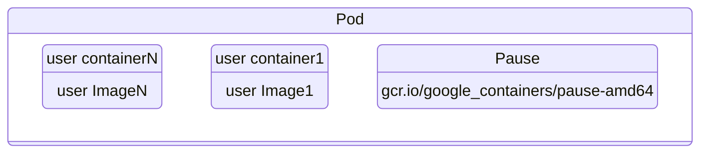
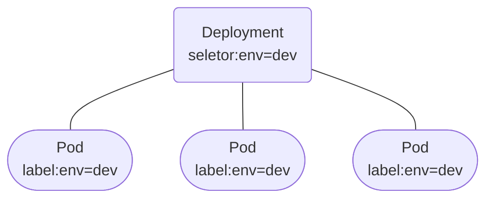
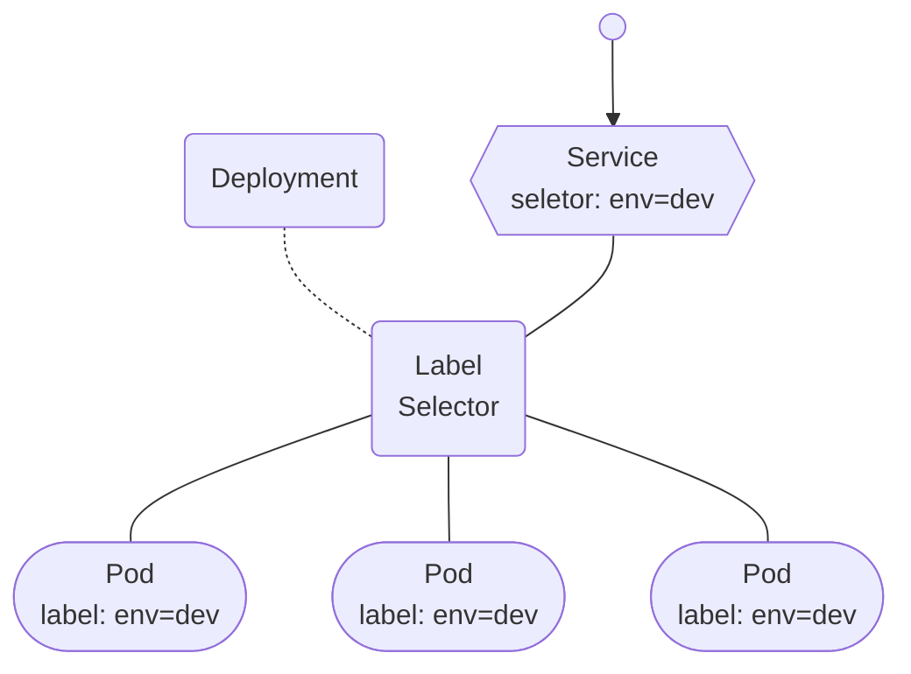

https://developer.aliyun.com/article/1366693
https://developer.aliyun.com/article/1366697
https://developer.aliyun.com/article/1366699

## 1. Kubernetes 介绍

### 1.1 K8S 部署方式演变

随着互联网的发展，在应用程序部署方式上主要经历了三个时代：

#### 1.传统部署：互联网早期，会直接将应用程序部署在物理机上
- 优点：简单，不需要其它技术的参与

- 缺点：不能为应用程序定义资源使用边界，很难合理地分配计算资源，而且程序之间容易产生影响

#### 2.虚拟化部署：可以在一台物理机上运行多个虚拟机，每个虚拟机都是独立的一个环境

- 优点：程序环境不会相互产生影响，提供了一定程度的安全性

- 缺点：增加了操作系统，浪费了部分资源

#### 3.容器化部署：与虚拟化类似，但是共享了操作系统

- 优点：  
    - 可以保证每个容器拥有自己的文件系统、CPU、内存、进程空间等  
    - 运行应用程序所需要的资源都被容器包装，并和底层基础架构解耦  
    - 容器化的应用程序可以跨云服务商、跨Linux操作系统发行版进行部署  

容器化部署方式给带来很多的便利，但是也会出现一些问题，比如说：  
- 一个容器故障停机了，怎么样让另外一个容器立刻启动去替补停机的容器  
- 当并发访问量变大的时候，怎么样做到横向扩展容器数量  

这些容器管理的问题统称为容器编排问题，为了解决这些容器编排问题，就产生了一些容器编排的软件：
- Swarm：Docker自己的容器编排工具
- Mesos：Apache的一个资源统一管控的工具，需要和Marathon结合使用
- Kubernetes：Google开源的的容器编排工具

#### 1.2 kubernetes简介

kubernetes 的 logo, 标志是一个舵手，因为英文单词 K 和 S 中间包含 8 个字母，所以简称 K8S， 是一个全新的基于容器技术的分布式架构领先方案，是谷歌严格保密十几年的秘密武器----Borg 系统的一个开源版本，于 2014 年 9 月发布第一个版本，2015年 7 月发布第一个正式版本。

kubernetes 的本质是一组服务器集群，它可以在集群的每个节点上运行特定的程序，来对节点中的容器进行管理。目的是实现资源管理的自动化，主要提供了如下的主要功能：

- 自我修复：一旦某一个容器崩溃，能够在1秒中左右迅速启动新的容器
- 弹性伸缩：可以根据需要，自动对集群中正在运行的容器数量进行调整
- 服务发现：服务可以通过自动发现的形式找到它所依赖的服务
- 负载均衡：如果一个服务起动了多个容器，能够自动实现请求的负载均衡
- 版本回退：如果发现新发布的程序版本有问题，可以立即回退到原来的版本
- 存储编排：可以根据容器自身的需求自动创建存储卷

#### 1.3 kubernetes组件

一个 kubernetes 集群主要是由控制节点 master、工作节点 node构成，每个节点上都会安装不同的组件。
- master：集群的控制平面，负责集群的决策 ( 管理 )  
Master 节点上会安装四个重要组件，分别如下：  
    - ApiServer : 资源操作的唯一入口，接收用户输入的命令，提供认证、授权、API注册和发现等机制
    - Scheduler : 负责集群资源调度，按照预定的调度策略将 Pod 调度到相应的 node 节点上
    - ControllerManager : 负责维护集群的状态，比如程序部署安排、故障检测、自动扩展、滚动更新等
    - Etcd ：负责存储集群中各种资源对象的信息，相当于 K8S 的数据库
- node：集群的数据平面，负责为容器提供运行环境 ( 干活 )  
node 节点上会安装三个重要组件，分别如下：
    - Kubelet : 负责维护容器的生命周期，即通过控制docker，来创建、更新、销毁容器
    - KubeProxy : 负责提供集群内部的服务发现和负载均衡
    - Docker : 负责节点上容器的各种操作


下面，以部署一个 nginx 服务来说明 kubernetes 系统各个组件调用关系：

1. 首先要明确，一旦 kubernetes 环境启动之后，master 和 node 都会将自身的信息存储到 etcd 数据库中；

2. 一个 nginx 服务的安装请求会首先被发送到 master 节点的 apiServer 组件；

3. apiServer 组件会调用 scheduler 组件来决定到底应该把这个服务安装到哪个 node 节点上，在此时，它会从 etcd 中读取各个 node 节点的信息，然后按照一定的算法进行选择，并将结果告知 apiServer；

4. apiServer 调用 controller-manager 去调度 Node 节点安装 nginx 服务；

5. kubelet 接收到指令后，会通知 docker，然后由 docker 来启动一个 nginx 的 pod，pod 是 kubernetes 的最小操作单元，容器必须跑在 pod 中；

6. 当Pod启动后，一个 nginx 服务就运行了，如果需要访问 nginx，就需要通过 kube-proxy 来对 pod 产生访问的代理。这样，外界用户就可以访问集群中的 nginx 服务了

### 1.4 kubernetes 概念

- Master：集群控制节点，每个集群需要至少一个 master 节点负责集群的管控

- Node：工作负载节点，由 master 分配容器到这些 node 工作节点上，然后 node 节点上的 docker 负责容器的运行

- Pod：kubernetes 的最小控制单元，容器都是运行在 pod 中的，一个 pod 中可以有 1 个或者多个容器

- Controller：控制器，通过它来实现对 pod 的管理，比如启动 pod、停止 pod、伸缩 pod 的数量等等

- Service：pod 对外服务的统一入口，下面可以维护着同一类的多个 pod

- Label：标签，用于对 pod 进行分类，同一类 pod 会拥有相同的标签

- NameSpace：命名空间，用来隔离 pod 的运行环境


## 2. kubernetes集群环境搭建
### 2.1 部署方式  
Kubernetes 有多种部署方式，目前主流的方式有：minikube、kubeadm、二进制包等。  
在生产环境 Kubernetes 集群主要有两种方式：
#### 1. kubeadm  
Kubeadm 是一个 K8s 部署工具，提供 kubeadm init 和 kubeadm join，用于快速部署 Kubernetes 集群。  
官方地址：  
https://kubernetes.io/docs/reference/setup-tools/kubeadm/kubeadm/  
#### 2. 二进制包   
从 github 下载发行版的二进制包，手动部署每个组件，组成 Kubernetes 集群。  
Kubeadm 降低部署门槛，但屏蔽了很多细节，遇到问题很难排查。如果想更容易可控，推荐使用二进制包部署 Kubernetes 集群，虽然手动部署麻烦点，期间可以学习很多工作原理，也利于后期维护。


### 2.2 kubeadm 部署方式介绍

kubeadm 是官方社区推出的一个用于快速部署 kubernetes 集群的工具，这个工具能通过两条指令完成一个 kubernetes 集群的部署：
- 创建一个 Master 节点 kubeadm init
- 将 Node 节点加入到当前集群中$ kubeadm join < Master 节点的IP 和端口

### 2.3 安装要求

在开始之前，部署 Kubernetes 集群机器需要满足以下几个条件：

- 一台或多台机器，操作系统 CentOS7.x-86_x64  
- 硬件配置：2GB 或更多 RAM，2 个 CPU 或更多 CPU，硬盘 30GB 或更多  
- 集群中所有机器之间网络互通  
- 可以访问外网，需要拉取镜像  
- 禁止 swap 分区  

### 2.4 最终目标

- 在所有节点上安装 Docker 和 kubeadm  
- 部署 Kubernetes Master  
- 部署容器网络插件  
- 部署 Kubernetes Node，将节点加入 Kubernetes 集群中  
- 部署 Dashboard Web 页面，可视化查看 Kubernetes 资源  

### 2.5 准备环境


本文采用三节点进行部署，mini1 代表 Master 节点，mini2、mini3 代表 node 节点。

|角色 |IP地址 |组件 |
|----|----|----|
|mini1|192.168.244.131|docker, kubectl, kubeadm, kubelet|
|mini2|192.168.244.132|docker, kubectl, kubeadm, kubelet|
|mini3|192.168.244.133|docker, kubectl, kubeadm, kubelet|

### 2.6 环境初始化

下面 2.6.1 - 2.6.11 章节的执行步骤在三台机器上全部执行,截图只展示 mini1的内容！！！

#### 2.6.1 检查操作系统的版本
```
# 此方式下安装 kubernetes 集群要求 Centos 版本要在 7.5 或之上
[root@mini1 ~]# cat /etc/redhat-release
CentOS Linux release 7.6.1810 (Core)
```
#### 2.6.2 主机名解析

在 hosts 文件配置 IP 地址映射
```
# 主机名成解析 编辑三台服务器的/etc/hosts文件，添加下面内容
192.168.244.131 mini1
192.168.244.132 mini2
192.168.244.133 mini3
```

#### 2.6.3 时间同步
kubernetes 要求集群中的节点时间必须精确一直，这里使用 chronyd 服务从网络同步时间  
企业中建议配置内部的会见同步服务器  
chronyd 安装教程如下：  
```
# 启动chronyd服务
[root@mini1 ~]# yum install -y chrony
[root@mini1 ~]# systemctl start chronyd
[root@mini1 ~]# systemctl enable chronyd
[root@mini1 ~]# date
```
#### 2.6.4  禁用 iptable 和 firewalld 服务  
kubernetes和docker 在运行的中会产生大量的iptables规则，为了不让系统规则跟它们混淆，直接关闭系统的规则
```
# 1 关闭firewalld服务
[root@mini1 ~]# systemctl stop firewalld
[root@mini1 ~]# systemctl disable firewalld
# 2 关闭iptables服务
[root@mini1 ~]# systemctl stop iptables
[root@mini1 ~]# systemctl disable iptables
```
#### 2.6.5 禁用 selinux

selinux 是 linux 系统一下的一个安全服务，如果不关闭它，在安装集群中会产生各种各样的奇葩问题
```
# 编辑 /etc/selinux/config 文件，修改SELINUX的值为disable
# 注意修改完毕之后需要重启linux服务
SELINUX=disabled
```
#### 2.6.6 禁用 swap 分区
swap 分区值是虚拟内存分区，它的作用是物理内存使用完之后将磁盘空间虚拟成内存来使用，启用 swap 设备会对系统的性能产生非常负面的影响，因此 kubernetes 要求每个节点都要禁用 swap 设备，但是如果因为某些原因确实不能关闭 swap 分区，就需要在集群安装过程中通过明确的参数进行配置说明
```
# 编辑分区配置文件/etc/fstab，注释掉swap分区一行
# 注意修改完毕之后需要重启linux服务
vim /etc/fstab
注释掉 /dev/mapper/centos-swap swap
# /dev/mapper/centos-swap swap
```
#### 2.6.7 修改 linux 的内核参数
```
# 修改 linux 的内核采纳数，添加网桥过滤和地址转发功能
# 编辑/etc/sysctl.d/kubernetes.conf文件，添加如下配置：
net.bridge.bridge-nf-call-ip6tables = 1
net.bridge.bridge-nf-call-iptables = 1
net.ipv4.ip_forward = 1
# 重新加载配置
[root@mini1 ~]# sysctl -p
# 加载网桥过滤模块
[root@mini1 ~]# modprobe br_netfilter
# 查看网桥过滤模块是否加载成功
[root@mini1 ~]# lsmod | grep br_netfilter
```
#### 2.6.8 配置 ipvs 功能  
在 Kubernetes 中 Service 有两种模型，一种是基于 iptables 的，一种是基于 ipvs 的，两者比较的话，ipvs的性能明显要高一些，但是如果要使用它，需要手动载入ipvs模块
```
# 1.安装ipset和ipvsadm
[root@mini1 ~]# yum install ipset ipvsadmin -y
# 2.添加需要加载的模块写入脚本文件
[root@mini1 ~]# cat <<EOF> /etc/sysconfig/modules/ipvs.modules
#!/bin/bash
modprobe -- ip_vs
modprobe -- ip_vs_rr
modprobe -- ip_vs_wrr
modprobe -- ip_vs_sh
modprobe -- nf_conntrack_ipv4
EOF
# 3.为脚本添加执行权限
[root@mini1 ~]# chmod +x /etc/sysconfig/modules/ipvs.modules
# 4.执行脚本文件
[root@mini1 ~]# /bin/bash /etc/sysconfig/modules/ipvs.modules
# 5.查看对应的模块是否加载成功
[root@mini1 ~]# lsmod | grep -e -ip_vs -e nf_conntrack_ipv4
# 6.重启服务
[root@mini1 ~]# reboot
```
#### 2.6.9 安装docker
```
# 1、切换镜像源
[root@mini1 ~]# wget https://mirrors.aliyun.com/docker-ce/linux/centos/docker-ce.repo -O /etc/yum.repos.d/docker-ce.repo
# 2、查看当前镜像源中支持的docker版本
[root@mini1 ~]# yum list docker-ce --showduplicates
# 3、安装特定版本的docker-ce
# 必须制定--setopt=obsoletes=0，否则yum会自动安装更高版本
[root@mini1 ~]# yum install --setopt=obsoletes=0 docker-ce-18.06.3.ce-3.el7 -y
# 4、添加一个配置文件
#Docker 在默认情况下使用 Vgroup Driver 为 cgroupfs，而 Kubernetes推荐使用 systemd 来替代 cgroupfs
[root@mini1 ~]# mkdir /etc/docker
[root@mini1 ~]# cat <<EOF> /etc/docker/daemon.json
{
    "exec-opts": ["native.cgroupdriver=systemd"],
    "registry-mirrors": ["https://kn0t2bca.mirror.aliyuncs.com"]
}
EOF
# 5、启动 dokcer
[root@mini1 ~]# systemctl restart docker
[root@mini1 ~]# systemctl enable docker
```
#### 2.6.10 安装Kubernetes组件
```
# 1、由于 kubernetes 的镜像在国外，速度比较慢，这里切换成国内的镜像源
# 2、添加下面的配置
[root@mini1 ~]# cat > /etc/yum.repos.d/kubernetes.repo << EOF
[kubernetes]
name=Kubernetes
baseurl=https://mirrors.aliyun.com/kubernetes/yum/repos/kubernetes-el7-x86_64
enabled=1
gpgcheck=0
repo_gpgcheck=0
gpgkey=https://mirrors.aliyun.com/kubernetes/yum/doc/yum-key.gpg https://mirrors.aliyun.com/kubernetes/yum/doc/rpm-package-key.gpg
EOF
# 3、安装kubeadm、kubelet和kubectl
[root@mini1 ~]# yum install -y   kubectl-1.17.4-0 kubeadm-1.17.4-0 kubelet-1.17.4-0
# 4、配置kubelet的cgroup
#vim /etc/sysconfig/kubelet, 添加下面的配置
KUBELET_CGROUP_ARGS="--cgroup-driver=systemd"
KUBE_PROXY_MODE="ipvs"
# 5、设置kubelet开机自启
[root@mini1 ~]# systemctl enable kubelet
```
#### 2.6.11 准备集群镜像
````
# 在安装 kubernetes 集群之前，必须要提前准备好集群需要的镜像，所需镜像可以通过下面命令查看
[root@mini1 ~]# kubeadm config images list
# 下载镜像
# 此镜像 kubernetes 的仓库中，由于网络原因，无法连接，下面提供了一种替换方案
[root@mini1 ~]# images=(
    kube-apiserver:v1.17.4
    kube-controller-manager:v1.17.4
    kube-scheduler:v1.17.4
    kube-proxy:v1.17.4
    pause:3.1
    etcd:3.4.3-0
    coredns:1.6.5
)
[root@mini1 ~]# for imageName in ${images[@]};do
    docker pull registry.cn-hangzhou.aliyuncs.com/google_containers/$imageName
    docker tag registry.cn-hangzhou.aliyuncs.com/google_containers/$imageName k8s.gcr.io/$imageName
    docker rmi registry.cn-hangzhou.aliyuncs.com/google_containers/$imageName 
done
````
（待完成后可）使用 docker images 查看一下下载的镜像。  
#### 2.6.12 集群初始化

下面的操作只需要在 mini1 节点上执行即可
````
# 创建集群
[root@mini1 ~]# kubeadm  reset init \
    --kubernetes-version v1.17.4 \
    --pod-network-cidr=10.244.0.0/16 \
  --service-cidr=10.96.0.0/12 \
  --apiserver-advertise-address=192.168.244.131
  ````
上面的步骤执行完后，当看到"Your Kubernetes control-plane has initialized successfully!"，证明 kubernetes 控制面板已经初始化成功！  
紧接着，在 mini1 主节点执行下面的操作  
```
# 创建必要文件
[root@mini1 ~]# mkdir -p $HOME/.kube
[root@mini1 ~]# sudo cp -i /etc/kubernetes/admin.conf $HOME/.kube/config
[root@mini1 ~]# sudo chown $(id -u):$(id -g) $HOME/.kube/config
```
下面的操作只需要在 mini2，mini3  node 节点上执行即可
```
# 1.先在主节点 mini1 生成 token，然后复制生成的token
[root@mini1 ~]# kubeadm token create --print-join-command
#2.查询一下其他 node 节点端口是否占用
[root@mini2 ~]# lsof -i:10250
[root@mini3 ~]# lsof -i:10250
#3. 杀死占用的端口进程
[root@mini2 ~]# kill -9  xx
[root@mini3 ~]# kill -9  xx
#4.复制 mini1 生成的 token 在mini2、mini3 节点执行
# 5 在 mini1 master 节点上查看节点信息
[root@mini1 ~]# kubectl get nodes
```
上面执行的那些命令的含义是将 mini2,mini3 node 节点添加到主节点中，随后我们可以看到 mini1、mini2、mini3 三个节点的网络状态都是 NotReady 状态，还不能通信，所以我们需要安装网络插件进行节点间通信。

#### 2.6.13 安装网络插件，

只在 mini1 节点操作即可,插件使用的是DaemonSet 控制器，它会在每个节点上运行。  
（1）下载 kube-flannel.yml 文件  
```
wget https://github.com/flannel-io/flannel/tree/master/Documentation/kube-flannel.yml
```
（2）将文件导出来，修改文件中 quay.io 仓库为 quay-mirror.qiniu.com  
（3）使用配置文件启动 fannel  
```
kubectl apply -f kube-flannel.yml
```
（4）查看集群状态是否已经是Ready, 若是Ready，则执行 2.7 操作。如不是 执行后面几步  
```
# 查看集群状态
[root@mini1 ~]# kubectl get nodes
```
（5） 查看pod运行状态  
```
# 生成 新的token
[root@mini1 ~]# kubectl get pod -n kube-system  -o wide
```
发现 flannel 状态为 Init:ImagePullBackOff，根据此教程进行修改  
```
https://www.cnblogs.com/pyxuexi/p/14288591.html
```
等待它安装完毕 发现已经是 集群的状态已经是 Ready  
### 2.7 集群测试
#### 2.7.1 创建一个nginx服务
```
kubectl create deployment nginx  --image=nginx:latest -alpine
```
#### 2.7.2 暴露端口
```
kubectl expose deploy nginx  --port=80 --target-port=80  --type=NodePort
```
#### 2.7.3 查看服务
```
kubectl get pod
kubectl get svc
```
#### 2.7.4 查看 pod
在浏览器登录创建的 Nginx 服务，查看是否成功。
```
192.168.244.131:30886
```

## 3. 资源管理
### 3.1 资源管理介绍
在 kubernetes 中，所有的内容都抽象为资源，用户需要通过操作资源来管理 kubernetes。

    kubernetes 的本质上就是一个集群系统，用户可以在集群中部署各种服务，所谓的部署服务，其实就是在 kubernetes 集群中运行一个个的容器，并将指定的程序跑在容器中。
    kubernetes 的最小管理单元是 pod 而不是容器，所以只能将容器放在Pod中，而 kubernetes 一般也不会直接管理 Pod，而是通过Pod控制器来管理 Pod 的。
    Pod 可以提供服务之后，就要考虑如何访问 Pod 中服务，kubernetes 提供了Service资源实现这个功能。
    当然，如果 Pod 中程序的数据需要持久化，kubernetes 还提供了各种存储系统。
    学习 kubernetes 的核心，就是学习如何对集群上的Pod、Pod 控制器、Service、存储等各种资源进行操作


### 3.2 YAML 语言介绍  
YAML 是一个类似 XML、JSON 的标记性语言。它强调以数据为中心，并不是以标识语言为重点。因而 YAML 本身的定义比较简单，号称"一种人性化的数据格式语言"。
```
apiVersion: v1
kind: Namespace
metadata:
  name: dev
```
YAML 的语法比较简单，主要有下面几个：  
• 大小写敏感  
• 使用缩进表示层级关系  
• 缩进不允许使用 tab，只允许空格( 低版本限制 )  
• 缩进的空格数不重要，只要相同层级的元素左对齐即可  
• '#'表示注释  
YAML 支持以下几种数据类型：  
• 纯量：单个的、不可再分的值  
• 对象：键值对的集合，又称为映射（mapping）/ 哈希（hash） / 字典（dictionary）  
• 数组：一组按次序排列的值，又称为序列（sequence） / 列表（list）  
```
# 纯量, 就是指的一个简单的值，字符串、布尔值、整数、浮点数、Null、时间、日期
# 1 布尔类型
c1: true (或者True)
# 2 整型
c2: 234
# 3 浮点型
c3: 3.14
# 4 null类型 
c4: ~  # 使用~表示null
# 5 日期类型
c5: 2018-02-17    # 日期必须使用ISO 8601格式，即yyyy-MM-dd
# 6 时间类型
c6: 2018-02-17T15:02:31+08:00  # 时间使用ISO 8601格式，时间和日期之间使用T连接，最后使用+代表时区
# 7 字符串类型
c7: three     # 简单写法，直接写值 , 如果字符串中间有特殊字符，必须使用双引号或者单引号包裹 
c8: line1
    line2     # 字符串过多的情况可以拆成多行，每一行会被转化成一个空格
```
```
# 对象
# 形式一(推荐):
lyz:
  age: 27
  address: hangzhou
# 形式二(了解):
lyz: {age: 27,address: hangzhou}
```
```
# 数组
# 形式一(推荐):
address:
  - 顺义
  - 昌平  
# 形式二(了解):
address: [顺义,昌平]
```
小提示：  
1 书写 yaml 切记: 后面要加一个空格  
2 如果需要将多段 yaml 配置放在一个文件中，中间要使用---分隔  
3 下面是一个 yaml 转 json 的网站，可以通过它验证 yaml 是否书写正确  
https://www.json2yaml.com/convert-yaml-to-json  

### 3.3 资源管理方式
• 命令式对象管理：直接使用命令去操作kubernetes资源  
```
kubectl run nginx-pod --image=nginx:1.17.1 --port=80
```
• 命令式对象配置：通过命令配置和配置文件去操作 kubernetes 资源  
```
kubectl create/patch -f nginx-pod.yaml
```
• 声明式对象配置：通过 apply 命令和配置文件去操作 kubernetes 资源  
```
kubectl apply -f nginx-pod.yaml
```
|类型|操作对象|适用环境|优点|缺点|
|---|---|---|---|---|
|命令式对象管理|对象|测试|简单|只能操作活动对象，无法审计、追踪|
|命令式对象配置|文件|开发|可以审计、跟踪|项目大时，配置文件多，操作麻烦|
|声明式对象配置|目录|开发|支持目录操作|意外情况下难以调试|
### 3.3.1 命令式对象管理
**kubectl命令**  
kubectl是kubernetes集群的命令行工具，通过它能够对集群本身进行管理，并能够在集群上进行容器化应用的安装部署。kubectl命令的语法如下：
```
kubectl [command] [type] [name] [flags]
```
**comand**：指定要对资源执行的操作，例如create、get、delete  
**type**：指定资源类型，比如deployment、pod、service  
**name**：指定资源的名称，名称大小写敏感  
**flags**：指定额外的可选参数  
```
# 查看所有pod
kubectl get pod 
# 查看某个pod
kubectl get pod pod_name
# 查看某个pod,以yaml格式展示结果
kubectl get pod pod_name -o yaml
```
**资源类型**

kubernetes中所有的内容都抽象为资源，可以通过下面的命令进行查看:
```
kubectl api-resources
```
经常使用的操作有下面这些：
|资源分类|资源名称|缩写|资源作用|
|---|---|---|---|
|集群级别资源|nodes|no|集群组成部分|
|namespaces|ns|隔离Pod||
|pod资源|pods|po|装载容器|
|pod资源控制器|replicationcontrollers|rc|控制pod资源|
||replicasets|rs|控制pod资源|
||deployments|deploy|控制pod资源|
||deamonsets|ds|控制pod资源|
||jobs||控制pod资源|
||cronjobs|cj|控制pod资源|
||horizontalpodautoscalers|hpa|控制pod资源|
||statefulsets|sts|控制pod资源|
|服务发现资源|services|svc|统一pod对外接口|
||ingress|ing|统一pod对外接口|
|存储资源|volumeattachments||存储|
||persistentvolumes|pv|存储|
||persistentvolumeclaims|pvc|存储|
|配置资源|configmaps|cm|配置|
||secrets||配置|

**操作**

kubernetes允许对资源进行多种操作，可以通过--help查看详细的操作命令
```
kubectl --help
```
### 3.3.2 命令式对象配置

命令式对象配置就是使用命令配合配置文件一起来操作 kubernetes 资源。

1） 创建一个nginxpod.yaml，内容如下：
```
apiVersion: v1
kind: Namespace
metadata:
  name: dev
---
apiVersion: v1
kind: Pod
metadata:
  name: nginxpod
  namespace: dev
spec:
  containers:
  - name: nginx-containers
    image: nginx:latest
```
2）执行create命令，创建资源：
```
[root@mini1 ~]# kubectl create -f nginxpod.yaml
namespace/dev created
pod/nginxpod created
```
此时发现创建了两个资源对象，分别是namespace和pod
3）执行get命令，查看资源：
```
[root@mini1 ~]#  kubectl get -f nginxpod.yaml
NAME            STATUS   AGE
namespace/dev   Active   18s
NAME            READY   STATUS    RESTARTS   AGE
pod/nginxpod    1/1     Running   0          17s
```
这样就显示了两个资源对象的信息
4）执行delete命令，删除资源：
```
[root@mini1 ~]# kubectl delete -f nginxpod.yaml
namespace "dev" deleted
pod "nginxpod" deleted
```
此时发现两个资源对象被删除了  
**总结:**
命令式对象配置的方式操作资源，可以简单的认为：  
命令  +  yaml 配置文件（里面是命令需要的各种参数）  

### 3.3.3 声明式对象配置

声明式对象配置跟命令式对象配置很相似，但是它只有一个命令 apply。
```
# 首先执行一次kubectl apply -f yaml文件，发现创建了资源
[root@mini1 ~]#  kubectl apply -f nginxpod.yaml
namespace/dev created
pod/nginxpod created
# 再次执行一次kubectl apply -f yaml文件，发现说资源没有变动
[root@mini1 ~]#  kubectl apply -f nginxpod.yaml
namespace/dev unchanged
pod/nginxpod unchanged
```
**总结:**

 其实声明式对象配置就是使用apply描述一个资源最终的状态（在yaml中定义状态）  
 使用apply操作资源：  
-  如果资源不存在，就创建，相当于 kubectl create  
-  如果资源已存在，就更新，相当于 kubectl patch  

扩展：kubectl 可以在 node 节点上运行吗 ?

> kubectl 的运行是需要进行配置的，它的配置文件是 $HOME/.kube，如果想要在 node 节点运行此命令，需要将 master 上的.kube文件复制到 node 节点上，即在 master 节点上执行下面操作：
```
[root@mini1 ~]# scp -r /root/.kube 192.168.244.132:/root/
[root@mini1 ~]# scp -r /root/.kube 192.168.244.133:/root/
```
**使用推荐: 三种方式应该怎么用 ?**

创建/更新资源 使用声明式对象配置 kubectl apply -f XXX.yaml
删除资源 使用命令式对象配置 kubectl delete -f XXX.yaml
查询资源 使用命令式对象管理 kubectl get(describe) 资源名称

## 4. 实战入门

本章节将介绍如何在 kubernetes 集群中部署一个 nginx 服务，并且能够对其进行访问。

### 4.1 Namespace

Namespace 是 kubernetes 系统中的一种非常重要资源，它的主要作用是用来实现多套环境的资源隔离或者多租户的资源隔离。

默认情况下，kubernetes 集群中的所有的 Pod 都是可以相互访问的。但是在实际中，可能不想让两个 Pod 之间进行互相的访问，那此时就可以将两个 Pod 划分到不同的 namespace 下。kubernetes 通过将集群内部的资源分配到不同的 Namespace 中，可以形成逻辑上的"组"，以方便不同的组的资源进行隔离使用和管理。

可以通过 kubernetes 的授权机制，将不同的 namespace 交给不同租户进行管理，这样就实现了多租户的资源隔离。此时还能结合 kubernetes 的资源配额机制，限定不同租户能占用的资源，例如 CPU 使用量、内存使用量等等，来实现租户可用资源的管理。

kubernetes 在集群启动之后，会默认创建几个 namespace。下面土哥给大家进行演示一下：
```
[root@mini1 ~]# kubectl  get namespace
NAME              STATUS   AGE
default           Active   45h     #  所有未指定Namespace的对象都会被分配在default命名空间
kube-node-lease   Active   45h     #  集群节点之间的心跳维护，v1.13开始引入
kube-public       Active   45h     #  此命名空间下的资源可以被所有人访问（包括未认证用户）
kube-system       Active   45h     #  所有由Kubernetes系统创建的资源都处于这个命名空间
```
下面来看namespace资源的具体操作：

### 4.1.1 查看
```
# 1 查看所有的ns  命令：kubectl get ns
[root@mini1 ~]# kubectl get ns
NAME              STATUS   AGE
default           Active   45h
kube-node-lease   Active   45h
kube-public       Active   45h     
kube-system       Active   45h     
# 2 查看指定的 ns   命令：kubectl get ns ns名称
[root@mini1 ~]# kubectl get ns default
NAME      STATUS   AGE
default   Active   45h
# 3 指定输出格式  命令：kubectl get ns ns名称  -o 格式参数
# kubernetes 支持的格式有很多，比较常见的是 wide、json、yaml
[root@mini1 ~]# kubectl get ns default -o yaml
  
# 4 查看 ns 详情  命令：kubectl describe ns ns名称
[root@mini1 ~]# kubectl describe ns default
```
### 4.1.2 创建
```
# 创建namespace
[root@mini1 ~]# kubectl create ns dev
namespace/dev created
```
### 4.1.3 删除
```
# 删除namespace
[root@mini1 ~]# kubectl delete ns dev
namespace "dev" deleted
```
### 4.1.4 配置方式
首先准备一个yaml文件：ns-dev.yaml
```
apiVersion: v1
kind: Namespace
metadata:
  name: dev
```
然后就可以执行对应的创建和删除命令了：  
创建：kubectl create -f ns-dev.yaml  
删除：kubectl delete -f ns-dev.yaml  
### 4.2 Pod

Pod 是 kubernetes 集群进行管理的最小单元，程序要运行必须部署在容器中，而容器必须存在于 Pod 中。  
**Pod 可以认为是容器的封装，一个 Pod 中可以存在一个或者多个容器**。


kubernetes 在集群启动之后，集群中的各个组件也都是以 Pod 方式运行的。可以通过下面命令查看：  
```
[root@mini1 ~]# kubectl get pod -n kube-system
```
### 4.2.1 创建并运行
kubernetes 没有提供单独运行 Pod 的命令，都是通过 **Pod 控制器**来实现的
```
# 命令格式：kubectl run (pod控制器名称) [参数] 
# --image  指定Pod的镜像
# --port   指定端口
# --namespace  指定 namespace
[root@mini1 ~]# kubectl run nginx --image=nginx:latest --port=80 --namespace dev 
deployment.apps/nginx created
```
### 4.2.2 查看 pod 信息
```
# 查看 Pod 基本信息
[root@mini1 ~]# kubectl get pods -n dev
# 查看 Pod 的详细信息
[root@mini1 ~]# kubectl describe pod nginx -n dev
```
### 4.2.3 访问 Pod
```
# 获取 podIP
[root@mini1 ~]# kubectl get pods -n dev -o wide
```
```
#访问 POD
[root@mini1 ~]# curl 10.244.2.14:80
```
### 4.2.4 删除指定 Pod
```
# 删除指定Pod
[root@mini1 ~]# kubectl delete pod nginx -n dev
pod "nginx" deleted
# 此时，显示删除 Pod 成功，但是再查询，发现又新产生了一个 
[root@mini1 ~]# kubectl get pods -n dev
NAME    READY   STATUS    RESTARTS   AGE
nginx-...     x   1/1     Running   0          21s
# 这是因为当前 Pod 是由 Pod 控制器创建的，控制器会监控 Pod 状况，一旦发现 Pod 死亡，会立即重建
# **此时要想删除 Pod，必须删除 Pod 控制器**
# 先来查询一下当前 namespace 下的 Pod 控制器
[root@mini1 ~]# kubectl get deploy -n  dev
NAME    READY   UP-TO-DATE   AVAILABLE   AGE
nginx   1/1     1            1           9m7s
# 接下来，删除此PodPod控制器
[root@mini1 ~]# kubectl delete deploy nginx -n dev
deployment.apps "nginx" deleted
# 稍等片刻，再查询Pod，发现Pod被删除了
[root@mini1 ~]# kubectl get pods -n dev
No resources found in dev namespace.
```
### 4.2.5 配置操作
创建一个pod-nginx.yaml，内容如下：
```
apiVersion: v1
kind: Pod
metadata:
  name: nginx
  namespace: dev
spec:
  containers:
  - image: nginx:latest
    name: pod
    ports:
    - name: nginx-port
      containerPort: 80
      protocol: TCP
```
然后就可以执行对应的创建和删除命令了：  
创建：kubectl create -f pod-nginx.yaml  
删除：kubectl delete -f pod-nginx.yaml  

### 4.3 Label
Label 是 kubernetes 系统中的一个重要概念。它的作用就是在资源上添加标识，用来对它们进行区分和选择。  
Label 的特点：  
- 一个 Label 会以 key/value 键值对的形式附加到各种对象上，如 Node、Pod、Service 等等
- 一个资源对象可以定义任意数量的 Label ，同一个 Label 也可以被添加到任意数量的资源对象上去
- Label 通常在资源对象定义时确定，当然也可以在对象创建后动态添加或者删除

可以通过 Label 实现资源的多维度分组，以便灵活、方便地进行资源分配、调度、配置、部署等管理工作。

> 一些常用的 Label 示例如下：  
> - 版本标签："version":"release", "version":"stable"......
> - 环境标签："environment":"dev"，"environment":"test"，"environment":"pro"
> - 架构标签："tier":"frontend"，"tier":"backend"

标签定义完毕之后，还要考虑到标签的选择，这就要使用到 Label Selector，即：  
Label 用于给某个资源对象定义标识  
Label Selector 用于查询和筛选拥有某些标签的资源对象

当前有两种 Label Selector：  
- 基于等式的 Label Selector  
name = slave: 选择所有包含 Label 中 key="name" 且 value="slave"的对象  
env != production: 选择所有包括 Label 中的 key="env" 且 value 不等于 "production" 的对象

- 基于集合的 Label Selector  
name in (master, slave): 选择所有包含Label中的key="name"且value="master"或"slave"的对象  
name not in (frontend): 选择所有包含Label中的key="name"且value不等于"frontend"的对象  

标签的选择条件可以使用多个，此时将多个 Label Selector 进行组合，使用逗号","进行分隔即可。例如：  
name=slave，env!=production  
name not in (frontend)，env!=production  
### 4.3.1 命令方式
```
# 为 pod 资源打标签
[root@mini1 ~]# kubectl label pod nginx version=1.0 -n lyz
pod/nginx labeled
# 为pod资源更新标签
[root@mini1 ~]# kubectl label pod nginx version=2.0 -n lyz --overwrite
pod/nginx labeled
# 查看标签
[root@mini1 ~]# kubectl get pod nginx  -n lyz --show-labels
NAME        READY   STATUS    RESTARTS   AGE   LABELS
nginx   1/1     Running   0          10m   version=2.0
# 筛选标签 添加 -l
[root@mini1 ~]# kubectl get pod -n lyz -l version=2.0  --show-labels
NAME        READY   STATUS    RESTARTS   AGE   LABELS
nginx   1/1     Running   0          17m   version=2.0
[root@mini1 ~]# kubectl get pod -n lyz -l version!=2.0 --show-labels
No resources found in dev namespace.
#删除标签 key后面添加 - 号
[root@mini1 ~]# kubectl label pod nginx version- -n lyz
pod/nginx-pod labeled
```
### 4.3.2 配置方式
```
apiVersion: v1
kind: Pod
metadata:
  name: nginx2
  namespace: lyz
  labels:
    version: "3.0" 
    env: "test"
spec:
  containers:
  - image: nginx:1.7.1
    name: pod
    ports:
    - name: nginx-port
      containerPort: 80
      protocol: TCP
```
然后就可以执行对应的更新命令了：kubectl apply -f pod-nginx.yaml

## 4.4 Deployment

在 kubernetes 中，Pod 是最小的控制单元，但是 kubernetes 很少直接控制Pod，一般都是通过 Pod 控制器来完成的。Pod 控制器用于 pod 的管理，确保 pod 资源符合预期的状态，当 pod 的资源出现故障时，会尝试进行重启或重建 pod。  
在 kubernetes 中 Pod 控制器的种类有很多，本章节只介绍一种：Deployment。


### 4.4.1 命令操作
```
# 命令格式: kubectl create deployment 名称  [参数] 
# --image  指定pod的镜像
# --port   指定端口
# --replicas  指定创建pod数量
# --namespace  指定namespace
[root@mini1 ~]# kubectl run nginx --image=nginx:latest --port=80 --replicas=3 -n dev
deployment.apps/nginx created
# 查看创建的Pod
[root@mini1 ~]# kubectl get pods -n dev
NAME                     READY   STATUS    RESTARTS   AGE
nginx-5ff7956ff6-6k8cb   1/1     Running   0          19s
nginx-5ff7956ff6-jxfjt   1/1     Running   0          19s
nginx-5ff7956ff6-v6jqw   1/1     Running   0          19s
# 查看deployment的信息
[root@mini1 ~]# kubectl get deploy -n dev
NAME    READY   UP-TO-DATE   AVAILABLE   AGE
nginx   3/3     3            3           2m42s
# UP-TO-DATE：成功升级的副本数量
# AVAILABLE：可用副本的数量
[root@mini1 ~]# kubectl get deploy -n dev -o wide
NAME    READY UP-TO-DATE  AVAILABLE   AGE     CONTAINERS   IMAGES              SELECTOR
nginx   3/3     3         3           2m51s   nginx        nginx:latest        run=nginx
# 查看deployment的详细信息
[root@mini1 ~]# kubectl describe deploy nginx -n dev
  
# 删除 
[root@mini1 ~]# kubectl delete deploy nginx -n dev
deployment.apps "nginx" deleted
```
### 4.4.2 配置操作
创建一个deploy-nginx.yaml，内容如下：  
```
apiVersion: apps/v1
kind: Deployment
metadata:
  name: nginx
  namespace: dev
spec:
  replicas: 3
  selector:
    matchLabels:
      run: nginx
  template:
    metadata:
      labels:
        run: nginx
    spec:
      containers:
      - image: nginx:latest
        name: nginx
        ports:
        - containerPort: 80
          protocol: TCP
```
然后就可以执行对应的创建和删除命令了：  
创建：kubectl create -f deploy-nginx.yaml  
删除：kubectl delete -f deploy-nginx.yaml  

## 4.5 Service

通过前面的分享，我们已经可以使用 Deployment 来创建一组 Pod 来提供具有高可用性的服务。  
虽然每个 Pod 都会分配一个单独的 Pod IP，然而却存在如下两问题：  
- Pod IP 会随着 Pod 的重建产生变化  
- Pod IP 仅仅是集群内可见的虚拟 IP，外部无法访问  

这样对于访问这个服务带来了难度。因此，kubernetes 设计了 Service 来解决这个问题。
Service 可以看作是一组同类 Pod **对外的访问接口**。借助 Service，应用可以方便地实现服务发现和负载均衡。



### 4.5.1 创建集群内部可访问的 Service
```
# 暴露 Service
[root@mini1 ~]# kubectl expose deploy nginx --name=svc-nginx --type=ClusterIP --port=80 --target-port=80 -n lyz
service/svc-nginx exposed
# 查看 service
[root@mini1 ~]# kubectl get svc svc-nginx -n lyz -o wide
NAME         TYPE        CLUSTER-IP       EXTERNAL-IP   PORT(S)   AGE     SELECTOR
svc-nginx   ClusterIP   10.100.226.217   <none>        80/TCP    23s   run=nginx
# 这里产生了一个 CLUSTER-IP，这就是 service 的IP，在 Service 的生命周期中，这个地址是不会变动的
# 可以通过这个 IP 访问当前 service 对应的POD
[root@mini1 ~]# curl 10.100.226.271:80
```

### 4.5.2 创建集群外部也可访问的Service
```
# 上面创建的 Service 的 type 类型为 ClusterIP，这个 ip 地址只用集群内部可访问
# 如果需要创建外部也可以访问的 Service，需要修改 type 为 NodePort
[root@mini1 ~]# kubectl expose deploy nginx --name=svc-nginx2 --type=NodePort --port=80 --target-port=80 -n dev
service/svc-nginx2 exposed
# 此时查看，会发现出现了NodePort类型的Service，而且有一对Port（80:31928/TC）
[root@mini1 ~]# kubectl get svc  svc-nginx2  -n dev -o wide
NAME          TYPE        CLUSTER-IP       EXTERNAL-IP   PORT(S)        AGE    SELECTOR
svc-nginx2   NodePort   10.99.9.211   <none>        80:31113/TCP   11s   run=nginx
# 接下来就可以通过集群外的主机访问 节点IP:31113 访问服务了
# 例如在的电脑主机上通过浏览器访问下面的地址
http://192.168.244.131:31113/
```
### 4.5.3 删除Service
```
[root@mini1 ~]# kubectl delete svc svc-nginx2 -n dev 
service "svc-nginx2" deleted
```
### 4.5.4 配置方式

创建一个 svc-nginx.yaml，内容如下：
```
apiVersion: v1
kind: Service
metadata:
  name: svc-nginx
  namespace: dev
spec:
  clusterIP: 10.109.179.231 #固定 svc 的内网ip
  ports:
  - port: 80
    protocol: TCP
    targetPort: 80
  selector:
    run: nginx
  type: ClusterIP
  ```
然后就可以执行对应的创建和删除命令了：  
创建：kubectl create -f svc-nginx.yaml  
删除：kubectl delete -f svc-nginx.yaml

> 小结  
> 通过土哥的实战演练，我相信只要跟着步骤进行操作，就能掌握 Namespace、Pod、Deployment、Service资源的基本操作，有了这些操作，就可以在 kubernetes 集群中实现一个服务的简单部署和访问了，但是如果想要更好的使用 kubernetes，还需要深入学习这几种资源的细节和原理。

\~完\~