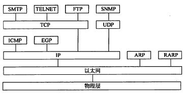

软考 备战2020上半年 网络工程师

20200211 每日一练 85
https://uc.educity.cn/tiku/testReport.html?id=6041073

	RAID分为0~7这8个不同的冗余级别，其中RAID0级无冗余校验功能：RAID1采用磁盘镜像功能，磁盘容量的利用率是50%； RAID3利用一台奇偶校验盘来完成容错功能。所以如果利用4个盘组成RAIDS阵列，可以有3个盘用于有效数据，磁盘容量的利用率为75%。

OSPF网络可以划分为多个区域（area），下面关于区域的描述中错误的是
A.区域可以被赋予0~65535中的任何编号 B.单域OSPF网络必须配置成区域1 
C.区域0被称为主干网 D.分层的OSPF网络必须划分为多个区域
W:A R:B

    OSPF网络可以划分为多个区域（area），每个OSPF区域被指定了一个32位的区域标识符，可以用点分十进制表示，例如主干区域的标识符可表示为0.0.0.0。单域OSPF网络就是只有主干区域的网络（配置成区域0）。分层的OSPF网络必须划分为多个区域。OSPF的区域分为以下5中，不同类型的区域对自治系统外部传入的路由信息的处理方式不同：
    • 标准区域：可以接收任何链路更新信息和路由汇总信息。
    • 主干区域：是连接各个区域的传输网络，其他区域都通过主干区域交换路由信息。主干区域拥有标准区域的所有性质。
    • 存根区域：不接收本地自治系统以外的路由信息，对自治系统以外的目标采用默认路由0.0.0.0。
    • 完全存根区域：不接收自治系统以外的路由信息，也不接收自治系统内其他区域的路由汇总信息，发送到本地区域外的报文使用默认路由0.0.0.0。完全存根区域是Cisco定义的，是非标准的。
    • 不完全存根区域（NSAA）：类似于存根区域，但是允许接收以类型7的链路状态公告发送的外部路由信息。

    UDP是一种简单的面向数据报的传输协议，实现的是不可靠、无连接的数据报服务，通常用于不要求可靠传输的场合，可以提高传输效率，减少额外开销。使用UDP传输时，应用进程的每次输出均生成一个UDP数据报，并将其封装在一个IP数据报中发送。
    UDP没有拥塞控制，所以网络出现的拥塞不会让源主机的发送速率降低。这对于某些实时应用是很重要的。很多实时的应用，例如IP电话、实时视频会议）要求源主机以恒定的速率发送数据，并且允许在网络拥塞情况下丢失一些数据，但却不允许数据有太大的时延，UDP正好适合这种要求。
    TCP的特点：
    （1）面向连接的传输层协议。
    （2）每一条TCP连接只能有两个端点：只能是点对点。
    （3）TCP提供可靠交付的服务：通过TCP连接传送的数据无差错、不丢失、不重复、并且按顺序到达。
    （4）TCP提供全双工通信：TCP允许通信双方的应用进程在任何时刻都能发送数据。在TCP连接的两端都有发送缓存和接收缓存，用来临时存放通信的数据。
    （5）面向字节流：TCP把应用进程交下来的数据看成是一连串无结构的字节流。TCP并不关心应用进程一次把多长的报文发送到TCP的缓存中，而是根据对端给出的窗口值和当前网络拥塞的程度来决定一个报文段应包含多少个字节。

    Hosts文件可以在本地定义域名对IP的解析。

    入侵检测是对已经产生的入侵行为进行分析和检测的功能，及时发现并处理，从而减少入侵带来的危害。

    Netstat –r作用就是显示路由表。

                                        
    OSPF定义了一下5种区域，不同类型的区域对由自制系统外部传入的路由信息的处理方式不同：
    标准区域：标准区域可以接收任何链路更新信息和路由汇总信息。
    主干区域：主干区域是连接各个区域的传输网络，其他区域都通过主干区域交换路由信息。主干区域拥有标准区域的所有性质。
    存根区域：不接受本地自治系统以外的路由信息，对自制系统以外的目标采用默认路由0.0.0.0。
    完全存根区域：不接受自制系统以外的路由信息，也不接受自制系统内其他区域的路由汇总信息，发送到本地区域外的报文使用默认路由0.0.0.0。完全存根区域是Cisco定义的，是非标准的。
    不完全存根区域（NSAA）：类似于存根区域，但是允许接收以类型7的链路状态公告发送的外部路由信息。

	需求分析阶段的任务主要是要解决系统做什么的问题，即弄清楚问题的要求，包括需要输入什么数据，要得到什么结果，最后应输出什么。
	概要设计的主要任务是把需求分析得到的结果转换为软件结构和数据结构，即将一个复杂系统按功能进行模块划分、建立模块的层次结构及调用关系、确定模块间的接口及人机界面、确定数据的结构特性、以及数据库的设计等。
	详细设计是在概要设计的基础上更细致的设计，它包括具体的业务对象设计、功能逻辑设计、界面设计等工作。详细设计是系统实现的依据，需要更多地考虑设计细节。
	编码即编写程序代码，具体实现系统。

假设模拟信号的最高频率为5MHz，采样频率必须大于（） ，才能使得到的样本信号不失真，如果每个样本量化为256个等级，则传输的数据速率是（）。*
A.5MHz B.10MHz C.15MHz D.20MHz      A.10Mb/s B.50Mb/s C.80Mb/s D.100Mb/s
W:BD R:BC

    按照尼奎斯特采样定理，为了恢复原来的模拟信号，取样速率必须大于模拟信号最高频率的二倍，即
    f=(1/T)>2f(max)
    其中f为采样频率，T为采样周期，f(max)为模拟信号的最高频率。所以当模拟信号的频率为5MHz时，采样频率必须大于10MHz.
	当样本量空间被量化为256个等级时.每个样本必须用8比特来表示。根据计算：8×10MHz=80Mb/s

20200212 每日一练 40
https://uc.educity.cn/tiku/testReport.html?id=6083101

在MIB-2中，IP组对象ipInReceives为接收的IP数据报总数，其数据类型为（  ）类型。
A.整数 B.计数器 C.序列 D.计量器
W:A R:B N:SNMP协议

    在MIB-2中，IP组对象ipInReceives为接收的IP数据报总数， 可以计数从接口收到的输入数据报的总量，包括收到的错误，其语法为32位计数器，最大权限是只读。

	正常情况下，FTP需要两个端口对外传输，如果你使用默认的21，还需要20端口传输数据，也就是说，数据传输端口比控制端口小1，例如说，你把FTP的端口改为2222，则数据传输的端口就是2221了.
	ftp服务器的模式问题：
	主动方式FTP的主要问题实际上在于客户端。FTP的客户端并没有实际建立一个到服务器数据端口的连接，它只是告诉服务器自己监听的一个随机端口号，服务器再回来连接客户端这个指定的端口。 
	被动FTP 也叫做PASV模式，只有当客户端通知服务器它处于被动模式时才启用。
	在被动方式FTP中，命令连接和数据连接都是由客户端发起的，当开启一个FTP连接时，客户端打开两个任意的非特权本地端口（N >; 1023和N+1）。第一个端口连接服务器的21端口，但与主动方式的FTP不同，客户端不会提交PORT命令并允许服务器来回连它的数据端口，而是提交PASV命令。这样做的结果是服务器会开启一个任意的非特权端口（P > 1023），并发送PORT P命令给客户端。然后客户端发起从本地端口N+1到服务器的端口P的连接用来传送数据。
	简单的来说就是下面的这个模型：
	主动FTP：
	命令连接：客户端 >1023端口 --> 服务器 21端口
	数据连接：客户端 >1023端口 <-- 服务器 20端口
	被动FTP：
	命令连接：客户端 >1023端口 --> 服务器 21端口
	数据连接：客户端 >1023端口 --> 服务器 >1023端口

在快速以太网物理层标准中，使用两对5类无屏蔽双绞线的是（  ）。*
A.100BASE-TX B.100BASE-FX C.100BASE-T4 D.100BASE-T2
R:A W:B N:IEEE 802标准

	1995年，100Mb/s的快速以太网标准IEEE 802.3u正式颁布，这是基于10Base-T和10Base-F技术、在基本布线系统不变的情况下开发的高速局域网标准。快速以太网使用的传输介质如下表（有错）所示，其中多模光纤的芯线直径为62.5µm，包层直径为125µm：单模光线芯线直径为8µm，包层直径也是125µm。

    整个综合布线系统通常由工作区子系统、水平子系统、干线子系统、设备间子系统、管理子系统和建筑群主干子系统6个部分组成。

    （1）工作区子系统：是连接用户终端设备的子系统，主要包括信息插座、信息插座和设备之间的适配器。通俗地说，就是指电脑和网线接口之间的部分。 
	（2）水平子系统：是连接工作区与主干的子系统，主要包括配线架、配线电缆和信息插座。通俗地说，就是指从楼层弱电井里的配线架到每个房间的网卡接口之间的部分，通常布线是在天花板上，因此与楼层平行。在水平子系统中，使用的是星型拓扑，即将每个网卡接口（信息模块）接回配线架，每个口一根线。 
	（3）管理子系统：管理子系统是对布线电缆进行端接及配置管理的子系统，通常在各个楼层都会设立。通俗地讲，这就是配线间中的设备部分。 
	（4）干线子系统：是用来连接管理间、设备间的子系统。通俗地说，就是将接入层交换机连接到分布层（或核心层）交换机的网络线路，由于其通常是顺着大楼的弱电井而下，是与大楼垂直的，因此也称为垂直子系统。通常来说，干线经常使用光缆，另外高品质的5类/超5类以及6类非屏蔽双绞线也是十分常用的。 
	（5）设备间子系统：是安装在设备间的子系统，而设备间是指集中安装大型设备的场所。一般来说，大型建筑物都会有一个或多个设备间。通常核心交换机所在的位置就是设备间。它与管理子系统相比，对于物理环境的要求更高。 
	（6）建筑群主干子系统：它是用来连接楼群之间的子系统，包括各种通信传输介质和支持设备，由于在户外，因此又称为户外子系统。通常包括地下管道、直埋沟内、架空三种方式。现在许多新的建筑物，通常都会预先留好地下管道。

SNMPc软件支持的4个内置TCP服务是（  ）。
A.FTP、SMTP、WEB 和 TELNET   B.DHCP、SMTP、WEB 和 TELNET
C.DNS、SMTP、WEB 和 TELNET   D.TFTP、SMTP、WEB 和 TELNET
R:A W:D N:SNMP协议

    SNMPC内网管理工具是由安奈特中国网络有限公司开发和研制的，目前最新版本是SNMPC 7.0。他是一个安全的分布式的通用网络管理系统平台，直观显示、监控和前瞻性地管理网络。能有效地监控整个网络的基础架构。支持SNMP V3，易用性较好。该软件4个内置的 TCP应用服务是FTP、SMTP、WEB、TELNET。

    累加寄存器AC通常简称为累加器，其功能是：当运算器的算术逻辑单元ALU执行算术或逻辑运算时，为ALU提供一个工作区。累加寄存器暂时存放ALU运算的结果信息。显然，运算器中至少要有一个累加寄存器。

双绞线电缆配置如下图所示，这种配置支持（  ）之间的连接。*

A.PC到路由器 B.PC到交换机 C.服务器到交换机 D.交换机到路由器
R:A W:D N:网络传输介质

    从图中可看出是交叉的线的连接方式，PC到路由器应采用交叉连接方式。
    现实是通用的，考试还是分直通和交叉线。
    交叉：DTE-DTE、DCE-DCE
    直通：DTE-DCE
    所以路由器连交换机属于DTE-DCE。
    PC跟路由器是同种设备*

渐增式开发方法有利于（）。
A.获取软件需求 B.快速开发软件 C.大型团队开发 D.商业软件开发
R:A W:B

    原型模型有抛弃式、演化式、渐增式三中原则。它们分别对应了快速原型模型、演化模型、增量模型。增量模型主要用户设计阶段，把软件产品划分为一系列的增量构建，分别进行设计、编程、集成、测试，新的增量构建不得破坏已经开发出来的产品。三种原则共同点都是用在用户没有明确的肯定其需求的时候，所以渐增式开发方法有利于获取软件需求。

某校园网的地址块是138.138.192.0/20，该校园网被划分为（）个C 类子网，不属于该校园网的子网地址是（）。
A.4 B.8 C.16 D.32    A.138.138.203.0 B.138.138.205.0 C.138.138.207.0 D.138.138.213.0
R:CD W:AA

    划分的C类子网为2^(24-20)=16个：
    分别将备选项A、B、C、D以及地址块138.13 8.192.0/20地址的第3个字节转化为二进制，即：11000000
    A：11001011     B：11001101     C：11001111     D：11010101
    第3个字节的前4位只有选项ABC和地址块一致，因此D不属于该校园网的子网地址。

20200213 每日一练 50
https://uc.educity.cn/tiku/testReport.html?id=6083139

设有两个子网 202.118.133.0/24 和 202.118.130.0/24，如果进行路由汇聚，得到的网络地址是（）。
A.202.118.128.0/21      B.202.118.128.0/22      C.202.118.130.0/22      D.202.118.132.0/20
R:A W:C

	网络202.118.133.0/24的二进制表示为：11001010 01110110 10000101 00000000   
	网络202.118.130.0/24的二进制表示为：11001010 01110110 10000010 00000000 
	两者的共同部分是（见黑体部分）：11001010 01110110 10000 000 00000000 
	所以经路由汇聚后得到的超网为202.118.128.0/21。

路由器Console端口默认的数据速率为（）。****
A.2400b/s       B. 4800b/s      C. 9600b/s      D. 10Mb/s 
R:C W:B*3

    可以通过控制台端口来访问和配置路由器交换机。这也是最常用、最有效的配置方法。控制台端口（Console ）是路由器的基本端口，连接控制台端口的线缆称为控制台电缆（Console Cable ）。控制台电缆一端插入交换机的控制台端口，另一端插入PC机的串行口，从而实现对交换机的访问和控制，参见下图所示。

     端口速率：9600bps；
     数据位：8；
     奇偶校验：无；
     停止位：1；
     数据流控制：无。

    为了使OSPF能用于规模很大的网络，OSPF将一个自治系统再划分为若干个更小的范围，叫做区域。划分区域的好处，就是利用洪泛法交换链路状态信息的范围限定在一个区域而不是整个的自治系统，减少了网络的通信量。在一个区域内部的路由器只知道本区域的完整拓扑结构，而不知道整个区域的网络拓扑的情况。为了使每一个区域能够和本区域以外的区域进行通信，OSPF使用层次结构的区域划分，在上层的区域叫做主干区域。主干区域的标识符规定为0.0.0.0。其作用是连通其他在下层的区域，从其他区域来的信息都由区域边界路由器进行概括。

在软件设计阶段，划分模块的原则是，一个模块的（）。
A.作用范围应该在其控制范围之内      B.控制范围应该在作用范围之内
C.作用范围与控制范围互不包含        D.作用范围与控制范围不受任何限制
R:A W:B N:软件开发方法论

    模块的作用范围应在控制范围之内。模块的控制范围包括它本身及其所有的从属模块。模块的作用范围是指模块内一个判定的作用范围，凡是受这个判定影响的所有模块都属于这个判定的作用范围。如果一个判定的作用范围包含在这个判定所在模块的控制范围之内，则这种结构是简单的，否则，它的结构是不简单的。

    DES算法为美国数据加密标准，是1972年美国IBM公司研制的对称密码体制加密算法。Diffie-Hellman为密钥交换算法。高级加密标准AES，是美国联邦政府采用的一种区块加密标准。这个标准用来替代原先的DES加密算法。报文摘要是指单向哈希函数算法将任意长度的输入报文经计算得出固定位的输出称为报文摘要。所谓单向是指该算法是不可逆的，找出具有同一报文摘要的两个不同报文是很困难的，常见的报文摘要算法有MD5、SHA。

    据2006年12月的统计，现在顶级域名TLD（Top Level Domain）已有265个，分为三大类：国家顶级域名nTLD、通用顶级域名gTLD、基础结构域名，其中org属于全世界通用顶级域名gTLD。

海明码是一种纠错的编程，一对有效码字之间的海明距离是（  ）。如果信息为6位，要求纠正1位，按照海明编码规则，需要增加的效验位是（  ）位。*
A.两个码字的比特数之和  B.两个码字的比特数之差  C.两个码字之间相同的比特数  D.两个码字之间不同的比特数
A.3 B.4 C.5 D.6
R:DB W:DA N:海明校验

	海明码属于线性分组编码方式，大多数分组码属于线性编码，其基本原理是，是信息码元与校验码元通过线性方程式联系起来。
	两个码子之间不同的比特数就是海明距离，此比特数又称为海明码距离。
	海明码的编码规则是：如果有n个数据位和k个冗余校验位，那么必须满足2^k -1≥n+k，此处k=4，因此有n≤2^k -1-k=16-1-4=11，n最大为11。

下图中主机A和主机B通过三次握手建立TCP连接，图中（1）处的状态是（  ），图（2）处的数字是（  ）。*

A.SYN received  B.Established  C.Listen   D.FIN wait
A.100  B.101  C.300  D.301
R:AB W:AD N:TCP协议

    TCP三次握手流程：
    1，A的TCP客户进程首先向B发出连接请求报文段，这时首部中的同步位SYN=1，同时选择一个初始序号seq=x。TCP规定，SYN报文段（SYN=1的报文段）不能携带数据，但要消耗一个序号。这时候，客户进程进入同步已发送状态。
    2，B收到这个连接请求之后，如同意建立连接，则向A发送确认。在确认报文段中应把SYN位和ACK位都置1，确认号是ack=x+1，同时也为自己选择一个初始序号seq=y。请注意，这个报文段也不能携带数据，但同样要消耗一个序号。这时TCP服务器进程进入同步收到状态。
    3，TCP客户进程收到B的确认后，还要向B给出确认，确认报文段的ACK置1，确认号ack=y+1，则自己的序号seq=x+1。TCP协议规定，ACK报文段可以携带数据，但如果不携带数据则不消耗序号。在这种情况下，下一个数据报文段的序号依然是seq=x+1。这时，TCP连接已经建立，A进入已建立连接状态。

    
	我们用二进制分别展开24和100
	24===0 0 0 1 1 0 0 0
	100==0 1 1 0 0 1 0 0
	与网络汇聚的方法一样，很快得出包含IP地址10.11.7.24和10.11.7.100的网络位有8+8+8+1=25，亦即该网络的子网掩码长度为25。

三层网络设计方案中，（  ）是汇聚层的功能。
A.不同区域的高速数据转发络  B.用户认证、计费管理络  C.终端用户接入网络  D.实现网络的访问策略控制 
R:D W:A N:逻辑网络设计

    核心层是互连网络的高速主干网，在设计中应增加冗余组件，使其具备高可靠性，能快速适应通信流量的变化。 设计核心层设备的功能时应避免使用数据包过滤、策略路由等降低转发速率的功能特性，使得核心层具有高速率、低延迟和良好的可管理性。 核心层设备覆盖的地理范围不宜过大，连接的设备不宜过多，否则会使得网络的复杂度增大，导致网络性能降低。 核心层应包括一条或多条连接外部网络的专用链路，使得可以高效地访问互联网。
    汇聚层是核心层与接入层之间的分界点，应实现资源访问控制和流量控制等功能。汇聚层应该对核心层隐藏接入层的详细信息，不管划分了多少个子网，汇聚层向核心路由器发布路由通告时，只通告各个子网汇聚后的超网地址。 如果局域网中运行了以太网和弹性分组环等不同类型的子网，或者运行了不同路由算法的区域网络，可以通过汇聚层设备完成路由汇总和协议转换功能。
    接入层提供网络接入服务，并解决本地网段内用户之间互相访问的需求，要提供足够的带宽，使得本地用户之间可以高速访问； 接入层还应提供一部分管理功能，例如MAC地址认证、用户认证、计费管理等； 接入层要负责收集用户信息(例如用户U地址、MAC地址、访问日志等)，作为计费和排错的依据。
    A选项核心层、B选项接入层、C选项接入层，D选项汇聚层。

20200214 每日一练 70
https://uc.educity.cn/tiku/testReport.html?id=6141079

SNMPv2的（  ）操作为管理学提供了从被管设备中一次取回一大批数据的能力。*
A.GetNextRequest  B.InformRequest  C.SetRequest  D.GetBulkRequest
R:D W:B N:SNMP协议

    从被管设备中一次取回一大批数据的操作应为GetBulkRequest。

    以太网的最大帧长为1518字节，每个数据帧前面有8个字节的前导字段，帧间隔为9.6μs，对于10BASE-5网络来说，发送这样的帧需要多少时间？ 10BASE-5以太网的数据速率是10Mb/s，据此可以计算如下：
    9.6µs+（8+1518）×8÷10Mb/s=1230.4µs≈1.23ms

RIPv2对RIPv1协议有三方面的改进。下面的选项中，RIPv2的特点不包括（  ）。在RIPv2而事，可以采用水平分割法来消除路由循环，这种方法是指（  ）。
A.使用组播而不是广播来传播路由更新报文 B.采用了触发更新机制来加速路由收敛 
C.使用经过散列的口令来限制路由信息的传播 D.支持动态网络地址变换来使用私网地址
A.不能向自己的邻居发送路由信息 B.不要把一条路由信息发送给该信息的来源
C.路由信息只能发送给左右两边的路由器 D.路由信息必须用组播而不是广播方式发送
R:DB W:AC N:RIP路由协议

    RIPv2是增强了的RIP协议，定义在RFC 1721和RFC 1722（1994）中。RIPv2基本上还是一个距离矢量路由一协议，但是有三方面的改进。首先，使用组播而不是广播来传播路由更新报文，并且采用了触发更新(triggered update)机制加速路由收敛，即出现路由变化时立即向邻居发送路由更新报文，而不必等待更新周期是否到达。其次，RIPv2是一个无类别的协议(classless protocol），可以使用可变长子网掩码（VLSM），也支持无类别域间路由（CIDR），这些功能使得网络的设计更具伸缩性。第三个增强是RIPv2支持认证，使用经过散列的口令字来限制路由更新信息的传播。其他方面的特性与第一版泪同，例如以跳步计数来度量路由费用，允许的最大跳步数为15等。
    距离矢量算法要求相邻路由器之问周期性地交换路由表，并通过逐步交换把路由信息扩散到网络中所有的路由器。这种逐步交换过程如果不加以限制，将会形成路由环路阵（Routing Loops)，使得各个路由器无法就网络的可到达性取得一致。

    例如在上图中，路由器A， B， C的路由表已经收敛，每个路由表的后两项是通过交换路由信息学习到的。如果在某一时刻，网络10.4.0.0发生故障，C检测到故障，并通过S0把故障通知B。然而，如果B在收到C的故障通知前将其路由表发送到C，C则认为通过B可以访问10.4.0.0，并据此将路由表中第二条记录修改为（10.4.0.0.S0，2）这样一来，路由器A， B， C都认为通过其他的路由器存在一条通往10.4.0.0的路径，结果导致目标地址为10.4.0.0的数据包在三个路由器之间来回传递，从而形路由环路。
    解决路由环路问题可以采用水平分割法(Split Horizon).这种方法规定，路由器必须有选择地将路由表中的信息发送给邻居，而不是发送整个路由表。具体地说，一条路由信息不会被发送给该信息的来源。可以对上图中B的路由表项加上一些注释，如图所示，可以看出，每一条路由信息都不会通过其来源接口向回发送，这样就可以避免环路的产生。

    简单的水平分割方案是：“不能把从邻居学习到的路由发送给那个邻居”，带有反向毒化的水平分割方案（Split Horizon with Poisoned Reverse）是：“把从邻居学习到的路由费用设置为无限大，并立即发送给那个邻居”。采用反向毒化的方案更安全一些，它可以立即中断环路。相反，简单水平分割方案则必须等待一个更新周期才能中断环路的形成过程。
    另外，前面提到的触发更新技术也能加快路由收敛，如果触发更新足够及时——路由器C在接收B的更新报文之前把网络10.4.0.0的故障告诉B，则可以防止环路的形成。

    甘特图表现了一个系统开发过程中各个活动（子任务）的时间安排，也反映了各个活动的持续时间和软件开发的进度，但是不能反映各个活动之间的依赖关系。活动之间依赖关系要用工程网络图（又称活动图）来表现。

    实现资源访问控制和流量控制是汇聚层的相关功能。A.要负责收集用户信息，例如用户IP地址、访问日志等 D.提供一部分管理功能，例如认证和计费管理等 选项属于接入层的功能。C.将分组从一个区域高速地转发到另一个区域 选项属于核心层功能。

    地址块为199.34.76.64/28，说明网络位占28位，主机位占4位，那么IP地址数是16。

    流水线执行时间的计算的算法：T＝第一条指令执行所需时间+（指令条数－1）×流水线周期

    帧中继技术适用于以下三种情况：
	当用户需要数据通信，其带宽要求为64 kbps~2Mbps，而参与通信的各个方面多于两个的时候实用帧中继是一种较好的解决方案。
	通信距离较长时，应优先帧中继。应为帧中继的高效性使用户可以享有较好的经济性。
	当数据业务量为突发性时，由于帧中继具有动态分配宽带的功能，选用帧中继可以有效地处理突发性数据。
	由于，带宽管理机制可以使得用户得到不同的服务质量和不用数据速率；其特性，如拥塞管理，使其不适合延迟较敏感的用户。
	帧中继的虚电路有永久型虚电路（PVC）和交换型虚电路（SVC）。
     A.帧中继在虚电路上可以提供不同的服务质量 
     B.在帧中继网中，用户的数据速率可以在一定的范围内变化
     C.帧中继网只提供永久虚电路服务（错）
     D.帧中继不适合对传输延迟敏感的应用

	关于脚本语言的基本知识如下：
	①脚本语言（JavaSctipt， VBScript等）是介于HTML和C、 C++、 Java、 C#等编程语言之间的程序设计语言。HTML通常用于格式化和链接文本，而编程语言通常用于向机器发出一系列复杂的指令。
	②脚本语言中也使用变量和函数，这一点与编程语言相似。与编程语言之间最大的区别是编程语言的语法和规则更为严格和复杂。
	③脚本语言一般都有相应的脚本引擎来解释执行，是一种解释性语言，一般需要解释器才能运行。
	④脚本语言一般以文本形式存在，类似于一种命令。
	下面举例说明脚本语言。设有一个可执行程序open_aa.exe，用于打开扩展名为“.aa” 的文件。编写“.aa”文件需要指定一套规则（语法），open_aa.exe就用这种规则来理解文件编写人的意图并作出回应。因此，这一套规则就是脚本语言。
	汇编语言是符号化的机器语言，一般情况下，用汇编语言编写的程序比高级语言效率更高。根据脚本语言的以上特点，“采用脚本语言编程可获得更高的运行效率”是错误的。

若一直得不到回应，DHCP客户端总共会广播（  ）次请求。
A.3 B.4 C.5 D.6
R:B W:C N:DHCP服务

    DHCP客户机在发出IP租用请求的DHCPDISCOVER广播包后，将花费1秒钟的 时间等待DHCP服务器的回应，如果1秒钟没有服务器的回应，它会将这一广播包重新广播四次（以2，4，8和16秒为间隔，加上1~1000毫秒之间随机 长度的时间）。四次之后，如果仍未能收到服务器的回应，则运行Windows 2000的DHCP客户机将从169.254.0.0/16这个自动保留的私有IP地址（APIPA）中选用一个IP地址，而运行其他操作系统的DHCP 客户机将无法获得IP地址。DHCP客户机仍然每隔5分钟重新广播一次，如果收到某个服务器的回应，则继续IP租用过程。

20200215 每日一练 65
https://uc.educity.cn/tiku/testReport.html?id=6174370

Needham-Schroeder协议是基于（） 的认证协议。 
A.共享秘钥 B.公钥 C.报文摘要 D.数字证书
R:A W:C

    本题考查有关Needham-Schroeder协议的基础知识。应该知道Needham-Schroeder协议是基于共享密钥进行认证的协议。

    目前交换机在传送源和目的端口的数据包时通常采用直通式交换、存储转发式和碎片隔离方式三种数据包交换方式。目前的存储转发式是交换机的主流交换方式。（不包含"IP交换"方式————真题选项）

    主机能PING通同一网络的部分主机，说明TCP/IP协议能正常工作，接口也没有故障，综合四个选择(本机TCP/IP协议不能正常工作、本机DNS服务器地址设置错误、本机网络接口故障、网络中存在访问过滤) 最有可能是的网络中存在过滤规则。

    Flynn分类法根据指令流、数据流和多倍性三方面进行分类的，如下表所示。

    在一个局域网中，每台机器都有一个主机名，便于主机与主机之间的区分，就可以为每台机器设置主机名，以便于以容易记忆的方法来相互访问。主机名的配置文件大多是主机名查询静态表/etc/hosts。

我国著作权法中，（）系指同一概念。
A.出版权与版权  B.著作权与版权  C.作者权与专有权  D.发行权与版权
R:B W:A

    本题考核有关著作权概念的知识。著作权又称为版权，前者属于大陆法系著作权法的称谓，后者则起源于英美法系。我国在进行著作权立法时就采取大陆法系著作权模式，同时也不排斥英美版权法模式。因此我国2001年新修订的著作权法和1990年原著作权法第51条分别规定“本法所称著作权与版权系同义语”和“本法所称著作权即版权”。可见，我国著作法中著作权和版权系同一概念。

    在SNMP 协议中，管理站要设置被管对象属性信息，需要采用set命令进行操作
    SNMP使用如下5种格式的PDU（协议数据单元），也是SNMP系列协议中最基础的部分。
    Get-Request：由管理进程发送，向管理代理请求其取值。
    Get-Next-Request：由管理进程发送，在Get-Request报文后使用。表示查询MIB中的下一个对象，常用于循环查询。
    Set-Request：由管理进程发出，用来请求改变管理代理上的某些对象。
    Get-Response：当管理代理收到管理进程发送的Get-Request或Get-Next-Request报文时，将应答一个该报文。
    Trap：一种报警机制（属于无请求的报文），用于在意外或突然故障情况下管理代理主动向管理进程发送报警信息。常见的报警类型有冷启动、热启动、线路故障、线路故障恢复和认证失败等。

	arp命令用于显示和修改本机的地址解析表。地址解析表是一个缓冲存储器其中记录 了数据链路层地址通常为以太网MAC地址到IP地址的映射。
	HTTP用户访问页面的事件如下：
	1，浏览器分析链接指向页面的URL。
	2，浏览器向DNS请求解析出Web服务器的IP地址。
	3，域名系统DNS解析出Web服务器的IP地址。
	4，浏览器与服务器建立TCP连接。
	5，浏览器发出取文件命令：GET/xx/index.htm。
	6，服务器给出响应，将文件index.htm发送给浏览器。
	7，释放TCP连接。
	8，浏览器显示出index.htm中的所有内容。
	 Http请求中Accept、Content-Type：
     Accept：发送端（客户端）希望接受的数据类型。
     Content-Type：发送端（客户端|服务器）发送的实体数据的数据类型。
     REF:https://www.jianshu.com/p/75e560d287f7

要进入以太端口配置模式，下面的路由器中命令，哪一条是正确的?（）
A.R1 （config）# interface e0    B. R1 > interface e0
C. R1 > line e0    D. R1 （config）# line s0
R:A W:B

	路由器的命令状态有下列几种。
	1. router>
	路由器处于用户命令状态，这时用户可以看路由器的连接状态，访问其他网络和主机，但不能看到和更改路由器配置的内容。
	2. router#
	在router>提示符下输入enable，路由器进入特权命令状态router#，这时不但可以执行所有的用户命令，还可以看到和更改路由器的配置内容。
	3. router（config）#
	在router#提示符下输入configure terrninal，出现提示符router（config）#，这时路由器处于全局配置状态，可以配置路由器的全局参数。
	4. route（config-if）#；
	router（config-line）#；
	router（config-router）#；
	路由器处于局部配皿状态，这时可以配置路由器的局部参数。
	5.在开机后60s内按Ctrl+Beak键，路由器进入RXBDOT状态。这时路由器不能完成正常的功能，只能进行软件升级和手工引导。
	要配置以太网端口，首先要进入特权命令状态，然后进入全局配且模式，最后进入局部配置模式。

	DHCP(Dynamic Host Configuration Protocol，动态主机配置协议)是一个局域网的网络协议，使用UDP协议工作，主要有两个用途：给内部网络或网络服务供应商自动分配IP地址，给用户或者内部网络管理员作为对所有计算机作中央管理的手段，在RFC 2131中有详细的描述。DHCP有3个端口，其中UDP67和UDP68为正常的DHCP服务端口，分别作为DHCP Server和DHCP Client的服务端口；546号端口用于DHCPv6 Client，而不用于DHCPv4，是为DHCP failover服务，这是需要特别开启的服务，DHCP failover是用来做“双机热备”的。
	DHCPRelay（DHCPR）DHCP中继也叫做DHCP中继代理。该技术就是在DHCP服务器和客户端之间转发DHCP数据包。当DHCP客户端与服务器不在同一个子网上，就必须有DHCP中继代理来转发DHCP请求和应答消息。
	对于一个DHCP客户机，以广播方式发出DHCPDiscover包之后，可以接收来自网络中多个DHCP Server的DHCP Offer包，采用先来后到的原则，客户端最终会使用最先将接收到DHCP Offer包中的IP地址。
	对于DHCP Server而言，若地址池中某个IP地址已经被租用，则在租用期内不能再租借给第二个DHCP client，否则会造成IP地址冲突。
                              
20200216 每日一练 80
https://uc.educity.cn/tiku/testReport.html?id=6195006

    Windows NT的SNMP的服务包括两各应用程序。一个是SNMP代理服务程序snmp.exe，另一个是SNMP陷入服务程序SNMPTRAP.EXE。
    snmp.exe接收SNMP请求报文，根据要求发送响应报文，能对SNMP报文进行语法分析，ASN.1和BER编码/译码，也能发送陷入报文，并处理WinSock API的接口。SNMPTRAP.EXE监听发送给NT主机的陷入报文，然后把其中的数据传送给SNMP管理API。

    T1载波也叫一次群，它把24路话音信道按时分多路的原理复合在一条1.544Mbps的高速信道上。该系统的工作过程是，用一个编码解码器轮流对24路话音信道取样、量化和编码，一个取样周期中〔125µs）得到的7位一组的数字合成一串，共7×24位长。这样的数字串在送入高速信道前要在每一个7位组的后面插入一个信令位，于是变成了8×24=192位长的数字串。这192位数字组成一帧，最后再加入一个帧同步位，故帧长为193位。每125 µss传送一帧，其中包含了各路话音信道的一组数字，还包含总共24位的控制信息，以及1位帧同步信息。这样，对每一路话音信道的来说，传输数据的速率为7b/125µs=56kbps，传输控制信息的速率为1b/125µs=8kbps，总的速率为193 b/125µs=1.544 Mbps。

    PPPoE是利用以太网发送PPP并且支持在同一以太网上建立多个PPP连接的接入技术。其结合了以太网和PPP连接的综合属性。在ADSL拨号中，经常应用。
    PPPoE一般用面向于广大普通用户提供认证、计费服务，也可用于固定用户申请独用的一个公网IP地址。PPPoE认证的主要特点在于其应用广泛、成熟；而且标准性、互通性好；与现有主流的PC操作系统可以良好的兼容，无兼容性问题。

边界网关协议BGP4是一种动态路由发现协议，它的主要功能是（控制路由策略）。BGP路由器之间传送的是AS路径信息，这样就解决了（路由环路）问题。BGP4报文封装在（TCP报文）。
    边界网关协议（BGP）是运行于 TCP 上的一种自治系统的路由协议。
    BGP的主要目标是为处于不同AS中的路由器之间进行路由信息通信提供保障。只是力求寻找一条能够到达目的网络且比较好的路由，而不是要寻找一条最佳路由。BGP既不是纯粹的矢量距离协议，也不是纯粹的链路状态协议，通常被称为通路向量路由协议。这是因为BGP在发布到一个目的网络的可达性的同时，包含了在IP分组到达目的网络过程中所必须经过的AS的列表。BGP系统的主要功能是交换其它BGP系统的网络可达信息，包括AS路径的列表信息，此信息可用于建立AS系统连接图，以消除路由环路，及执行AS策略确定。

Linux操作系统中，存放用户账号加密口令的文件是（）。
A./etc/sam B./etc/shadow C./etc/group D./etc/security
R:B W:A N:Linux概念

    在Linux操作系统中，存放用户账号和密码的文件有两个：/etc/passwd和etc/shadow。etc/shadow文件是/etc/passwd的影子文件，和/etc/passwd应该是对应互补的。Shadow内容包括用户及被加密的密码以及其他/etc/passwd不能包括的信息，比如用户的有效期限等。

    32位的IP地址可以划分为网络号和主机号两部分。以下地址中，0.0.0.0不能作为目标地址，可以作为源地址使用，表示本网络上的本主机（详细参考DHCP过程）。网络号为127的非全0和全1的IP地址，用作本地软件回环测试之用（测试本机的TCP/IP软件是否安装正确），可以作为源地址和目的地址使用，主机号全为1的地址，为广播地址，不能作为源地址使用，但可以作为目的地址使用。

CIDR技术解决了路由缩放问题。例如2048个C类网络组成一个地址块，网络号从192.24.0.0~192.31.255.0，这样的超网号应为 （192.24.0.0），其地址掩码应为（255.248.0.0）。
    网络号变化范围是192.24.0.0~192.31.255.0，我们对这些C类网络作路由汇聚。假设该汇聚网络ID网络位扩长n位后，得到2048个标准C类网络，再利用公式2^n即可求出n的值。公式2^n可以求出子网个数，题干给出子网个数为2048，所以代入到公式中2^n≥2048，此时n的值最小为11，亦即超网将网络位扩长11位后得到2048个标准C类网络，这些子网的子网掩码长度为24，该超网原来的子网掩码长度为24-11=13，十进制表示为255.248.0.0。192.24.0.0~192.31.255.0中任何一个网络都是超网下的子网网络ID，随意抽取一个IP与255.248作与运算即可得到超网网络ID为192.24.0.0/13。

    干线子系统：就是将接入层交换机连接到分布层（或核心层）交换机的网络线路，由于其通常是顺着大楼的弱电井而下，是与大楼垂直的，因此也称为垂直子系统。

20200217 每日一练 40
https://uc.educity.cn/tiku/testReport.html?id=6195033

N:SNMP协议
    RMON监视系统有两部分构成：探测器（代理或监视器）和管理站。 RMON代理在RMON MIB中存储网络信息，它们被直接植入网络设备（如路由器、交换机等），代理也可以是PC机上运行的一个程序。代理只能看到流经它们的流量，所以在每个被监控的LAN段或WAN链接点都要设置RMON代理，网管工作站用SNMP获取RMON数据信息。

设信道带宽为4000Hz，调制为4种不同的码元，根据Nyquist定理，理想信道的数据速率为（） 。
A.10Kb/s B.16Kb/s C.24Kb/s D.48Kb/s
R:B W:D N:奈奎斯特定律

	1924年，贝尔实验室的研究员亨利·尼奎斯特（Harry Nyquist）推导出了有限带宽无噪声信道的极限波特率，称为“尼奎斯特定理”。若信道带宽为W，则尼奎斯特定理指出最大码元速率为
	B=2W（Baud）
	按照尼奎斯特定理计算的信道容量叫做“尼奎斯特极限”，这是由信道的物理特性决定的。超过尼奎斯特极限传送脉冲信号是不可能的，所以要进一步提高波特率，必须改善信道带宽。
	码元携带的信息量由码元取的离散值个数决定。若码元取两个离散值，则每个码元携带1位信息。若码元可取4种离散值，则每个码元携带2位信息。总之一个码元携带的信息量n与码元的种类数N有如下关系:
	n = log(2)N
	单位时间内在信道上传送的信息量称为“数据速率”。在一定的波特率下提高数据速率的途径是用一个码元表示更多的位数。如果把两位编码为一个码元，则数据速率可成倍提高。公式如下
	R=B log(2)N=2 W log(2)N （b/s）
	根据题中的数据，计算如下
	R=B log(2)N=2 × 4000 log(2)4=1600b/s=16Kb/s

HDLC协议是一种（  ），采用（  ）标志作为帧定界符。*
A.面向比特的同步链路控制协议  B.面向字节计数的同步链路控制协议  C.面向字符的同步链路控制协议  D.异步链路控制协议
A.10000001  B.01111110  C.10101010  D.10101011
R:AB W:BA N:HDLC协议
	数据链路控制协议分为面向字符的协议和面向比特的协议。面向字符的协议以字符作为传输的基本单位，并用10个专用字符控制传输过程。面向比特的协议以比特作为传输的基本单位，它的传输效率高，广泛地应用于公用数据网中。 
	HDLC（High Level Data Link Control，高级数据链路控制）协议是ISO根据IBM公司的SDLC （Synchronous Bata Link Control ）协议扩充开发而成的。美国国家标准化协会（ANSI）则根据SDLC开发出类似的协议，叫做ADCCP协议（Advanced Data Communication Control Procedure）。 
	HDLC使用统一的帧结构进行同步传输，下图为HDLC帧的格式示意图。HDLC帧由6个字段组成，以两端的标志字段（F）作为帧的边界，在信息字段（INFO）前面的三个字段（F、A和C）叫做帧头，信息字段后面的两个字段〔FCS和F）叫做帧尾，信息字段中包含了要传输的数据。 
 
	HDLC用一种特殊的比特模式01111110作为标志以确定帧的边界。同一个标志既可以作为前一帧的结束，也可以作为后一帧的开始。链路上所有的站都在不断地探索标志模式，一旦得到一个标志就开始接收帧。在接收帧的过程中如果发现一个标志，则认为该帧结束了。如果帧中间出现比特模式01111110时，也会被当作标志，从而破坏了帧的同步。为了避免这种错误，要使用位填充技术，即发送站的数据比特序列中一旦发现。后有5个1，则在第7位插入一个0。这样就保证了传输的数据比特序列中不会出现与帧标志相同的比特模式。接收站则进行相反的操作：在接收的比特序列中如果发现0后有5个1，则检查第7位，若第7位为0则删除之：若第7位是1且第8位是0，则认为是检测到帧尾的标志域；若第7位和第8位都是1，则认为是发送站的停止信号。

当传输介质出现老化、破损、介质规格不匹配时会导致物理接口处于 DOWN 状 态，常使用（display transceiver interface）命令检查光纤模块状态、参数是否正常。
N:交换机基本配置
    display transceiver命令用来显示设备接口上的光模块信息。

CSMA/CD协议可以利用多种监听算法来减小发送冲突的概率，下面关于各种监听算法的描述中，正确的是（  ）。*
A.非坚持型监听算法有利于减少网络空闲时间 B.坚持型监听算法有利于减少冲突的概率
C.P坚持型监听算法无法减少网络的空闲时间 D.坚持型监听算法能够及时抢占信道
R:D W:B N:CSMA/CD协议
	CSMA/CD协议定义的监听算法有以下三种： 
	（l）非坚持型监听算法。当一个站准备好帧，发送之前先监听信道： 
	①若信道空闲，立即发送，否则转②。 
	②若信道忙，则后退一个随机时间，重复①。 
	由于随机时延后退，从而减少了冲突的概率。然而，可能出现的问题是因为后退而使信道闲置一段时间，这使信道的利用率降低，而且增加了发送时延。 
	（2）1-坚持型监听算法。当一个站准备好帧，发送之前先监听信道： 
	①若信道空闲，立即发送，否则转②。 
	②若信道忙，继续监听，直到信道空闲后立即发送。 
	这种算法的优缺点与前一种正好相反：有利于抢占信道，减少信道空闲时间：但是多个站同时都在监听信道时必然发生冲突。 
	（3）P-坚持型监听算法。这种算法汲取了以上两种算法的优点，但较为复杂。 
	①若信道空闲，以概率P发送，以概率（1-P ）延迟一个时间单位。一个时间单位等于网络传输时延τ。 
	②若信道忙，继续监听直到信道空闲，转①。 
	③如果发送延迟一个时间单位τ，则重复①。 
	困难的问题是决定概率P的值，P的取值应在重负载下能使网络有效地工作。为了说明P的取值对网络性能的影响，假设有n个站正在等待发送，与此同时，有一个站正在发送。当这个站发送停止时，实际要发送的站数等于nP。若nP大于1，则必有多个站同时发送，这必然会发生冲突，nP必须小于1。然而若P值太小，发送站就要等待较长时间，在轻负载的情况下，这意味着较大的发送时延。

下面可用于消息认证的算法是（  ） 。
A.DES B.PGP C.MD5 D.KMI
R:C W:B N:哈希算法和报文鉴别
    报文摘要算法是精心选择的一种单向函数，我们很容易计算出一个长报文X的报文摘要H，但是想从报文摘要H反过来找到原始报文X，实际上是不可能的。另外，找到两个任意的报文，使得他们具有相同的报文摘要，也是不可能的。
    RFC 1321提出的报文摘要算法MD5已经获得广泛的应用。它可对任意长度的报文进行运算，得出128位的MD5报文摘要代码。另一种标准是安全散列算法SHA，和MD5相似，但码长为160位，SHA比MD5更安全，但计算的效率不如MD5。

以下关于结构化开发方法的叙述中，不正确的是（  ）。
A.总的指导思想是自顶向下，速层分解  B.基本原则是功能的分解与抽象
C.与面向对象开发方法相比，更合适大规模、特别夏杂的项目  D.特别适合于数据数据处理领域的项目
R:C W:D N:软件开发方法论
    本题考查软件开发中的结构化开发方法。 
    结构化开发方法是一种面向数据流的开发方法，其基本思想是软件功能的分解和抽象。 
    结构化开发方法又称生命周期法，是迄今为止最传统、应用最广泛的一种信息系统开发方法。结构化开发方法采用系统工程的思想和工程化的方法，按用户至上的原则，结构化、模块化、自顶向下地对信息系统进行分析与设计。该方法严格按照信息系统开发的阶段性开展设计工作，每个阶段都产生一定的设计成果，通过评估后再进入下一阶段开发工作。因此，结构化开发方法具有以下优点：
            开发工作的顺序性、阶段性适合初学者参与软件的开发 
            开发工作的阶段性评估可以减少开发工作重复性和提高开发的成功率 
            该方法有利于提高系统开发的正确性、可靠性和可维护性 
            具有完整的开发质量保证措施 
            具有完整的开发文档标准体系 
    结构化开发方法存在的不足主要是开发周期太长，个件化开发阶段的文档编写工作量过大或过于烦琐,无法发挥开发人员的个性化开发能力。特别适应于数据处理领域的项目，但是它不适应于规模大以及特别复杂的项目。 

DMA工作方式下，在（  ）之间建立了直接的数据通路。
A.CPU与外设  B.CPU与主存  C.主存与外设  D.外设与外设
R:C W:A N:设备管理-输入输出控制方式
    DMA工作方式是程序输入输出控制方式中的一种。DMA工作方式使用DMA控制器（DMAC）来控制和管理数据传输。DMAC与CPU共享系统总线，并且具有可以独立访问存储器的能力。 
	在进行DMA时，CPU放弃对系统总线的控制，改由DMAC控制总线；由DMAC提供存储器地址及必需的读写控制信号，实现外设与存储器的数据交换。 
	①向CPU申请DMA传送。 
	②获得CPU允许后，DMA控制器接管系统总线的控制权。 
	③在DMA控制器的控制下，在存储器和外设之间进行数据传送，在传送过程中无须CPU参与，开始时需要提供传送数据的长度和起始地址。 
	④传送结束后，向CPU返回DMA操作完成信号。 
	DMAC获取系统总线的控制权可以采用暂停方式（CPU交出控制权到DMA操作结束）、周期窃取方式（CPU空闲时暂时放弃总线，插入一个DMA周期）、共享方式（CPU不使用系统总线时，由DMAC来进行DMA传输）。

IEEEE 802.11i 标准制定的无线网络加密协议(WPA)是-一个基于(TKIP)算法的加密方案。
N:WLAN
    wpa协议是一种保护无线网络(WiFi)安全的系统，它是在前一代有线等效加密(wep)的基础上产生的，解决了前任wep的缺陷问题，它使用tkip(临时密钥完整性)协议，是ieee802.11i标准中的过渡方案

    商标权取得的原则有以下三种： 
    （1）使用原则 
    使用原则，即使用取得商标权原则，是指商标权因商标的使用而自然产生，商标权根据商标使用事实而得以成立。 
    （2）注册原则 
    注册原则，即注册取得商标权原则，是指商标权因注册事实而成立，只有注册商标才能取得商标权。 
    （3）混合原则 
    混合原则，即折衷原则，是指在确定商标权的成立时，兼顾使用与注册两种事实，商标权既可因注册而产生，也可因使用而成立。

20200218 每日一练 60
https://uc.educity.cn/tiku/testReport.html?id=6212767

设文件索引节点中有8个地址项，每个地址项大小为4字节，其中5个地址项为直接地址索引，2个地址项是一级间接地址索引，1个地址项是二级间接地址索引，磁盘索引块和磁盘数据块大小均为1KB字节。若要访问文件的逻辑块号分别为5和518，则系统应分别采用（  ）。*
A.直接地址索引和一级间接地址索引      B.直接地址索引和二级间接地址索引
C.一级间接地址索引和二级间接地址索引   D.一级间接地址索引和一级间接地址索引
R:C W:B

    本题主要考查我们对索引文件的理解。索引文件既可以满足文件动态增长的要求，又可以方便而迅速地实现随机存取。对一些大的文件，当索引表的大小超过一个物理块时，会发生索引表的分配问题。一般采用多级（间接索引）技术，这时在由索引表指出的物理块中存放的不是文件而是存放文件信息的物理块地址。这样，如果一个物理块能存储n个地址，则一级间接索引将使可寻址的文件长度变成n ^2 块，对于更大的文件可以采用二级甚至三级间接索引。
	文件的信息存储需要磁盘数据块。
	采用索引结构是将逻辑上连续的文件信息存放在不连续的物理块中，操作系统为每个文件建立了一张索引表。索引表记录了文件信息所在的逻辑块号对应的物理块号，并且将索引表的起始地址放在文件的文件目录项中。
	比如文件目录：文件名W.TXT 起始地址99
	索引结构：
    0   60
    1   77
    2   89
    3   103
    访问W.TXT文件的过程就是，系统按照文件名W.TXT查文件目录表，根据索引表的起始地址99#索引表块读入主存，按索引表查找对应的物理块号并将物理块读入主存。多级索引就是类似于内存的间接寻址方式（一级、二级间接…），由于80％以上文件是小文件，为了解决能高速存取小文件和管理大文件的矛盾，UNIX将直接寻址、一级索引、二级索引和三级索引结合起来，形成混合寻址方式。
    题目中：
    每个地址项大小为4字节，磁盘索引块和磁盘数据块大小均为1KB字节，那么每个索引块中的项目数目就是1024/4=256个。5个为直接地址索引，那么对应的文件大小是5*1K=5KB；一级间接索引数据块大小为2*256*1K=512KB，二级索引的数据块大小就是1*256*256*1K=65536K。
    那么题目逻辑块号如图是从0编号的，0-4是直接索引，5-516是一级索引，517-66052是二级索引。

    答案是C。

    /proc目录，保存了当前系统所有的详细信息，包括进程、文件系统、硬件等。而且还可以通过/proc来即时修改系统中的某些参数。

    OSPF路由器周期性（默认10秒）的从其启动OSPF协议的每一个接口以组播地址224.0.0.5发送HELLO包，以寻找邻居。

    寄存器是CPU中的一个重要组成部分，它是CPU内部的临时存储单元。寄存器既可以用来存放数据和地址，也可以存放控制信息或CPU工作时的状态。在CPU中增加寄存器的数量，可以使CPU把执行程序时所需的数据尽可能地放在寄存器件中，从而减少访问内存的次数，提高其运行速度.但是，寄存器的数目也不能太多，除了增加成本外，由于寄存器地址编码增加也会相对增加指令的长度。CPU中的寄存器通常分为存放数据的寄存器、存放地址的寄存器、存放控制信息的寄存器、存放状态信息的寄存器和其他寄存器等类型。
	程序计数器用于存放指令的地址。令当程序顺序执行时，每取出一条指令，PC内容自动增加一个值，指向下一条要取的指令。当程序出现转移时，则将转移地址送入PC，然后由PC指向新的程序地址。
	程序状态寄存器用于记录运算中产生的标志信息，典型的标志为有进位标志位、零标志位、符号标志位、溢出标志位和奇偶标志等。
	地址寄存器包括程序计数器、堆栈指示器、变址寄存器和段地址寄存器等，用于记录各种内存地址。
	累加寄存器是一个数据寄存器，在运算过程中暂时存放被操作数和中间运算结果，累加器不能用于长时间地保存一个数据。

把IP网络划分成子网，这样做的好处是（）。
A.增加冲突域的大小  B.增加主机的数量  C.减小广播域的大小  D.增加网络的数量
R:C W:D
    每一个网络是一个广播域，把IP网络划分成子网的好处是减少了广播域的大小。

数据链路协议HDLC是一种（  ）。
A.面向比特的同步链路控制协议  B.面向字节计数的同步链路控制协议
C.面向字符的同步链路控制协议  D.异步链路控制协议
R:A W:B N:HDLC协议
    数据链路控制协议可分为两大类：面向字符的协议和面向比特的协议。面向字符的协议以字符作为传输的基本单位，并用10个专用字符控制传输过程。面向比特的协议以比特作为传输的基本单位，在帧头和帧尾加上同步标志，它的传输效率高。HDLC是一种面向比特的同步链路控制协议。

所谓正交幅度调制是把两个（  ）的模拟信号合成为一个载波信号。
A.幅度相同相位相差90度 B.幅度相同相位相差180度  C.频率相同相位相差90度  D.频率相同相位相差180度
R:A W:C N:调制技术
    本题考察正交幅度调制的基本概念。
    正交幅度调制QAM是一种在两个正交载波上进行幅度调制的调制方式。这两个载波通常是相位差为90度的正弦波，因此被称作正交载波。这种调制方式因此而得名。
    注意官方答案和官方教程是A答案，实际答案应该为C。频率相同。
    如果有一样的试题出现，建议还是选A。

    IP地址根据子网掩码被分为独立的网络地址和主机地址。但是，与子网划分把大网络分成若干小网络相反，超网是把一些小网络组合成一个大网络。由16个C类网络，可以设置成子网掩码255.255.240.0。

20200219 每日一练 66
https://uc.educity.cn/tiku/testReport.html?id=6212776

阵列处理机属于（）计算机。
A.SISD B.SIMD C.MISD D.MIMD
R:B W:D
    根据阵列机的定义，它将大量重复设置的处理单元互连构成阵列，在单一个控制部件的控制下，向各处理单元分配各自的数据，用以达到并行的执行同一条指令的目的。因此，阵列处理机是单指令流多数据流（SIMD）计算机。

    
The metric assigned to each network depends on the type of protocol. Some simple protocol， like RIP， treats each network as equals. The（  ）of passing through each network is the same; it is one（  ）count. So if a packet passes through 10 network to reach the destination， the total cost is 10 hop counts. Other protocols， such as OSPF， allow the administrator to assign a cost for passing through a network based on the type of service required. A（  ）through a network can have different costs (metrics). For example， if maximum（  ）is the desired type of service， a satellite link has a lower metric than a fiber-optic line. On the other hand， if minimum（  ）is the desired type of service， a fiber-optic line has a lower metric than a satellite line. OSPF allow each router to have several routing table based on the required type of service.
A.number B.connection C.diagram D.cost
A.process B.hop C.route D.flow
A.flow B.window C.route D.cost
A.packet B.throughput C.error D.number
A.delay B.stream C.packet D.cost
R:DBCBA W:BCCBA N:RIP路由协议
    
	赋予每一个网络的路由度量依赖于协议的类型。对于像RIP这样的简单协议，可以认为每个网络都是相同的，因而通过每一个网络的费用也都是相同的，其费用为1。所以，如果一个分组经过10个网络到达目标，则总的费用就是10跳。其他的协议，例如OSPF，允许网络管理员根据要求的服务类型赋予所通过的网络一个度量值。通过一个网络的路由可以具有不同的费用。例如，若期望的服务类型为最大吞吐率，则卫星链路比光纤线路的费用低。另一方面，如果期望的服务类型为最小延迟，则光纤线路比卫星线路的费用低。OSPF协议允许每一个路由器根据需要的服务类型设置几个不同的路由表。

    主域名服务器包含域的授权信息，具有域名数据库，同时一个域有且只有一个主域名服务器。辅助域名服务器是备份服务器，包含域的授权地址信息，域名信息是从主域名服务器通过域区数据传送获得。转发域名服务器负责非本地域名的本地查询。

    ARP协议的作用是由IP地址求MAC地址，其协议数据单元格式如下图所示：

    当源主机要发送一个数据帧时，必须在本地的ARP表中查找目标主机的MAC（硬件）地址。如果ARP表查不到，就广播一个ARP请求分组，这种分组可到达同一子网中的所有主机，它的含义是；“如果你的IP（协议）地址是这个，请回答你的MAC地址是什么。”收到该分组的主机一方面可以用分组中〔发送结点的）的两个源地址更新自己的ARP表，另一方面用自己的IP地址与目标IP地址字段比较，若相符则发回一个ARP响应分组，向发送方报告自己的MAC地址，若不相符则不予回答。ARP请求通过广播帧发送，ARP响应通过单播帧发送给源站。

IPSec的加密和认证过程中所使用的密钥由（  ）机制来生成和分发。
A.ESP B.IKE C.TGS D.AH
R:B W:A N:VPN配置
    本题考查IPSec相关知识。
    IPSec密钥管理利用IKE（Internet密钥交换协议）机制实现，IKE解决了在不安全的网络环境（如Internet）中安全地建立或更新共享密钥的问题。

    TCP协议：复位RST：RST=1，表明TCP连接出现严重错误，需要释放连接，重新建立。

内存按字节编址从B3000H到DABFFH的区域，其存储容量为（  ）。
A.123KB B.159KB C.163KB D.194KB
R:B W:D N:主存储器
    主存按字节编址，每个字节占有一个地址，通常采用16进制（H）表示。例如：按字节编址，地址从B3000H到DABFFH，则表示有（DABFF－B3000）＋1个字节，即27C00H个字节，159KB。

    有2种方法求十进制
    方法一：27C00（16进制）转为2进制数是0010 0111 1100 0000 0000
    再把这个2进制数换成10进制数是162816
    方法二：用按权展开来处理2*16的4次方+7*16的3次方+12*16的2次方=162,816
    162816/1024=159K
    两种方法计算量都不小，你挑个你喜欢的算即可

    在Linux中，文件/etc/hosts解析主机域名。 /etc/host.conf说明解析的顺序。

	CP协议基础知识。TCP用三次握手过程建立连接，首先是发起方发送一个SYN标志置位的段，其中的发送顺序号为某个值X，称为初始顺序号（Initial Sequence Number，ISN），接收方以SYN和ACK标志置位的段响应，其中的应答顺序号应为X＋1（表示期望从第X＋1个字节处开始接收数据），发送顺序号为某个值Y（接收端指定的ISN）。这个段到达发起端后，发起端以ACK标志置位，应答顺序号为Y＋1的段回答，连接就正式建立了，连接建立的同时发起方还可以发送数据，参见下图。

	WLAN基础知识。自从1997年IEEE802.11标准实施以来，先后有二十多个标准出台，其中802.11a、802.11b和802.11g采用了不同的通信技术，使得数据传输速率不断提升。但是与有线网络相比，仍然存在一定差距。随着2009年9月11日IEEE 802.11n标准的正式发布，这一差距正在缩小，有望使得一些杀手级的应用能够在WLAN平台上畅行无阻。
	802.11n可以将WLAN的传输速率由目前802.11a/802.11g的54Mb/s提高到300Mb/s，甚至600Mb/s。这个成就主要得益于MIMO与OFDM技术的结合。应用先进的无线通信技术，不但提高了传输速率，也极大地提升了传输质量。

20200220 每日一练 54
https://uc.educity.cn/tiku/testReport.html?id=6239740

IEEE 802.1x是一种基于（  ）认证协议。
A.用户ID B.报文 C.MAC地址 D.SSID
R:C W:B
    802.1x协议是基于Client/Server的访问控制和认证协议。它可以限制未经授权的用户/设备通过接入端口(access port)访问LAN/WLAN。在获得交换机或LAN提供的各种业务之前，802.1x对连接到交换机端口上的用户/设备MAC地址进行认证。在认证通过之前，802.1x只允许EAPoL（基于局域网的扩展认证协议）数据通过设备连接的交换机端口；认证通过以后，正常的数据可以顺利地通过以太网端口。
    C选项比A选项更优的是，A选项应该加上用户ID和密码。802.1x协议也可以扩展到基于MAC地址的认证。

Network security consists of policies and practices to prevent and monitor（  ）access,misuse, modification, or denial of a computer network and network-accessible resources.Network security involves the authorization of access to data in a network, which is controlled by the network（  ）.Users choose or are assigned an ID and password or other authenticating information that allows them to access to information and programs within their authority.Network security secures the network, as well as protecting and overseeing operations being done. The most common and simple way of protecting a network resource is by assigning it a （  ）name and a corresponding password. Network security starts with authentication. Once authenticated,a（  ）enforces access policies such as what services are allowed to be accessed by the network users.Though effective to prevent unauthorized access, this component may fail to check potentially harmful content such as computer（  ）or Trojans being transmitted over the network.
A.unauthorized  B.harmful C.dangerous D.frequent
A.user B.agent C.server D.administrator
A.complex B.unique C.catchy D.long 
A.firewall B.proxy C.gateway D.host
A.spams B.malwares C.worms D.programs
R:ADBAC W:ADAXX
    网络安全包括防止和监视（）计算机网络和网络可访问资源的访问，滥用，修改或拒绝的策略和实践。网络安全涉及对网络中数据的访问的授权，该访问由网络控制（）。用户选择或分配一个ID，密码或其他身份验证信息，使他们能够访问其权限范围内的信息和程序。网络安全性保护网络安全，并保护和监督正在进行的操作。保护网络资源最常见，最简单的方法是为其分配一个（）名称和一个相应的密码。网络安全始于身份验证。一旦通过身份验证，（）将强制执行访问策略，例如允许网络用户访问哪些服务。尽管有效地防止了未经授权的访问，但此组件可能无法检查通过计算机传输的潜在有害内容，例如计算机（）或特洛伊木马程序网络。

100BASE-FX采用4B/5B和NRZ-I编码，这种编码方式的效率为 （） 。
A.50% B.60% C.80% D.100%
R:C W:B N:数字编码和编码效率
	在快速以太网中，不能使用曼彻斯特编码。因为曼码的编码效率是50%，即100Mb/s的数据速率要求200M的波特率。为了提高编码的效率，降低电路的频率（成本），在高速网络中采用4B/5B编码法，这种编码方法的原理如图3所示

	这是一种两级编码方案。基本的编码方法是“见1就翻不归零码”（NRZ-I代码序列中1的个数越多，越能提供同步信息，但如果遇到长串的0，则不能提供同步信息。所以在发送到传送介质去之前需经过一次4B/5B编码的变换，发送器扫描发送的比特序列，4位分为一组，然后按照表1的对应规则变换成5位的代码。

	5位二进制代码共有32种状态，在表1选用的5位代码中1的个数不的个数都不少于两个。这样就保证了在介质上传输的代码能够提供足够多的同步信息。
	4B/5B编码的效串为4/5=80%，对于100M的数据速率，需要的波特率为100M÷80%=125M波特。

    VLAN把交换机划分成多个逻辑上独立的区域。
    VLAN可以跨越交换机。
    vlan可以按交换机端口划分 ，但不是只能。*
    VLAN隔离了广播，可以缩小广播风暴的范围。 

下图中画出了曼彻斯特编码和差分曼彻斯特编码的波形图，实际传送的比特串为（  ）。

A.1 0 1 0 1 1 0 0
B.0 1 1 1 0 0 1 0
C.0 1 0 1 0 0 1 1
D.1 0 0 0 1 1 0 1
R:C N:数字编码和编码效率
	曼彻斯特编码是一种双相码，用低到高的电平转换表示1，用高到低的电平转换表示0（注意：某种教程中关于此部分内容有相反的描述，也是正确的），因此它也可以实现自同步，常用于以太网（802.3 10M以太网）。
	差分曼彻斯特编码是在曼彻斯特编码的基础上加上了翻转特性，遇0翻转，遇1不变，常用于令牌环网。要注意的一个知识点是：使用曼码和差分曼码时，每传输1bit的信息，就要求线路上有2次电平状态变化（2 Baud），因此要实现100Mbps的传输速率，就需要有200MHz的带宽，即编码效率只有50%。

快速以太网标准100BASE-TX采用的传输介质是5类无屏蔽双绞线〔UTP）， TX表示Twisted Pair。

    DHCP服务器通过option可以指定给客户端对应的一些ip配置信息。如DNS服务器地址，默认网关地址等。但是Web服务器地址与DHCP并没有什么直接的联系。

    若需要把DHCP协议获取IP地址的主机划分为不同的类别进行管理，常见的做法是把网络中的服务器配置保留地址，把固定用户划分到约期较长的类别，把移动用户划分到租约期较短的类别。

在Linux中，ls –c命令可将文件以修改时间顺序显示。

20200221 每日一练 55
https://uc.educity.cn/tiku/testReport.html?id=6272515

100BASE-FX支持2芯的多模或单模光纤。100BASE-FX主要是用做高速主干网，从节点到集线器（HUB）的距离可以达到2km，是一种全双工系统。

    OSPF路由路由有5种类型的报文，HELLO（用来建立邻居关系）、DD报文（描述LSA摘要信息）、3、LSR报文（向对方请求所需的LSA）4、LSU（向对方发送所需要的LSA）5、LSACK（用来对收到的LSA进行确认）。

SNMP协议中网管代理使用（Trap）操作向管理站发送异步事件报告。
    SNMP使用的是无连接的UDP协议，因此在网络上传送SNMP报文的开销很小，但UDP是不保证可靠交付的。同时SNMP使用UDP的方法有些特殊，在运行代理程序的服务器端用161端口来接收Get或Set报文和发送响应报文（客户端使用临时端口），但运行管理程序的客户端则使用熟知端口162来接收来自各代理的Trap报文。

    地址172.16.2.12/24的二进制表示为10101100 00010000 00000010 00001100，子网掩码为24位，所以网络地址部分为10101100 00010000 00000010 00000000，即172.16.2.0

    Linux中采用Bind来搭建DNS服务器。

    自动专用IP地址（APIPA） APIPA的范围为169.254.0.0~169.254.255.255。

IGRP协议的路由度量包括多种因素，但是在一般情况下可以简化为（  ）。
A.可靠性  B.带宽  C.跳步数  D.MTU
R:B W:D N:IGRP和EIGRP协议
    IGRP度量标准的计算公式如下：度量标准=[K1*带宽+(K2*带宽)/(256-负载)+K3*延迟]*[K5/(可靠性+K4)]，默认的常数值是K1=K3=1，K2=K4=K5=0。因此，IGRP的度量标准计算简化为：度量标准=带宽+延迟。。

    层次化网络设计模型可以帮助设计者按层次设计网络结构，并对不同层次赋予特定的功能，为不同层次选择正确的设备和系统。一个典型的层次化网络结构包括以下特征。
    层次化模型中最为经典的是三层模型：
    核心层是因特网络的高速骨干，由于其重要性，因此在设计中应该采用冗余组件设计，使其具备高可靠性，能快速适应变化。在选择核心层设备时候，应尽量避免使用数据包过滤、策略路由等降低数据包转发处理的特性，以优化核心层获得低延迟和良好的可管理性。
    汇聚层是核心层和接入层的分界点，应尽量将出于安全性原因对资源访问的控制、出于性能原因对通过核心层流量的控制等，都在汇聚层实施。
    接入层为用户提供了在本地网段访问应用系统的能力，接入层要解决相邻用户之间的互访需要，并且为这些访问提供足够的带宽。接入层还应该适当负责一些用户管理功能，包括地址认证、用户认证和计费管理等内容。接入层还负责一些信息的用户信息收集工作，例如用户的IP地址、MAC地址和访问日志等信息。

IPv6协议数据单元由一个固定头部和若干个扩展头部以及上层协议提供的负载组成，其中用于表示松散源路由功能的扩展头是（  ）。如果有多个扩展头部，第一个扩展头部为（  ）。
A.目标头部 B.路由选择头部 C.分段头部 D.安全封装负荷头部
A.逐跳头部 B.路由选择头部 C.分段头部 D.认证头部
R:BA W:BD N:IPv6协议
	IPv6有6种扩展头部，如下表所示，这6种扩展头部都是任选的。扩展头部的作用是保留IPv4某些字段的功能，但只是由特定的网络设备来检查处理，而不是每个设备要处理。

	如果一个IPv6分组包含多个扩展头，建议采用下面的封装顺序：
	（1）IPv6头部。
	（2）逐跳选项头。
	（3）目标选项头（IPv6头部目标地址字段中指明的第一个目标结点要处理的信息，以及路由选择头中列出的后续目标结点要处理的信息）。
	（4）路由选择头。
	（5）分段头。
	（6）认证头。
	（7）封装安全负荷头。
	（9）上层协议头部。

20200222 每日一练 60
https://uc.educity.cn/tiku/testReport.html?id=6291570

    在网络设计方面，应着重考虑以下几个要素，它们也是网络设计和网络建设的基本原则。
    （1）采用先进、成熟的技术。在规划网络、选择网络技术和网络设备时，应重点考虑当今主流的网络技术和网络设备。只有这样，才能保证建成的网络有良好的性能，从而有效地保护建网投资，保证网络设备之间、网络设备和计算机之间的互联，以及网络的尽快使用、可靠运行。
    （2）遵循国际标准，坚持开放性原则。网络的建设应遵循国际标准，采用大多数厂家支持的标准协议及标准接口，从而为异种机、异种操作系统的互联提供极大的便利和可能。
    （3）网络的可管理性。具有良好的可管理性的网络，网管人员可借助先进的网管软件，方便地完成设备配置、状态监视、信息统计、流量分析、故障报警、诊断和排除等任务。
    （4）系统的安全性。一般的网络包括内部的业务网和外部网。对于内部用户，可分别授予不同的访问权限，同时对不同的部门(或工作组)进行不同的访问及连通设置。对于外部的互联网络，要考虑网络“黑客”和其他不法分子的破坏，防止网络病毒的传播。有些网络系统，如金融系统对安全性和保密性有着更加严格的要求。网络系统的安全性包括两个方面的内容，一方面是外部网络与本单位网络之间互联的安全性问题；另一方面是本单位网络系统管理的安全性问题。
    （5）灵活性和扩充性。网络的灵活性体现在连接方便，设置和管理简单、灵活，使用和维护方便等方面。网络的可扩充性表现在数量的增加、质量的提高和新功能的扩充等方面。网络的主干设备应采用功能强、扩充性好的设备，如模块化结构、软件可升级、信息传输速度高、吞吐量大。可灵活选择快速以太网、千兆以太网、FDDI、ATM网络模块进行配置，关键元件应具有冗余备份的功能。
    （6）系统的稳定性和可靠性。选择网络产品和服务器时，最重要的一点应考虑它们的稳定性和可靠性，这也是我们强调选择技术先进、成熟的产品的重要原因之一。关键网络设备和重要服务器的选择应考虑是否具有良好的电源备份系统、链路备份系统，是否具有中心处理模块的备份，系统是否具有快速、良好的自愈能力等。不应追求那些功能大而全但不可靠或不稳定的产品，也不要选择那些不成熟和没有形成规范的产品。
    （7）经济性。网络的规划不但要保质保量按时完成，而且要减少失误、杜绝浪费。
    （8）实用性。网络设计一定要充分保护网络系统现有资源，同时要根据实际情况，采用新技术和新装备，还需要考虑组网过程要与平台建设及开发同步进行，建立一个实用的网络。力求使网络既满足目前需要，又能适应未来发展，同时达到较好的性能/价格比。

    在Windows操作系统中，DNS负责域名解析，TCP/IP是网络通信协议组件，IIS是Web服务器，而WINS用于Windows名字服务。

建立TCP连接时，一端主动打开后所处的状态为（  ）。*
A.SYN SENT  B.ESTABLISHED  C.CLOSE-WAIT  D.LAST-ACK
R:A W:B N:TCP协议
    LISTEN：服务器等待连接过来的状态
    SYN_SENT：客户端发起连接（主动打开），变成此状态，如果SYN超时，或者服务器不存在直接CLOSED
    SYN_RCVD：服务器收到SYN包的时候，就变成此状态，
    ESTABLISHED：完成三次握手，进入连接建立状态，说明此时可以进行数据传输了

    震网（Stuxnet）病毒于2010年6月首次被检测出来，是第一个专门定向攻击真实世界中基础（能源）设施的“蠕虫”病毒这种病毒可以破坏世界各国的化工、发电和电力传输企业所使用的核心生产控制电脑软件。

    Windows Server 2003采用了活动目录（Active Directory）对网络资源进行管理，活动目录需安装在（NTFS）分区。

选择软件开发工具时，应考虑功能、（）、稳健性、硬件要求和性能、服务和支持。
A.易用性 B. 易维护性 C. 可移植性 D. 可扩充性
R:A W:B
   为提高开发效率，通常的软件开发活动中需要若干开发工具的支持。而在选择这些支撑工具时，应当选择功能上满足需要、运行稳定，且具有良好服务支持的工具。另外，工具的易用性也是需要考虑的一个重要因素，因为一个容易使用的工具可有效提高开发效率。

在OGSA标准中定义了（）的概念，它提供一组遵守特定的约定并定义明确的接口，是实体之间产生、管理和交换信息的机制。
A.Object  B.Grid Service  C.Web Service  D.XML
R:B W:C
	OGSA（Open Grid Services Achitecture）是开放网络服务框架，是Web Serivce和Grid技术结合的产物，已成为网格基础框架的标准，它利用Web Serivice的标准接口定义机制、多功能协议绑定、本地与远端的透明性，利用网格的服务语义、可靠性和安全模型、生命周期管理、发现和其他服务，以及多主机或运行环境来建构自己的框架。
	为了使服务的思想更加明确和具体，OGSA定义了网格服务(Grid servlce)的概念。网格服务是一种Web Service。由于Web Service提供的都是永久服务，而网格应用环境需要大量的是临时性的短暂服务。因此OGSA结合Web Service，提出了网格服务，用于解决服务的发现、动态服务的创建、服务生命周期的管理等与临时服务有关的问题。OGSA的一个基本前提是所有一切都描述为服务，即计算资源、存储资源、网络、程序、数据库等都是服务。
	Object是面向对象技术中的对象。
	Web Service是一系列标准且还正在发展中，它们由W3C(Worldwide WebConsortium，万维网协会)设计和指定，用来促进跨平台的程序对程序通信。再具体一些，W3C目前已经指定了一个模板WSDL（Web Services Description Language，Web服务描述语言）和一个过程调用协议SOAP（Simple Object Access Protocol，简单对象访问协议）的编程接口作为“正式的”Web Service标准。
	XML（eXtensible Markup Language）即可扩展标记语言，是用于标记电子文件的结构化语言。与HTML相比，XML是一种真正的数据描述语言，它没有固定的标记符号，允许用户自己定义一套适合于应用的文档元素类型，因而具有很大的灵活性。XML包含了大量的确良自解释型的标识文本，每个标识文本又由若干规则组成。这些规则可用于标识，使XML能够让不同的应用系统理解相同的意义，正是由于这些标识的存在XML能够有效地表达网络上的各种知识，也为网上信息交换提代了载体。

    以太网协议中使用了二进制指数后退算法，这个算法的特点是（）。 
    A.容易实现，工作效率高  B.在轻负载下能提高网络的利用率  C.在重负载下能有效分解冲突  D.在任何情况下不会发生阻塞
    R:C N:CSMA/CD协议
    以太网的MAC子层采用CSMAICD协议，当发送过程中检测到了冲突，就使用二进程指数后退算法退避一段时间后再重新试图发送。按照这种算法，后退时延的取值范围与重发次数。形成二进制指数关系。或者说，随着重发次数n的增加，后退时延tζ的取值范围按2的指数增大。即第一次试发送时n的值为4，每冲突一次，n的值加1，并按下式计算后退时延。

	其中第一式是在区间[0，2n]中取一均匀分布的随机整数ξ，第二式是计算出随机后退时延。为了避免无限制的重发，规定当n增加到某一最大值（例如16）时，放弃发送，向上层协议报告错误。二进制指数后退算法考虑了网络负载的变化情况。事实上。后退次数的多少往往与负载大小有关，二进制指数后退算法的优点是把后退时延的乎均取值与负载的大小联系起来了，使得在重负载的估况下能有效地分解冲突。
    Q:但B说法也没错啊
    A:二进制指数退避算法不是提高网络利用率的，而是为了避免冲突用的。当网络中流量大的时候，容易发生碰撞，发生碰撞就要停止发送，然后等待一个时间再发。
      轻负载，你想个极端情况，比如网络中10台主机，就一台主机需要发送数据。那么就不可能产生冲突，也用不到指数退避算法
    Q:我记得上课的时候有特意提到轻负载时可以提高效率，那是指的什么
    A:是指在csma/cd网络中的。cs是载波侦听，cd是冲突避免（或者称为冲突检测）。cs是在发送前监听信道，cd是在发送的过程中监听信道
      当发送过程中发生了冲突之后，立马停止发送。之后会使用到二进制指数退避算法来确定什么时候重发数据

某网络结构如下图所示。除了 PC1 外其它 PC 机都能访问服务器 Server1，造成 PC1不能正常访问 Server1 的原因可能是（） 。

A.PC1 设有多个 IP 地址   B.PC1 的 IP 地址设置错误   C.PC1 的子网掩码设置错误   D.PC1 的默认网关设置错误
R:D W:B
    若PC1设有多个IP地址，某一时刻连接到Internet的只有一个，不是造成PC1不能访问服务器Server1的原因；图中各PC采用集线器而不是交换机进行连接，各PC不需要设置在同一网段，因此IP地址设置错误或子网掩码设置错误也不是造成PC1不能正常访问Serverl的原因。若PC1的默认网关设置错误，则不能连接Internet。
	默认网关对于有效地运行IP路由非常重要。在多数情况下，充当TCP/IP主机的默认网关的路由器（专用路由器或者连接两个或更多网段的计算机）维护大型网络中其他网络的信息以及访问这些网络的方法。
	TCP/IP主机依赖默认网关来满足大多数与远程网段上的主机通信的需要。这样，单独主机就免去了需要维护单独远程IP网段的广泛而持续的信息更新的负担。只有充当默认网关的路由器才需要维护访问大型互联网络中的远程网段这个级别上的路由信息。
	如果默认网关出现故障，则本地网段之外的通信可能会减弱。为了防止发生这种情况，可以使用“高级TCP/IP设置”对话框（在“网络连接”中）来为每一个连接指定多个默认网关。也可以使用route命令手动向路由表添加经常使用的主机或网络的路由。

20200223 每日一练 50
https://uc.educity.cn/tiku/testReport.html?id=6301597

E1载波的数据速率是（  ）。E3载波的数据速率是（  ）。
A.64kb/s  B.2.048Mb/s  C.34.368Mb/s  D.139.26Mb/s
A.64kb/s  B.2.048Mb/s  C.34.368Mb/s  D.139.26Mb/s
R:BC W:CD N:信道复用技术
    E1的一个时分复用帧（其长度T=125us）共划分为32相等的时隙，时隙的编号为CH0~CH31。其中时隙CH0用作帧同步，时隙CH16用来传送信令，剩下CH1~CH15和CH17~CH31 共30个时隙用作30个话路。每个时隙传送8bit，因此共用256bit。每秒传送8000个帧，因此PCM一次群E1的数据率就是2.048Mbit/s。E3速率是34.368Mbit/s，相当于16E1电路。

两个公司希望通过Internet传输大量敏感数据，从信息源到目的地之间的传输数据以密文形式出现，而且不希望由于在传输结点使用特殊的安全单元而增加开支，最合适的加密方式是（  ），使用会话密钥算法效率最高的是（  ）。 
A.链路加密 B.结点加密 C.端-端加密 D.混合加密
A.RSA B.RC-5 C.MD5 D.ECC
R:CB W:CA
    通过Internet传输数据，报文在路由器间依据路由选择算法进行转发，所经过的路径并不唯一，故采用链路加密难以实现；节点加密开支过大；混合加密结合多种方式，也不符合题意；端一端加密在发送端与接收端之间进行加解密，是最合适的加密方式。在传输过程中采用对称密钥比非对称密钥效率要高，故选择RC-5。

    www服务器配置的特点。index.htm，default.htm，default.asp均为常见的默认文档，但默认文档是有顺序的，居于最上面的最优先被使用，即当网页所在文件夹中同时有index.htm，default.htm，default.asp ，ih.htm四个文件时，“index.htm”最先被使用。这样出现的主页就是“index.htm”的内容。

在802.11中采用优先级来进行不同业务的区分，优先级最低的是（  ）。
A.服务访问点轮询  B.服务访问点轮询的应答  C.分布式协调功能竞争访问  D.分布式协调功能竞争访问帧的应答
R:C N:WLAN
    在IEEE 802.11标准中，为了使各种MAC操作互相配合，IEEE 802.11推荐使用3种帧间隔(IFS)，以便提供基于优先级的访问控制。
    DIFS(分布式协调IFS)：最长的IFS，优先级最低，用于异步帧竞争访问的时延。
    PIFS(点协调IFS)：中等长度的IFS，优先级居中，在PCF操作中使用。
    SIFS(短IFS)：最短的IFS，优先级最高，用于需要立即响应的操作。
    DIFS用在CSMA/CA协议中，只要MAC层有数据要发送，就监听信道是否空闲。如果信道空闲，等待DIFS时段后开始发送；如果信道忙，就继续监听，直到可以发送为止。

下图的两种编码方案分别是*（）。

 A.①差分曼彻斯特编码，②双相码 B.①NRZ编码，②差分曼彻斯特编码 C.①NRZ-I编码，②曼彻斯特编码  D.①极性码，②双极性码
 R:C W:B

	在图①中，每个“0”比特的前沿没有电平跳变，每个“1”比特的前沿有电平跳变，这是典型的NRZ-I编码的波形。NRZ-I编码的数据速率与码元速率一致，其缺点是当遇到长串的“0”时会失去同步，所以有时要做出某种变通，例如采用4B/5B编码。
	曼彻斯特编码和差分曼彻斯特编码都属于双相码。双相码要求每一比特中间都有一个电平跳变，它起到自定时的作用。在图②中，我们用高电平到低电平的转换边表示“0”，用低电平到高电平的转换边表示“1”，这是曼彻斯特编码的一种实现方案。反之，如果用高电平到低电平的转换边表示“1”，而用低电平到高电平的转换边表示“0”；也可以认为是曼彻斯特编码，只要能区分两种不同的状态就可以了。比特中间的电平转换边既表示了数据代码，也作为定时信号使用。曼彻斯特编码用在低速以太网中。
	差分曼彻斯特编码与曼彻斯特编码不同，码元中间的电平转换边只作为定时信号，而不表示数据。数据的表示在于每一位开始处是否有电平转换：有电平转换表示“0”无电平转换表示“1”，差分曼彻斯特编码用在令牌环网中。
	在曼彻斯特编码和差分曼彻斯特编码的图形中可以看出，这两种双相码的每一个码元都要调制为两个不同的电平，因而调制速率是码元速率的二倍。这对信道的带宽提出了更高的要求，所以在数据速率很高时实现起来更昂贵，但由于其良好的抗噪声特性和比特同步能力，所以在局域网中仍被广泛使用。

在异步通信中，每个字符包含1位起始位、8位数据位、1位奇偶位和2位终止位，若有效数据速率为800b/s ，采用QPSK调制，则码元速率为（  ）波特。
A.600   B.800   C.1200   D.1600
R:A W:C N:码元速率和比特率的换算
    有效数据速率为800bps，因此可知传输速率为：1200bit/s。QPSK调制技术，4种码元，对应需要用二位二进制表示。因此每2位二进制表示一种码元，码元速率为二进制数据速率的一半。
    有效数据速率和实际数据速率不一样,1个字符包含1+8+1+2=12个比特，但是真实有用的是那个数据位8bit,你知道一秒能发800个有效的bit，那么实际的传输速率就是1200bit/s。

如果两个交换机之间设置多条 Trunk，则需要用不同的端口权值或路径费用来进 行负载均衡。默认情况下，端口的权值是（）。在如图的配置下，（）。

A.64  B.128  C.256  D.1024
A.VLAN1 的数据通过 Trunk1，VLAN2 的数据通过 Trunk2   B.VLAN1 的数据通过 Trunk1，VLAN3 的数据通过 Trunk2
C.VLAN2 的数据通过 Trunk2，VLAN4 的数据通过 Trunk1   D.VLAN2 的数据通过 Trunk2，VLAN3 的数据通过 Trunk1
R:BB W:RC
    默认情况下，端口的权值是128。如果端口权值相同，则选择路径费用小的链路进行传输。在图中所示的配置下，VLAN1和VLAN2在Trunkl上的费用小，VLAN3和VLAN4在Trunk2上的费用小。
    可以理解为两个城市A，B（指两个交换机）；每个城市有出/入城口（指交换机端口）。你开车从A城市到B城市需要交纳出城费用（即端口权值）和路上的油费（即路径花费）。当出城费用一致时，决定你总花费的少要考虑油费使用少的。

20200224 每日一练 71
https://uc.educity.cn/tiku/testReport.html?id=6316417

    MPLS（多协议标记交换）根据标记对分组进行交换，MPLS包头的位置应插入在二层和三层之间（以太帧头与IP头之间），俗称2.5层。

    RISC鼓励尽可能使用较少的寻址方式，这样可以简化实现逻辑、提高效率。相反地，CISC则提倡通过丰富的寻址方式来为用户编程提供更大的灵活性。 
    RISC:指令长度固定、指令种类尽量少；增加寄存器数目以减少访存次数 ；用硬布线电路实现指令解码，快速完成指令译码。

Routing protocols use different techniques for assigning（  ）to individual networks．Further，  each routing protocol forms a metric aggregation in a different way. Most routing protocols can use multiple paths if the paths have an equal（  ）.Some routing protocols can even use multiple paths when paths have an unequal cost.In either case，load（  ）can improve overall allocation of network bandwidth．When multiple paths are used，there are several ways to distribute the packets. The two most common mechanisms are per-packet load balancing and per-destination load balancing.Per-packet load balancing distributes the（  ）across the possible routes in a manner proportional to the route metrics，Per-destination load balancing distributes packets across the possible routes based on（  ）.
A.calls  B.metrics  C.links  D.destinations
A.user  B.distance  C.entity  D.cost
A.bracketing  B.balancing  C.downloading  D.transmitting
A.destinations  B.Resources  C.packets  D.sources
A.destinations  B.resources  C.packets  D.sources
R:BDBCA W:CDDCA
    各种路由协议使用不同的技术来为网络赋予度量值。进一步说，每一种路由协议都形成了不同的度量汇聚模式。大部分路由协议在各个通路具有相等费用时可以使用多个通路。某些路由协议甚至在各个通路费用不相等时也可以使用多个通路。在上述任何一种情况下．负载均衡都可以改进网络带宽的全局分配。当使用多个通路时，可以使用多种方法来分配分组。两种最通常的机制是按分组进行负载均衡和按目标进行负载均衡。按分组进行负载均衡是指按照路由度量的比例向各个可能的路由上分配分组。按目标进行负载均衡是指根据目标向各个可能的路由上分配分组。

    水平子系统：目的是实现信息插座和管理子系统（跳线架）间的连接。该子系统由一个工作区的信息插座开始，经水平布置到管理区的内侧配线架的线缆所组成。水平子系统电缆长度要求在90m范围内，它是指从楼层接线间的配线架至工作区的信息插座的实际长度。
    *错误选项：“实现中央主配线架和各种不同设备之间的连接”
    干线子系统：作用是通过骨干线缆将主设备间与各楼层配线间体系联接起来，由设备间的配线设备和跳线以及设备间至各楼层配线间的联接电缆构成，由于其通常是顺着大楼的弱电井而下，是与大楼垂直的，因此也称为垂直子系统。

    POP3是邮局协议，用的是TCP的110端口。

    主机A--(e0)-路由器A--路由器B--路由器C-(e0)--主机C
    路由器C的e0端口状态为down视为路由器无法转发或传送IP数据报，此时会向初始源返回目的站不可达报文。
	当路由器或主机发现数据包中的问题并没有被前面的ICMP差错报文提到时发送参数问题报文给源站。
	当数据报到达太快，以至于主机或路由器无法处理时会发出源站抑制报文，直到可以处理时停止发送。
	检测目的站可可达性与状态（ping命令）使用回显请求和回显应答报文。

    数字用户线路（Digital Subscriber Line，DSL）允许用户在传统电话线上提供高速的传输，用户计算机借助于DSL调制解调器连接到电话线上，通过DSL连接访问互联网络或者企业网络。
	DSL技术存在多种类型，以下是常见的技术类型：
	ADSL：非对称DSL，用户的上下行流量不对称，一般具有三个信道，分别为1.544-9Mb/s的高速下行信道，16-640Kb/s的双工信道，64Kb/s的语音信道。
	SDSL：对称DSL，用户的上下行流量对等，最高可以达到1.544Mb/s。
	HDSL：高比特率DSL，是在两个线对上提供1.544Mb/s或在三个线对上提供2.048Mb/s对称通信的技术，其最大特点是可以运行在低质量线路上，最大距离为3700-4600m。
	VDSL：甚高比特率DSL，一种快速非对称DSL业务，可以在一对电话线上提供数据和语音业务。

    127.0.0.1为本地环回地址，可测试本地tcp/ip协议是否正确安装。

对下面4条路由：202.115.129.0/24、202.115.130.0/24、202.115.132.0/24和202.115.133.0/24进行路由汇聚，能覆盖这4条路由的地址是（  ）。
A.202.115.128.0/21  B.202.115.128.0/22  C.202.115.130.0/22  D.202.115.132.0/23
R:A N:CIDR和路由汇聚
    这是一道典型的网络汇聚类试题，用CIDR的思路来解答。CIDR解题思路实际上是VLSM的反向操作，其核心思想是“网络位缩短，找相同位作网络位”202.115.129.0/24、202.115.130.0/24、202.115.132.0/24和202.115.133.0/24四个网络其IP地址全两个8位组都是“202.115”，把IP地址第三个8位组129，130，132，133四个数值二进制展开，分别是10000001、10000010、10000100、10000101，这四个二进制数值前5位都是“10000”，后3位不同，那么在汇聚网络ID中，第三段8位组相同的位作为汇聚网络ID的网络位，亦即汇聚网络ID总共有8+8+5=21位是网络位，剩余3+8=11位都是主机位，求汇聚网络ID时，主机位全0，得到202.115.128.0/21的网络ID。

网络192.21.136.0/24 和192.21.143.0/24汇聚后的地址是(   )。
A.192.21.136.0/21  B.192.21.136.0/20  C.192.21.136.0/22  D.192.21.128.0/21
R:A W:B N:CIDR和路由汇聚
    两个网段中，取出第三个字节，用二进制展开
    136：1000 1000
    143：1000 1111
    这两个字节相比较，只有前5个bit是完全相同的。所以子网掩码就是8+8+5=21
    同时汇聚后，第三个字节为1000 1000，换成十进制就是136
    所以汇聚后的地址是192.21.136.0/21

20200225 每日一练 70
https://uc.educity.cn/tiku/testReport.html?id=6320222

    Windows系统除了实现操作系统的各种管理功能之外，同时还提供了面向用户的系统服务应用程序接口，通常称为程序接口（Application Programming Interface），简称API函数。这些函数是Windows提供给应用程序与操作系统的接口、在程序中通过API函数调用，可以实现各种界面丰富、功能灵活的应用程序。所以可以认为API函数是构筑整个windows西哦他那个框架的基础，在它的下面是windows的操作系统核心，而它的上面则是Windows丰富多彩和功能强大的应用程序。其中Winsock是Windows Sockets的缩写，它作为windows和TCP/IP之间的接口，是在网络编程中使用最广泛的应用编程接口。
	RPC（Remote Procedure Calls）是远程过程调用协议，可以由用户程序使用向网络中的另一台计算机上的程序请求服务。由于使用RPC的程序不必了解支持通信的网络协议的情况，因此RPC提高了程序的互操作性。在RPC中，发出请求的程序是客户程序，而提供服务的程序是服务器，RPC（远程过程调用）是一项广泛用于支持分布式应用程序（不同组件分布在不同计算机上的应用程序）的级数。RPC的主要目的是为组件提供一种相互通信的方式，使这些组件之间能够互相发出请求并传递这些请求的结果。
	NetBIOS（Network Basic Input/Output system）网络基本输入输出系统是1983年IBM开发的一套网络协议标准。温软的客户机/服务器模式的网络通信系统就是基于NetBIOS协议的。应用程序通过标准的NetBIOS API调用，实现NetBIOS命令和数据在各种协议中传输。
	而NFS（Network FileSystem）是网络文件系统，最早是有SUN公司所发展出来的，NFS的主要功能是通过网络是不同的计算机系哦他那个和不同的操作系统之间实现文件共享。

在Linux 中，（  ）是默认安装 DHCP服务器的配置文件。
A./etc/dhcpd.conf  B.conf  C./etc/dhcp.conf  D./var/dhcp  E.conf  F./var/dhcp.conf
R:A W:F N:Linux系统DHCP服务器配置
    默认DHCP服务器的配置文件 /etc/dhcpd.conf

使用CIDR技术把4个C类网络110.217.128.0/22、110.217.132.0/22、110.217.136.0/22和110.217.140.0/22汇聚成一个超网，得到的地址是（ 110.217.128.0/20  ）。 N:CIDR和路由汇聚
    路由汇聚算法是把四个地址全部转为二进制，寻找最大的相同位数作为汇聚后的网络位。
    110.217.128.0/22
    110.217.132.0/22
    110.217.136.0/22
    110.217.140.0/22
    其中第三段换成二进制分别为：
    10000000
    10000100
    10001000
    10001100
    汇聚后的地址为：110.217.10000000.0/20

    FTP服务器使用20和21两个网络端口与FTP客户端进行通信。主动模式下，FTP服务器的21端口用于传输FTP的控制命令，20端口用于传输文件数据。
    FTP服务器采用用户名anonymous进行匿名登录。

开放最短路径优先协议（OSPF）采用 （） 算法计算最佳路由。
A.Dynamic-Search  B. Bellman-Ford  C. Dijkstra  D. Spanning-Tree
R:C N:OSPF路由协议
    OSPF （RFC2328，1998）是一种链路状态协议，这种协议要求路由器掌握完整的网络拓扑结构，并据此计算出到达目标的最佳路由。OSPF路由器通过向邻居发送一系列数据库描述分组来传送自己的数据库内容。数据库描述分组中包含了一组链路状态公告，每个链路状态公告都描述了一条链路的状态:端口的标识和连接的目标地址。发送和接收数据库描述分组的过程叫做“数据库交换过程”。当数据库交换过程结束时，路由器之间就形成了“邻接”关系。路由更新报文在邻接的路由器之间交换，当网络拓扑发生变化时，数据库的内容随之改变。路由器利用链路状态数据库存储的信息构造有向图，并通过Dijkstra的最短通路优先算法〔Shortest Path First. SPF）计算最小生成树.建立和更新自己的路由表。

    域名查询记录： 查本地HOSTS表，再查本地缓存，然后再查找本地DNS服务器，再根域名服务器，顶级域名服务器、权限域名服务器。

Traditional IP packet forwarding analyzes the （  ）IP address contained in the network layer header of each packet as the packet travels from its source to its final destination. A router analyzes the destination IP address independently at each hop in the network. Dynamic （  ）protocols or static configuration builds the database needed to analyze the destination IP address （the routing table）.The process of implementing traditional IP routing also is called hop-by-hop destination-based （  ）routing. Although successful，and obviously widely deployed，certain restrictions，which have been realized for some time，exist for this method of packet forwarding that diminish its （  ）. New techniques are therefore required to address and expand the functionality of an IP-based network infrastructure.This first chapter concentrates on identifying these restrictions and presents a new archiecture，known as multiprotocol （  ）switching，that provides solutions some of these restrictions.
A.datagram  B.destination  C.connection  D.service
A.routing  B.forwarding  C.transmission  D.management
A.anycast  B.muticast   C.broadcast   D.unicast
A.reliability   B.flexibility   C.stability   D.capability
A.cost  B.cast  C.mark  D.label
R:BADBD N:计算机专业英语
    传统的IP数据包转发分析目的IP地址，该地址包含在每个从源到最终目的地的网络层数据包的头部。一个路由器的分析目的IP地址，该地址独立在网络中的每跳。动态路由协议或静态配置构建数据库，该数据数据库需要分析目的IP地址(路由表)。实施传统的IP路由的过程也叫作基于目的地的逐条单播路由。虽然成功而且明显得广泛部署，并实现了一段时间，但是必然有某些限制，这种数据包转发方法的存在是减少了灵活性。新技术是因此需要地址和扩展一个基于ip的网络基础设施的功能。第一章集中在识别一种新的架构的限制条件和反馈，该架构众所周知是多协议标签交换，它为其中的一些限制条件提供解决方案。

    某软件设计师自行将他人使用C程序语言开发的控制程序转换为机器语言形式的控制程序，并固化在芯片中，该软件设计师的行为（构成侵权，因为他不享有原软件作品的著作权）。
    根据《中华人民共和国计算机软件保护条例》的规定，软件著作权人享有翻译权，即将原软件从一种自然语言文字转换成另一种自然语言文字的权利。未经软件著作权人许可，发表或者登记其软件的行为，构成计算机软件侵权。

HDLC协议是一种（  ），采用（  ）标志作为帧定界符。*

    ppp协议是面向字符的。

20200226 每日一练 60
https://uc.educity.cn/tiku/testReport.html?id=6337996

网络200.105.140.0/20中可分配的主机地址数是（  ）。
A.1022  B.2046  C.4094  D.8192
R:C W:B
    从题干的/20可以看出，用于表示主机的bit数是32-20=12bit。根据可分配的IP地址数=2^n-2，其中的N表示主机的bit数。因此可知2^12-2=4096-2=4094个。这里注意题目问的是可分配的主机地址数。因此要减去网络地址和广播地址这两个。

    APIPA是一个DHCP故障转移机制。当DHCP服务器出故障时，APIPA在169.254.0.1到 169.254.255.254的私有空间内分配地址，所有设备使用默认的网络掩码255.255.0.0

    1、WIFI，WIFI是目前应用最广泛的无线通信技术，传输距离在100-300M，速率可达300Mbps，功耗10-50mA。
    2、Zigbee，传输距离50-300M，速率250kbps，功耗5mA，最大特点是可自组网，网络节点数最大可达65000个。
    3、蓝牙，传输距离2-30M，速率1Mbps，功耗介于zigbee和WIFI之间。
    ZigBee应用于智能家居的比较多，而蓝牙应用于特别短距离的文件传输。

    甘特图的优点是直观表明各个任务的计划进度和当前进度，能动态地反映软件开发进展的情况，是小型项目中常用的工具。缺点是不能显式地描绘各个任务间的依赖关系，关键任务也不明确。

    本题测试Linux中有关文件系统与设备文件管理的概念和知识。
	在Linux系统中，把每一种I/O设备都映射成为一个设各文件，可以像普通文件一样处理，这就使得文件与设备的操作尽可能统一。外部设备文件分为字符设备文件和块设备文件，对应于字符设备和块设备。Linux把对设备的I/0作为普通文件的读取/写入操作内核提供了对设备处理和对文件处理的统一接口。每一种I/O设备对应一个设备文件，存放在/dev目录中，如行式打印机对应/dev/lp，第一个软盘驱动器：/dev/fd0等。

在浏览器的地址栏中输入xxxyftp.abc.com.cn，该URL中（  ）是要访问的主机名。
A.xxxyfip  B.abc  C.com  D.cn
R:A W:B N:DNS协议
    在浏览器的地址栏中输入xxxyftp.abc.com.cn，该URL中xxxyftp是要访问的主机名，cn是顶级域名，com是二级域名，abc是三级域名。

互联网规定的B类私网IP地址为（  ）。
A.172.16.0.0/16  B.172.16.0.0/12  C.172.15.0.0/16  D.172.15.0.0/12
R:B W:A N:特殊IP地址
    在TCP/IP协议中，专门保留了三个IP地址区域作为私有地址，其地址范围如下： A类：10.0.0.0/8：10.0.0.0～10.255.255.255 B类：172.16.0.0/12：172.16.0.0～172.31.255.255 C类：192.168.0.0/16：192.168.0.0～192.168.255.255
    *可以理解成B类私网的范围：172.16.0.0-172.31.0.0/16经过CIDR路由汇聚之后形成的新超网172.16.0.0/12

在IPv6中，地址类型是由格式前缀来区分的。IPv6可聚合全球单播地址的格式前缀是（  ）。
A.001  B.1111111010  C.1111111011  D.1111 1111
R:A W:B N:IPv6协议
    可集聚全球单播地址是另一种类型的集聚，它是独立于isp 的。基于供应商的可集聚地址必须随着供应商的改变而改变，而基于交换局的地址则由ipv6 交换实体直接定位。由交换局提供地址块，而用户和供应商为网络接入签订合同。这样的网络接入或者是直接由供应商提供，或者通过交换局间接提供，但选路通过交换局。这就使得用户改换供应商时，无需重新编址。同时也允许用户使用多isp 来处理单块网络地址。 可集聚全球单播地址包括地址格式的起始3 位为001 的所有地址。

20200227 每日一练 80
https://uc.educity.cn/tiku/testReport.html?id=6349403

    目前的WLAN标准主要有4种，如表6所示。

    IEEE 802.11g标准与802.11b都使用了2.4GHz的ISM频段，两者可以共存在同一AP的网络里，有利于原来的WLAN向高速网络过渡，降低了投资费用。

下列关于私有地址个数和地址的描述中，都正确的是(   )。
A. A类有10个：10.0.0.0~10.10.0.0
B. B类有16个: 172.0.0.0~172.15.0.0
C. B类有16个: 169.0.0.0~169.15.0.0
D. C类有256个: 192.168.0.0~192.168.255.0 
R:D W:B N:特殊IP地址
    IP地址中的私有地址有以下三个段，分别是10.0.0.0/8，172.16.0.0~172.31.0.0/16，192.168.0.0~192.168.255.0/24.

    <Linux文件权限> 在Linux系统中，每一个文件和目录都有相应的访问许可权限，文件或目录的访问权限分为可读（可列目录）、可写（对目录而言是可在目录中做写操作）和可执行（对目录而言是可以访问）三种，分别以r，w，x表示，其含义为：对于一个文件来说，可以将用户分成三种文件所有者、同组用户、其他用户，可对其分别赋予不同的权限。每一个文件或目录的访问权限都有三组，每组用三位表示，如图所示。

    注：文件类型有多种，d代表目录，- 代表普通文件，c代表字符设备文件。

    PGP是一个基于RSA公钥加密体系，在应用层对电子邮件进行加密的协议。DES是一种对称分组加密标准。IPSec是在网络IP层提供安全的协议，安全套接层（SSL）是一个协议独立的加密方案.提供对网络信息包在应用层和传输层之间的安全通道。

    文档是网络设计工作中的重点环节，覆盖了需求规范、通信规范、逻辑设计、物理设计、网络实施和运营维护等各个阶段，通过对网络分析、设计实现等阶段的细节进行描述，说明开发一个网络的步骤。文档把设计过程中发生的事件以某种可阅读的形式记录在文档中，管理人员可以把这些记载下来的材料作为检查项目设计进度和设计质量的依据，实现对网络设计工作的管理。
	文档的编制在网络项目开发工作中占有突出的地位。高效率、高质量地开发、分发、管理和维护文档对于转让、变更、修正、扩充和使用文档，以及充分发挥网络产品的效益都有着重要的意义。

    建筑物综合布线系统中的园区子系统将一个建筑物的电缆延伸到建筑群的另外一些建筑物中的通信设备和装置上，是结构化布线系统的一部分，支持提供楼群之间通信所需的硬件。它由电缆、光缆和入楼处的过流过压电气保护设备等相关硬件组成，常用介质是光缆。

    交换机和网桥都是二层设备，网桥是基于软件的方式实现，交换机是基于硬件实现。交换机和网桥都分割冲突域，每一个接口就是一个冲突域。交换机和网桥都是基于MAC地址进行转发，交换机比网桥的端口多，而且转发速度更快。

某公司网络的地址是202.100.192.0/20，要把该网络分成16个子网，则对应的子网掩码应该是（），每个子网可分配的主机地址数是（）。
A.255.255.240.0  B.255.255.224.0  C.255.255.254.0  D.255.255.255.0
A.30  B.62  C.254  D.510
R:DC N:子网划分和子网掩码
    公司网络202.100.192.0/20需要20位子网掩码，分成16个子网又要增加4位子网掩码，总共为24位子网掩码，所以子网掩码为255.255.255.0。每个子网可分配的主机数是2^8-2=254。
    
	<网络系统设计原则> 网络方案设计中应把握“够用”和“实用”原则。网络系统应采用成熟可靠的技术和设备，达到实用、经济和有效的目的。网络总体设计不仅要考虑到近期目标，也要为网络的进一步发展留有扩展的余地。网络系统应采用开放的标准和技术。网络需求分析必须依赖于应用系统的需求分析。

20200228 每日一练 56
https://uc.educity.cn/tiku/testReport.html?id=6359407

以下关于Windows Server 2003域管理模式的描述中，正确的是（  ）。
A.域间信任关系只能是单向信任        B.单域模型中只有一个主域控制器，其他都为备份域控制器
C.如果域控制器改变目录信息，应把变化的信息复制到其他域控制器        D.只有一个域控制器可以改变目录信息
R:C W:B N:Windows概念
    域间的信任关系可以是单向信任或双向信任。Windows2003域中采用多主模式，每一台域控制器的地位都是相同的，域控制改变目录信息，会所变化的信息复制到其他域控制器。而且每一台域控制器都能改变目录信息。

    主域服务器：具有一个或几个域区的授权，并负责维护这个区域的所有域名信息。辅助域名服务器作为主域名服务器的备份服务器也同样提供域名解析服务。而转发域名服务器主要负责非本地域名的查询。由于域名结构在整个Internet中是一个树形结构，通过递归查询或者迭代查询方式来查找域名，因此任何一个Internet用户可以使用整个域名树上的任何一个域名服务器来解析域名。
    正确：主域名服务器负责维护这个区域的所有域名信息；辅助域名服务器作为主域名服务器的备份服务器提供域名解析服务；转发域名服务器负责非本地域名的查询。
    错误：用户只能使用本网段内DNS服务器进行域名解析。

在RIP协议中，默认（  ）秒更新一次路由。*
A.30  B.60  C.90  D.100
R:A W:B N:RIP路由协议
    RIP协议的路由更新原理是每隔一定时间（默认为30秒）发送一个路由更新消息，以更新网络拓扑结构信息。当一台路由器收到一个RIP路由更新消息时，这台路由器就会更新它自己的路由表，以体现新的路由。
    RIP协议的特点：
    （1）只和相邻路由器交换信息。
    （2）交换的信息是本路由器知道的全部信息，也就是自己的路由表。具体的内容就是：我到本自治系统中所有网络的最短距离，已经到每个网络应经过的下一跳路由器。
    （3）每隔30秒发整张路由表的副表给邻居路由器。

数据链路协议HDLC是一种（  ）。
A.面向比特的同步链路控制协议  B.面向字节计数的同步链路控制协议  C.面向字符的同步链路控制协议 D.异步链路控制协议
R:A W:B N:HDLC协议
    数据链路控制协议可分为两大类：面向字符的协议和面向比特的协议。面向字符的协议以字符作为传输的基本单位，并用10个专用字符控制传输过程。面向比特的协议以比特作为传输的基本单位，在帧头和帧尾加上同步标志，它的传输效率高。HDLC是一种面向比特的同步链路控制协议。

WebSQL is a SQL-like（）language for extracting information from the web.Its capabilities for performing navigation of web （）make it a useful tool for automating several web-related tasks that require the systematic processing of either all the links in a （），all the pages that can be reached from a given URL through （）that match a pattern，or a combination of both.WebSQL also provides transparent access to index servers that can be queried via the Common （）Interface.
A.query  B.transaction  C.communication  D.programming
A.browsers  B.servers   C.hypertexts  D.clients
A.hypertext  B.page  C.protocol  D.operation
A.paths  B.chips  C.tools  D.directories
A.Router  B.Device  C.Computer  D.Gateway
R:ACBAD W:AAAAD
    WebSQL是一种类似于SQL的查询语言，用于从Web中提取信息。它能够在Web超文本中巡航，这使得它成为自动操作一个页面中有关链接的有用工具，或是作为搜索从一个给定的URL可以到达的、所有匹配某种模式的页面的有用工具。WebSQL也提供透明地访问索引服务器的手段，这种服务器可以通过公共网关接口进行查询。

    网桥刚刚连接到以太网时，其转发表是空的。这时若网桥收到一个帧，它将怎样处理呢？网桥就按照以下自学习（self-learning）算法处理收到的帧（这样就逐步建立起转发表），并且按照转发表把帧转发出去。这种自学习算法的原理并不复杂，因为：若从某个站A发出的帧从接口x进入了某网桥，那么从这个接口出发沿相反方向一定可以把一个帧传送到A。所以网桥只要每收到一个帧，就记下其源地址和进入网桥的接口，作为转发表中的一个项目。
    "交换机检查端口流入分组的源地址"，以实现交换机获取与其端口连接设备的MAC地址。

    ICMP （Internet control Message Protocol）与IP协议同属于网络层，用于传送有关通信问题的消息，例如数据报不能到达目标站，路由器没有足够的缓存空间，或者路由器向主机提供最短通路信息等。ICMP报文封装在IP数据报中传送，因而不保证可靠地提交。ICMP报文类型很多，报文格式如下图所示。其中的类型和代码字段表示ICMP报文携带的消息类型，有关参数可写入32位的参数字段。ICMP报文携带的详细信息包含在可变长的信息字段中，校验和字段是关于整个ICMP报文的校验和。
    ----------------------
    | 类型 | 代码 | 校验和 |
    ----------------------
           参  数
    ----------------------
         信息（可变长）
    ----------------------
         ICMP报文格式
    ----------------------
	下面解释常用的ICMP报文的含义。
	• 目标不可到达（类型3）：如果路由器判断出不能把IP数据报送达目标主机，则向源主机返回这种报文。另一种情况是目标主机找不到有关的用户协议或上层服务访问点，也会返回这种报文。出现这种情况的原因可能是IP头中的字段不正确；或是数据报中说明的源路由无效；也可能是路由器必须把数据报分段，但IP头中的D标志已置位。
	• 超时（类型11 ）：路由器发现IP数据报的生存期已超时，或者目标主机在一定时间内无法完成重装配，则向源端返回这种报文。
	• 源抑制（类型4）：这种报文提供了一种流量控制的初等方式。如果路由器或目标主机缓冲资源耗尽而必须丢弃数据报，则每丢弃一个数据报就向源主机发回一个源抑制报文，这时源主机必须减小发送速度。另外一种情况是系统的缓冲区已用完，并预感到行将发生拥塞，则发出源抑制报文。但是与前一种情况不同，涉及的数据报尚能提交给目标主机。
	• 参数问题（类型12）：如果路由器或主机判断出IP头中的字段或语义出错，则返回这种报文，报文头中包含一个指向出错字段的指针。
	• 路由重定向（类型5）：路由器向直接相连的主机发出这种报文.告诉主机一个更短的路径。例如路由器R1收到本地网络上的主机发来的数据报，R1检查它的路由表，发现要把数据报发往网络X，必须先转发给路由器R2，而R2又与源主机在同一网络中。于是R1向源主机发出路由重定向报文，把2的地址告诉它。
	• 回声（请求/响应，类型8/0 ）：用于测试两个结点之间的通信线路是否畅通。收到回声请求的结点必须发出回声响应报文。该报文中的标识符和序列号用于匹配请求和响应报文。当连续发出回声请求时，序列号连续递增。常用的PING工具就是这样工作的。
	• 时间戳（请求/响应，类型13/14 ）：用于测试两个结点之间的通信延迟时间。请求方发出本地的发送时间，响应方返回自己的接收时间和发送时问。这种应答过程如果结合强制路由的数据报实现，则可以测量出指定线路上的通信延迟。
	• 地址掩码（请求1响应，类型17.18）：主机可以利用这种报文获得它所在的LAN 的子网掩码。首先主机广播地址掩码请求报文，同一LAN上的路由器以地址掩码响应报文回答，告诉请求方需要的子网掩码。了解子网掩码可以判断出数据报 的目标结点与源结点是否在同一LAN中。

    安全电子邮件使用PGP协议。PGP是一个基于RSA公钥加密体系的邮件加密协议。可以用它对邮件保密以防止非授权者阅读，它还能对邮件加上数字签名从而使收信人可以确认邮件的发送者，并能确信邮件没有被篡改。

20200229 每日一练 55
https://uc.educity.cn/tiku/testReport.html?id=6383250

    三层交换机包括二层交换和三层转发，二层交换由硬件实现，三层转发采用软件实现。
    三层交换机不仅可以实现二层交换功能，还能实现三层路由功能。
    通常路由器一般用在出口，三层交换机用在单位内部。
    三层交换机使用存储转发，不采用直通交换技术。

IGRP 是 Cisco 设计的路由协议，它发布路由更新信息的周期是（）。
A.25 秒  B.30 秒  C.50 秒  D.90 秒
R:D W:B
    IGRP发布路由更新信息的周期是90s，而RIP路由更新周期通常为30s。

计算机网络机房建设过程中，为了屏蔽外界的干扰、漏电及电火花等，要求所有计算机网络设备的机箱、机柜、机壳等都需接地，该接地系统称为安全地，安全地接地电阻要求小于（  ）。
A.1Ω   B.4Ω   C.5Ω   D.10Ω
R:B W:C N:综合布线系统
    关于接地电阻测试要求：
	（1）交流工作接地电阻不应大于4Ω；
	（2）安全工作接地电阻不应大于4Ω；
	（3）直流工作接地电阻应按计算机系统具体要求确定；
	（4）防雷保护地接地电阻不应大于10Ω；
	（5）对于屏蔽系统若采用联合接地，其接地电阻不应大于1Ω。

    路由器是网络层设备，其作用是隔离广播域，根据路由表进行分组转发。

下列FTTx组网方案中，光纤覆盖面最广的是（  ）。
A.FTTN  B.FTTC  C.FTTH  D.FTTZ
R:C W:A N:光纤接入网
    FTTN、FTTC、FTTH、FTTZ分别是：
    ・ FTTN (fiber to the node，光纤到节点)
    ・ FTTC (fiber to the curb，光纤到路边)
    ・ FTTH (fiber to the home，光纤到户)
    ・ FTTZ (fiber to the zone，光纤到小区)
    FTTC为目前最主要的服务形式，主要是为住宅区的用户作服务，将ONU设备放置于路边机箱，利用ONU出来的同轴电缆传送CATV信号或双绞线传送电话及上网服务。
	FTTH，ITU认为从光纤端头的光电转换器（或称为媒体转换器MC）到用户桌面不超过100米的情况才是FTTH。FTTH将光纤的距离延伸到终端用户家里，使得家庭内能提供各种不同的宽带服务，如VOD、在家购物、在家上课等，提供更多的商机。若搭配WLAN技术，将使得宽带与移动结合，则可以达到未来宽带数字家庭的远景。
	FTTN，光纤到节点（fiber-to-the-node）。FTTN是光纤延伸到电缆交接箱所在处，一般覆盖200～300用户。
    覆盖面泛指涉及或影响到的范围；显然，FTTH将光纤直接铺到千家万户，覆盖面是最广的。

    软件产品的可靠性取决于潜在错误的数量、潜在错误的位置以及软件产品的使用方式，但不包括软件产品的开发方式。
	软件可靠性与软件缺陷有关，也与系统输入和系统使用有关。理论上说，可靠的软件系统应该是正确、完整、一致和健壮的。但是实际上任何软件都不可能达到百分之百的正确，而且也无法精确度量。一般情况下，只能通过对软件系统进行测试来度量其可靠性。
	这样，给出如下定义：“软件可靠性是软件系统在规定的时间内及规定的环境条件下，完成规定功能的能力”。根据这个定义，软件可靠性包含了以下三个要素：
	1.规定的时间
	软件可靠性只是体现在其运行阶段，所以将“运行时间”作为“规定的时间”的度量。“运行时间”包括软件系统运行后工作与挂起（开启但空闲）的累计时间。由于软件运行的环境与程序路径选取的随机性，软件的失效为随机事件，所以运行时间属于随机变量。
	2.规定的环境条件
	环境条件指软件的运行环境。它涉及软件系统运行时所需的各种支持要素，如支持硬件、操作系统、其它支持软件、输入数据格式和范围以及操作规程等。不同的环境条件下软件的可靠性是不同的。具体地说，规定的环境条件主要是描述软件系统运行时计算机的配置情况以及对输入数据的要求，并假定其它一切因素都是理想的。有了明确规定的环境条件，还可以有效判断软件失效的责任在用户方还是研制方。
	3.规定的功能
	软件可靠性还与规定的任务和功能有关。由于要完成的任务不同，软件的运行剖面会有所区别，则调用的子模块就不同（即程序路径选择不同），其可靠性也就可能不同。所以要准确度量软件系统的可靠性必须首先明确它的任务和功能。

    在CATV的技术方案中，用户端需要使用一个称为Cable Modem（电缆调制解调器）的设备，它不单纯是一个调制解调器，还集成了调谐器、加/解密设备、桥接器、网络接口卡、虚拟专网代理和以太网集线器的功能于一身，它无须拔号、可提供随时在线的永远连接。其上行速度已达10Mbps以上，下行速率更高。

下列关于1000BaseT 的叙述中错误的是（）。
A.可以使用超5 类UTP 作为网络传输介质 
B.最长有效距离可以达到100 米 
C.支持8B/10B 编码方案
D.不同厂商的超5 类系统之间可以互用
R:C W:D
    1000BaseT是一种使用5类UTP作为网络传输介质的千兆以太网技术，最长有效距离与l00BaseTX一样可以达到l00米。可以采用这种技术在原有的快速以太网系统中实现从100Mb/s到1000Mb/s的平滑升级。与前面所介绍的其他三种网络介质不同，1000BaseT不支持8B/10B编码方案，需要采用专门的更加先进的编码/译码机制。

在缺省配置时交换机所有端口（  ），不同VLAN 的数据帧必须通过（  ）传输。
A.属于直通状态  B. 属于不同 VLAN  C. 属于同一 VLAN　 D. 地址都相同
A.DNS 服务器　 B. 路由器　 C. 二层交换机　 D. DHCP 服务器
R:CB W:CC N:VLAN
    默认情况下交换机所有端口都属于同一VLAN1，不同VLAN间的通信需要通过三层设备。

20200301 每日一练 51
https://uc.educity.cn/tiku/testReport.html?id=6383263

    光纤传输介质由可以传送光波的玻璃纤维或透明塑料制成，外包一层比玻璃折射率低的材料。进入光纤的光波在两种材料的介面上形成全反射，从而不断地向前传播。
	光波在光导纤维中以多种模式传播，不同的传播模式有不同的电磁场分布和不同的传播路径，这样的光纤叫多模光纤。光波在光纤中以什么模式传播。这与芯线和包层的相对折射率、芯线的直径以及工作波长有关。如果芯线的直径小到光波波长大小，则光纤就成为波导，光在其中无反射地沿直线传播，这种光纤叫单模光纤。单模光纤比多模光纤的数据速率高，但价格更昂贵。单模光纤与多模光纤的传播模式如图I所示。

	光导纤维作为传输介质，其优点是很多的。首先是它具有很高的数据速率、极宽的频带、低误码率和低延迟。典型数据速率是100Mb/s，甚至可达1000Mb/s，而误码率比同轴电缆可低两个数量级，只有109。其次是光传输不受电磁干扰，不可能被偷听，因而安全和保密性能好。最后，光纤重量轻、体积小、铺设容易。
    [正确选项]多模光纤包层的折射率比芯线的折射率低。

    地址200.16.192.0/18的二进制表示为11001000.00010000.11000000.00000000，将其划分为16个子网，则各个子网的地址为：
	11001000.00010000.11000000.00000000——200.16.192.0/22
	11001000.00010000.11000100.00000000——200.16.196.0/22
	11001000.00010000.11001000.00000000——200.16.200.0/22
	11001000.00010000.11001100.00000000——200.16.204.0/22
	11001000.00010000.11010000.00000000——200.16.208.0/22
	11001000.00010000.11010100.00000000——200.16.212.0/22
	11001000.00010000.11011000.00000000——200.16.216.0/22
	11001000.00010000.11011100.00000000——200.16.220.0/22
	11001000.00010000.11100000.00000000——200.16.224.0/22
	11001000.00010000.11100100.00000000——200.16.228.0/22
	11001000.00010000.11101000.00000000——200.16.232.0/22
	11001000.00010000.11101100.00000000——200.16.236.0/22
	11001000.00010000.11110000.00000000——200.16.240.0/22
	11001000.00010000.11110100.00000000——200.16.244.0/22
	11001000.00010000.11111000.00000000——200.16.248.0/22
	11001000.00010000.11111100.00000000——200.16.252.0/22
	可以看出，以上16个网络地址的第三个字节都能被4整除，而答案D 200.16.254.0/22 中的254不能被4整除。

无线局域网标准IEEE 802.11i提出了新的TKIP协议来解决（）中存在的安全隐患。
A.WAP协议  B. WEP协议  C. MD5  D. 无线路由器
R:B W:A N:IEEE 802标准
    IEEE 802.11i在2004年6月成为正式标准，作为802.11家族的一部分，802.11i为802. l la.、802.11b和802. l l g无线局域网提供了全新的安全技术。802.11 i定义了新的密钥交换协议TKIP（Temporal Key Integrity Protocol）和高级加密标准AES〔Advanced Encryption Standard ）。TKIP是对WEP （Wired Equivalency Pratocol）协议的改进，它提供了报文完整性检查，每个数据包使用不同的混合密钥（per-packet key mixing），每次建立连接时生成一个新的基本密钥（re-keying 3，这些手段的采用使得诸如密钥共享、碰撞攻击和重放攻击等无能为力，从而弥补了WEP协议的安全隐患。

关于原型化开发方法的叙述中，不正确的是 （） 。
 A.原型化方法适应于需求不明确的软件开发   B.在开发过程中，可以废弃不用早期构造的软件原型
 C.原型化方法可以直接开发出最终产品   D.原型化方法利于确认各项系统服务的可用性
 R:C W:A 
    原型化软件开发方法的基本思想是软件开发人员对用户提出的需求和问题进行总结，就系统的主要需求取得一致意见后，构造一个软件原型（原型是软件的一个早期版本，通常反映最终软件的部分重要特性，原型应该是可以运行和修改的），使用户在试用原型过程中得到感受和启发，并做出反应和评价。然后开发者根据用户的意见对原型进行改进，使之逐步完善，直到用户对系统完全满意为止。这种开发方法的优点是需求表示清楚，用户满意度较高、可降低开始风险和开发成本。所以原型化方法特别适应于原始需求不明确的软件，因为通过用户的不断使用和体验并提出评价，使得不断修改的原型逐步达到用户要求。通常，软件开发过程中会得到多个软件原型，只有得到用户认可的才是最终的产品。

某机器字长为n位的二进制可以用补码来表示（  ）个有符号定点小数。
A.2^n  B.2^(n-1)  C.2^n-1  D.2^(n-1)+1
R:A W:B N:数据的表示
    直接应用补码的概念，无论对于定点小数还是定点整数，第一个总是符号位，例如8位补码整数中，其余7位表示数，从-128—-1，从0-127，共256个数，那么一共2^8个数，小数也是一样的。把8替换为N就得到了答案。

OSPF协议使用（  ）报文来保持与其邻居的连接。下面关于OSPF拓扑数据库的描述中，正确的是（  ）。
A.Hello   B.Keepalive   C.SPF   D.LSU
A.每一个路由器都包含了拓扑数据库的所有选项   B.在同一区域中的所有路由器包含同样的拓扑数据库
C.使用Dijkstra算法来生成拓扑数据库  D.使用LSA分组来更新和维护拓扑数据库
R:AD W:BD N:OSPF路由协议
    OSPF共有以下五种分组类型：
	类型1：问候Hello分组，用来发现和维持邻站的可达性。
	类型2：数据库描述DD分组，向邻站给出自己的链路状态数据库中的所有链路状态项目的摘要信息。
	类型3：链路状态请求LSR分组，向对方请求发送某些链路状态项目的详细信息。
	类型4：链路状态更新LSU通告包，用洪泛法对全网更新链路状态。
	类型5：链路状态通告LSA分组，记录了链路状态变化信息的数据，封装在LSU中。
    一个区域内的路由器有内部路由器和区域边界路由器之分，内部路由器只具有其所在区域的拓扑数据库，而区域边界路由器则具有与其相连的所有区域的拓扑数据库；A、B错在是只有区域内路由器，C 使用Dijkstra算法根据拓扑来计算路由。

    层次化网络设计设计在互联网组件的通信中引入了三个关键层的概念，这三个层次分别是：核心层（Core Layer）、汇聚层（Distribution Layer）和接入层（Access Layer）。
	核心层为网络提供了骨千组件或高速交换组件，高速数据传输是核心层的目标。
	汇聚层是核心层和终端用户接入层的分界面，汇聚层完成网络访问策略控制、广播域的定义、ULAN间路由、数据包处理、过滤、寻址及其他数据处理的任务。
	接入层向本地网段提供用户接入，主要提供网络分段、广播能力、多播能力、介质访问的安全性、MAC地址过滤和路由器发现等任务。

    计算机系统总线和接口方面的基础知识。
	广义地讲，任何连接两个以上电子元器件的导线都可以称为总线。通常可分为4类:
	①芯片内总线。用于在集成电路芯片内部各部分的连接。
	②元件级总线。用于一块电路板内各元器件的连接。
	③内总线，又称系统总线。用于构成计算机各组成部分（CPU、内存和接口等）的连接。
	④外总线，又称通信总线。用计算机与外设或计算机与计算机的连接或通信。
	连接处理机的处理器、存储器及其他部件的总线属于内总线，按总线上所传送的内容分为数据总线、地址总线和控制总线。

在一台服务器上只开放了25和110两个端口，这台服务器可以提供（  ）服务。
A.E-Mail   B.WEB   C.DNS   D.FTP
R:A W:C N:电子邮件协议
    25—SMTP，110---POP3，一个是发邮件一个是读取邮件的协议。

A transport layer protocol usually has several responsibilities.One is to create a process-to-process communication;UDP uses（  ）numbers to accomplish this. Another  responsibility is to provide control mechanisms at the transport level. UDP does this task at a very minimal level. There is no flow control mechanism and there is no（  ）for received packet. UDP，however， does provide error control to some extent. If UDP detects an error in the received packet， it will silently drop it. 
The transport layer also provides a connection mechanism for the processes. The （  ） must be able to send streams of data to the transport layer.It is the responsibility of the transport layer at（  ）station to make the connection with the receiver， chop the stream into transportable units，number them， and send them one by one. It is the responsibility of the transport layer at the receiving end to wait until all the different units belonging to the same process have arrived， check and pass those that are（  ）free， and deliver them to the receiving process as a stream.
A.hop   B.port  C.route  D.packet
A.connection  B.window  C.acknowledgement  D.destination
A.jobs  B.processes  C.programs  D.users
A.sending   B.routing   C.switching   D.receiving
A.call   B.state   C.cost  D.error
R:BCBAD W:BCBCC N:计算机专业英语
    传输层协议通常有几个功能，其中之一就是生成进程与进程之间的通信。UDP使用端口号来实现这个功能。另外一个责任是在传输级实现控制机制。UDP对于这个任务只做很少的工作。没有流量控制，对于接收的报文也没有应答。然而，UDP在一定程度上还是做了差错控制工作。如果UDP在收到的报文中检测到了错误，就直接丢弃。
	传输层也提供进程之间的连接机制。进程应该能够向传输层发送数据流。与接收站建立连接是发送方传输层的责任，同时把数据流划分成可传输的单元，对其进行编号，然后一个接一个地发送他们。接收方传输层的责任就是等待同一个进程的各个传输单元到达，检查其正确性，让没有错误的通过，并将其组织成数据流提交给接受进程。

20200302 每日一练 65
https://uc.educity.cn/tiku/testReport.html?id=6398875

    DHCP是基于客户—服务器模型设计的，DHCP客户和DHCP服务器之间通过收发DHCP消息进行通信，如图所示。

    DHCP客户端启动时会向网络发出一个Dhcpdiscover包来请求lP地址，其源IP地址为（0.0.0.0）。
    不论是DHCP客户还是DHCP服务器，都是通过按DHCP消息格式要求来填写各个段的，形成具体的DHCP消息，DHCP使用的传输协议是非面向连接的UDP（用户数据报协议），从DHCP客户发出的DHCP消息送往DHCP服务器的端口67，DHCP服务器发给客户的DHCP消息送往DHCP客户的端口68，由于在取得服务器赋予的IP之前，DHCP客户并没有自己的IP，所以包含DHCP消息的UDP数据报的IP头的源地址段是0.0.0.0，目的地址则是255.255.255.255。

使用netstat-o命令可显示网络（  ）。
A.IP、ICMP、TCP、UDP协议的统计信息  B.以太网统计信息
C.以数字格式显示所有连接、地址及端口  D.每个连接的进程ID
R:D W:C N:Windows网络管理命令
    Netstat命令中各选项的含义如下： 
    -a 显示所有socket，包括正在监听的。 
    -c 每隔1秒就重新显示一遍，直到用户中断它。 
    -i 显示所有网络接口的信息，格式“netstat -i”。 
    -n 以网络IP地址代替名称，显示出网络连接情形。 
    -r显示核心路由表，格式同“route -e”。 
    -t 显示TCP协议的连接情况 
    -u 显示UDP协议的连接情况。 
    -v 显示正在进行的工作。 
    -p 显示指定协议信息。 
    -b 显示在创建每个连接或侦听端口时涉及的可执行程序。 
    -e 显示以太网统计。此选项可以与 -s 选项结合使用。 
    -f 显示外部地址的完全限定域名(FQDN)。 
    -o 显示拥有的与每个连接关联的进程 ID。 
    -s 显示每个协议的统计。 
    -x 显示 NetworkDirect 连接、侦听器和共享端点。 
    -y 显示所有连接的 TCP 连接模板。无法与其他选项结合使用。

路由器出厂时，默认的串口封装协议是（  ）。
A.HDLC  B.WAP  C.MPLS  D.L2TP
R:A W:C N:路由器基本配置
	路由器出厂时，其串口（广域网接口）默认的封装协议是HDLC，但可以手工修改为PPP、帧中继等封转协议。

把网络117.15.32.0/23划分为117.15.32.0/27，则得到的子网是多少个？（  ）。每个子网中可使用的主机地址是多少个（  ）。
A.4  B.8  C.16  D.32
A.30  B.31  C.32  D.34
R:CA W:CC N:子网划分和子网掩码
    这是一道典型的子网划分的试题，只需要记住两个公式即可：
	2^n，此公式计算子网个数，n为网络位向主机位借位位数（网络位延长位数）。
	2^m-2，此公式计算每个子网有效主机IP数，m为剩余主机位位数。
	根据题干/23变成/27之后，网络位延长了4位，可以产生2^4=16个子网。
	主机位还剩32-27=5位，每个子网可以产生的有效IP数为2^5-2=30。

    每一个DNS服务器包含了它所管理的DNS命名空间的所有资源记录。资源记录包含和特定主机有关的信息，如IP地址、提供服务的类型等等。常见的资源记录类型有：SOA（起始授权结构）、A（主机）、NS（名称服务器）、CNAME（别名）和MX（邮件交换器）。A记录：也称为主机记录，是DNS名称到IP地址的映射，用于正向解析。
    在Windows的DOS窗口中键入命令
    C：\> nslookup
    > set type=a
    > xyz.com.cn
    这个命令序列的作用是（查询xyz.com.cn到IP地址的映射）。

一个中等规模的公司，3个不同品牌的路由器都配置了RIPv1协议。ISP为公司分配的地址块为201.113.210.0/24。公司希望通过VLSM技术把网络划分为3个子网，每个子网中有40台主机，下面的配置方案中最优的是（  ）。
A.转换路由协议为EIGRP，3个子网地址分别设置201.113.210.32/27、201.113.210.64/27和201.113.210.92/27
B.转换路由协议为RIPv2，3个子网地址分别设置为201.113.210.64/26、 201.113 210.128/26和201.113.210.192/26
C.转换路由协议为OSPF，3个子网地址分别设置为201.113.210.16/28、 201.113.210.16/28和201.113.210.48/28
D.保持路由协议为RIPv1，3个子网地址分别设置为201.113.210.32/26、201.113.210.64/26和201.113.210.92/26
R:B
    一、RIPV1不支持可变长网掩码，RIPV2支持。二、子网划分。根据题干得出，40台主机，主机位必须为6位。得出其掩码为/26，同时需要使用RIPV2路由协议。

要实现VTP动态修剪，在VTP域中的所有交换机都必须配置成（  ）。
A.服务器   B.服务器或客户机   C.透明模式   D.客户机
R:A W:C N:VTP协议
    本题考查VTP协议的基础知识。VLAN中继协议（VLAN Trunking Protocol，VTP）是Cisco公司的专利协议。VTP在交换网络中建立了多个管理域，同一管理域中的所有交换机共享VLAN信息。一台交换机只能参加一个管理域，不同管理域中的交换机不共享VLAN信息。通过VTP协议，可以在一台交换机上配置所有的VLAN，配置信息通过VTP报文可以传播到管理域中的所有交换机。 
	按照VTP协议，交换机的运行模式分为３种： 
	（1）服务器模式（Server）：交换机在此模式下能创建、添加、删除和修改VLAN配置，并从中继端口发出VTP组播帧，把配置信息分发到整个管理域中的所有交换机。一个管理域中可以有多个服务器。 
	（2）客户机模式（Client）：在此模式下不允许创建、修改或删除VLAN，但可以监听本管理域中其它交换机的VTP组播信息，并据此修改自己的VLAN配置。 
	（3）透明模式（Transparent）：在此模式下可以进行VLAN配置，但配置信息不会传播到其它交换机。在透明模式下，可以接收和转发VTP帧，但是并不能据此更新自己的VLAN配置，只是起到通路的作用。

    目前全球因特网所采用的协议族是TCP/IP协议族。IP是TCP/IP协议族中网络层的协议，是TCP/IP协议族的核心协议。IPv6正处在不断发展和完善的过程中，它在不久的将来将取代目前被广泛使用的IPv4。每个人将拥有更多IP地址。 
	（1）IPV6地址长度为128位，地址空间增大了2的9 6次方倍； 
	（2）灵活的IP报文头部格式。使用一系列固定格式的扩展头部取代了IPV4中可变长度的选项字段。IPV6中选项部分的出现方式也有所变化，使路由器可以简单路过选项而不做任何处理，加快了报文处理速度； 
	（3）IPV6简化了报文头部格式，字段只有8个，加快报文转发，提高了吞吐量； 
	（4）提高安全性。身份认证和隐私权是IPV6的关键特性； 
	（5）支持更多的服务类型； 
	（6）允许协议继续演变，增加新的功能，使之适应未来技术的发展；

大型局域网通常划分为核心层、汇聚层和接入层，以下关于各个网络层次的描述中，不正确的是（  ）。
A.核心层承担访问控制列表检查  B.汇聚层定义了网络的访问策略
C.接入层提供局域网络接入功能  D.接入层可以使用集线器代替交换机
R:A N:逻辑网络设计
    本题考查局域网体系结构的基础知识。大型局域网的层次结构是将局域网络划分成不同的功能层次，例如划分成核心层、汇聚层和接入层，通过与核心设备互连的路由器接入广域网。
    在三层模型中，核心层提供不同区域之间的高速连接和最优传输路径，汇聚层提供网络业务接入，并实现与安全、流量和路由相关的控制策略，接入层为终端用户提供接入服务。

    通过在网络上安装和配置DHCP服务器，DHCP的客户端可在每次启动并加入网络时动态地获得IP地址和相关配置参数。DHCP服务器以地址租约的形式将该配置提供给发出请求的客户端。
    DHCP的租约期限为DHCP服务器所分配的IP地址的有效期，租约定义了指派的IP地址可以使用的时间长度。默认情况下DHCP的租约期限为8天，当租约期过了一半时（按默认时间算是4天），客户端将和设置它的TCP/IP配置的DHCP服务器更新租约。当租期过了87.5%时，如果客户端仍然无法与当初的DHCP服务器联系上，它将与其他DHCP服务器通信，如果网络上再没有任何DHCP服务器在运行时，该客户端必须停止使用该IP地址，并从发送一个dhcpdiscover数据包开始，再一次重复整个过程。
    [错误]客户机一直使用 DHCP 服务器分配给它的 IP 地址，直至整个租约期结束才开始联系更新租约。 

20200303 每日一练 70
https://uc.educity.cn/tiku/testReport.html?id=6399151

中断向量可提供（  ）。
A.I/O设备的端口地址   B.所传送数据的起始地址
C.中断服务程序的入口地址   D.主程序的断点地址 
R:C N:设备管理-输入输出控制方式
    中断向量是指中断发生时，存放在内存中，用于指向中断处理程序地址的数据，每个中断向量占一个字，低字节为中断号，高字节为例行程序的偏移地址。

    ARP（Address Resolution Protocol）地址解析协议是链路协议，但同时对上层（网络层）提供服务。网络中IP数据包经常是通过以太网发送。以太网设备并不识别32位IP地址，而是以48位的MAC地址传输以太网数据包的。因此，必须把IP目的地址转换成以太网的MAC目的地址，ARP就是用来实现这一转换功能的。ARP工作时，送出一个含有所希望的IP地址的以太网广播数据包。当发出ARP请求时，发送方填好发送方首部和发送方IP地址，还要填写目标IP地址。当目标机器收到这个ARP广播帧时，就会在响应报文中填上自己的48位主机地址。由此可以看出ARP广播帧最初是以IP地址的形式来寻址发送的，所以需要工作在网络层的网络设备路由路来对其进行隔离。

    OSPF支持可变长子网掩码（VLSM）和路由汇聚功能（Route Summarization）。
    IGRP (Interior Gateway Routing Protocol) 是一种动态距离向量路由协议，它由Cisco公司八十年代中期设计。使用组合用户配置尺度，包括延迟、宽带、可靠性和负载。缺省情况下，IGRP每90秒发送一次路由更新广播，在3个更新周期内（即270秒），没有从路由中的第一个路由接收到更新，则宣布路由不可访问。在7个更新周期即630秒后，Cisco IOS软件从路由表中清除路由，与RIPv1一样都不支持VSLM和CIDR（无类域间路由：严格的路由汇聚，或者说是路由汇聚的最优方式/精确汇聚）。
	VTP(VLAN trunk protocol)VLAN中继协议，作用是交换机与交换机之间VLAN信息相互传递，使用VTP协议可以在一个交换机中使用另一个交换机中VLAN配置信息，从而避免了在不同交换机设置相同的VLAN所造成的重复劳动，同时减少了VLAN配置错误的可能性。

    快速以太网标准100BASE-TX采用的传输介质是5类无屏蔽双绞线〔UTP）， TX表示Twisted Pair。

设信道带宽为4000Hz，信噪比为30dB，按照香农定理，信道容量为（  ）。*
A.4Kb/s  B.1.6Kb/s  C.40Kb/s  D.120Kb/s
R:C W:D* N:香农定律
    本题考察香农公式。
	香农公式为：C=B*log2(1+S/N)，B为宽带，S/N为信噪比。
	而题干给出的信噪比为dB，dB和S/N的关系为：dB=10log(S/N)。30dB时，可得出S/N这1000。
	C=B*log2(1+S/N)=4000*log2(1+1000)=40Kb/s。
    dB=10lg(S/N)

链路状态路由协议的主要特点是（  ）。*
A.邻居之间交换路由表  B.通过事件触发及时更新路由
C.周期性更新全部路由表  D.无法显示整个网络拓扑结构  
R:B W:D N:OSPF路由协议
    链路状态路由协议是邻居之间交换LSA链路状态通告，每台路由在本地维护链路状态数据库，再运行SPF(最短路径优先)算法，生成路由表。链路状态路由协议可通过事件触发及时更新路由。

Linux系统中，（  ）服务的作用与Windows的共享文件服务作用相似，提供基于网络的共享文件/打印服务。
A.Samba　B.Ftp　C.SMTP D.Telnet
R:A W:B N:Linux概念

	Linux系统交换分区（swap）的合理值一般在内存的2倍左右，可以适当加大。
    Swap分区在系统的物理内存不够用的时候，把物理内存中的一部分空间释放出来，以供当前运行的程序使用。那些被释放的空间可能来自一些很长时间没有什么操作的程序，这些被释放的空间被临时保存到Swap分区中，等到那些程序要运行时，再从Swap分区中恢复保存的数据到内存中。

20200304 每日一练 70
https://uc.educity.cn/tiku/testReport.html?id=6400083

    shutdown命令可以安全地关闭或重启Linux系统，它在系统关闭之前给系统上的所有登录用户提示一条警告信息。该命令还允许用户指定一个时间参数，可以是一个精确的时间，也可以是从现在开始的一个时间段。 
	精确时间的格式是hh:mm，表示小时和分钟，时间段由+ 和分钟数表示。系统执行该命令后会自动进行数据同步的工作。 
	该命令的一般格式：shutdown [-efFhknr][-t 秒数][时间][警告信息] 
	-c 　当执行"shutdown -h 11:50"指令时，只要按+键就可以中断关机的指令。 
	-f 　重新启动时不执行fsck。 
	-F 　重新启动时执行fsck。 
	-h 　将系统关机。 
	-k 　只是送出信息给所有用户，但不会实际关机。 
	-n 　不调用init程序进行关机，而由shutdown自己进行。 
	-r 　shutdown之后重新启动。 
	-t<秒数> 　送出警告信息和删除信息之间要延迟多少秒。 
	[时间] 　设置多久时间后执行shutdown指令。 
	[警告信息] 　要传送给所有登入用户的信息。

    IP地址根据子网掩码被分为独立的网络地址和主机地址。但是，与子网划分把大网络分成若干小网络相反，超网是把一些小网络组合成一个大网络。

    RARP是反向ARP协议，在已获知自己MAC地址的前提下，广播请求包，还获取主机对应的IP地址。

运行距离矢量路由协议的路由器（  ）。
A.把路由表发送到整个路由域中的所有路由器  B.使用最短道路算法确定最佳路由
C.根据邻居发来的信息更新自己的路由表  D.维护整个网络的拓扑数据库
R:C W:B N:RIP路由协议
    距离矢量路由协议根据邻居发来的信息更新路由表。

建立PPP 连接以后，发送方就发出一个提问消息（Challenge Message），接收方根据提问消息计算一个散列值。（）协议采用这种方式进行用户认证。
A.ARP  B.CHAP  C.PAP  D.PPTP
R:B W:D
    ARP是地址解析协议，负责IP地址到MAC地址的转换。 
	握手认证协议（CHAP）：使用一种算法（MD-5）来计算只有认证系统和远程设备知道的值。使用CHAP时，总是对用户ID和密码进行加密，所以该协议比PAP更安全。此协议对回放和试错法访问企图有效。可以在连接期间执行多次CHAP认证。认证系统向正在尝试连接到网络的远程设备发送一个握手信号。远程设备通过由两个设备使用的公共算法（MD-5）所算出的值进行响应。认证系统对照自己的计算结果检查该响应。当这些值匹配时，认证被认可；否则，结束连接。 
	密码认证协议（PAP ）：使用双向握手为同级系统提供建立其身份的简单方法。在建立链接时进行握手。在建立链接之后，远程设备将一个用户ID/密码对发送到认证系统。根据用户ID/密码对的正确与否，认证系统继续连接或结束连接。使用PAP时，从不对用户ID和密码进行加密，这使得有可能对它们进行跟踪。由于此原因，应尽可能使用CHAP。 
	点对点隧道协议（PPTP）是一种支持多协议虚拟专用网络的网络技术。通过该协议，远程用户能够通过Microsoft Windows NT、工作站、Windows 95和Windows 98操作系统以及其他装有点对点协议的系统安全访问公司网络，并能拨号连入本地ISP，通过Internet安全链接到公司网络。 
	PPTP可以用于在IP网络上建立PPP会话隧道。在这种配置下，PPTP隧道和PPP会话运行在两个相同的机器上，呼叫方充当PNS 。 PPTP使用客户机一服务器结构来分离当前网络访问服务器具备的一些功能并支持虚拟专用网络。PPTP作为一个呼叫控制和管理协议，它允许服务器控制来自FSTN或FSDN的拨入电路交换呼叫访问并初始化外部电路交换连接。 
	PPTP只能通过FAC和PNS来实施，其他系统没有必要知道PPTP。拨号网络可与PAC相连接而无需知道PPTP。标准的PPP客户机软件可继续在隧道PPP链接上操作。 
	PPTP使用GRE的扩展版本来传输用户PPP包。这些增强允许为在PAC和PNS之间传输用户数据的隧道提供低层拥塞控制和流控制。这种机制允许高效使用隧道可用带宽并且避免了不必要的重发和缓冲区溢出。PPTP没有规定特定的算法用于低层控制，但它确实定义了一些通信参数来支持这样的算法工作。 
	ARP和PPTP不是用户认证方式，只有CHAP采用散列算法(MD-5）来进行用户认证，故正确答案为B。

    病毒的命名规则：一般格式为：<病毒前缀>.<病毒名>.<病毒后缀>，病毒前缀是指一个病毒的种类，他是用来区别病毒的种族分类的。不同的种类的病毒，其前缀也是不同的。比如我们常见的木马病毒的前缀 Trojan ，蠕虫病毒的前缀是 Worm 等等。

4B/5B 编码先将数据按 4 位分组，将每个分组映射到 5 单位的代码，然后采用（  ）进行编码。
A.PCM 　 B. Manchester 　 C. QAM 　 D. NRZ-I
R:D N:数字编码和编码效率
    4B/5B编码实际上是一种两级编码。系统中使用不归零编码，在发送到传输介质之前要变成见1就翻的不归零编码(NRZ-I)。NRZ-I代码序列中1的个数越多，越能提供同步定时信息，但如果遇到长串的0，则不能提供同步信息。所以在发送到介质之前还需要进行一次4B/5B编码，发送器扫描要发送的位序列，将其每4位分成一组，然后按照4B/5B编码规则转换成相应的5位代码。
    4B/5B编码用5位代码表示4位有效信息，因此编码效率为4/5×100%=80%=0.8。

    路由器Console端口使用专用连线直接连接至计算机的串口，对路由器进行本地设置。
    路由器AUX端口为异步端口，主要用于远程设置，也可用于拨号连接，还可通过收发器和Modem进行连接。
    高速同步串口主要用于连接DDN、帧中继、X.25和PSTN等网络。这种同步端口一般需求速率非常高，因为一般来说通过这种端口所连接的网络的两端都需求实时同步。
    SFP(small form-factor pluggable，小型机架可插拔设备)端口用于安装SFP模块，该模块能够将电、光信号进行转换，可用于连接光纤通道。

20200305 每日一练 80
https://uc.educity.cn/tiku/testReport.html?id=6400181

以下关于层次化网络设计的叙述中，错误的是（  ）。
A.核心层实现数据分组从一个区域到另一个区域的高速转发 　B.接入层应提供丰富接口和多条路径来缓解通信瓶颈
C.汇聚层提供接入层之间的互访  D.汇聚层通常进行资源的访问控制
R:B N:逻辑网络设计
    接入层不考虑多路径选择。多路径选择和汇聚是核心层功能。

    万兆以太网正式标准于2002年完成，主要特点是：
	（1）帧格式与之前的Ethernet（10Mbps、100Mbps、1Gbps）完全相同；
	（2）保留了802.3标准对以太网最小帧长度和最大帧长度的规定；
	（3）传输介质只使用光纤；
	（4）只工作在全双工方式。
    (原题：IEEE 802.3ae 10Gb/s以太网标准)

OSPF协议适用于4种网络。下面的选项中，属于广播多址网络的是（  ），属于非广播多址网络的是（  ）。
A.Ethernet  B.PPP  C.Frame Relay  D.RARP
A.Ethernet  B.PPP  C.Frame Relay  D.RARP
R:AC N:OSPF路由协议
    根据路由器所连接的物理网络不同，OSPF将网络划分为四种类型：广播多路访问型（Broadcast multiAccess）、非广播多路访问型（None Broadcast MultiAccess，NBMA）、点到点型（Point-to-Point）、点到多点型（Point-to-MultiPoint）。 广播多路访问型网络如：Ethernet、Token Ring、FDDI。NBMA型网络如：Frame Relay、X.25、SMDS。Point-to-Point型网络如：PPP、HDLC。

    知识产权方面的基础知识：
	高新技术企业大都是以知识创新开发产品，当知识产品进入市场后，则完全依赖于对其知识产权的保护，如果没有保护或保护不力，将影响企业的生存与发展。 
	我国《反不正当竞争法》第十条第3项规定：“违反约定或者违反权利人有关保守商业秘密的要求，披露、使用或者允许他人使用其所掌握的商业秘密。第三人明知或者应知前款所列违法行为，获取、使用或者披露他人的商业秘密，视为侵犯商业秘密。” 
	“本条所称的商业秘密，是指不为公众所知悉、能为权利人带来经济利益、具有实用性并经权利人采取保密措施的技术信息和经营信息。” 
	试题中“某开发人员违反企业有关保守商业秘密的要求”表明企业对软件产品或成果中的技术秘密，采取了保密措施，构成了商业秘密。一旦发生企业“技术秘密”被泄露的情况。则便于认定为技术秘密，依法追究泄密行为人的法律责任，保护企业的权益。 
	发表权是指决定作品是否公之于众的权利。所谓公之于众是指作品完成后，以复制、表演、播放、展览、朗诵、发行、摄制或改编、翻译等方式使作品在一定数量不特定人的范围内公开。发表权具体内容包括作品发表的时间、发表的形式和发表的地点等。 
	所以开发人员的行为违反了企业的规章制度，侵犯了权利人商业秘密权，侵犯了权利人软件著作权。

哪个协议用于承载多个VLAN信息？ （  ）。*
A.802.3  B.802.1q  C.802.1x  D.802.11
R:B W:D N:VLAN
        可用于承载多个VLAN信息的技术是TRUNK技术，实现该技术可以采用公有标准802.1Q或思科私有标准ISL。802.3协议是指的以太网介质访问控制协议（CSMA/CD）及物理层技术规范。802.1x是基于端口的访问控制协议。802.11是无线局域网（WLAN）标准。

        IIS身份验证方式中，基本身份验证的安全级别最低，采用明文的方式传送用户名和密码。

运行RIPv2 协议的 3 台路由器按照如下图所示的方式连接，路由表项最少需经过（  ）可达到收敛状态。*
----R1----R2----R3----
A.30s  B. 60s  C. 90s  D. 120s
R:B N:RIP路由协议
    RIP协议的特点： 
    （1）只和相邻路由器交换信息。 
    （2）交换的信息是本路由器知道的全部信息，也就是自己的路由表。具体的内容就是：我到本自治系统中所有网络的最短距离，已经到每个网络应经过的下一跳路由器。 
    （3）每隔30秒发整张路由表的副表给邻居路由器。 
    在本题中，经过60S的时候，所有路由器就能学习到所有网段。

设信号的波特率为800Baud，采用幅度一相位复合调制技术，由4种幅度和8种相位组成16种码元，则信道的数据速率为（  ）。
A.1600 b/s  B.2400 b/s  C.3200 b/s  D.4800 b/s
R:C W:B N:码元速率和比特率的换算
    波特率表示单位时间内传输的码元数目
    数据速率（比特率）表示单位时间内传输的bit数目
    码元可以用n位的bit来表示，题目中提到有16种码元，则用4bit就可以来表示。则数据速率为800*4=3200bps

    三重DES加密使用两个密钥进行三次加密，密钥长度为112位。

假设系统中进程的三态模型如下图所示，图中的a、b和c的状态分别为（  ）。

A.就绪、运行、阻塞  B.运行、阻塞、就绪   C.就绪、阻塞、运行 　 D.阻塞、就绪、运行
R:A N:进程管理-进程的状态
    本题考查操作系统进程管理方面的基础知识。试题（9）的正确答案是A。因为进程具有三种基本状态：运行态、就绪态和阻塞态。处于这三种状态的进程在一定条件下，其状态可以转换。当CPU空闲时，系统将根据某种调度算法选择处于就绪态的一个进程进入运行态；而当CPU的一个时间片用完时，当前处于运行态的进程就进入了就绪态；进程从运行到阻塞状态通常是由于进程释放CPU，等待系统分配资源或等待某些事件的发生，如：执行了P 操作，系统暂时不能满足其对某资源的请求，或等待用户的输入信息等；当进程正在等待的事件发生时，进程从阻塞到就绪状态，如I/O完成。

20200306 每日一练 60
https://uc.educity.cn/tiku/testReport.html?id=6400203

    在Windows 'Server 2003中，Administrator组成员用户具有完全控制权限。

    扩频技术就是用伪随机序列对代表数据的模拟信号进行调制。
    扩展频谱通信技术起源于军事通信网络，其主要想法是将信号散布到更宽的带宽上以减少发生阻塞和干扰的机会。早期的扩频方式是频率跳动扩展频谱（Frequency Hopping Spread Spectrum，FHSS ），更新的版本是直接序列扩展频谱（ Direct Sequence Spread Spectrwn，DSSS）。
	下图表示了各种扩展频谱系统的共同特点。输入数据首先进入信道编码器，产生一个接近某中央频谱的较窄带宽的模拟信号。再用一个伪随机序列对这个信号进行调制。调制的结果是大大拓宽了信号的带宽，即扩展了频谱。在接收端，使用同样的伪随机序列来恢复原来的信号，最后再进入信道解码器来恢复数据。

	伪随机序列由一个使用初值（称为种子seed）的算法产生。算法是确定的，因此产生的数字序列并不是统计随机的。但如果算法设计得好，得到的序列能够通过各种随机性测试，这就是被叫做伪随机序列的原因。重要的是，除非你知道算法与种子，否则预测序列是不可能的。因此，只有与发送器共享同一伪随机序列的接收器才能成功地对信号进行解码。

某计算机系统页面大小为4K，进程的页面变换表如下所示。若进程的逻辑地址为2D16H。该地址经过变换后，其物理地址应为（）
页号    物理块号
0       1
1       3
2       4
3       6
A.2048H B.4096H C.4D16H D.6D16H
R:C N:存储管理
    页面大小是4K，逻辑地址是2D16H，转为二进制是 0010 1101 0001 0110,那么后12位（4K,2的12次方;如果8K,13位）是页内地址，前0010是页号，通过查表物理块号是4，所以物理地址是4D16H。

    终端服务（Terminai Service）提供了通过作为终端仿真器工作的“瘦客户端”软件远程访问服务器桌面的能力。终端服务基本由三部分技术组成，即客户端部分、协议部分及服务器端部分。客户端和服务器通过远程桌面协议进行通信。

光纤分为单模光纤和多模光纤，这两种光纤的区别是（  ）。
A.单模光纤的数据速率比多模光纤低   B.多模光纤比单模光纤传输距离更远
C.单模光纤比多模光纤的价格更便宜   D.多模光纤比单模光纤的纤芯直径粗 
R:D W:A N:网络传输介质
    本题考查有关光纤传输介质的基础知识。光波在光导纤维中以多种模式传播，不同的传播模式有不同的电磁场分布和不同的传播路径，这样的光纤叫多模光纤（Multi Mode Fiber）。光波在光纤中以什么模式传播．这与芯线的直径、芯线和包层的相对折射率、以及工作波长有关。如果芯线的直径小到光波波长大小，则光纤就成为波导，光在其中无反射地沿直线传播，这种光纤叫单模光纤（Single Mode Fiber），如下图所示。

	单模光纤采用激光二极管作为光源，波长分为1310nm和1550nm两种。单模光纤的纤芯直径为8.3μm，包层外径125μm，可表示为8.3/125μm。单模光纤只能传导一种模式的光，色散很小，适用于远程通讯。如果希望支持万兆传输，而且距离较远，应考虑采用单模光缆。
	多模光纤采用LED作为光源，波长分为850nm和1300nm两种。多模光纤的纤芯较粗，有50μm和62.5μm两种，包层外径125μm，分别表示为50/125μm和62.5/125μm。多模光纤可传多种模式的光，但模间色散较大，这就限制了传输信号的频率，而且随距离的增加限制会更加严重。多模光纤传输的距离比较近，一般只有几公里。但是多模光纤要比单模光纤价格便宜。如果对传输距离或数据速率要求不高，则可选择多模光缆。

Kerberos由认证服务器（AS）和票证授予服务器（TGS）两部分组成，当用户A通过Kerberos向服务器V请求服务时，认证过程如下图所示，图中①处为（  ），②处为（  ）。*

A.KTGS（A，KS）  B.KS（V，KAV）  C.KV（A，KAV）  D.Ks（t） 
A.KAV（t+1）  B.Ks（t+1）  C.Ks（t）  D.KAV（t）
R:AD W:BB* N:对称密钥的分配
    在分布式网络应用环境中，要保证其使用的安全性，就必须让工作站能够用可信、安全的方式向服务器证实其身份，否则就会出现许多安全问题。而解决这个问题的技术称之为身份认证。比较常见的身份认证技术包括：用户双方指定共享密钥（最不安全）、使用智能卡生成密钥、使用Kerberos服务、使用PKI服务（即通过从CA中心获取数字证书的方式）。
	Kerberos并非为每一个服务器构造一个身份认证协议，而是提供一个中心认证服务器，提供用户到服务器以及服务器到用户的认证服务。Kerberos的核心是使用DES加密技术，实现最基本的认证服务。
	如图所示，Kerberos认证过程可以分为3个阶段，6个步骤。

    第一阶段：认证服务交换，客户端获取授权服务器访问许可票据。
	① 用户A输入自己的用户名，以明文的方式发给认证服务器。
	② 认证服务器返回一个会话密钥KS和一个票据KTGS（A，KS），这个会话密钥是一次性的（也可以使用智能卡生成），而这两个数据报则是使用用户A的密钥加密的，返回时将要求其输入密码，并解密数据。
	第二阶段：票据许可服务交换，客户端获得应用服务访问许可票据。
	③ 用户A将获得的票据、要访问的应用服务器名B，以及用会话密钥加密的时间标记（用来防止重发攻击）发送给授权服务器（TGS）。
	④ 授权服务器（TGS）收到后，返回A和B通信的会话密钥，包括用A的密钥加密的，和B的密钥加密的会话密钥KAB。
	第三阶段：客户端与应用服务器认证交换，客户端最终获得应用服务。
	⑤ 用户A将从TGS收到的用B的密钥加密的会话密钥发给服务器B，并且附上用双方的会话密钥KAB加密的时间标记以防止重发攻击。
	⑥ 服务器B进行应答，完成认证过程。
	从上面的描述中我们可以看出，Kerberos采用了连续加密的机制来防止会话被劫持。

OSPF协议将其管理的网络划分为不同类型的若干区域（Area），其中标准区域的特点是（  ）；存根区域（stub）的特点是（  ）。
A.不接受本地AS之外的路由信息，也不接受其他区域的路由汇总信息   B.不接受本地AS之外的路由信息，对本地AS之外的目标采用默认路由
C.可以接收任何链接路更新信息和路由汇总信息   D.可以学习其它AS的路由信息，对本地AS中的其他区域采用默认路由
A.不接受本地AS之外的路由信息，也不接受其他区域的路由汇总信息   B.不接受本地AS之外的路由信息，对本地AS之外的目标采用默认路由
C.可以接收任何链接路更新信息和路由汇总信息   D.可以学习其它AS的路由信息，对本地AS中的其他区域采用默认路由
R:CB W:BD N:OSPF路由协议
    OSPF区域类型划分如下：
	1、骨干区域（即传输区域） ：area 0
	2、非骨干区域（即常规区域）：除area 0之外的其他所有许可范围内的区域
	非骨干区域又可划分如下：
	（1）标准区域：即正常传输数据的区域
	（2）存根区域（末梢区域）：禁用外部AS的信息进入，即禁用LSA 4，LSA 5类信息进入（5类信息都禁用了。要4类通告ASBR来也没用了。），但AS内其它区域的路由信息还能接收。
	（3）完全存根区域（完全末梢区域）：禁用外部AS信息很区域间的信息，即LSA 5、LSA4、LSA 3类信息进入
	（4）NSSA区域：禁用非直连的外部AS信息进入，同时会产生LSA 7类信息，在路由表中表示为 O N2（N2代表类型2，默认的是2，可以改成1，即metric-type 1）
	需要注意的是虽然存根区域和完全存根区域都禁用了外部AS信息和区域间的信息，但是不代表就不可达其他区域或者外部了。其他区域和外部路由在禁用之后都会向相应区域内通告一条默认路由以指向外部，保持可达性。但是NSSA区域需要我们另外输入命令以保证可达外部AS。

    <title style="italic">science</title>是一个XML元素的定义，其中：
	title是元素标记名称；
	style是元素标记属性名称；
	italic是元素标记属性值；
	science是元素内容。

    所有网络设备尽可能选取同一厂家的产品，这样在设备可互连性、协议互操作性、技术支持、价格等方面都更有优势。在网络的层次结构中，主干设备选择应预留一定的能力，以便将来扩展，而低端设备则够用即可。同时，应尽可能保留并延长用户对原有网络设备的投资，使资金的投入产出达到最大值，能以较低的成本、较少的人员投入来维持系统运转。网络系统应具有较高的可靠性。全系统的可靠性主要体现在网络设备的可靠性。

20200307 每日一练 80
https://uc.educity.cn/tiku/testReport.html?id=6402769

    数字签名用的是发送方的私钥，接收方收到消息后用发送方的公钥进行核实签名。

下面列出的4种快速以太网物理层标准中，采用4B5B编码技术的是（  ）。
A.100BASE-FX  B.100BASE-T4  C.100BASE-TX  D.100BASE-T2
R:A W:B N:高速以太网
    100BASE-FX使用与100BASE-TX相同的4B5B编码和NRZI线路代码。AC选项均可。

如果在查找路由表时发现有多个选项匹配，那么应该根据（  ）原则进行选择。假设路由表有4个表项如下所示，那么与地址139.17.179.92匹配的表项是（  ）。
A.包含匹配   B.恰当匹配   C.最长匹配   D.最短匹配
A.139.17.145.32   B.139.17.145 .64   C.139.17.147.64   D.139.17.177.64
R:CD W:DD N:CIDR和路由汇聚
    最长匹配原则：在使用CIDR时，由于采用了网络前缀这种记法，IP地址由网络前缀和主机号两部分组成，因此在路由表中的项目也要有相应的改变。这时，每个项目由“网络前缀”和“下一跳地址”组成。但是在查找路由表时可能会得到不止一个匹配结果，这样就带来一个问题：我们应当从这些结果中选择哪一条路由呢？
    正确的答案是：应当从匹配结果中选择具有最长网络前缀的路由。这叫做最长前缀匹配，这时因为网络前缀越长，其地址块就越小，路由就越具体。
    假设路由表有4个表项如下所示，那么与地址139.17.179.92匹配的表项是139.17.177.64，因为他和139.17.179.92具有最多的相同位数。

利用SDH实现广域网互联，如果用户需要的数据传输速率较小，可以用准同步数字系列（PDH）兼容的传输方式在每个STM-1帧中封装（63）个E1信道。
    同步数字系列（Synchronous Digital Hierarchy，SDH）是一种将复接、线路传输及交换功能融为一体的物理传输网络。SDH不是一种协议，也不是指一种传输介质，而是一种传输技术。SDH网络主要使用光纤通信技术，但也可使用微波和卫星传送。SDH可以对网络实现有效的管理、提供实时业务监控、动态网络维护、不同厂商设备间的互通等多项功能，能大大提高网络资源利用率、降低网络管理及维护的费用，是运营商主要的基础设施网络。
	SDH采用的信息结构等级称为同步传送模块STM-N（N=1，4，16，64等），最基本的模块为STM-1（155.520Mb/s），4个STM-1同步复用构成STM-4（622.080Mb/s），16个STM-1同步复用构成STM-16（2488.320Mb/s）。
	如果用户需要的数据传输速率较小，则SDH还可以提供准同步数字系列（Plesiochronous Digital Hierarchy， PDH）兼容的传输方式。这种方式在STM-1中封装了63个E1信道，可以同时向63个用户提供2Mb/s的接入速率。PDH兼容方式提供两种接口，一是传统的E1接口，例如路由器上的G.703转V.35接口，另一种是封装了多个E1信道的CPOS（Channel POS）接口，路由器通过一个CPOS接口接入SDH网络，并通过封装的多个E1信道连接多个远程站点。

    存储器的存取方式如下表所示：
    存取方式                    读写装置                   数据库标志                    访问特性            代表
    顺序存取                    共享对象装置                    无                     特定线性顺序          磁带
    直接存取                    共享读写装置         数据分块，每块一个唯一标志      可直接移动到特定数据块     磁盘
    随机存取            每个可寻址单元专有读写装置    每个可寻址单元均有一个唯一标志  随时访问任何一个存储单元   主存储器
    相关存取(属随机存取)  每个可寻址单元专用读写装置  每个可寻址单元均有一个唯一标志 根据内容而非地址来选择读写点  Cache (相联存储器)

在路由表中设置一条默认路由，目标地址应为（0.0.0.0），子网掩码应为（0.0.0.0）。
W:0.0.0.0 255.255.255.255
    在RIP协议中，特殊地址0.0.0.0表示默认路径路由。当RIP更新报文中不便于罗列出所有的网络，或者说者当一个路由器要处理所有未明确列出的网络通信时可以使用默认路子径路由。通常，每个自治系统都有自己首选的默认路由，0.0.0.0项不会通过自治系统的边界。
    与（路由封装成IP报文时的规则）IP地址全0只能作为源地址，全1只能作为目标地址不一样，路由概念（路由表，是报文转发时所需要查看的信息（遵循最长匹配原则））里，默认路由里面的目标网络ip是0.0.0.0 ，子网掩码是0.0.0.0，表示网络中的任意一个网络。

    网络设计每个过程所产生的文档的归类。其中逻辑网络设计包括以下几个：1）网络总体设计，如分析目前的网络体系结构，网络逻辑结构等、2）分层设计，如核心层、汇聚层、接入层的设计，以及连接到Internet的设计等、3）IP地址规划和设计、4）选路和路由、5）选择技术以及其他功能设计(聚合设计，冗余设计，安全设计)等。而物理网络设计的主要是指结构化布线系统设计、网络机房系统设计和供电系统的设计等。

    OSPF定义了4种网络：
	（1）广播多址网络（Broadcast Multi-Access），例如Ethemet.Token Ring和FDDI等。
	（2）非广播多址网络（None Broadcast Multi-Access， NBMA ），例如Franrxe Relay.X.25和SMDS等。
	（3）点到点网络（Point-to-Point ），例如PPP， HDLC等。
	（4）点到多点网络（Paint-to-Multi-Point），例如运行RARP协议网络。

20200308 每日一练 60
https://uc.educity.cn/tiku/testReport.html?id=6402848

    
POP3协议采用（  ）模式进行通信，当客户机需要服务时，客户端软件与POP3 服务器建立（  ）连接。
A.Browser/Server   B.Client/Server  C.Peer to Peer   D.Peer to Server
A.TCP   B.UDP   C.PHP  D.IP
R:BA W:CA N:电子邮件协议
    POP3协议采用的是C/S模式进行通信。客户端安装客户端软件如outlook、IE、foxmail等，客户端软件与POP3服务器器建立TCP连接，需要POP3服务器开启TCP 110号端口。
    POP3即邮局协议的第3个版本，它是规定个人计算机如何连接到互联网上的邮件服务器进行收发邮件的协议。它是因特网电子邮件的第一个离线协议标准，POP3协议允许用户从服务器上把邮件存储到本地主机（即自己的计算机）上，同时根据客户端的操作删除或保存在邮件服务器上的邮件，而POP3服务器则是遵循POP3协议的接收邮件服务器，用来接收电子邮件的。当客户机需要服务时，客户端软件（Outlook Express或Foxmail）与POP3服务器建立TCP连接。

对路由选择协议的一个要求是必须能够快速收敛，所谓“路由收敛”是指（）。
A.路由器能把分组发送到预订的目标   B.路由器处理分组的速度足够快
C.网络设备的路由表与网络拓扑结构保持一致   D.能把多个子网汇聚成一个超网
R:C W:A
    所谓“收敛”，就是当路由环境发生变化后，各路由器调整自己的路由表以适应网络拓扑结构的变化。“收敛”得越快，路由器就越快适应网络拓扑结构的变化。

    在网络管理中要防止各种安全威胁。安全威胁分为主要和次要两类，其中主要的威胁有：
	1，篡改管理信息：通过改变传输中的SNMP报文实施未经授权的管理操作。
	2，假冒合法用户：未经授权的用户冒充授权用户，企图实施管理操作
	次要的威胁为：
	1，消息泄露：SNMP引擎之间交换的信息被第三者偷听
	2，修改报文流：由于SNMP协议通常是基于无连接的传输服务，重新排序报文流、延迟或重放报文的威胁都可能出现。这种威胁的危害性在于通过报文流的修改可能实施非法的管理操作。
	另外有两种威胁是安全体系结构不必防护的，因为不重要或者是无法预防。
	1，拒绝服务：因为很多情况下拒绝服务和网络失效是无法区别的，所以可以由网络管理协议来处理，安全系统不必采取措施。
	2，通信分析：第三者分析管理实体之间的通信规律，从而获取管理信息。

RS-232-C的电气特性采用V.28标准电路，允许的数据速率是（  ），传输距离不大于（  ）。
A.1Kb/s   B.20Kb/s   C.100Kb/s   D.1Mb/s
A.1m  B.15m  C.100m  D.1Km
R:BB W:CC
    物理层标准规定了DTE与DCE之间接口的机械特性、电气特性、功能特性和过程特性。RS-232-C是主要的物理层接口之一，是PC的标准设备。RS-232-C的机械特性没有规定，可以采用25针、15针或9针D型连接器，RS-232-C的电气特性与CCITT V.28标准兼容。常用的各种电气特性标准参见下表。

    nslookup是查询域名信息的一个非常有用的命令，可以指定查询的类型，可以查到DNS记录的生存时间还可以指定使用那个DNS服务器进行解释，在已安装TCP/IP协议的电脑上面均可以使用这个命令，主要用来诊断域名系统 (DNS) 基础结构的信息。arp命令是查询、删除、添加arp记录的命令。netstat用以查看本地连接状态信息。query是SQL查询语句，不是Windows XP下的DOS命令。

    SNMP网络管理中，—个代理可以由多个网管工作站管理，而且从SNMP2开始，网管工作站之间也可以相互管理。

TCP协议使用（  ）次握手机制建立连接，当请求方发出SYN连接请求后，等待对方回答（  ），这样可以防止建立错误的连接。
A.1  B.2  C.3  D.4
A.SYN，ACK  B.FIN，ACK  C.PSH，ACK  D.RST，ACK
R:CA W:BA N:TCP协议
    三次握手：
	1，A的TCP客户进程首先向B发出连接请求报文段，这时首部中的同步位SYN=1，同时选择一个初始序号seq=x。TCP规定，SYN报文段（SYN=1的报文段）不能携带数据，但要消耗一个序号。这时候，客户进程进入同步已发送状态。
	2，B收到这个连接请求之后，如同意建立连接，则向A发送确认。在确认报文段中应把SYN位和ACK位都置1，确认号是ack=x+1，同时也为自己选择一个初始序号seq=y。请注意，这个报文段也不能携带数据，但同样要消耗一个序号。这时TCP服务器进程进入同步收到状态。
	3，TCP客户进程收到B的确认后，还要向B给出确认，确认报文段的ACK置1，确认号ack=y+1，则自己的序号seq=x+1。TCP协议规定，ACK报文段可以携带数据，但如果不携带数据则不消耗序号。在这种情况下，下一个数据报文段的序号依然是seq=x+1。这时，TCP连接已经建立，A进入已建立连接状态。

ITU V.90 调制解调器（Modem）（）。
A.下载速率是56kb/s，上传速率是33.6kb/s  B.上下行速率都是56kb/s
C.与标准X.25 公用数据网连接，以56kb/s 的速率交换数据   D.时刻与ISP 连接，只要开机，永远在线
R:A W:C
    V.90高速Modem的工作模型和工作原理如下：
	基于V.90标准的Modem与通常的V系列Modem有所不同，它在设计上突破了传统的对称通信模式，采用的是一种不对称的通信模式（如下图所示），使用户在进行终端到网络运营商的连接时（Home to ISP ），可以享受56kb/s的下行速率，而上行速率仍然和原有V.34Modem一样，只有33.6kb/s。

	该不对称通信模型与传统的对称通信模型的本质差别在于：ISP点的数字V.90Modem是采用B交换局提供的数字专线直接与局间高速数字线路相连，使ISP点到用户的下行信道不再需要经过B交换局交换机中A律A/D转换器，从而突破了因A/D转换器引入量化噪声所产生的Modem速率瓶颈。
	从信息编码角度看，下行信道之所以能达到56kb/s的传输速率，其原因就在于下行方向采用PCM编码技术，ISP点与交换局是通过数字接口连接的，下行数字数据无需进行A律A/D转换，而直接通过数字复接设备进入数字交换网。到达交换局A后，经过一次A律D/A转换和脉冲形成滤波，PCM码就被转换成相应的离散电压，并通过电话线送到客户端V.90模拟Modem上。客户端V.90模拟Modem把接收到的信号重新转换成离散的PCM码，并解码输出服务器所发送的信息。

采用ADSL虚拟拨号接入方式中，用户端需要安装（  ）软件。
A.PPP  B.PPPoE  C.PPTP  D.L2TP
R:B N:XDSL
    PPPoE可以使以太网的主机通过一个简单的桥接设备连到一个远端的接入集中器上。通过PPPoE协议，远端接入设备能够实现对每个接入用户的控制和计费。与传统的接入方式相比，PPPoE具有较高的性价比，它在包括小区组网建设等一系列应用中被广泛采用，目前流行的宽带接入方式ADSL 就使用了PPPoE协议。

20200309 每日一练 65
https://uc.educity.cn/tiku/testReport.html?id=6403006

使用CIDR 技术把 4个C 类网络192.24.12.0/24、192.24.13.0/24、192.24.14.0/24和192.24.15.0/24汇聚成一个超网，得到的地址是（  ）。
A.192.24.8.0/22  B.192.24.12.0/22  C.192.24.8.0/21  D.192.24.12.0/21
R:B W:D N:CIDR和路由汇聚
    CIDR技术是把小的网络汇聚成大的超网。这里的4个网络地址的二进制表示如下。
	192.24.12.0/24的二进制表示为：11000000 00011000 00001100 00000000
	192.24.13.0/24的二进制表示为：11000000 00011000 00001101 00000000
	192.24.14.0/24的二进制表示为：11000000 00011000 00001110 00000000
	192.24.15.0/24的二进制表示为：11000000 00011000 00001111 00000000
	可以看出，汇聚后的网络地址为：11000000 00011000 00001100 00000000，即192.24.12.0/22。

    曼彻斯特编码属于双相码，每一位都有电平跳变，包含一个低电平码元和一个高电平码元，电平跳变用于位同步，因而不需要附加外同步信息。曼彻斯特编码用高电平到低电平的跳变表示数据“0”，用低电平到高电平的跳变表示数据“1”。也有的系统中采用相反的方法，即用低电平到高电平的跳变表示数据“0”，用高电平到低电平的跳变表示数据“1”，这两种方法是等价的。图中表示的数据是011101110011。

在交换机之间的链路中，能够传送多个VLAN数据包的是（  ）。
A.中继连接  B.接入链路  C.控制连接  D.分支链路
R:A W:B N:TRUNK
    本题考查VLAN的基础知识。在划分成VLAN的交换局域网中，交换机端口之间的连接分为两种：接入链路连接（Access-Link Connection）和中继连接（Trunk Connection）。接入链路只能连接具有标准以太网卡的设备，只能解释的以太帧，也只能传送属于单个VLAN的数据包。任何连接到接入链路的设备都属于同一广播域。
	中继连接能够传送多个VLAN的数据包。为了支持中继连接，应该修改原来的以太网数据包，在其中加入VLAN标记，以区分属于不同VLAN的广播域。例如，VLAN1中的设备发出一个广播包，这个广播包在交换网络中传送，所有的交换机都必须识别VLAN1的标识符，以便把该数据包转发到属于VLAN1的端口去。
	中继链路是在一条物理连接上生成多个逻辑连接，每个逻辑连接属于一个VLAN。在进入中继端口时，交换机在数据包中加入VLAN标记。这样，在中继链路另一端的交换机不仅根据目标地址进行转发，而且要根据数据包所属的VLAN进行转发决策。下图用不同的颜色表示不同VLAN的帧，这些帧共享一条中继链路。

	为了与接入链路设备兼容，在数据包进入接入链路连接的设备时，交换机要删除VLAN标记，恢复原来的帧结构。添加和删除VLAN标记的过程是由交换机中的专用硬件自动实现的。从用户角度看，数据源产生标准的以太帧，目标接收的也是标准的以太帧，VLAN标记对用户是透明的。
	通常的PC机网卡不支持中继连接，但是也有的网卡支持中继连接。如果一个服务器要接受多个VLAN的访问，并直接连接在交换机上，则应该在服务器中插入支持中继连接的网卡，这种配置比通过路由器转发效率高。

在以太网协议中使用1-坚持型监听算法的特点是 （） 。
A.能及时抢占信道，但增加了冲突的概率  B.能即使抢占信道，并减少了冲突的概率
C.不能及时抢占信道，并增加了冲突的概率  D.不能及时抢占信道，但减少了冲突的概率
R:A W:B N:CSMA/CD协议
    IEEE 842.3定义的CSMA/CD协议中有三种监听算法，这三种监听算法的优缺点如下。
	·坚持型监听：能及时抢占信道，但增加了冲突的概率。
	·非坚持型监听：不能及时抢占信道，但减少了冲突的概率。
	·P坚持型监听：既能及时抢占信道，又能减少冲突的概率，但是算法复杂。

802.11 标准定义的分布式协调功能采用了（CSMA/CA）协议。
    IEEE 802.11标准定义的分布式协调功能采用了载波监听多路访问/冲突避免（CSMA/CA协议）。在无线网中进行冲突检测是有困难的。例如两个站由于距离过大或者中间障碍物的分隔而检测不到冲突，但是位于它们之间的第三个站可能会检测到冲突，这就是所谓隐蔽终端问题。采用冲突避免的办法可以解决隐蔽终端的问题。802.11定义了一个帧间隔（Inter Frame Spacing，IFS）时间。另外还有一个后退计数器，其初始值是由随机数发生器设置的，递减计数直到0。基本的操作过程如下：
	（1）如果一个站有数据要发送并且监听到信道忙，则产生一个随机数设置自己的后退计数器并坚持监听；
	（2）监听到信道空闲后等待一个IFS时间，然后开始计数，最先计数完的站可以开始发送：
	（3）其他站在监听到有新的站开始发送后暂停计数，在新的站发送完成后再等待一个IFS时间继续计数，直到计数完成开始发送。
	CSMA/CA协议可以采用载波检测方法发现信道空闲，也可以采用能量检测方法发现信道空闲。这个算法对参与竞争的站是公平的，基本上是按先来先服务的顺序获得发送的机会。

    运营商指定本地路由器接口的地址是200.15.10.6/29，路由器连接的默认网关的地址是200.15.10.7，这样配置后发现路由器无法ping通任何远程设备，原因是（默认网关的地址是子网中的广播地址 ）。
    200.15.10.6/29位掩码，可得出子网号为：200.15.10.0，广播地址为200.15.10.7。所以可以确定默认网关地址设置错误。

    虚拟局域网（Virtual Local Area Network. VLAN）是根据管理功能、组织机构或应用类型对交换局域网进行分段而形成的逻辑网络，其分段方法与设备的物理位理无关。虚拟局域网中的工作站可以不属于同一物理网段，属于同一个VLAN的所有端口构成一个广播域，VLAN之间的通信必须通过路由器或三层交换机进行转发。

可以用于表示地址块220.17.0.0～220.17.7.0的网络地址是（  ），这个地址块中可以分配（  ）个主机地址。
A.220.17.0.0/20  B.220.17.0.0/21  C.220.17.0.0/16  D.220.17.0.0/24
A.2032  B.2048  C.2000  D.2056
R:BA W:AA N:子网划分和子网掩码
    这是一道典型的网络汇聚类试题，用CIDR的思路来解答。220.17.0.0～220.17.7.0经过CIDR汇聚后，得到的汇聚网络ID为220.17.0.0/21的网络。220.17.0.0～220.17.7.0共有8个标准的C类地址，每个C类地址都有两个地址不能分配给主机使用（网络号和子网广播地址），220.17.0.0/21地址块有11位主机位，可以分配2^11-2×8=2032个有效IP地址。

20200310 每日一练 82
https://uc.educity.cn/tiku/testReport.html?id=6403111

    软件项目计划的一个重要内容是安排进度，常用的方法有Gantt图和PERT图。Gantt图用水平条状图描述，它以日历为基准描述项目任务，可以清楚地表示任务的持续时间和任务之间的并行，但是不能清晰地描述各个任务之间的依赖关系。PERT图是一种网络模型，描述一个项目任务之间的关系。可以明确表达任务之间的依赖关系，即哪些任务完成后才能开始另一些任务，以及如期完成整个工程的关键路径，但是不能清晰地描述各个任务之间的并行关系。

    tracert也被称为Window路由跟踪实用程序,在命令提示符(cmd)中使用tracert命令可以用于确定IP数据包访问目标时所选择的路径。

NAC’s（Network Access Control）role is to restrict network access to only compliant endpoints and （）users.However， NAC is not a complete LAN （）solution; additional proactive and （）security measures must be implemented.Nevis is the first and only comprehensive LAN security solution that combines deep security processing of every packet at 10Gbps， ensuring a high level of security plus application availability and performance.Nevis integrates NAC as the first line of LAN security （） .In addition to NAC， enterprises need to implement role-based network access control as well as critical proactive security measures— real-time， multilevel （）inspection and microsecond threat containment.
A.automated  B.distinguished C.authenticated D.destructed
A.crisis  B.security  C.favorable  D.excellent
A.constructive  B.reductive  C.reactive  D.productive
A.defense  B.intrusion  C.inbreak  D.protection
A.port  B.connection  C.threat  D.insurance
R:CBCAC W:CDADB
    网络访问控制（NAC）的作用是限制对网络的访问，只允许注册的终端和认证的用户访问网络。然而NAC不是一个完整的LAN安全解决方案，另外还要实现主动的和被动的安全手段。Nevis是第一个也是仅有的全面的LAN安全解决方案，它以l0Gbps的速率对每一个分组进行深度的安全处理，在提供高级别安全的同时能保证网络应用的可利用性和适当的性能。Nevis集成了NAC作为LAN的第一道安全防线。此外，企业还需要实现基于角色的网络访问控制以及起关键作用的主动安全测试——实时的多级安全威胁检测和微秒级的安全威胁堵截。集中的安全策略配置、管理和报告使其能够迅速地对问题进行分析，对用户的活动进行跟踪，这些都是实时可见的，也是历史可查的。

    Gantt图是以图示的方式通过活动列表和时间刻度形象地表示出任何特定项目的活动顺序与持续时间。其思想简单，基本是一条线条图，横轴表示时间，纵轴表示活动(项目)，线条表示在整个期间上计划和实际的活动完成情况。它直观地表明任务计划在什么时候进行，及实际进展与计划要求的对比。管理者由此极为便利地弄清一项任务(项目)还剩下哪些工作要做，并可评估工作是提前还是滞后，还是正常进行。

运行OSPF协议的路由器用（  ）报文来建立和更新它的拓扑数据库。
A.由其他路由器发送的链路状态公告(LSA)  B.从点对点链路收到的信标  C.由指定路由器收到的TTL分组  D.从邻居路由器收到的路由表
R:A W:C N:OSPF路由协议
    运行OSPF协议的路由器用LSA链路状态通告报文来建立和更新它的拓扑数据库。

    *美国制定的光纤多路复用标准叫做SONET（Synchronous Optical Network），CCITT对应的建议是SDH（Synchronous Digital Hierarchy）。这两种标准的速率如下表所示。

    其中OC-3、OC-12和OC-48（表中黑体部分）是常用的。

    一个网络系统从构思开始，到最后被淘汰的过程称为网络生命周期。一般来说，网络生命周期至少应包括网络系统的构思和计划、分析和设计、运行和维护的全过程。网络系统的生命周期与软件工程中的软件生命周期类似，首先它是一个循环迭代的过程，每次循环迭代的动力都来自于网络应用需求的变更。其次，每次循环过程中，都存在需求分析、规划设计、实施调试和运营维护等多个阶段。一般来说，网络规模越大，则可能经历的循环周期也越长。
	每一个迭代周期都是网络重构的过程，不同的网络设计方法，对迭代周期的划分方式是不同的，拥有不同的网络文档模板，但是实施后的效果都满足了用户的网络需求。常见的迭代周期构成可分为如下五个阶段：需求规范阶段，通信规范阶段，逻辑网络设计阶段，物理网络设计阶段，实施阶段。
	在这五个阶段中，每个阶段都是一个工作环节，每个环节完毕后才能进入到下一个环节，类似于软件工程中的“瀑布模型”，形成了特定的工作流程。如下图所示。
	需求规范--->通信规范--->逻辑网络设计--->物理网络设计--->实施阶段	
	按照这种流程构建网络，在下一个阶段开始之前，前一阶段的工作已经完成，一般情况下，不允许返回到前面的阶段。

    N:数据的表示*
    确定小数点的位置通常有两种方法：一种是规定小数点位置固定不变，称为定点数。另一种是小数点的位置不固定，可以浮动，称为浮点数。在计算机中，通常是用定点数来表示整数和纯小数，分别称为定点整数和定点小数。对于既有整数部分、又有小数部分的数，一般用浮点数表示。下面分别予以介绍： （1）、定点整数 在定点数中，当小数点的位置固定在数值位最低位的右边时，就表示一个整数。请注意：小数点并不单独占1个二进制位，而是默认在最低位的右边。定点整数又分为有符号数和无符号数两类。 （2）、定点小数 当小数点的位置固定在符号位与最高数值位之间时，就表示一个纯小数。 因为定点数所能表示数的范围较小，常常不能满足实际问题的需要，所以要采用能表示数的范围更大的浮点数。 （3）、浮点数 在浮点数表示法中，小数点的位置是可以浮动的。 在大多数计算机中，都把尾数s定为二进制纯小数，把阶码p定为二进制定点整数。尾数S的二进制位数决定了所表示数的精度；阶码p的二进制位决定了所能表示的数的范围。为了使所表示的浮点数既精度高、又范围大，就必须合理规定浮点数的存储格式。

    通常路由器不进行转发的网络地址有：10.x.x.x、172.16.x.x—172.31.x.x、192.168.x.x，这些地址被大量用于企业内部网络中。一些宽带路由器，也往往使用192.168.1.1作为默认地址。私有网络由于不与外部互连，因而可能使用随意的IP地址。保留这样的地址供其使用是为了避免以后接入公网时引起地址混乱。使用私有地址的私有网络在接入Internet时，要使用地址翻译（NAT）将私有地址翻译成公用合法地址。在Internet上，这类地址是不能出现的。

20200311 每日一练 49
https://uc.educity.cn/tiku/testReport.html?id=6409410

以下关于网络存储描述正确的是 （）。
 A.SAN 系统是将存储设备连接到现有的网络上，其扩展能力有限  B.SAN系统是将存储设备连接到现有的网络上，其扩展能力很强
 C.SAN系统使用专用网络，其扩展能力有限  D.SAN系统使用专用网络，其扩展能力很强
 R:D W:B N:网络存储技术
    本题考查的是网络存储的概念。
	存储区域网络（Storage Area Network，SAN）是一种专用网络，可以把一个或多个系统连接到存储设备和子系统。SAN可以被看作是负责存储传输的“后端”网络，而“前端”网络〔或称数据网络）负责正常的TCP/IP传输。
	与NAS相比，SAN具有下面几个特点。
	（1）SAN具有无限的扩展能力。
	由于SAN采用了网络结构，服务器可以访问存储网络上的任何一个存储设备，因此用户可以自由增加磁盘阵列、带库和服务器等设备，使得整个系统的存储空间和处理能力得以按客户需求不断扩大。
	（2）SAN具有更高的连接速度和处理能力。

以太网的最大帧长为1518字节，每个数据帧前面有8个字节的前导字段，帧间隔为9.6μs。传输240000bit的IP数据报，采用100BASE-TX网络，需要的最短时间为（  ）。
 A.1.23ms  B.12.3ms  C.2.63ms  D.26.3ms 
 R:C W:B N:高速以太网
    IP数据包的长度是240000比特，一共30000字节，封装在以太帧里面，需要分片，一共分20片（太网帧的长度范围是64-1518，容纳数据1480，30000-20IP数据报中数据部分长度，实际应该是21片，此题以20片计算）。
    每个以太帧的传输时间是（1518+8）*8/100Mbps=0.00012208s。20个以太帧的传输时间是20*0.00012208=0.0024416s。
    20个帧中间会存在20个帧间间隔时间192us。
    所以总时间=2441.6+192=2633.6us=2.63ms。

    多模光纤：很多不同角度的入射的光线在一条光纤中传输。适合用于近距离传输，一般约束在550M。
    单模光纤：如光纤的直径减小到只有一个光的波长，使光纤一直向前传播，而不会产生多次反射，这样的光纤就成为单模光纤。单模光纤传输距离数十公里而不必要采用中继器。

路由器的 S0 端口连接（） 。
A.广域网  B.以太网  C.集线器  D.交换机
R:A W:B
    路由器的SO端口连接广域网，如下图所示。

两个公司希望通过Internet进行安全通信，保证从信息源到目的地之间的数据传输以密文形式出现，而且公司不希望由于在中间节点使用特殊的安全单元而增加开支，最合适的加密方式是（），使用的会话密钥算法应该是（）。
A.链路加密  B.节点加密  C.端-端加密  D.混合加密
A.RSA  B.RC-5  C.MD5  D.ECC
R:CB W:CA
    1、链路加密是在物理层加密，包括数据、路由信息、协议信息等都被加密，发送端和接受端之间的任何智能交换和存储节点都必须在处理这些序列之间对其进行解密。中间结点开销大。
	2、端－端加密是把加密设备放在网络层和传输层之间，只加密传输层的数据单元，数据一直保持加密状态，直到到达目地才被解密。
	3、节点加密时，节点中的数据是以密文形式存在，但要求在每个节点加装安全单元，需要公共网络提供配合。由此判断，最合适的加密方式是端到端加密。
	所以（10）选C。
	RSA算法是非对称密钥算法，可用于密钥的分发和会话。MD5属于消息摘要算法，RC5属于分组对称密钥算法。

    访问控制列表用来限制使用者或设备，达到控制网络流量，解决拥塞，提高安全性等目的。在IP网络中，可以使用的访问列表有标准访问列表（值为1～99）、扩展访问列表（标号为100～199）两种。
	标准访问列表：基于源IP地址来进行判定是否允许或拒绝数据报通过（或其他操作，例如在NAT中就是判断是否进行地址转换）。
	扩展访问列表：在标准访问列表的基础上增加更高层次的控制，它能够基于目的地址、端口号码、对话层协议来控制数据报。
	其中涉及到的命令有：
	access-list：访问列表命令。
	access-list-number：访问列表号码。
	permit：允许。
	deny：拒绝。
	source：源IP地址。
	source-wildcard：源IP地址的通配符。
	any：任何地址，代表0.0.0.0 255.255.255.255。
	通配符：source-wildcard省略时，则使用默认值0.0.0.0。它的作用与子网掩码是不相同的，当其取值为1时，代表该位不必强制匹配；当其取值为0时，代表必须匹配。
	网络用户只能接收但不能发送Email，不可能的原因是deny pop3，POP3为邮局协议第3个版本，用于接收邮件。

A transport layer protocol usually has several responsibilities.One is to create a process-to-process communication;UDP uses（  ）numbers to accomplish this. Another  responsibility is to provide control mechanisms at the transport level. UDP does this task at a very minimal level. There is no flow control mechanism and there is no（  ）for received packet. UDP，however， does provide error control to some extent. If UDP detects an error in the received packet， it will silently drop it.
The transport layer also provides a connection mechanism for the processes. The （  ） must be able to send streams of data to the transport layer.It is the responsibility of the transport layer at（  ）station to make the connection with the receiver， chop the stream into transportable units，number them， and send them one by one. It is the responsibility of the transport layer at the receiving end to wait until all the different units belonging to the same process have arrived， check and pass those that are（  ）free， and deliver them to the receiving process as a stream.
A.hop  B.port  C.route  D.packet
A.connection  B.window  C.acknowledgement  D.destination
A.jobs  B.processes C.programs D.users
A.sending  B.routing  C.switching  D.receiving
A.call  B.state  C.cost  D.error
R:BCBAD W:BCCBB N:计算机专业英语
    传输层协议通常有几个功能，其中之一就是生成进程与进程之间的通信。UDP使用端口号来实现这个功能。另外一个责任是在传输级实现控制机制。UDP对于这个任务只做很少的工作。没有流量控制，对于接收的报文也没有应答。然而，UDP在一定程度上还是做了差错控制工作。如果UDP在收到的报文中检测到了错误，就直接丢弃。
	传输层也提供进程之间的连接机制。进程应该能够向传输层发送数据流。与接收站建立连接是发送方传输层的责任，同时把数据流划分成可传输的单元，对其进行编号，然后一个接一个地发送他们。接收方传输层的责任就是等待同一个进程的各个传输单元到达，检查其正确性，让没有错误的通过，并将其组织成数据流提交给接受进程。

网络连接和IP 地址分配如下图所示，并且配置了RIPv2 路由协议。如果在路由器R1 上运行命令：R1﹟show ip route，下面4 条显示信息中正确的是（）。

A.R 192.168.1.0 [120/1] via 192.168.66.1，00：00：15，Ethernet0
B.R 192.168.5.0 [120/1] via 192.168.66.2，00：00：18，Serial
C.R 192.168.5.0 [120/1] via 192.168.66.1，00：00：24，Serial
D.R 192.168.65.0 [120/1] via 192.168.67.1，00：00：15，Ethernet0
R:B W:A
    日常工作中最常用的就是通过show ip route命令来看路由表，如想看关于10.83.x.x的所有路由，可输入：
	Router# show ip route|include 10.83.
	显示的信息为：
	O 10.83.100.8/30 [110/2370] via 10.83.100.2，05：32：27，Serial1/2：0.83
	O 10.83.100.4/34 [11012115] via 10.20.100.2，05：32：27，Seria1/2：0.2
	C 10.83.100.0/3D is directly connected.Setial1/2：0.83
	O 10.83.103.D/24 [110/2195] via 10.83.1OO.2，05：32：27，Seria1/2：0.83
	又从路由器R1到192.168.1.0不需经192.168.66.1，故备选答案A是错误的；从路由器RL到192.168.5.0的第一跳为192.168.66.2故B正确C错误；同理D也是错误的。
    最左边那个R表示通过rip学习到的路由。由于是动态学习到的路由，所以目标网络ip不可能是和r1直连的接口网段ip。而是其他路由器上的网段ip。选项里面的每行你能看到2个ip。从左往右，第一个是目标网络的ip，第二个是下一跳地址。其中你还能在最后看到Ethernet0这些，这表示出接口。

    DNS是一种在网络上为用户提供从域名向IP地址映射的服务。它基于UDP运行，使用53号端口。

20200312 每日一练 72
https://uc.educity.cn/tiku/testReport.html?id=6422375

    Nslookup 是一个监测网络中DNS服务器是否能正确实现域名解析的命令行工具。它在Windows NT/2000/XP（在之后的windows系统也都可以用的，比如win7，win8等）中均可使用，Nslookup 必须要安装了TCP/IP 协议的网络环境之后才能使用。
	在cmd环境下，输入nslookup进入nslookup交互界面
	查询域名A记录(主机记录)，输入set type=a
	查询域名MX记录(邮件交换记录)，输入set type=mx
	查询域名CNAME记录(别名记录)，输入set type=cname
	查询域名ns记录（所有DNS记录），输入set type=ns

下面哪个字段包含在TCP头部和UDP头部？ （  ）。
A.发送顺序号  B.窗口   C.源端口  D.紧急指针
R:C W:A N:TCP协议
    TCP和UDP都是传输层核心协议，负责端到端传输。不管是TCP报文还是UDP报文都包含了源端口和目的端口以建立端到端传输。由于TCP是可靠传输，相比UDP报文多出了一些字段用以实现流控、防重放攻击、标识报文优先级、确认等功能。如发送序列号、确认号、滑动窗口、紧急指针等字段。

    软件开始是一个长时间的过程，其测试计划的制定应该是尽可能的早，一般在需求分析阶段就开始指定测试计划。

Serialization delay and  （）  delay are the two components of network delay that are improved by increasing bandwidth.Serialization delay， i.e.the amount of time it takes to put the  （）  on the wire， and queuing delay (depth of the queue) are improved by increasing the  （）  from a 128kbps circuit to a T1.However， three other components of delay， routing/switching delay， distance delay， and protocol delay are components that can not be positively affected by an  （）  in bandwidth.If the circuits are not over-utilized， then increasing the bandwidth to improve the  （）  of the application will only result in an increased bandwidth with no positive effects on performance.
A.buffering  B.queuing  C.receiving  D.timing
A.electricity  B.digital  C.data  D.variable
A.memory  B.cache  C.bandwidth  D.delay
A.increase  B.decrease  C.maintenance  D.extension
A.capability  B.cost  C.amount  D.performance
R:BCCAD W:CBCDA
    串行排序延迟和队列延迟是网络延迟的两个主要因素，这些是可以通过增加带宽加以改进的。串行排序延迟（将数据输出到线路上需要的时间）和队列延迟（队列的长度）可以通过把带宽从128Kbps增加到T1得到改善。然而，另外三种延迟因素—路由咬换延迟、距离延迟和协议处理延迟是不能通过增加带宽来改进的。如果线路没有超量使用，则通过增加带宽来改进应用软件性能的企图只能产生一种结果，那就是带宽的增加对性能并没有产生正面的影响。

在Windows Server 2003 环境中有本地用户和区域用户两种用户。其中本地用户信息存储在（  ）。
A.本地计算机的SAM数据库  B.本地计算机的活动目录  C.域控制器的活动目录  D.域控制器的SAM数据库
R:A N:Windows概念
    在操作系统中，计算机的账户是用户登录系统的钥匙，当用户想要进入一台计算机的操作系统对计算机进行操作和管理的时候，必须有一个相应的账户才可以，在windows环境下的计算机账户从计算机的管理模式来分主要分为本地用户账户和域账户两种，这两种账户各有以下特点和区别呢：
	1、本地用户账户是在工作组环境上或是域的成员机登录本地机器所使用的账户名和密码，而域账户是在域的管理模式下域上的用户所使用的账户。
	2、本地用户账户存储在本地的sam数据库中，而域账户存储在AD（active directory）中。
	3、使用本地用户账户的时候，用户只能使用该账户登录到本地计算机上,而使用域账户用户可以在整个域环境中所有的计算机上进行登录。
	4、本地账户只能在账户所属的计算机上进行管理，每个计算机上的管理员单独管理自己机器上的本地账户，而域账户通过AD用户和计算机管理工具进行统一的管理。

下列关于项目估算方法的叙述不正确的是（  ）。
A.专家判断方法受到发多经验和主观性影响  B.启发式方法（如COCOMO模型）的参数难以确定
C.机器学习方法难以描述训练数据的特征和确定其相似性  D.结合上述三种方法可以得到精确的估算结果
R:D N:项目管理
    项目估算的常用方法主要有专家判断法、启发式法和机器学习法等。
	专家判断法是指向学有专长、见识广博并有相关经验的专家进行咨询、根据他们多年来的实践经验和判断能力对计划项目作出预测的方法。很显然，采用这种方法容易受到专家经验和主观性的影响。
	启发式方法使用一套相对简单、通用、有启发性的规则进行估算的方法，它具有参数难以确定、精确度不高等特点。
	机器学习方法是一种基于人工智能与神经网络技术的估算方法，它难以描述训练数据的特征和确定其相似性。
	而无论采用哪种估算方法，估算得到的结果都是大概的，而不是精确的。

下列路由器协议中，（）用于AS之间的路由选择。
 A.RIP  B.OSPF  C.IS-IS  D.BGP
 R:D W:C
    RIP、OSPF和IS-IS都是内部网关协议，只有BGP用于AS之间的路由选择。

20200313 每日一练 80
https://uc.educity.cn/tiku/testReport.html?id=6439369

    软件许可使用一般有独占许可使用、独家许可使用和普通许可使用三种形式。独占许可使用，许可的是专有使用权。实施独占许可使用后，软件著作权人不得将软件使用权授予第三方，软件著作权人不能使用该软件；独家许可使用，许可的是专有使用权，实施独家许可使用后，软件著作权人不得将软件使用权授予第三方，软件著作权人自已可以使用该软件；普通许可使用，许可的是非专有使用权，实施普通许可使用后，软件著作权人可以将软件使用权授予第三方，软件著作权人自己可以使用该软件。

在结构化分析中，用数据流图描述（  ）。当采用数据流图对一个图书馆管理系统进行分析时，（  ）是一个外部实体。
 A.数据对象之间的关系，用于对数据建模   B.数据在系统中如何被传送或变换，以及如何对数据流进行变换的功能或子功能，用于对功能建模
 C.系统对外部事件如何响应，如何动作，用于对行为建模   D.数据流图中的各个组成部分
 A.读者 B.图书 C.借书证 D.借阅
R:BA N:软件开发方法论
    数据流图（Data Flow Diagram）：它从数据传递和加工角度，以图形方式来表达系统的逻辑功能、数据在系统内部的逻辑流向和逻辑变换过程，是结构化系统分析方法的主要表达工具及用于表示软件模型的一种图示方法。
	外部实体指系统以外，又和系统有联系的人或事物，它说明了数据的外部来源和去处，属于系统的外部和系统的界面。外部实体支持系统数据输入的实体称为源点，支持系统数据输出的实体称为终点。当采用数据流图对一个图书馆管理系统进行分析时，读者是一个外部实体。

下图1所示是图2所示网络发生链路故障时的部分路由信息，该信息来自设备（  ），发生故障的接口是（  ）。

A.R1 B.R2 C.R3 D.R4
A.R2 GE0/0/1  B.R2 GE0/0/2  C.R4 GE0/0/1  D.R4 GE0/0/2 
R:AB W:CB N:网络设备的基本概念
    从路由表的直连网段以及RIP学习到的网段来看，属于R1的路由表。
    并且RIP路由协议是基于跳数定义最佳路由，认为经过的路由器数目少为最佳路由。但R1路由表显示到达172.16.1.0/24网络经过路由器R4而不是R2，所以判断发生故障的接口是R2的GE0/0/2。

    能隔离局域网中广播风暴、提高带宽利用率的设备是（路由器）。
    广播域被认为是OSI中的第二层概念，所以像Hub，交换机等这些第一，第二层设备连接的节点被认为都是在同一个广播域。而路由器，第三层交换机则可以划分广播域，即可以连接不同的广播域。

OSPF 协议把网络划分成 4 种区域 （Area），其中（  ）不接受本地自治系统以外的路由信息，对自治系统以外的目标采用默认路由 0.0.0.0 。
A. 分支区域  B. 标准区域  C. 主干区域  D. 存根区域
R:D N:OSPF路由协议
    Stub区域是一种比较特殊的区域，因为它不能像其他区域那样，经过该区域中的ABR接收其他OSPF AS路由。在Stub区域的内部路由器仅需要配置一条到达该区域ABR的默认路由（0.0.0.0 0.0.0.0）来实现与同一AS中不同区域间的路由，这样可使得这些区域中内部路由器的路由表的规模以及路由信息传递的数量都会大大减少。

计算机中常采用原码、反码、补码和移码表示数据，其中，±0 编码相同的是（  ）。
A.原码和补码  B.反码和补码  C.补码和移码  D.原码和移码
R:C W:B N:数据的表示
    本题考查计算机系统数据编码基础知识。
	设机器字长为n（即采用n个二进制位表示数据），最高位是符号位，0表示正号，1表示负号。
	原码表示方式下，除符号位外，n-1位表示数值的绝对值。因此，n为8时，[+0]原=0 0000000， [-0]原 =1 0000000。
	正数的反码与原码相同，负数的反码则是其绝对值按位求反。n为8时，数值0的反码表示有两种形式:[+0]反=0 0000000， [-0]反=1 1111111。
	正数的补码与其原码和反码相同，负数的补码则等于其反码的末尾加 1。在补码表示中，0有唯一的编码[+0]原=0 0000000， [-0]原=00000000。
	移码表示法是在数X上增加一个偏移量来定义的，常用于表示浮点数中的阶码。机器字长为n时，在偏移量为2n-1的情况下，只要将补码的符号位取反便可获得相应的移码表示。
    移码就是在补码的基础上，符号位取反

常见的软件开发模型有瀑布模型、演化模型、螺旋模型、喷泉模型等。其中（）模型适用于需求明确或很少变更的项目，（）模型主要用来描述面向对象的软件开发过程。
A.瀑布模型  B.演化模型  C.螺旋模型  D.喷泉模型
A.瀑布模型  B.演化模型  C.螺旋模型  D.喷泉模型
R:AD W:AC
    本题考查的是常见的软件开发模型的基本概念。
	瀑布模型给出了软件生存周期中制定开发计划、需求分析、软件设计、编码、测试和维护等阶段以及各阶段的固定顺序，上一阶段完成后才能进入到下一阶段，整个过程如同瀑布流水。该模型为软件的开发和维护提供了一种有效的管理模式，但在大量的实践中暴露出其缺点，其中最为突出的是缺乏灵活性，特别是无法解决软件需求不明确或不准确的问题。这些问题有可能造成开发出的软件并不是用户真正需要的，并且这一点只有在开发过程完成后才能发现。所以瀑布模型适用于需求明确，且很少发生较大变化的项目。
	为了克服瀑布模型的上述缺点，演化模型允许在获取了一组基本需求后，通过快速分析构造出软件的一个初始可运行版本（称作原型），然后根据用户在适用原型的过程中提出的意见对原型进行改进，从而获得原型的新版本。这一过程重复进行，直到得到令用户满意的软件。该模型和螺旋模型、喷泉模型等适用于对软件需求缺乏明确认识的项目。
	螺旋模型将瀑布模型和演化模型进行结合，在保持二者优点的同时，增加了风险分析，从而弥补了二者的不足。该模型沿着螺线旋转，并通过笛卡尔坐标的四个象限分别表示四个方面的活动：制定计划、风险分析、实施工程和客户评估。螺旋模型为项目管理人员及时调整管理决策提供了方便，进而可降低开发风险。
	喷泉模型是以面向对象的软件开发方法为基础，以用户需求为动力，以对象来驱动的模型。该模型主要用于描述面向对象的开发过程，体现了面向对象开发过程的迭代和无间隙特性。迭代指模型中的活动通常需要重复多次，相关功能在每次迭代中被加入新的系统。无间隙是指在各开发活动（如分析、设计、编码）之间没有明显边界。

20200314 每日一练 45
https://uc.educity.cn/tiku/testReport.html?id=6454106

    计算机系统硬件方面的基础知识。在设计RISC时，需要遵循如下一些基本的原则。
        ①指令条数少，一般为几十条指令。
        ②寻址方式尽可能少。
        ③采用等长指令，不管功能复杂的指令还是简单的指令，均用同一长度。
        ④设计尽可能多的通用寄存器。
        因此，采用变长指令，功能复杂的指令长度长而简单指令长度短不是应采用的设计原则。

在广播网络中，OSPF协议要选出一个指定路由器（Designated Router，DR）。DR有几个作用，以下关于DR的描述中，（）不是DR的作用。
A.减少网络通信量  B.检测网络故障  C.负责为整个网络生成LSA  D.减少链路状态数据库的大小
R:B
    OSPF支持下面几种网络：点对点网络、广播网络和非广播网络。广播网络和非广播网络都是多接入（multi-access）网络。以太网就是广播网络的一种例子，而帧中继或X.25可以作为非广播网络例子。在多接入网络中，相邻的路由器是通过OSPF的hello协议发现的。每一个多接入网络都有一个指定路由器DR。DR主要完成两个功能：
	·代表网络发出链路状态LSA（link state advertisement），这种公告罗列出所在网络中包括DR本身在内的所有路由器，公告ID就是DR接口IP地址。
	·DR与网络中所有路由器都是相邻的。由于链路状态数据库是通过邻接关系同步的，所以DR就成为同步过程中的中心。
	指定路由器的概念减少了多接入网络中的链路数，也减少了网络中路由信息的通信量和拓扑数据库的大小。

    可视电话、数字电视、拨号上网、收发邮件中，显然数字电视是要求带宽最高的，可视电话其次，可视电话采用ISDN业务实现，带宽也只需128K，拨号上网仅仅33.6kbps的传输速率，而收发邮件对带宽基本没什么要求。考生在答题过程中最难区分的可能是数字电视与可视电话的比较。
	什么是数字电视，数字电视的含义不仅是指我们一般人家中的电视接收机，而是包含了从摄制、发送、传输到接受的全过程。摄像机摄制的节目经过电视台的后期制作后，由电视台送出图像及声音信号，经数字压缩和数字调制后，形成数字电视信号，经过空中无线方式或电缆有线方式传送，由数字电视接收机接收后，通过数字解调和数字视音频解码处理还原出原来的图像及伴音。因此，数字电视就是在电视台播出节目和电视机接收节目全过程都采用数字技术进行处理的电视系统。
	在传统的模拟电视中，模拟全电视信号通过调制无限电射频载波上发送出去。广播信号可以是地面广播、有线电视网或卫星广播。数字电视则是将电视新号进行数字化采样，其信号的数据率是很高，演播室质量的数字化电视信号的数据率在200Mbps。要在原模拟电视频道宽带内传输如此高速率的数字信号是不可能的，因此，必须发展数据压缩技术。
	实现数据压缩技术方法有两种：一是信源编码过程中进行压缩，利用人类听觉视觉效应去除信号中的多余成分，在不影响收听收看效果的前提下尽量压缩数据率；二是改进信道编码，发展新的数字调制技术，提高单位屏宽数据传送速率。在信源编码方面，IEEE的MPEG专家组已发展制定了ISO/IEC11172    （MPEG-1）和ISO/IEC13818（MPEG-2）两项国际标准。MPEG-1的输入视频格式为CIF352×288，主要用于CD-ROM、VCD或T1（E1）线路传输，码率为固定的1.5Mbps；MPEG-2供数字电视使用，它支持标准分辨率的16：9宽屏及高清晰电视等多种格式，其码率可变，为3～40Mbps。
	对于我国来说，今后信源编解码标准也会与美国、欧洲、日本一样采用MPEG-2标准。

使用海明码进行前向纠错，如果冗余位为4位，那么信息位最多可以用到（）位，假定码字为a6a5a4a3a2alao，并且有下面的监督关系式：
	S2=a2+a4+a5+a6
	S1=a1+a3+a5+a6
	S0=a0+a3+a4+a6
若S2S1S0=110，则表示出错位是（）。
A.6 B.8 C.11 D.16
A.a3 B.a4 C.a5 D.a6
R:CC W:CB
    本题考查海明编码知识。
	海明码属于线性分组编码方式，大多数分组码属于线性编码，其基本原理是，是信息码元与校验码元通过线性方程式联系起来。
	海明码的编码规则是：如果有n个数据位和k个冗余校验位，那么必须满足2^k -1≥n+k，此处k=4，因此有n≤2^k -1-k=16-1-4=11，n最大为11。
	由于S2 S1 S0=110，则说明S2 和S1出错，得出a5或者a6可能出错，但是S0没有出错，所以a6 不可能出错，因此只能是a5出错。

使用150DPI的扫描分辨率扫描一幅3×4英寸的彩色照片，得到原始的24位真彩色图像的数据量是（  ）Byte。
A.1800   B.90000   C.270000   D.810000
R:D W:B
    DPI是指每英寸的像素,也就是扫描精度。使用150DPI的扫描分辨率扫描一幅3×4英寸的彩色照片，得到原始的24位真彩色图像的数据量是150*3*150*4*24/8=810000Byte。
    DPI是指每英寸的像素。一幅3x4英寸的彩色照片，可得总像素为：150*3*150*4。此彩色照片为24位真彩，所以总容量为：150*3*150*4*24。单位为字节Byte，所以还要除以8

校园网连接运营商的IP地址为 202.117.113.3/30，本地网关的地址为192.168.1.254/24，如果本地计算机采用动态地址分配，在下图中应如何配置？（  ）。
(TCP/IP属性窗口截图)
A.选取“自动获取IP地址”   B.配置本地计算机IP地址为 192.168.1.x
C.配置本地计算机IP地址为202.115.113.x   D.在网络168.254.X.X中选取一个不冲突的IP地址
R:A W:B N:分类的IP地址 (粗心大意)
    题干中关键文字为“本地计算机采用动态地址分配”，在该环境下，DHCP客户端的网卡参数配置直接选取“自动获取IP地址”即可。至于DNS服务器IP的设置，也可以选取“自动获得DNS服务器地址”或者选取“使用下面的DNS服务器地址”后，手工配置DNS服务器地址。

配置路由器端口，应该在哪种提示符下进行？（）
A.R1(config)#  B.R1(config-in)#  C.R1(config-intf)#  D.R1(config-if)#
R:D W:A
    路由器的命令状态分为：
	1.R1>
	路由器处于用户命令状态，这时用户可以查看路由器的连接状态，访问其他网络和主机，但不能更改路由器配置的内容。
	2.R1#
	在“>”提示符下输入enable，路由器进入特权命令状态，这时不但可以执行所有的用户命令，还可以看到和更改路由器的配置内容。
	3.R1 (canfig)#
	在“#”提示符下输入configure terminal，这时路由器处于全局配置状态，可以配置路由器的全局参数。
	4.R1 (canfig)#：端口配置状态。
	Rl (onfig-line)#：线路配置状态。
	Rl (config-router)#：路由协议配置状态。
	在全局配置状态下，
	输入interface type nitmhersuhinterface，进入端口配置状态。
	输入licie type slo/number，进入线路配置状态。
	输入router protocol，进入路由协议配置状态。
	在路由器处于局部配置状态下，可以配置路由器的局部参数。
	5.>
	在开机后60s内按ctrl-break键，路由器进入RXBOOT状态，这时路由器不能完成正常的功能，只能进行软件升级和手工引导。

光纤布线系统的测试指标不包括（）。
A.最大衰减限值  B.波长窗口参数  C.回波损耗限值  D.近端串扰
R:D W:B
    由于在光纤系统的实施过程中，涉及到光纤的镉铺设，光纤的弯曲半径，光纤的熔接、跳线，更由于设计方法及物理布线结构的不同，导致两网络设备间的光纤路径上光信号的传输衰减有很大不同。虽然光纤的种类较多，但光纤及其传输系统的基本测试方法大体相同，所使用的测试仪器也基本相同。对磨接后的光纤或光纤传输系统，必须进行光纤特性测试，使之符合光纤传输通道测试标准。
	基本的测试内容包括：
	● 波长窗口参数
	综合布线系统光纤波长窗口的各项参数，应符合有关规定。
	● 光纤布线链路的最大衰减限值
	综合布线系统的光纤布线链路的衰减限值，应符合有关规定。
	● 光回波损耗限值
	综合布线系统光纤布线链路任一接口的光回波损耗限值，应符合有关规定。

    网络逻辑设计阶段要根据网络用户的分类和分布，选择特定的技术，形成特定的网络结构。网络逻辑结构大致描述了设备的互联及分布情况，但是并不涉及具体的物理位置和运行环境。逻辑设计过程主要由确定逻辑设计目标、网络服务评价、技术选项评价及进行技术决策4个步骤组成。
	逻辑网络设计工作主要包括网络结构的设计、物理层技术选择、局域网技术选择与应用、广域网技术选择与应用、地址设计和命名模型、路由选择协议、网络管理和网络安全等内容。

E1载波的基本帧由32个子信道组成，其中子信道（  ）用于传送控制信令。
A.CH0和CH2  B.CH1和CH15  C.CH15和CH16  D.CH0和CH16 
R:D W:B N:信道复用技术
    E1的一个时分复用帧（其长度T=125us）共划 分为32相等的时隙，时隙的编号为CH0~CH31。其中时隙CH0用作帧同步，时隙CH16用来传送信令，剩下CH1~CH15和CH17~CH31 共30个时隙用作30个话路。

20200315 每日一练 71
https://uc.educity.cn/tiku/testReport.html?id=6464886

以下ACL语句中，含义为“允许172.168.0.0/24网段所有PC访问10.1.0.10中的FTP服务”的是（access-list 101 permit tcp 172.168.0.0 0.0.0.255 host 10.1.0.l0 eq ftp）。
N:访问控制列表ACL
    访问控制列表用来限制使用者或设备，达到控制网络流量，解决拥塞，提高安全性等目的。在IP网络中，可以使用的访问列表有标准访问列表（值为1～99）、扩展访问列表（标号为100～199）两种。
	1．标准访问列表
        功能说明：基于源IP地址来进行判定是否允许或拒绝数据报通过（或其他操作，例如在NAT中就是判断是否进行地址转换）。
        命令格式：
        access-list access-list-number {permit | deny}
        {source [ source-wildcard] | any }
        命令解释：
        access-list：访问列表命令。
        access-list-number：访问列表号码，值为1～99。
        permit：允许。
        deny：拒绝。
        source：源IP地址。
        source-wildcard：源IP地址的通配符。
        any：任何地址，代表0.0.0.0 255.255.255.255。
        通配符：source-wildcard省略时，则使用默认值0.0.0.0。它的作用与子网掩码是不相同的，当其取值为1时，代表该位不必强制匹配；当其取值为0时，代表必须匹配。
	2．扩展访问列表
        功能说明：在标准访问列表的基础上增加更高层次的控制，它能够基于目的地址、端口号码、对话层协议来控制数据报。
        命令格式：
        access-list access-list-number { permit | deny }
        {protocol \ protocol-keyword }
        {source [ source-wildcard ] | any }
        {destination destination-wildcard ] | any }
        [ protocol-specific options] [ log ]

某计算机的时钟频率为400MHz，测试该计算机的程序使用4种类型的指令。每种指令的数量及所需指令时钟数（CPI）如下表所示，则该计算机的指令平均时钟数为（）。

A.1.85  B.1.93  C.2.36  D.3.75
R:B
    指令平均时钟数约为
	（160000×1+30000×2 +24000×4+16000×8）/（160000+30000+24000+16000）
	= 444000 / 230000 ≈ 1.93
	该计算机的运算速度约为
	400M/1.93 ≈ 207.3MIPS

某Apache服务器的配置文件httpd.conf包含如下所示配置项。在（1）处选择合适的选项，使得用户可通过http://www.test.cn访问到该Apache服务器；当用户访问http:// 111.25.4.30:80时，会访问到 （）虚拟主机。 
	NameVirtualHost 111.25.4.30: 80 
	ServerName www.othertest.com 
	DocumentRoot /www/othertest 
	ServerName （1） 
	DocumentRoot /www/otherdate 
	ServerName www.test.com 
	ServerAlias test.com *.test.com 
	DocumentRoot /www/test
A.www.othertest.com  B.www.test.com   C.www.test.cn  D.ftp.test.com
A.www.othertest.com  B.www.test.com   C.www.test.cn  D.ftp.test.com
R:CA W:CB N:Linux系统Apache服务配置
    本题考查Apache服务器的配置。 
	在Apache服务器的配置文件httpd.conf中，NameVirtualHost用来指定虚拟主机使用的IP地址，这个IP地址将对应多个DNS名字。如果Apache使用了Listen参数控制了多个端口，那么就可以在这里加上端口号以进一步进行区分对不同端口的不同连接请求。此后，使用VirtualHost语句，使用NameVirtualHost指定的IP地址作参数，对每个名字都定义对应的虚拟主机设置。 
	按照题目要求，用户可通过http://www.test.cn访问到该Apache服务器，而配置文件中ServerName缺少www.test.cn，所以（1）处应填写www.test.cn，当用户访问http://111.25.4.30:80时，会访问配置文件中定义的第一个虚拟主机www.othertest.com 。

以下关于两种路由协议的叙述中，错误的是（  ）。
A.链路状态协议在网络拓扑发生变化时发布路由信息   B.距离矢量协议是周期性地发布路由信息
C.链路状态协议的所有路由器都发布路由信息   D.距离矢量协议RIP采用广播路由信息
R:C N:RIP路由协议
    链路状态路由协议网络拓扑发生变化时发布更新LSA消息，从而更新路由信息距离矢量路由协议是周期性的发布路由信息。链路状态路由协议传递LSA不是周期性的传播，只是通告给邻居一些链路状态，运行该路由协议的路由器不是简单地从相邻的路由器学习路由，而是把路由器分成区域，收集区域的所有的路由器的链路状态信息，根据状态信息生成拓扑结构，每一个路由器再根据拓扑结构计算出路由。

下列选项中，同属于报文摘要算法的是（  ）。
A.DES和MD5  B.MD5和SHA-1  C.RSA和SHA-1  D.DES和RSA
R:B W:A N:哈希算法和报文鉴别
    报文摘要算法(Message Digest Algorithms)即采用单向HASH算法将需要加密的明文进行摘要，而产生的具有固定长度的单向散列(HASH)值。其中，散列函数(HashFunctions)是将一个不同长度的报文转换成一个数字串(即报文摘要)的公式，该函数不需要密钥，公式决定了报文摘要的长度。报文摘要和非对称加密一起，提供数字签名的方法。报文摘要算法主要有安全散列标准SHA-1、MD5系列标准。

Originally introduced by Netscape Communications，（） are a general mechanism which HTTP Server side applications，such as CGI （），can use to both store and retrieve information on the HTTP （） side of the connection.Basically，Cookies can be used to compensate for the （） nature of HTTP.The addition of a simple，persistent，client-side state significantly extends the capabilities of WWW-based （）.
A.Browsers  B.Cookies  C.Connections  D.Scripts
A.graphics  B.processes  C.scripts  D.texts
A.Client  B.Editor  C.Creator  D.Server
A.fixed  B.flexible C.stable D.stateless
A.programs  B.applications  C.frameworks  D.Constrains
R:BCADB W:DCDDB
    Cookies原来是由Netscape通信公司引入的，这是HTTP服务器方应用程序的一种通用机制，就像CGI脚本一样，它可以由HTTP连接的客户方用于存储和检索信息。Cookies的基本功能是弥补HTTP无状态的缺陷。它能通过简单而持续地维护客户方的状态来扩展基于WWW的应用能力。

VLAN 中继协议（VTP）用于在大型交换网络中简化 VLAN 的管理。按照 VTP协议，交换机的运行模式分为3种：服务器、客户机和透明模式。下面关于VTP 协议的描述中，错误的是（  ）。
A.交换机在服务器模式下能创建、添加、删除和修改VLAN 配置  B.一个管理域中只能有一个服务器
C.在透明模式下可以进行VLAN 配置，但不能向其它交换机传播配置信息  D.交换机在客户机模式下不允许创建、修改或删除VLAN
R:B N:VTP协议
    VLAN中继协议（VLAN Trunking Protocol， VTP）是Cisco公司的专利协议，用于在大型交换网络中简化VLAN的管理。VTP协议在交换网络中建立了多个管理域，同一管理域中的所有交换机共享VLAN信息。一台交换机只能参加一个管理域，不同管理域中的交换机不共享VLAN信息。通过VTP协议，可以在一台交换机上配置所有的VLAN，配置信息通过VTP报文可以传播到管理域中的所有交换机。 
	按照VTP协议，交换机的运行模式分为3种： 
	（1）服务器模式（Server）。交换机在此模式下能创建、添加、删除和修改VLAN配置，并从中继端口发出VTP组播帧，把配置信息分发到整个管理域中的所有交换机。一个管理域中可以有多个服务器。 
	（2）客户机模式（Client ）。交换机在此模式下不允许创建、修改或删除VLAN，但可以监听本管理域中其他交换机的VTF组播信息，并据此修改自己的VLAN配置。 
	（3）透明模式（Transparent）。交换机在此模式下可以进行VLAN配置，但配置信息不会传播到其他交换机。在透明模式下，可以接收和转发VTP帧，但是并不能据此更新自己的VLAN配置，只是起到通路的作用。 
	VTP协议的优点有： 
	提供通过一个交换机在整个管理域中配置VLAN的方法； 
	提供跨不同介质类型（如ATM， FDDI和以太网）配置VLAN的方法； 
	提供跟踪和监视ULAN配置的方法； 
	保持VLAN配置的一致性。

20200316 每日一练 90
https://uc.educity.cn/tiku/testReport.html?id=6465264

某项目组拟开发一个大规模系统，且具备了相关领域及类似规模系统的开发经验。下列过程模型中，（瀑布模型）最合适开发此项目。 N:软件开发模型
    本题考查软件开发生命周期模型的基本知识。
	常见的软件生存周期模型有瀑布模型、演化模型、螺旋模型、喷泉模型等。瀑布模型是将软件生存周期各个活动规定为依线性顺序连接的若干阶段的模型，适合于软件需求很明确的软件项目的模型。V模型是瀑布模型的一种演变模型，将测试和分析与设计关联进行，加强分析与设计的验证。原型模型是一种演化模型，通过快速构建可运行的原型系统，然后根据运行过程中获取的用户反馈进行改进。演化模型特别适用于对软件需求缺乏准确认识的情况。螺旋模型将瀑布模型和演化模型结合起来，加入了两种模型均忽略的风险分析。
	本题中项目组具备了所开发系统的相关领域及类似规模系统的开发经验，即需求明确，瀑布模型最适合开发此项目。

    在IP地址范围中，有一部分称为私有地址（Private address），该地址属于非注册地址，专门为组织机构内部使用。以下表列出留用的内部寻址地址：
	A类 10.0.0.0 --10.255.255.255
	B类 172.16.0.0--172.31.255.255
	C类 192.168.0.0--192.168.255.255
	除去以上地址范围之外的地址称为公有地址，可以应用于公共互联网，很显然只有B答案是符合公有地址范围的。

    SNMP是一种异步请求/响应协议，在传输层采用UDP协议进行封装。

    客户机会在租约期过去50%的时候，直接向为其提供IP地址的DHCP Server发送DHCP REQUEST消息包。租约期满了是发DHCP DISCOVER。

    通常在程序中安排一条指令，发出START信号来启动外围的设备，然后机器继续执行程序。当外围设备完成数据传送的准备后，便向CPU发“中断请求信号”。CPU接到请求后若可以停止正在运行的程序，则在一条指令执行完后，转而执行“中断服务程序”，完成传送数据工作，通常传送一个字或者一个字节，传送完毕后仍返回原来的程序。

    在计算机CPU的部件中，运算器用以在控制器的控制下完成算术运算、逻辑运算、缓存计算中间结果和其它操作。控制器是CPU的核心，它负责控制和协调整个计算机的动作，其中子部件中指令寄存器（IR）保存了即将执行的指令，标志寄存器（FR）可以记录运算器是否出现溢出、结果为0等异常状态，从而作为跳转至零的判断条件。寄存器组分散在运算器和控制器中，功能囊括了控制器和运算器中寄存器的功能。真正要保证指令的正确执行是控制器的功能。内部总线则只是用来传输数据 、数据地址、控制信号。

    图中的最长路径是A-D-F-H-J。总时间是46天
    活动FG的路径是A-D-F-G-J。时间是28天
    所以活动FG的松弛时间是46-28=18天

	在Linux系统中，很多服务的配置数据都保存在相应的配置文件中（文件名一般为server-name.conf)。
	inet.conf是/usr/sbin/inetd的初始化文件，告诉/usr/sbin/inetd所需要监听的inet服务及有关信息，主要的信息有服务名称、协议(tcp或udp)，标志(wait或nowait）、属主、真实服务程序全路径、真实服务程序名称及参数。lilo.conf是Linux中多引导程序lilo的配置文件；resolv.conf是DNS域名解析服务的配置文件。
	httpd.conf是Linux中Apache Web服务的配置文件，其中的Listen选项用于配置服务的IP地址和端口号。例如，.Listen 192.168.1.1:8080指定Web服务的IP地址为192.168.1.1，端口号为8080。

边界网关协议BGP4被成为路径矢量协议，它传送的路由信息是由一个地址前缀后跟（  ）组成，这种协议的优点是（  ）。
A.一串IP地址   B.一串自治系统编号   C.一串路由器编号   D.一串子网地址
A. 防止域间路由循环   B. 可以及时更新路由   C. 便于发现最短通路   D. 考虑了多种路由度量因素
R:BA W:BD N:BGP路由概念
    本题考察BGP的基础知识。
    边界网关协议（BGP）是运行于 TCP 上的一种自治系统的路由协议。 BGP 是唯一一个用来处理像因特网大小的网络的协议，也是唯一能够妥善处理好不相关路由域间的多路连接的协议。BGP 构建在 EGP 的经验之上。 BGP 系统的主要功能是和其他的 BGP 系统交换网络可达信息。网络可达信息包括列出的自治系统（AS）的信息。这些信息有效地构造了 AS 互联的拓朴图并由此清除了路由环路，同时在 AS 级别上可实施策略决策。

    在一般情况下，网络上所有的计算机都可以接收到通过的数据帧，但对不属于自己的报文则不予响应，但是如果某工作站的网络接口处于杂收模式，那么它就可以捕获网络上所有的报文和帧，如果一个工作站被配置成这样的方式，它就是一个唉探器。

20200317 每日一练 80
https://uc.educity.cn/tiku/testReport.html?id=6471339

    DNS服务器中的资源记录
    SOA 定义了该区域中哪个名称服务器是权威域名服务器
    NS 表示该区域的域名服务器
    PTR 记录把IP地址映射到域名
    MX 邮件交换记录

5个64kb/s 的信道按统计时分多路复用在一条主线路上传输，主线路的开销为4% ，假定每个子信道利用率为90%  ，那么这些信道在主线路上占用的带宽为（  ）kb/s。
A.128 B.248 C.300 D.320
R:C W:B N:信道复用技术
    个子信道利用率为90%，因此复用后速率为：5*64kbps*90%=288kbps，又因为开销占了4%，因此实际传送的数据只占96%，所以实际要占288/0.96=300kbps。

在机器指令的地址字段中，直接指出操作数本身的寻址方式称为（  ）。
A.隐含寻址   B.寄存器寻址   C.立即寻址   D.直接寻址
R:C W:D N:寻址方式
    立即寻址方式通常直接在指令的地址码部分给出操作数。这种方式的优点就是不需要数据存储单元，缺点是立即寻址方式通常仅仅用来指定一些精度要求不高的整型常数，数据的长度不能太长。
    直接寻址：在指令中直接给出参加运算的操作数或运算结果所存放的主存地址，即在指令中直接给出有效地址。
    寄存器寻址：指令在执行过程中所需要的操作数来源于寄存器，运算结果也写回到寄存器中，这种寻址方式在所有的RISC计算机及大部分的CISC计算机中得到广泛应用。它有寄存器直接寻址与间接寻址之分。其中在寄存器间接寻址方式中，寄存器内存放的是操作数的地址，而不是操作数本身，即操作数是通过寄存器间接得到的，因此称为寄存器间接寻址。

    在默认配置下，所有的接口都处于可用状态并且都属于VLAN1。通常在配置VLAN时采用的是静态设置法，也就是手动在交换机上直接将某个端口分配给一个VLAN：
    Sl（config-if）#switchport access vlan 1

 网络管理系统由网络管理站、网管代理、网络管理协议和管理信息库4个要素组成。当网管代理向管理站发送异步事件报吿时，使用的操作是（trap）。N:SNMP协议
    SNMP使用如下5中格式的PDU（协议数据单元），也是SNMP系列协议中最基础的部分。
	Get-Request：由管理进程发送，向管理代理请求其取值。
	Get-Next-Request：由管理进程发送，在Get-Request报文后使用。表示查询MIB中的下一个对象，常用于循环查询。
	Set-Request：由管理进程发出，用来请求改变管理代理上的某些对象。
	Get-Response：当管理代理收到管理进程发送的Get-Request或Get-Next-Request报文时，将应答一个该报文。
	Trap：一种报警机制（属于无请求的报文），用于在意外或突然故障情况下管理代理主动向管理进程发送报警信息。常见的报警类型有冷启动、热启动、线路故障、线路故障恢复和认证失败等。

以下IP地址中，既能作为目标地址又能作为源地址，且以该地址为目的地址的报文在Internet上通过路由器进行转发的是(   )
A.0.0.0.0  B.127.0.0.1  C.100.10.255.255/16  D.202.117.112.5/24
R:D N:特殊IP地址
    既能做目标地址又能做源地址，同时作为目的地址能在Internet上通过路由器转发的是主机地址。选项中只有202.117.112.5/24是个主机地址

20200318 每日一练 80
https://uc.educity.cn/tiku/testReport.html?id=6484783

哪个协议用于承载多个VLAN信息？ （  ）。* W:C

    ICMP是Internet控制报文协议。它是TCP/IP协议族的一个子协议，工作在网络层，用于在IP主机、路由器之间传递控制消息。控制消息是指网络通不通、主机是否可达、路由是否可用等网络本身的消息。ICMP报文封装在IP包中进行传送。

    网络172.16.1.12/20的子网掩码为11111111 11111111 11110000 00000000，即255.255.240.0，其中的主机地址为12位，即2^2-2=4094个主机地址。

    “禁止外网和内网之间互相ping”这样的要求势必会用到扩展ACL，其表号为100~199。禁ping实际上是要阻止ICMP协议的流量，所以ACL语句：access-list 101 deny icmp any any可满足要求。

    VSFTPD的配置文件/etc/vsftpd/vsftpd.conf是个文本文件。以“#”字符开始的行是注释行。每个选项设置为一行，格式为“option=value"，注意“=”号两边不能留空白符。除了这个主配置文件外，还可以给特定用户设定个人配置文件，具体介绍见后。
	VSFTPD包中所带的vsftpd.conf文件配置比较简单，而且非常偏执狂的（文档自称）。我们可以根据实际情况对其进行一些设置，以使得VSFTPD更加可用。
	● 监听地址与控制端口
	listen address=ip address
	此参数在VSFTPD使用单独（standalone）模式下有效。此参数定义了在主机的哪个IP地址上监听FTP请求，即在哪个IP地址上提供FTP服务。对于只有一个IP地址的主机，不需要使用此参数。对于多址主机，不设置此参数，则监听所有IP地址。默认值为无。
	listen_port=port_value
	指定FTP服务器监听的端口号（控制端口），默认值为21。此选项在standalone模式下生效。
	● FTP模式与数据端口
	FTP分为两类：PORT FTP和PASV FTP。 PORT FTP是一般形式的FTP。这两种FTP在建立控制连接时操作是一样的，都是由客户端首先和FTP服务器的控制端口（默认值为21）建立控制链接，并通过此链接进行传输操作指令。它们的区别在于使用数据传输端口（助一data）的方式。PORT FTP由FTP服务器指定数据传输所使用的端口，默认值为20。PASV FTP由FTP客户端决定数据传输的端口。PASV FTP这种做法，主要是考虑到存在防火墙的环境下，由客户端与服务器进行沟通（客户端向服务器发出数据传输请求中包含了数据传输端口），决定两者之间的数据传输端口更为方便一些。
	port enable=YES│NO
	在数据连接时取消PORT模式，设此选项为NO。它的默认值为YES 。
	connetc_from_port 20=YES│NO
	控制以PORT模式进行数据传输时是否使用20端口（ftp-data）。YES使用，NO不使用。默认值为NO，但RHL自带的vsftpd.conf文件中此参数设为YES。

    借助中继代理，DHCP客户机可以从外网段获取IP地址；DHCP不会同时租借相同的IP地址给两台主机；默认情况下DHCP分配的IP地址租约期为8天；DHCP客户机可以收到多个dhcpoffer，通常从中选择最先到达的作为本机的IP地址。

    Cache与主存的地址映像需要专门的硬件自动完成，使用硬件来处理具有更高的转换速率。

假定用户 A、B 分别在I(1)和I(2)两个 CA 处取得了各自的证书，下面（  ）是 A、B 互信的必要条件。
A.A、B互换私钥  B.A、B互换公钥  C.I(1)、I(2)互换私钥  D.I(1)、I(2)互换公钥
R:D W:B N:数字证书
    两个用户分别从两个CA中取得各自证书后，接下来，两个CA要相互交换CA的公钥去验证对方身份。

20200319 每日一练 80
https://uc.educity.cn/tiku/testReport.html?id=6494498

IIS6.0支持的身份验证安全机制有4种验证方法，  其中安全级别最高的验证方法是（集成Windows身份验证）。
    微软IIS服务是一项经典的Web服务，可以为广大用户提供信息发布和资源共享功能。身份认证是保证IIS服务安全的基础机制，IIS支持以下4种Web身份认证方法：
	一、匿名身份认证
	如果启用了匿名访问，访问站点时，不要求提供经过身份认证的用户凭据。当需要让大家公开访问那些没有安全要求的信息时，使用此选项最合适。
	二、基本身份认证
	使用基本身份认证可限制对NTFS格式的Web服务器上文件的访问。使用基本身份认证，用户必须输入凭据，而且访问是基于用户ID的。用户ID和密码都以明文形式在网络间进行发送。
	三、摘要式身份认证
	摘要式身份认证需要用户ID和密码，可提供中等的安全级别，如果用户要允许从公共网络访问安全信息，则可以使用这种方法。这种方法与基本身份认证提供的功能相同。摘要式身份认证克服了基本身份认证的许多缺点。在使用摘要式身份认证时，密码不是以明文形式发送的。
	四、Windows集成身份认证
	Windows集成身份认证比基本身份认证安全，而且在用户具有Windows域帐户的内部网环境中能很好地发挥作用。在集成Windows身份认证中，浏览器尝试使用当前用户在域登录过程中使用的凭据，如果此尝试失败，就会提示该用户输入用户名和密码。如果用户使用集成Windows身份认证，则用户的密码将不传送到服务器。如果用户作为域用户登录到本地计算机，则此用户在访问该域中的网络计算机时不必再次进行身份认证。

    802.11采用2.4GHz和5GHz这两个ISM频段。其中2.4GHz的ISM频段为世界上绝大多数国家采用。5GHz ISM 频段在一些国家和地区的使用情况比较复杂，加上高载波频率所带来了负面效果，使得802.11a的普及受到了限制，虽然它是协议组的第一个版本。
	802.11n向下兼容802.11a/b/g，可以支持2.4GHz和5GHz两个频段。

    在电子邮件协议中，POP3和IMAP4都是邮件接收协议，SMTP是简单邮件传输协议。SNMP是简单网络管理协议，它与电子邮件没有关联。

    IP地址根据子网掩码被分为独立的网络地址和主机地址。但是，与子网划分把大网络分成若干小网络相反，超网是把一些小网络组合成一个大网络。由16个C类网络，可以设置成子网掩码255.255.240.0。

（）不属于PKI CA（认证中心）的功能。
A.接收并验证最终用户数字证书的申请  B.向申请者颁发或拒绝颁发数字证书
C.产生和发布证书废止列表（CRL），验证证书状态  D.业务受理点LRA 的全面管理
R:D
    本目题考查的是安全认证、密钥管理方面的知识。
	PKI CA认证中心的主要功能是密钥的分发和管理，具体来说就是管理和发放数字证书。这其中包括接收并验证最终用户数字证书的申请、向申请者颁发或拒绝颁发数字证书、产生和发布证书废止列表〔CRL ），以及验证证书状态。
	通常CA中心会采用“统一建设，分级管理”的原则，分为多层结构进行建设和管理，即统一建立注册中心（RA）系统，各地级市以及各行业可以根据具体情况设置不同层次的下级RA中心或本地注册中心（LRA ）。各级下级RA机构统一接受CA中心的管理和审计，证书用户可通过LRA业务受理点完成证书业务办理。RA系统负责本地管理员。用户的证书申请审核，并为LRA系统在各分支机构的分布建设提供策略支撑，完成CA中心的证书注册服务的集中处理。

下面关于帧中继的描述中错误的是（  ），思科路由器支持的帧中继本地管理接口类型（Lmi-type）不包括（  ）。
A.在第三层建立虚电路   B.提供面向连接的服务   C.是一种高效率的数据链路技术   D.充分利用了光纤通信和数字网络技术的优势
A.Cisco  B.DCE  C.ANSI  D.Q933A
R:AB W:BA N:帧中继网络
    本题考察帧中继的相关内容。帧中继是在数据链路层建立虚电路，而不第三层。帧中继本地管理接口类型包括：Cisco、ASNI、Q933A。（思科貌似不考了）

    原型模型有抛弃式、演化式、渐增式三中原则。它们分别对应了快速原型模型、演化模型、增量模型。增量模型主要用户设计阶段，把软件产品划分为一系列的增量构建，分别进行设计、编程、集成、测试，新的增量构建不得破坏已经开发出来的产品。三种原则共同点都是用在用户没有明确的肯定其需求的时候，所以渐增式开发方法有利于获取软件需求。

20200320 每日一练 45*
https://uc.educity.cn/tiku/testReport.html?id=6505418

在 Window Server 2003 中，与 Window Server 2000 终端服务对应的是（  ）。
A.远程协助  B.管理远程桌面  C.远程管理的Web界面  D.远程安装服务
R:B W:D N:Windows概念
    在Window Server 2003 中有一个RDP（远程桌面）协议可以实现远程终端服务，该服务对应了TCP 3389号端口。

NAT技术解决了IPv4地址短缺的问题。假设内网的地址数是m，而外网的地址数n,若m＞n，则这种技术叫做（  ），若m＞n，且n=1，则这种技术叫做（  ）。
A.动态地址翻译  B.静态地址翻译  C.地址伪装  D.地址变换
A.动态地址翻译  B.静态地址翻译  C.地址伪装  D.地址变换
R:AC W:AB N:NAT配置
    NAT（Network Address Translation，网络地址转换）是将IP 数据包头中的IP 地址转换为另一个IP 地址的过程。在实际应用中，NAT 主要用于实现私有网络访问公共网络的功能。这种通过使用少量的公有IP 地址代表较多的私有IP 地址的方式，将有助于减缓可用IP地址空间的枯竭。
	NAT不仅能解决了lP地址不足的问题，而且还能够有效地避免来自网络外部的攻击，隐藏并保护网络内部的计算机。
	1、宽带分享：这是 NAT 主机的最大功能。
	2、安全防护：NAT 之内的 PC 联机到 Internet 上面时，他所显示的 IP 是 NAT 主机的公共 IP，所以 Client 端的 PC 当然就具有一定程度的安全了，外界在进行 portscan（端口扫描） 的时候，就侦测不到源Client 端的 PC 。
	NAT的实现方式有三种，即静态转换Static Nat、动态转换Dynamic Nat和端口多路复用OverLoad。
	静态转换是指将内部网络的私有IP地址转换为公有IP地址，IP地址对是一对一的，是一成不变的，某个私有IP地址只转换为某个公有IP地址。借助于静态转换，可以实现外部网络对内部网络中某些特定设备（如服务器）的访问。
	动态转换是指将内部网络的私有IP地址转换为公用IP地址时，IP地址是不确定的，是随机的，所有被授权访问上Internet的私有IP地址可随机转换为任何指定的合法IP地址。也就是说，只要指定哪些内部地址可以进行转换，以及用哪些合法地址作为外部地址时，就可以进行动态转换。动态转换可以使用多个合法外部地址集。当ISP提供的合法IP地址略少于网络内部的计算机数量时。可以采用动态转换的方式。
	端口多路复用（Port address Translation,PAT)是指改变外出数据包的源端口并进行端口转换，即端口地址转换（PAT，Port Address Translation).采用端口多路复用方式。内部网络的所有主机均可共享一个合法外部IP地址实现对Internet的访问，从而可以最大限度地节约IP地址资源。同时，又可隐藏网络内部的所有主机，有效避免来自internet的攻击。因此，目前网络中应用最多的就是端口多路复用方式。
    题干中m＞n时，采用动态NAT，若m＞n，且n=1时，采用NAPT-PT以及地址伪装。

下面有关RMON的论述中，错误的是（  ）。
A.RMON的管理信息库提供整个子网的管理信息   B.RMON的管理信息库属于MIB-2的一部分
C.RMON监视器可以对每个分组进行统计和分析   D.RMON监视器不包含MIB-2的功能
R:D N:SNMP协议
    RMON监视系统有两部分构成：探测器（代理或监视器）和管理站。 RMON代理在RMON MIB中存储网络信息，它们被直接植入网络设备（如路由器、交换机等），代理也可以是PC机上运行的一个程序。代理只能看到流经它们的流量，所以在每个被监控的LAN段或WAN链接点都要设置RMON代理，网管工作站用SNMP获取RMON数据信息。

    OSI参考模型在每一层都定义了实现的功能和数据传输格式要求，其中物理层的功能是实现实体之间的按位传输，保证按位传输的正确性，并向数据链路层提供一个透明的位流传输，所以物理层处理的数据单位是比特。数据链路层的功能是实现系统实体间二进制信息块的正确传输，并为网络提供可靠无错误的数据信息，所以数据链路层处理的数据单位是桢。网络层的主要任务是提供路由，为信息包的传送选择一条最佳路径。网络层还具有拥塞控制、信息包顺序控制及网络记账等功能。在网络层交换的数据单元是包。传输层向上层提供的主要服务是无差错的和有序的报文收发。

	TD-SCDMA是由中国大陆独自制定的3G标准，1999年6月29日，中国原邮电部电信科学技术研究院（大唐电信）向ITU提出。该标准将智能无线、同步CDMA和软件无线电等当今国际领先技术融于其中，在频谱利用率、对业务支持的灵活性、频率灵活性及成本等方面具有独特优势。另外，由于中国国内庞大的市场，该标准受到各大主要电信设备厂商的重视，全球一半以上的设备厂商都宣布可以支持TD-SCDMA标准。

使用RAID作为网络存储设备有许多好处，以下关于RAID的叙述中不正确的是（）。
A.RAID使用多块廉价磁盘阵列构成    B.RAID采用交叉存取技术，提高了访问速度
C.RAID0使用磁盘镜像技术，提高了可靠性   D.RAID3利用一个奇偶校验盘完成容错功能，减少了冗余磁盘数量
R:C W:B 
    廉价磁盘冗余阵列（Redundant Array of inexpensive disks，RAID）是由美国加利福尼亚大学柏克莱分校在1987年提出的，现在已经广泛应用在大、中型计算机和计算机网络储存系统中。它是利用一台磁盘阵列控制器来管理和控制一组磁盘驱动器，组成一个高度可靠的、快速的大容量磁盘系统。
	RAID根据访问速度和可靠性分成很多级别。
	●RAID-0：没有容错设计的条带磁盘阵列（Striped Disk Array without Fault Tolerance），仅提供并行交叉存取功能。它虽能有效地提高磁盘I/O速度，但是磁盘系统的可靠性不好。
	●RAID-1：具有磁盘镜像和双工（Mirroting and Duplexing）功能，可利用并行读/写特性，将数据块同时写入主盘和镜像盘，故比传统的镜像盘速度快，但磁盘利用率只有50%。
	●RAID-2：增加了汉明码校验与纠错（Hamming Code ECC）功能，是早期为了进行即时数据校验而研制的一种技术，针对当时对数据安全敏感的领域，如金融服务等。但由于花费太大，成本昂贵，目前已不用。
	●RAID-3：具有并行传输和校验（Parallel transfer with panty）功能的磁盘阵列。它利用一台奇偶校验盘来完成容错功能。比起磁盘镜像，减少了所需的冗余磁盘数。
	●RAID-4：具有独立的数据硬盘与共享的校验硬盘（Independent Data disks with shared parity disk），与RAID-3相比，RAID-4是一种相对独立的形式。
	●RAID-5:具有独立的数据磁盘和分布式校验块(Independent Data disks with distributed parity blocks)的磁盘阵列.每个驱动器都有独立的数据通路，独立地进行读/写，无专门的校验盘.用于纠错的校验信息是以螺旋方式散布在所有数据盘上.RAID5常用于I/O较频敏的事务处理上.
	●RAID-6:具有独立的数据硬盘与两个独立的分布式校验方案(Independent Data disks with two indenendent distributed panty schemes)。在RAID6级的阵列中设置了一个专用的、可快速访问的异步校验盘。该盘具有独立的数据访问通路，但其性能改进有限，价格却很昂贵。
	●RAID-7:RAID-7是具有最优化的异步高I/O速率和高数据传输率(Optimized Asynchrony for High I/O Rates as well as High Data Transfer Rates)的磁盘阵列，是对RAID6级的改进.在这种阵列中的磁盘，都具有较高的传输速度，有着优异的性能，是目前最高档次的磁盘阵列.
	●RAID-10:高可靠性与高性能的组合(Very High Reliability combined with High Performance)。这种RAID是由多个RAID等级组合而成，而不是像RAID5那样全新的等级。RAID 10是建立在RAID 0和RAID 1基础上的，RAID 1是一个冗余的备份阵列，而RAID 0是负责数据读写的阵列，因此被很多人称为RAID 0+1。由于利用RAID 0级高的读写效率和RAID 1较高的数据保护和恢复能力，使RAID 10成为了一种性价比较高的等级，目前几乎所有的RAID控制卡都支持这一等级。

把下列8个地址块20.15.0.0～20.15.7.0聚合成一个超级地址块，则得到的网络地址是（  ）。
A.20.15.0.0/20   B.20.15.0.0/21   C.20.15.0.0/16   D.20.15.0.0/24
R:B W:A N:CIDR和路由汇聚
    本题考察网络汇总的相关知识。
    将二进制写出：
    20.15.0000 0000.0
    20.15.0000 0001.0
    20.15.0000 0010.0
    20.15.0000 0011.0
    20.15.0000 0100.0
    20.15.0000 0101.0
    20.15.0000 0110.0
    20.15.0000 0111.0
    可得出，相同的位数为16+5=21,网络号为20.15.0.0/21。

IPv6新增加了一种任意播地址，这种地址（  ）。*
A.可以用作源地址，也可以用作目标地址  B.只可以作为源地址，不能作为目标地址  C.代表一组接口的标识符  D.可以用作路由器或主机的地址
R:C W:A N:IPv6协议
    IPv6地址长度为128比特，地址按照其传输类型分为三种，即单播地址（Unicast Address）、多播地址（Multicast Address）和任播地址（Anycast Address）。
	其中任播地址是IPv6中新的成员，RFC 2723将IPv6地址结构中的的任播地址定义为一系列网络接口（通常属于不同的节点）的标识，其特点是：发往一个任播地址的分组将被转发到由该地址标识的“最近”的一个网络接口（“最近”的定义是基于路由协议中的距离度量）。该地址只能作为目标地址，不能作为源地址使用，且只能分配给路由器网关角色。

两个以上的申请人分别就相同内容的计算机程序的发明创造，先后向国务院专利行政部门提出申请，（  ）可以获得专利申请权。
A.所有申请人均  B.先申请人  C.先使用人  D.先发明人
R:B W:A N:产权人的确定
    对于专利权而言，若有多个相类似的专利申请，专利权归属最先提交的申请人。这是在专利法中对于确定专利权人一节有专门的说明。

20200321 每日一练 70
https://uc.educity.cn/tiku/testReport.html?id=6523768

下面4种编码方式中属于差分曼彻斯特编码的是 （） 。

R:B W:A N:数字编码和编码效率
	差分曼彻斯特编码是一种双相码。与曼彻斯特编码相同的地方是，每一位都由一正一负两个码元组成，但它又是一种差分码，0位的前沿有相位变化，1位的前沿没有相位变化，所以选项B的图形是差分曼彻斯特编码。

以下关于IEE802.3ae标准的描述中，错误的是（）。
A.支持802.3标准中定义的最小和最大帧长
B.支持IEE802.3ad链路汇聚协议
C.使用1310nm单模光纤作为传输介质，最大段长可达10公里
D.使用850nm多模光纤作为传输介质，最大段长可达10公里
R:D N:IEEE 802标准
    IEEE 802.3ae万兆以太网技术标准的物理层只支持光纤作为传输介质，但提供了两种物理连接。一种是与传统以太网进行连接的、速率为l 0Gb/s的LAN物理层设备，即LAN PHY，另一种是与SDH/SONET进行连接的速率为9.58464Gb/s的WAN物理层设备，即WAN PHY。通过引入WAN PHY，万兆以太网的帧可以与SONETOC-192帧结构融合，从而能够通过SONET城域网提供端到端的以太网连接。
	每种物理连接都可使用10GBASE-S < 850nm短波）、l0GBASE-L（1310nm长波）和10GBASE-E （1550nm长波）这三种规格的传输介质，最大传输距离分别为300m、10000m和40000m。
	在物理拓扑上，万兆位以太网既支持星状连接（或扩展星状连接），也支持点到点连接，以及星状连接与点到点连接的组合。在万兆位以太网的MAC子层，已不再采用CSMA/CD机制，只支持全双工传输方式。另外，万兆以太网还继承了802.3以太网的帧格式和最大/最小帧长度，从而能充分兼容已有的以太网技术，进而降低了对现有以太网进行万兆位升级的成本。

    在Linux系统中，使用ifconfig设置接口的IP地址并启动该接口的命令是（ifconfig eth0 192.168.1.1 mask 255.255.255.0 up）。
    ifconfig 可以用来配置网络接口的IP地址、掩码、网关、物理地址等；值得一说的是用ifconfig 为网卡指定IP地址，这只是用来调试网络用的，并不会更改系统关于网卡的配置文件。
    ifconfig 网络端口 IP地址 netmask 掩码地址 [up/down]

    著作权、邻接权、专利权、商标权、商业秘密权和集成电路布图设计权属于知识产权的范围。物权不属于知识产权的范围。

    信息：不确定的减少。比如身份年龄等；数据：具体信息的表现形式。

    ftp命令中：
	get或recv的功能是下载远程主机的一个文件到自己的计算机上。
	list显示远程计算机上的目录文件和子目录列表。
	lcd命令的功能是更改本地计算机上的工作目录。默认情况下，工作目录是启动ftp的目录。
	! list命令的功能是从ftp命令行提示符临时退出到Windows命令行提示符下，然后运行list命令。

三层网络设计方案中，（  ）是汇聚层的功能。*
W:B N:逻辑网络设计
    
	APIPA（Automatic Private IP Addressing，自动专用IP寻址），是一个DHCP故障转移机制。当DHCP服务器出故障时， APIPA在169.254.0.1到 169.254.255.254的B类地址私有空间内分配地址，所有设备使用默认的网络掩码255.255.0.0。客户机调整它们的地址使用它们在使用ARP的局域网中是唯一的。APIPA可以为没有DHCP服务器的单网段网络提供自动配置TCP/IP协议的功能。
    
使用CIDR 技术把 4个C 类网络192.24.12.0/24、192.24.13.0/24、192.24.14.0/24和192.24.15.0/24汇聚成一个超网，得到的地址是（  ）。
 A.192.24.8.0/22   B.192.24.12.0/22   C.192.24.8.0/21   D.192.24.12.0/21
 R:B W:D N:CIDR和路由汇聚
    CIDR技术是把小的网络汇聚成大的超网。这里的4个网络地址的二进制表示如下。
	192.24.12.0/24的二进制表示为：11000000 00011000 00001100 00000000
	192.24.13.0/24的二进制表示为：11000000 00011000 00001101 00000000
	192.24.14.0/24的二进制表示为：11000000 00011000 00001110 00000000
	192.24.15.0/24的二进制表示为：11000000 00011000 00001111 00000000
	可以看出，汇聚后的网络地址为：11000000 00011000 00001100 00000000，即192.24.12.0/22。

20200322 每日一练 70
https://uc.educity.cn/tiku/testReport.html?id=6534816

    VLAN有以下划分方法：
	● 基于端口划分的VLAN
	这是最常应用的一种VLAN，目前绝大多数VLAN协议的交换机都提供这种VLAN配置方法。这种VLAN是根据以太网交换机的交换端口来划分的，它是将VLAN交换机上的物理端口和VLAN交换机内部的PVC（永久虚电路）端口分成若干个组，每个组构成一个虚拟网，相当于一个独立的VLAN交换机。例如，一个交换机的1，2，3，4，5端口被定义为虚拟网A，同一交换机的6， 7， 8端口组成虚拟网B。这种方法的优点是定义VLAN成员时非常简单，只要将所有的端口都定义为相应的VLAN组即可，适合于任何大小的网络。它的缺点是如果某用户离开了原来的端口，到了一个新的交换机的某个端口，必须重新定义。
	● 基于MAC地址划分的VLAN
	这种VLAN是根据每个主机的MAC地址来划分，即对每个MAC地址的主机都配置其属于哪个组，VLAN交换机跟踪属于VLAN MAC的地址。这种方式的VLAN允许网络用户从一个物理位置移动到另一个物理位置时，自动保留其所属VLAN的成员身份。
	这种VLAN最大优点就是当用户物理位置移动时，即从一个交换机换到其他的交换机时，VLAN不用重新配置，因为它是基于用户，而不是基于交换机的端口。这种方法的缺点是初始化时，所有的用户都必须进行配置，如果有几百个甚至上千个用户的话，配置是非常累的，所以这种划分方法通常适用于小型局域网。而且这种划分的方法也导致了交换机执行效率的降低，因为在每一个交换机的端口都可能存在很多个VLAN组的成员，保存了许多用户的MAC地址，查询起来相当不容易。另外，对于使用笔记本电脑的用户来说，他们的网卡可能经常更换，这样VLAN就必须经常配置。
	● 基于网络层协议划分的VLAN
	这种VLAN是根据每个主机的网络层地址或协议类型（如果支持多协议）划分的。VLAN按网络层协议来划分，可分为IP、IPX、DECnet、AppleTalk、 Banyan等VLAN网络。虽然这种划分方法是根据网络地址，比如IP地址，但它不是路由，与网络层的路由毫无关系。
	这种方法的优点是用户的物理位置改变了，不需要重新配置所属的VLAN，而且可以根据协议类型来划分VLAN。另外，这种方法不需要附加的帧标签来识别VLAN，这样可以减少网络的通信量。
	这种方法的缺点是效率低，因为检查每一个数据包的网络层地址是需要消耗处理时间的（相对于前面两种方法），一般的交换机芯片都可以自动检查网络上数据包的以太网帧头，但要让芯片能检查IP帧头，需要更复杂的技术，同时也更费时。
	● 根据IP组播划分的VLAN
	IP组播实际上也是一种VLAN的定义，即认为一个组播组就是一个VLAN，这种划分的方法将VLAN扩大到了广域网，因此这种方法具有更大的灵活性，而且也很容易通过路由器进行扩展，当然这种方法不适合局域网，主要因为它的效率不高。

IPv6的链路本地地址是在地址前缀1111 1110 10之后附加（MAC地址）形成的。
    链路本地地址是使用链路本地前缀FE80::/10的IPv6单播地址(1111 1110 10)和在已修改EUI-64格式的接口标识符在所有接口可以自动地配置。

    网络攻击是以网络为手段窃取网络上其他计算机的资源或特权，对其安全性或可用性进行破坏的行为。网络攻击又可分为主动攻击和被动攻击。被动攻击就是网络窃听，截取数据包并进行分析，从中窃取重要的敏感信息。被动攻击很难被发现，因此预防很重要，防止被动攻击的主要丰段是数据加密传输。为了保护网络资源免受威胁和攻击，在密码学及安全协议的基础上发展了网络安全体系中的5类安全服务，它们是：身份认证、访问控制、数据保密、数据完整性和不可否认。对这5类安全服务，国际标准化组织ISO已经有了明确的定义。主动攻击包括窃取、篡改、假冒和破坏。字典式口令猜测，IP地址欺骗和服务拒绝攻击等都属于主动攻击，。一个好的身份认证系统（包括数据加密、数据完整性校验、数字签名和访问控制等安全机制）可以用于防范主动攻击，但要想杜绝主动攻击很困难，因此对付主动攻击的另一措施是及时发现并及时恢复所造成的破坏，现在有很多实用的攻击检测工具。
    常用的有以下9种网络攻击方法。
	1.获取口令。
	2.放置特洛伊木马程序。
	3.WWW的欺骗技术。
	4.电子邮件攻击。
	5.通过一个节点来攻击其他节点。
	6.网络监听。
	7.寻找系统漏洞。
	8.利用账号进行攻击。
	9.偷取特权。

在WIFI安全协议中，WPA与WEP相比，采用了（  ）。
A.较短的初始化向量   B.更强的加密算法   C.共享密钥认证方案   D.临时密钥以减少安全风险
R:D W:B N:WLAN
    WEP（有线等效保密协议）是802.11于1999年提到的加密协议。目的是为了防止窃听，是一种RC4算法与CRC进行效验和计算。不久即被证明漏洞百出，为了弥补WEP缺陷，IEEE立刻把64加密升级到了128位。不过WEP的缺陷不是密码长短的问题，而是弱IV和CRC机制的问题。
	802.11i 2004年推出了IEEE制定了WPA加密协议。WPA采用了TKIP算法（其实也是一种rc4算法，相对WEP有些许改进，避免了弱IV攻击），还有MIC算法来计算效验和。相比较WEP，WPA采用的是.临时密钥以减少安全风险。

    IP地址169.254.220.167是自动私有IP地址。当DHCP客户端无法与DHCP服务器通信时，在Windows 2000以前的系统中，如果计算机无法获取IP地址，则自动配置成“IP地址：0.0.0.0 ”、“子网掩码:0.0.0.0”的形式，导致其不能与其他计算机进行通信。而对于Windows 2000以后的操作系统，则在无法获取IP地址时自动配置成“IP地址：169.254.X.X”、“子网掩码：255.255.0.0”的形式，这样可以使所有获取不到IP地址的计算机之间能够通信。

    ITU-R对4G标准的要求是能够提供基于IP的高速语音、数据和流式多媒体服务，支持的数据速率至少是100Mbps，选定的复用技术是（正交频分复用）。这是一种无线环境下的高速传输技术，其主要思想就是在频段内将给定信道分成许多正交子信道，在每个子信道上使用一个子载波进行调制，各子载波并行传输。OFDM技术的优点是可以消除或减小信号波形间的干扰，对多径衰落和多普勒频移不敏感，提高了频谱利用率。

    在IIS中，如果要设置用户对主页文件的读取权限，需要在主目录选项卡中进行配置。

下面的应用层协议中通过UDP传送的是（  ）。
A.SMTP  B.TFTP  C.POP3  D.HTTP
R:B W:C N:UDP协议
    TFTP是简单文件传输协议，传输层的承载协议是UDP。

20200323 每日一练 53.3
https://uc.educity.cn/tiku/testReport.html?id=6534918

VLAN中继协议（VTP）的作用是（  ）。按照VTP协议，交换机的运行模式有（  ）。如果要启动VTP动态修剪，则（  ）。*
A.启动VLAN自动配置过程   B.减少VLAN配置信息的冲突   C.让同一管理域中的所有交换机共享VLAN配置信息  D.建立动态配置VLAN的环境
A.服务器模式，客户机模式，透明模式   B.服务器模式，客户机模式，终端模式  C.路由器模式，交换机模式，终端模式  D.路由器模式，交换机模式，透明模式
A.管理域中的交换机必须配置成一个服务器和多个客户  B.管理域中的所有交换机都不能配置成终端模式  C.管理域中的所有交换机都不能配置成透明模式  D.管理域中的所有交换机都必须配置成服务器
R:CAA W:CBB N:VTP协议
    VTP协议是在企业交换网中统一VLAN信息。基于VTP协议需要搭建VTP域，VTP域内的各个交换机之间要通过Trunk物理链路相连，域内可把交换机分成VTP服务端，VTP客户端，VTP透明模式这三种角色。VTP修剪的作用是剪掉不必要的TRUNK链路上的广播，以提升整体交换网的性能和节约带宽。

8个9600b/s的信道按时分多路复用在一条线路上传输，在统计TDM情况下，假定每个子信道有80%的时间忙，复用线路的控制开销为5%，那么复用线路的带宽为 （64Kb/s） 。
    8个9600b/s的信道复用在一条线路上，按照同步时分多路方式计算，复用线路的带宽为：
	9600b/s×8=76800b/s
	在统计TDM情况下，每个子信道有80%的时间忙。复用线路的控制开销为5%，则复用线路的带宽为：
	(76800*80%)/（1-5%）=相当于64Kbps

SNMP协议实体发送请求和应答报文的默认端口号是(   )。
A.160 B.161 C.162 D.163
R:B C:C N:SNMP协议
SNMP采用UDP的方式传输，SNMP使用的端口号是161来发送请求和应答，SNMP TRAP使用的端口号是162

如果IPv6头部包含多个扩展头部，第一个扩展头部为（  ）。
A.逐跳头部  B.路由选择头部  C.分段头部  D.认证头部
R:A W:C N:IPv6协议
    一个IPv6包可以有多个扩展头，扩展头应该依照如下顺序：逐跳选项头、路由选择、分片、鉴别、封装安全有效载荷、目的站选项。

HFC接入网采用（  ）传输介质接入住宅小区。
A.同轴电缆   B.光纤   C.5类双绞线   D.无线介质
R:B W:A N:HFC
    HFC是将光缆敷设到小区，然后通过光电转换结点，利用有线电视CATV的总线式同轴电缆连接到用户，提供综合电信业务的技术。这种方式可以充分利用CATV原有的网络。

设信道带宽为 3400Hz，调制为 4 种不同的码元，根据 Nyquist 定理，理想信道的数据速率为（）。
A.3.4Kb/s   B.6.8Kb/s   C.13.6Kb/s   D.34Kb/s
R:C W:B
    按照Nyquist定理，
	B=2W （Baud）
	码元速率为信道带宽的两倍。同时数据速率还取决于码元的离散状态数，码元携带的信息量n（比特数）与码元的离散状态数N有如下关系：
	n=log(2)N
	所以，综合考虑了信道带宽和码元的离散状态数后得到的公式为：
	R=B log(2)N=2W log(2)N （b/s）
	其中，R表示数据速率，单位是b/s。据此，数据速率可计算如下：
	R=B log(2)N=2W log(2)N=2 ×3400 ×log(2)4=6800*2=13.6Kb/s

20200324 每日一练 75.9
https://uc.educity.cn/tiku/testReport.html?id=6548694

某单位网络拓扑如下图所示：

路由器AR2路由表内容如下所示。从路由信息中可以看出，DHCP Server所在网段是（  ）；PC1所在网段是（  ）；路由器AR2接口GE0/0/0地址为（  ）。

A.192.168.0.0/24   B.192.168.1.0/24   C.201.1.1.0/30   D.127.0.0.0/24 
A.192.168.0.0/24   B.192.168.1.0/24   C.201.1.1.0/30   D.127.0.0.0/24
A.192.168.0.1   B.192.168.1.254   C.201.1.1.1   D.201.1.1.2
R:BAD W:BCA N:子网划分和子网掩码
    由其路由表可在，192.168.0.0/24是通过RIP学习到的，跳数为1，下一跳IP地址为：201.1.1.1，因此192.168.0.0网段符合PC1的情况。直连网段有201.1.1.0/32，192.168.1.0/24，并且201.1.1.2是自己的地址。从而可知答案。
    Q:路由器ar2接口ge0/0/0也可以是201.1.1.3？
    A:不能是201.1.1.3，在路由表中已看出是30位的掩码，如果是201.1.1.3的话那是广播地址，不能给路由器接口使用。
    设备与设备互联，设备的两个接口一般都是同网段的，所以他们的ip地址是同网段的ip
    在AR2上看路由表，interface表示出接口，g0/0/0接ar1路由器，这是从图里面看到的
    从表里面可以知道那么g0/0/1就是接dhcp服务器，g0/0/1的ip是192.168.1.0网段，所以dhcp服务器也是这个网段的
    proto 表示协议，指明路由是通过哪种协议学到的。pc1在ar2对端，所以能学到的是rip
    direct 表示直连路由的意思。那么pc1就是192.168.0.0网段
    nexthop 表示下一跳，在ar2上看路由表，g0/0/0的下一跳是201.1.1.1，所以它的ip就得是201.1.1.2
    estination/mask 目的网络/目的子网掩码
    Proto 路由协议类型
    pre 优先级
    cost 开销（路由度量值）
    next hop 下一跳（路由器连接的端设备的接口）
    interface 出接口（路由器自己的接口）

    安全超文本传输协议S-HTTP在应用层，它是HTTP协议的扩展，它仅适用于HTTP联结上，S-HTTP可提供通信保密、身份识别、可信赖的信息传输服务及数字签名等。
    PGP是1995年开发出的，是一个完整的电子邮件安全软件包，包括加密、鉴别、电子签名和压缩等技术。PGP工作原理并不复杂。提供电子邮件的安全性、发送发鉴别和报文完整性功能。
    MIME意为多目Internet邮件扩展，它设计的最初目的是为了在发送电子邮件时附加多媒体数据，让邮件客户程序能根据其类型进行处理。
    SET协议是专为在因特网上进行安全信用卡交易的协议，最初是由两个著名的信用卡公司VISA和MasterCard开发的。但是在SET交易中客户端要使用专门的软件（浏览器钱包），同时商家要支付的费用要比使用SSL更加昂贵，所以SET在市场竞争中失败了。

VLAN中继协议（VTP）的作用是（  ）。按照VTP协议，交换机的运行模式有（  ）。如果要启动VTP动态修剪，则（  ）。*
W:CAC N:VTP协议

If two communicating entities are in different hosts connected by a network，there is a risk that PDUs will not arrive in the order in which they were sent，because they may traverse（  ）paths through the network. If each PDUs is given a unique number，and numbers are assigned（  ），then it is a logically simple task for the receiving entity to reorder（  ）PDUs on the basis of sequence number. A problem with this scheme is that，with a（  ）sequence number field，sequence  number  will  repeat. Evidently，the  maximum  sequence  number  must  be（  ）than  the  maximum  number  of  PDUs  that  could  be  outstanding  at any  time.
A.same   B. different   C. single   D. unique
A. randomly   B. equally   C. uniformly   D. sequentially
A. received   B. sent   C. transmitting  D. forwarding
A. various  B. diverse  C. finite  D. infinite
A. smaller  B. greater  C. less  D. more
R:BDACB W:BCCCB N:UDP协议
    如果两个通信实体位于通过网络连接的不同主机中，会有一个PDU不会按照发送顺序到达的风险, 因为他们可能通过网络穿过____路径。如果每个PDU被赋予唯一的号码，并且数字被____分配，那么接收实体在序列号的基础上重新排序随机____PDU是一个逻辑上简单的任务。该方案的一个问题是，使用____序列号字段，序列号将重复。显然，PDUs最大序列号必须比____PDUs最大数量才会在任何时候展示出卓越。
    A. same（相同的） B. different（不同的） C. single（单一的） D. unique（唯一的）
    A. randomly（随机地） B. equally（公正地） C. uniformly （相同地）D. sequentially（继续地）
    A. received（收到） B. sent（发送） C. transmitting（传播） D. forwarding （促进）
    A. various（各种各样的） B diverse（不同的） C. finite（有限的） D. infinite（无限的）
    A. smaller（更小） B. greater（更大） C. less（更少） D. more（更多）

    无线局域网标准的制定始于1987年，当初是在802.4L组作为令牌总线的一部分来研究的，其主要目的是用作工厂设备的通信和控制设施。1990年，IEEE802.11小组正式独立出来，专门从事制定WLAN的物理层和MAC层标准。1997年颁布的IEEE802.11标准运行在2.4GHz的ISM（Industrial Scientific and Medical）频段，采用扩频通信技术，支持1 Mb/s和2Mb/s数据速率。随后又出现了两个新的标准，1998年推出的IEEE802.11b标准也是运行在ISM频段，采用CCK （ Complementary Code Keying）技术，支持11 Mbls的数据速率。1999年推出的IEEE802. 11 a标准运行在U-NII （Unlicensed National Information Infrastructure）频段，采用OFDM （ Orthogonal Frequency Division Multiplexing ）调制技术，支持最高达54Mb/s的数据速率。目前的WLAN标准主要有4种，如下表所示。

WI-Fi联盟制定的安全认证方案WPA(Wi-fi Protected Access)是（  ）标准的子集。
A.IEEE 802.11   B.IEEE 802.11a   C.IEEE 802.11b   D.IEEE 802.11i
R:D W:B N:IEEE 802标准
    Wi-Fi保护接入（Wi-Fi Protected Access，WPA）是作为通向802.11i道路的不可缺失的一环而出现，并成为在IEEE 802.11i 标准确定之前代替WEP的无线安全标准协议，属于IEEE 802.11i标准的子集。

20200325 每日一练 70
https://uc.educity.cn/tiku/testReport.html?id=6559577

    入侵检测技术的核心包括两个方面：一是如何充分并可靠地提取描述行为的特征数据；二是如何根据特征数据，高效并准确地判断行为的性质。它通过从计算机网络或计算机系统的关键点收集信息并进行分析，从中发现网络或系统中是否有违反安全策略的行为和被攻击的迹象。
	入侵检测系统的实现过程如下图所示。

	IETF将一个入侵检测系统分为4个组件：事件产生器（Event Generators）；事件分析器（Event Analyzers）、响应单元（Response Units ）、事件数据库（Event Databases ）。
	①事件产生器的目的是从整个计算环境中获得事件，并向系统的其他部分提供此事件。
	②事件分析器分析得到的数据，并产生分析结果。
	③响应单元则是对分析结果做出反应的功能单元，它可以做出切断连接、改变文件属性等强烈反应，也可以只是简单的报警。
	④事件数据库是存放各种中间数据和最终数据地方的统称，它可以是复杂的数据库，也可以是简单的文本文件。
	这四个组件对应公共入侵检测框架示意图如图所示

    浏览器与Web服务器之间通过HTTP协议传送网页数据。支持HTTP协议的下层协议为TCP协议，所以在开始传送网页之前浏览器与Web服务器必须先建立一条TCP连接。

下面的4个IPv6地址中，无效地址是（  ）。
A.::192:168:0:1   B.:2001:3452:4955:2367::   C.2002:c0a8:101::43   D.2003:dead:beef:4dad:23:34:bb:101
R:B W:C N:IPv6地址
    可以看出，选项B将整节IP省略，这在IPV6地址中是不允许的。
    其中的2001就是一段ip，在采用0位压缩或省略先导0方式简化IPV6地址，B选项合理简化应该是 0:2001:3452:4955:2367::，其将0整个部分全部省略是不允许的

IEEE802.3规定的最小帧长为64字节，这个帧长是指（  ）。
A.从前导字段到校验和的长度  B.从目标地址到校验和的长度  C.从帧起始符到校验和的长度  D.数据字段的长度
R:B W:C N:以太网帧格式
    这是考查以太网帧格式的基本概念。我们通常所指的以太网帧长是不包括前导字段的部分，也就是从目标地址开始到帧校验和结束的部分。同理以太网的最大帧长1518字节也是指的这个范围。

以下光纤以太网标准中，支持1000m以上传输距离的是（ ）。
A.1000BASE-FX   B.1000BASE-CX   C.1000bASE-SX  D.1000BASE-LX
R:D W:A N:网络传输介质
    1000BASE-FX是千兆光纤以太网接口，支持500米传输距离。
	1000BASE-CX对应于802.3z标准，采用的是150Ω平衡屏蔽双绞线（STP）。最大传输距离25米，使用9芯D型连接器连接电缆。1000BASE-CX采用8B/10B编码方式。1000BASE-CX适用于交换机之间的连接，尤其适用于主干交换机和主服务器之间的短距离连接。
	1000BASE-SX标准只支持多模光纤介质，最大传输距离为550米。
	1000BASE-LX标准支持多模光纤传输介质，传输距离为550米。同时该标准还支持单模光纤传输介质，其最最大传输距离为5000米。

20200326 每日一练 41.6*
https://uc.educity.cn/tiku/testReport.html?id=6572706

OSPF网络被划分为各种区域，其中作为区域之间交换路由信息的是（  ）。
A.主干区域  B.标准区域  C.存根区域  D.不完全存根区域
R:A W:B N:OSPF路由协议
    为了使OSPF能用于规模很大的网络，OSPF将一个自治系统再划分为若干个更小的范围，叫做区域。划分区域的好处，就是利用洪泛法交换链路状态信息的范围限定在一个区域而不是整个的自治系统，减少了网络的通信量。在一个区域内部的路由器只知道本区域的完整拓扑结构，而不知道整个区域的网络拓扑的情况。为了使每一个区域能够和本区域以外的区域进行通信，OSPF使用层次结构的区域划分，在上层的区域叫做主干区域。主干区域的标识符规定为0.0.0.0。其作用是连通其他在下层的区域，从其他区域来的信息都由区域边界路由器进行概括。

    密码学中的高级加密标准（Advanced Encryption Standard，AES），又称Rijndael加密法，是美国联邦政府采用的一种区块加密标准。这个标准用来替代原先的DES，已经被多方分析且广为全世界所使用。
	AES的基本要求是，采用对称分组密码体制，密钥长度的最少支持为128、192、256，分组长度128位，算法应易于各种硬件和软件实现。

下面有关RMON的论述中，错误的是（  ）。*
W:A N:SNMP协议

    RAID 0把n块同样的硬盘用硬件的形式通过智能磁盘控制器或用操作系统中的磁盘驱动程序以软件的方式串联在一起，形成一个独立的逻辑驱动器，容量是单独硬盘的n倍。在计算机数据写时被依次写入到各磁盘中，当一块磁盘的空间用尽时，数据就会被自动写入到下一块磁盘中。它的好处是可以增加磁盘的容量。速度与其中任何一块磁盘的速度相同，如果其中的任何一块磁盘出现故障，整个系统将会受到破坏，可靠性是单独使用一块硬盘的1/n。 
	RAID 1称为磁盘镜像，把一个磁盘的数据镜像到另一个磁盘上，在不影响性能情况下最大限度地保证系统的可靠性和可修复性上，具有很高的数据冗余能力。但磁盘利用率为50%，故成本最高，多用在保存关键性重要数据的场合。 
	RAID 3使用一个专门的磁盘存放所有的校验数据，而在剩余的磁盘中创建带区集分散数据的读写操作。 
	RAID 5把校验块分散到所有的数据盘中。RAID 5使用了一种特殊的算法，可以计算出任何一个带区校验块的存放位置。这样就可以确保任何对校验块进行的读写操作都会在所有的RAID磁盘中进行均衡，从而消除了产生瓶颈的可能。

应该在（）阶段制定系统测试计划。
A.需求分析  B.概要设计  C.详细设计  D.系统测试
R:A W:B
    软件开始是一个长时间的过程，其测试计划的制定应该是尽可能的早，一般在需求分析阶段就开始指定测试计划。

采用抓包工具截获的结果如下图所示，图中第1行记录显示的是（  ），该报文由（  ）发出。

A.TCP错误连接响应报文   B.TCP连接建立请求报文   C.TCP连接建立响应报文   D.Urgent紧急报文
A.Web客户端  B.Web服务器  C.DNS服务器  D.DNS客户端
R:AB W:BA
    本题考查TCP报头的标志位。
    第1行关键字RST，是复位位。表示发生错误后发出的复位连接。
    通过详细报文可以看出源端口为80，所以可以表明是web服务器发出的。
    Q:查看报文发送方接口是从transmission control protocol这一行的内容来判断吗？
    A:这一行的，SRC PORT  和 DST port
    Q:建立请求和建立响应分别是用什么关键字表示？
    A:syn表示和对方建立连接请求 回应的话是syn，ack。表示我知道你要和我建立连接了，同时我也想和你建立链接
    Q:RST 复位位。发生错误后发出的复位连接。
    A:是的
    Q:由图也可知目的端口为1617，那为什么不是服务器呢？
    A:端口是80，一般指的就是网页服务器 是客户端要和服务器建立连接，1617是客户端的端口
    Q:第二空为什么不是Web客户端了？
    A:图中源端口是80，就说明这是网页服务器，所以是服务器发出来的

在E1载波中，每个子信道的数据速率是 （） ，E1载波的控制开销占 （） 。
A.32 kb/s  B.64 kb/s  C.72 kb/s  D.96 kb/s
A.3.125 %  B.6.25 %  C.1.25%   D.25%
R:BB W:CC N:数据通信基础
    CCITT的E1载波提供2.048 Mb/s的数据传输速率。它把32个8位一组的数据样本组装成125µs的基本帧，其中30个子信道用于传送数据，两个子信道用于传送控制信令，每4帧能提供64个控制位。我国和欧洲使用E1作为数字载波的传输标准。在E1载波中，每个子信道的数据速率是：
	8÷125µs=64kb/s
	E1载波的控制开销为：
	2÷32=6.25%

DNS反向搜索功能的作用是（  ）,资源记录MX的作用是（  ），DNS资源记录（  ）定义了区域的反向搜索。
A.定义域名服务器的别名  B.将IP地址解析为域名  C.定义域邮件服务器地址和优先级  D.定义区域的授权服务器
A.定义域名服务器的别名  B.将IP地址解析为域名  C.定义域邮件服务器地址和优先级  D.定义区域的授权服务器
A.SOA  B.NS  C.PTR  D.MX
R:BCC W:BCA N:DNS协议
    DNS资源记录： 
	每一个DNS服务器包含了它所管理的DNS命名空间的所有资源记录。资源记录包含和特定主机有关的信息，如IP地址、提供服务的类型等等。常见的资源记录类型有：SOA（起始授权结构）、A（主机）、NS（名称服务器）、CNAME（别名）和MX（邮件交换器）。 
	SOA记录：SOA说明能解析这个区域的DNS服务器中哪个是主服务器。 
	NS记录：用于标识区域的DNS服务器，有几台提供服务。 
	A记录：也称为主机记录，是DNS名称到IP地址的映射，用于正向解析。 
	PTR记录：IP地址到DNS名称的映射，用于反向解析。 
	MX记录： 邮件交换记录，在使用邮件服务器的时候，MX记录是无可或缺的，比如A用户向B用户发送一封邮件，那么他需要向DNS查询B的MX记录，DNS在定位到了B的MX记录后反馈给A用户，然后A用户把邮件投递到B用户的MX记录邮件服务器里。 
	CNAME记录：别名记录，这种记录允许您将多个域名映射到同一台计算机。 通常用于同时提供多种应用服务的计算机。例如，有一台计算机名为“host.csai.cn”（A记录）。 它同时提供WWW和FTP服务，为了便于用户访问服务。可以为该计算机设置两个别名（CNAME）：WWW和FTP。这两个别名的全称就是“www.csai.cn”和“ftp. csai.cn”。实际上他们都指向同一台计算机。

电话信道的频率为0-4kHZ ，若信噪比为30dB，则信道容量为（  ）kb/s ，要达到此容量，至少需要（  ）个信号状态。
A.4   B. 20   C. 40   D. 80
A.4   B. 8   C. 16   D. 32
R:CD W:CC N:奈奎斯特定律
    用香农定理C=Wlog2(1+S/N)，又因为DB=10log10(S/N)，所以C=40Kbps，而回到奈奎斯特定律，如果R=2Wlog2（N），算出N=32。

20200327 每日一练 27.5 *
https://uc.educity.cn/tiku/testReport.html?id=6584480

某网络拓扑结构如下图所示。

在路由器R2上采用命令（  ）得到如下图所示结果。 PC1可能的口地址为（  ），路由器R2的S0口的IP地址为（  ）。若在PC1上查看主机的路由表，采用的命令为（  ）。

A.nslookup   B.route print 　 C.ip routing 　 D.show ip route
A.192.168.0.1 　B.192.168.1.1　 C.202.117.112.1　 D.202.117.112.2
A.192.168.0.1 　B.192.168.1.1　 C.202.117.112.1　 D.202.117.112.2
A.nslookup   B.route print 　 C.ip routing 　 D.show ip route
R:DBDB W:DBCB N:RIP路由协议
    在路由器上显示路由表的命令是：show ip route。
	在路由表中，C表示是直连的路由，R表示是RIP学习到的路由。
	路由器R2直连的局域网段是192.168.1.0/24，那么PC1的地址就属于这一网段，所以第2空选择B。
	路由器R2直连的广域网段是202.117.112.0/30，那么S2/0口属于这个网段，又因为学习到的192.168.0.0/24网段是通过下一跳也就是R1上和R2相连的接口地址202.117.112.1，那么S2/0口的地址，根据202.117.112.0/30和202.117.112.1能算出是202.117.112.2。
	主机上查看路由表是Route print或者netstat –r命令。

以下关于RARP协议的说法中，正确的是（  ）。*
A.RARP协议根据主机IP地址查询对应的MAC地址  B.RARP协议用于对lP协议进行差错控制
C.RARP协议根据MAC地址求主机对应的IP地址  D.RARP协议根据交换的路由信息动态改变路由表
R:C W:A N:ARP协议
	RARP是反向ARP协议，在已获知自己MAC地址的前提下，广播请求包，还获取主机对应的IP地址。

    位示图是利用二进制的一位来表示磁盘中的一个盘块的使用情况。当其值为“0”时，表示对应的盘块空闲；为“1”时，表示已经分配。
    系统中字长为64位，可记录64个物理块的使用情况，
    根据题意，某文件系统采用位示图（bitmap）记录磁盘的使用情况。计算机系统的字长为64位，若磁盘的容量为1024GB，物理块的大小为4MB，那么该磁盘就有256×1024个物理块，位示图的大小为256×1024/64=4096个字。

路由器出厂时，默认的串口封装协议是（  ）。*

下面选项中，与服务质量管理有关的协议是（  ），这种协议的主要特点是（  ）。
A.RSVP   B.VTP   C.ATM   D.UDP
A.由接收方向路由器预约资源   B.由发送方向接收方预约资源   C.由发送方向路由器预约资源   D.由接收方向发送方预约资源
R:AA W:CC N:IP Qos技术
    通常情况下，QoS是一个网络部件（如一个应用、一台主机或一个路由器）提供的一些保证稳定传输网络数据的质量级别。某些应用对QoS的要求比其它应用更高，因此有下面两种基本的QoS：
	资源预留（RSVP）：适于综合服务，根据某个应用对QoS的要求来分配网络资源，并且服从带宽管理策略
	按优先级排列（DiffServ）：适于差分服务，对网络的业务进行分类，并根据带宽管理策略的规范来分配网络资源。当所标识的业务类别有更强烈服务要求的需求时，网络部件会给予优先处理。
	RSVP是由接收者（或下游结点）向中间路由器（或上游结点）提出资源预留申请的，这种申请是单向的。
    Q:第二空 的答案是啥 我看解析里有的说是D
    A:向前一个路由器预约资源，沿着指向发送方的方向

    Q:就是D，只有从接收方向发送方预约才叫预约，接收方向路由器预约是不正确的
    A:接收方向发送方这个方向，沿途的路由器预留资源。

在（  ）校验方法中，采用模2运算来构造校验位。
A.水平奇偶   B.垂直奇偶   C.海明码   D.循环冗余
R:D W:C N:CRC校验
    模2运算是一种二进制算法，属于CRC校验技术中的核心部分，具体用的模二除算法。
    垂直奇偶校验又称为纵向奇偶校验，它是将要发送的整个信息块分为定长p位的若干段(比如说q段)，每段后面按"1"的个数为奇数或偶数的规律加上一位奇偶位。
    水平奇偶校验又称为横向奇偶校验，它是对各个信息段的相应位横向进行编码，产生一个奇偶校验冗余位。
    奇偶校验用的是模二加运算法则。

通过交换机连接的一组工作站（）。
A.组成一个冲突域，但不是一个广播域   B.组成一个广播域，但不是一个冲突域
C.既是一个冲突域，又是一个广播域   D.既不是冲突域，也不是广播域 
R:B W:C
    通过交换机连接的一组工作站同属于一个子网，是一个广播域。交换机的各个端口是不冲突的，这正是交换机优于集线器的特点。事实上，交换机的每个端口组成一个冲突域。

下面的应用中，（  ）基于UDP协议。
A.HTTP  B.telnet  C.RIP  D.FTP 
R:C W:D
    RIP协议基于UDP，其它三个基于TCP。

用来承载多个VLAN流量的协议组是（  ）。
A.802.11a和802.1q   B.ISL和802.1q  C.ISL和802.3ab   D.SSL和802.11b
R:B W:A N:VLAN
    在以太网为介质的干道上，目前有两种主要的干道标记技术：国际标准IEEE 802.1Q和思科的私有标准ISL。
    IEEE 802.1Q会在数据帧准备通过干道的时候对数据帧的帧头进行编辑，在数据帧的头上放置单一的标识，以标识数据帧来自哪个VLAN。当数据帧离开干道时，标识被去除。
    ISL封装技术是思科公司开发的私有技术，在帧的前面的后面都添加封装信息，其中包含VLAN ID。该封装协议在标准以太帧头部加上26字节的ISL头，以太帧尾部加上4字节的ISL尾，共30个字节的封装信息。
    
20200328 每日一练 50
https://uc.educity.cn/tiku/testReport.html?id=6613006

CPU响应DMA请求是在（  ）结束时。
A.一条指令执行  B.一段程序  C.一个时钟周期　D.一个总线周期
R:D W:C N:设备管理-输入输出控制方式

    一个设备接口通过总线直接向另一个设备发送数据，它会先向CPU发送DMA请求信号。外设通过DMA控制器向CPU提出接管总线控制权的总线请求，CPU收到该信号后，在当前的总线周期结束后，会按DMA信号的优先级和提出DMA请求的先后顺序响应DMA信号。CPU对某个设备接口响应DMA请求时，会让出总线控制权。于是在DMA控制器的管理下，外设和存储器直接进行数据交换，而不需CPU干预。数据传送完毕后，设备接口会向CPU发送DMA结束信号，交还总线控制权。

    风险涉及到一个事件发生的可能性，涉及到该事件产生的不良后果或影响。

    ADSL是一种宽带接入技术。所谓宽带，可以从两方面理解。首先是它提供的带宽比较高，下载速率可以达到8Mbls，甚至更高，上传速率也可以达到644Kb/s~1 Mb/s。其次是它采用频分多路技术在普通电话线划分出上行、下行和话音等不同的信道，从而实现上网和通话同时传输。

    通常，双绞线系统的测试指标主要集中在链路传输的最大衰减值和近端串音衰减等参数上。
	近端串扰（NEXT）：类似于噪音，是从相邻的一对线上传过来的干扰信号。这种串扰信号是由于UTP中，邻近的饶对通过电容和电感偶合过来的。
	衰减（Attenuation）：指信号沿链路传输的减弱。链路传输的最大衰减值是由于集肤效应、绝缘损耗、阻抗不匹配、连接电阻等因素，造成信号沿链路传输损失的能量。

如果想知道配置了哪种路由协议，应使用的命令是（  ）。
A.router>showrouter protocol 　 B.Router (config)>show ip protocol
C.router (config)>#show router protocol 　 D.router >show ip protocol
R:D W:B N:路由器基本配置

    show命令可以同时在用户模式和特权模式下运行，“show ？”命令来提供一个可利用的show命令列表。show ip protocol /查看当前路由器运行的动态路由协议情况。

在IPv6的单播地址中有两种特殊地址，其中地址0:0:0:0:0:0:0:0表示（  ），地址0:0:0:0:0:0:0:1表示（  ）。
A.不确定地址，不能分配给任何结点　 B.回环地址，结点用这种地址向自身发送IM分组
C.不确定地址，可以分配给任何结点　 D.回环地址，用于测试远程结点的连通性
A.不确定地址，不能分配给任何结点　 B.回环地址，结点用这种地址向自身发送IPv6分组
C.不确定地址，可以分配给任何结点　 D.回环地址，用于测试远程结点的连通性
R:AB W:BD N:IPv6协议

    IPV6的特殊地址和保留地址在第一个1/256 ipv6 地址空间中，所有地址的第一个8 位：0000 0000 被保留。大部分空的地址空间用作特殊地址，这些特殊地址包括： 未指定地址：这是一个“全0”地址，当没有有效地址时，可采用该地址。
	例如当一个主机从网络第一次启动时，它尚未得到一个ipv6 地址，就可以用这个地址，即当发出配置信息请求时，在ipv6 包的源地址中填入该地址。
	该地址可表示为0:0:0:0:0:0:0:0，如前所述，也可写成::。
	环回地址：在ipv4 中，环回地址定义为127.0.0.1。任何发送环回地址的包必须通过协议栈到网络接口，但不发送到网络链路上。网络接口本身必须接受这些包，就好像是从外面节点收到的一样，并传回给协议栈。
	环回功能用来测试软件和配置。ipv6 环回地址除了最低位外，全为0，即环回地址可表示为0:0:0:0:0:0:0:1 或::1。

在软件设计阶段，划分模块的原则是，一个模块的（ ）。
A.作用范围应该在其控制范围之内　 B.控制范围应该在作用范围之内
C.作用范围与控制范围互不包含  D.作用范围与控制范围不受任何限制
R:A W:B N:软件开发方法论

    模块的作用范围应在控制范围之内。模块的控制范围包括它本身及其所有的从属模块。模块的作用范围是指模块内一个判定的作用范围，凡是受这个判定影响的所有模块都属于这个判定的作用范围。如果一个判定的作用范围包含在这个判定所在模块的控制范围之内，则这种结构是简单的，否则，它的结构是不简单的。

设信道带宽为4000Hz，信噪比为30dB，按照香农定理，信道容量为（  ）。*

20200329 每日一练 55
https://uc.educity.cn/tiku/testReport.html?id=6613150

    OSPF是链路状态路由协议，用区域0来表示主干区域，该路由协议提供了整个网络的拓扑视图（链路状态数据库），并根据拓扑图计算到达每个目标的最优路径，对网络发生的变化能够快速响应，当网络发生变化的时候发送触发式更新(triggered update)，发送周期性更新链路状态通告(LSA)，不是相互交换自己的整张路由表。

    无线通信的基础知识。世界各国都划出一些无线频段，用于工业、科学研究和微波医疗方面。应用这些频段无需许可证，只要低于一定的发射功率（一般为1w）即可自由使用。美国有3个ISM频段（902-928MHz、2400-2483.5MHz、5725-5850MHz），2.4GHz为各国共同的ISM频段。频谱越高，潜在的带宽也越大。另外，还要考虑可能出现的干扰。有些设备（例如无绳电话、无线麦克、业余电台等）的工作频率为900MHz。还有些设备运行在2.4GHz上，典型的例子就是微波炉，它使用久了会泄露更多的射线。目前看来，在5.8GHz频带上还没有什么竞争。但是频谱越高，设备的价格就越贵。

下面关于WLAN 安全标准IEEE 802.11i的描述中，错误的是（  ）。
A.采用了高级加密标准AES   B.定义了新的密钥交换协议TKIP
C.采用802.1x实现访问控制   D.提供的加密方式为有线等价协议WEP
R:D W:C N:WLAN

    原来的IEEE 802.11标准提供的加密方式是有线等价协议（Wired Eduivalency Protocol WEP）.WEP包括共享密钥认证和数据加密两个过程。共享密钥认证使得没有WEP密钥的用户无法访问网络，而加密则要求所有数据必须用密文传输。
    认证采用了标准的询问和响应帧格式。执行过程中，AP根据RC4算法运用共享密钥对128字节的随机序列进行加密后作为询问帧发给用户，用户将收到的询问帧进行解密后以明文形式响应AP， AP将明文与原始随机序列进行比较，如果两者一致，则通过认证。
    2004年6月公布的IEEE 802.11i标准是对WEP协议的改进，为无线局域网提供了全新的安全技术。802.11i定义了新的密钥交换协议（Temporal Key Integrity Protocol， TKIP）和高级加密标准（Adrranced Encryption Standard， AES ）。TKIP提供了报文完整性检查，每个数据包使用不同的混合密钥（ per-packet key mixing ），每次建立连接时生成一个新的基本密钥（ re-keying ），这些手段的采用使得诸如密钥共享、碰撞攻击和重放攻击等无能为力，从而弥补了WEP协议的安全隐患。另外，IEEE 802.11还采用802.1x实现访问控制，根据用户端的MAC地址进行认证，从而防止了非法访问。

某企业有生产部和销售部，生产部负责生产产品并送入仓库，销售部从仓库取出产品销售。假设仓库可存放n件产品。用PV操作实现他们之间的同步过程如下图所示。

图中信号量S1和S2为同步信号量，初值分别为n和0;s是一个互斥信号量，初值为（ ）。*
A.0 B.1 C.n D.-1
R:B W:C N:进程管理-死锁问题

    题干中的案例是典型的生产者和消费者问题，该案例不仅要解决生产者进程与消费者进程的同步关系，还要处理缓冲区的互斥关系，因此用到3个信号量来实现。其中S1是同步信号量，说明空闲缓冲区（仓库）数量，开始没有产生操作，其初始值是缓冲区（仓库）最大值n。S2也是一同步信号量，说明占用缓冲区（仓库）的数量，其初始值为0。S信号量是用以管理互斥的，以保证同时只有一个进程在写缓冲区，其初始值为1。

    进行网络仿真是逻辑网络设计阶段的任务。

下面哪一个IP地址属于CIDR地址块120.64.4.0/22?？（  ）。
A.120.64.8.32    B.120.64.7.64   C.120.64.12.128   D.120.64.3.255
R:B W:D N:CIDR和路由汇聚

    汇聚地址块120.64.4.0/22包含的IP地址范围是120.64.4.0/22~120.64.7.255/22。其中120.64.4.0/22是汇聚网络ID，120.64.7.255/22是该汇聚网络ID下的广播地址。
	只有B答案是处于该汇聚网络ID下的地址范围。

在RIP协议中，可以采用水平分割法（Split Horizon）解决路由环路问题，下面的说法中正确的是 （） 。
A.把网络分割成不同的区域以减少路由循环  B. 不要把从一个邻居学习到的路由再发送回该邻居
C. 设置邻居之间的路由度量为无限大 　   D. 路由器必须把整个路由表发送给自己的邻居
R:B W:A N:RIP路由协议

    RIP是一种距离矢量路由协议，这种算法要求相邻的路由器之间周期性地交换路由表，并通过逐步交换把路由信息扩散到网络中所有的路由器。对这种逐步交换过程如果不加以限制，将会形成路由环路（Routing Loops ），使得各个路由器无法就网络的可到达性取得一致。
    例如在图5中，路由器A， B， C的路由表已经收敛，每个路由表的后两项是通过交换路由信息获得的。如果在某一时刻，网络10.4.0.0发生故障，C检测到故障，不再通过端口E0向外发送数据包，随后通过端口S0把故障通知B。然而，如果B在收到C的故障通知前将其路由表发送到C， C会认为通过B可以访问10.4.0.0，并在此基础上将路由表中第二条记录修改为（10.4.0.0 ，S0， 2 ）。这样一来，路由器A， B， C都认为通过其他的路由器存在着一条通往10.4.0.0的路径，结果导致目标地址为10.4.0.0的数据包在三个路由器之间来回传递，从而形成路由环路。

    解决路由环路问题可以采用水平分割的方法。这种方法规定，路由器必须有选择地将路由表中的信息发送给邻居，而不是向邻居发送整个路由表。具体地说，一条路由信息不会被发送给该信息的来源方向。可以对图5中B的路由表项加上一些注释，如图6所示，可以看出，每一条路由信息都不会通过其来源端口向回发送，这样就可以避免路由环路的产生。

    
    简单的水平分割方案是，“不把从一个邻居学习到的路由发送给那个邻居”，带有反向毒化的水平分割方案（ Split Horizon with Poisoned Reverse ）是，“把从一个邻居学习到的路由设置为无限大，再发送给那个邻居”。采用反向毒化的方案更安全一些，它可以立即中断环路，相反，简单水平分割方案则必须等待一个更新周期才能中断环路的形成。
    另外，触发更新技术也能加快路由收敛，如果触发更新足够及时—路由器C在接收B的更新报文之前把网络10.4.0.0的故障告诉B，则可以防止环路的形成。

在windows中运行（  ）命令后得到如下图所示的结果，如果要将目标地址为102.217.112.0/24的分组经102.217.115.1发出，需增加一条路由，正确的命令为（  ）。

A.ipconfig /renew　 B.ping　 C.nslookup　 D.route print
A.route add 102.217.112.0 mask 255.255.255.0 102.217115.1　  B.route add 102.217.112.0 255.255.255.0 102.217.115.1
C.add route 102.217.112.0 255.255.255.0 102.217.115.1　  D.add route 102.217.112 0 mask.255.255.255.0 102.217.115.1
R:DA W:CA N:Windows网络管理命令

    Route在本地IP路由表中显示和修改条目。其语法为：
	route [-f] [-p] [Command [Destination] [mask Netmask] [Gateway] [metric
	Metric]] [if Interface]]
	其中，命令参数print用以显示主机路由信息，add用以添加路由，change用以更改现存路由，delete用以删除路由。
	ipconfig /renew用于命令重新自动获取IP地址；ping命令通过对方主机发送“网际消息控制协议（ICMP )”回响请求消息来验证与对方计算机的连接，是用于检测网络连接性、可到达性的TCP/IP命令；nslookup最简单的用法就是查询域名应的IP地址，包括A记录和CNAME记录；route print用以显示主机路由信息。故正确答案为D。
	Route命令参数add用以添加路由，例如要添加目标为10.41.0.0，子网掩码为255.255.0.0，下一个跃点地址为10.27.0.1，跃点数为7的路由，正确的命令为：
	Route add 10.41.0.0 mask 255.255.0.0 10.27.0.1 metric 7

20200330 每日一练 60
https://uc.educity.cn/tiku/testReport.html?id=6614638

假设某分时系统采用简单时间片轮转法，当系统中的用户数为n，时间片为q时，系统对每个用户的响应时间T=（  ）。
A.n 　 B.q 　  C.n×q    D.n+q
R:C W:B

    分时操作系统将CPU的时间划分成若干个片段，称为时间片。操作系统以时间片为单位，轮流为每个终端用户服务。每个用户轮流使用一个时间片而使每个用户并不感到有别的用户存在。系统对每个用户的响应时间为（n-1）×q+q= n×q。
    
	局域网交换机的基本功能与网桥一样，具有帧转发、帧过滤和生成树算法功能。业界常见的说法就是“交换机是一种多端口的网桥”。

    当一个帧离开路由器接口时，其第二层封装信息中（源和目标MAC地址改变）。
    数据包转发过程中，源目IP不变，源目MAC变化。

    配置ACL是在路由器全局模式下配置。配置ACL的原则为，将严格限制的语句放在列表的前面。因为ACL的最后都有一条拒绝所有的语句，所以ACL至少要有一条允许的语句。ACL不能过滤路由器自身产生的数据。

配置路由器接口的提示符是（  ）。
A.router (config)#   B.router (config-in)#
C.router (config-intf)#   D.router (config-if) #
R:D W:B N:路由器基本配置

    路由器的基本配置如下：
    （1）进入特权模式
    Router>          （用户模式提示符）
    Router> enable                   （进入特权模式）      
    Password:<password>           （输入口令）
    Router #                      （特权模式提示符）
    （2）进入全局配置模式
    Router # ip routing                      （启动路由协议）
    Router # config terminal           （输入config termial命令进入配置模式）
    Router（config）#                （配置模式提示符）   
    （3）配置接口
    Router（config）# interface fastethernet0/1        （进入接口F0/1子配置模式）
    Router（config-if）# ip address 192.168.0.1 255.255.255.0
    （设置该接口的IP地址，格式为：ip address ip-addr subnet-mask）
    Router（config-if）# no shutdown            （激活接口）            
    Router（config-if）# exit                                 （返回至全局配置模式）
    如果有多个接口需配置，则重复步骤（3）。
    （4）查看配置，保存配置
    Router（config）# end                     （退回到特权模式）
    Router # Show running-config             （查看配置）
    Router # write                                    （保存配置）

某网络拓扑结构如下图所示。

在路由器R2上采用命令（  ）得到如下所示结果。
R2>
…
R   192.168.0.0/24[120/1] via 202.117.112.1， 00:00:11， Seria12/0
C   192.168.1.0/24 is directly connected， FastEthernet0/0
202.117.112.0/30 is subnetted，1 subnets
C   202.117.112.0 is directly connected， Seria12/0
R2>
则PC1可能的lP地址为（  ），路由器R1的S0口的IP地址为（  ），路由器R1和R2之间采用的路由协议为（  ）。
A.netstat-r B.show ip route  C.ip routing   D.route print
A.192.168.0.1  B.192.168.1.1  C.202.117.112.1   D.202.117.112.2
A.192.168.0.1  B.192.168.1.1  C.202.117.112.1   D.202.117.112.2
A.OSPF  B.RIP  C.BGP  D.IGRP
R:BACB N:路由器基本配置

    本题考查的是路由协议。通过“show ip route”可以查看到本地路由器的路由表信息。在路由条目中有直连路由和通过静态配置和动态路由学习到路由条目。在路由条目中，R表示通过RIP路由协议学习路由条目。产看题干描述中的R2的路由表，可以得知R2通过RIP路由协议学习到192.168.0.0/24的非直连路由，在该路由条目中，地址202.117.112.1是下一跳路由器R1的IP地址，亦即，路由器R1的S0口的IP地址为202.117.112.1。图中PC1隶属于192.168.0.0/24网络。

报文摘要算法SHA-1输出的位数是（  ）。
A.100位  B.128位  C.160位  D.180位
R:C W:B N:哈希算法和报文鉴别

    信息摘要简要地描述了一份较长的信息或文件，它可以被看做是一份长文件的数字指纹，信息摘要可以用于创建数字签名。对于特定的文件而言，信息摘要是唯一的，而且不同的文件必将产生不同的信息摘要。常见的信息摘要算法包括MD5（产生一个128位的输出，输入是以512位的分组进行处理的）和SHA（安全散列算法，也是按512位的分组进行处理，产生一个160位的输出），它们可以用来保护数据的完整性。

参加下面的网络连接图，4个选项是Host A的ARP表，如果HostA ping HostB,则ARP表中的哪一选项用来封装传输的帧？（  ）。

  Interface Address   Physical Address    Type
A. 192.168.4.7        000f 2480 8916     dynamic
B. 192.168.4.7        0010 5a0c feae     dynamic
C. 192.168.6.2        0010 5a0c feae     dynamic
D. 192.168.6.1        000f 2480 8916     dynamic
R:D N:ARP协议
    ARP是以广播的方式的工作的，当跨网段通信时，ARP会解析网关的IP与MAC的对应，然后将数据帧发送到网关通过路由器进行转发。

主机 A的主域名服务器为202.112.115.3，辅助域名服务器为202.112.115.5，域名www.aaaa.com的授权域名服务器为102.117.112.254。 若主机A访问www.aaaa.com时，由102.117.112.254 返回域名解析结果，则(   )。
A.若202.112.115.3工作正常，其必定采用了迭代算法 　  B.若202.112.115.3工作正常，其必定采用了递归算法
C.102.117.112.254 必定采用了迭代算法 　 D.102.117.112.254 必定采用了递归算法
R:A W:B N:DNS协议

    主机查询域名www.aaaa.com，当本地没有记录时，会查询设置好的本地域名服务器。在这里，如果主域名服务器 工作正常，那么就先找他。但是主域名服务器没有给出结果，而是由 授权域名服务器 返回的结果，说明应该是主域名服务器让主机去找了授权域名服务器。所以主域名服务器使用的是迭代查询
    对于授权域名服务器使用什么查询方式，在本题中不可知 

    IIS组件包含了web、FTP、NNTP、SMTP四大子服务。

20200331 每日一练 60
https://uc.educity.cn/tiku/testReport.html?id=6625159

TCP使用的流量控制协议是（  ）。
A.固定大小的滑动窗口协议   B.可变大小的滑动窗口协议   C.后退N帧ARQ协议   D.停等协议
R:B N:TCP协议

    TCP是全双工的协议，会话的双方都可以同时接收、发送数据。TCP会话的双方都各自维护一个“发送窗口”和一个“接收窗口”。其中各自的“接收窗口”大小取决于应用、系统、硬件的限制（TCP传输速率不能大于应用的数据处理速率）。各自的“发送窗口”则要求取决于对端通告的“接收窗口”，要求相同。

RAID技术中，磁盘容量利用率最高的是（  ）。
A.RAID0  B.RAID1  C.RAID3  D.RAID5
R:A W:C N:RAID技术

    RAID 0需要两个以上硬盘驱动器，每个磁盘划分为不同的区块，如下图所示。

    磁盘1   磁盘2
    区块0   区块1
    区块2   区块3
    区块4   区块5

    数据按区块A1、A2、A3、 A4、…的顺序存储，数据访问采用交叉存取、并行传输的方式。将数据分布在不同驱动器上可以提高传输速度，平衡驱动器的负载。这种没有镜像盘，也没有差错控制措施，磁盘容量利用率在RAID技术中最高。

管理站用SetRequest在RMON表中产生一个新行，如果新行的索引值与表中其他行的索引值不冲突，则代理产生一个新行，其状态对象的值为（  ）。
A.creatRequest   B.underCreate   C.valid   D.invalid
R:A W:C N:SNMP协议

    RMON（远程网络监控协议）也是一种监控局域网通信的标准。它在SNMP管理信息库的基础上进行了扩充，能够实现离线操作、主动监视、问题检测和报告、提供增值数据、多管理站操作等。RMON的目标是为了扩展SNMP的MIB-2（管理信息库），使SNMP更为有效、更为积极主动地监控远程设备。RMON MIB由一组统计数据、分析数据和诊断数据构成，利用许多供应商生产的标准工具都可以显示出这些数据，因而它具有独立于供应商的远程网络分析功能。
	在RMON表操作管理中，管理站用Set命令在RMON表中增加行，并遵循下列规则：
	1、管理站用SetRequest生成一个新行，如果新行的索引值不冲突，则代理产生一个新行，其状态值为creatRequest；
	2、新行产生后，由代理把状态对象值置为underCreation。对与管理站没有设置新值得列对象，代理可以置为默认值，或者让新行维持这种不完整、不一致的状态。
	3、新行的状态值保持为underCreation，直到管理站产生了所要生成的新行。这时由管理站置每一信行状态的值为valid。
	4、如果管理站要生成的新行已经存在，则返回一个错误值。

    Ping命令是测试两点之间的连通性，t参数表示持续ping。

以太网交换机的交换方式有三种，这三种交换方式不包括（  ）。
A.存储转发式交换  B.IP交换  C.直通式交换  D.碎片过滤式交换
R:B W:C N:交换机转发方式
    
    目前交换机在传送源和目的端口的数据包时通常采用直通式交换、存储转发式和碎片隔离方式三种数据包交换方式。目前的存储转发式是交换机的主流交换方式。

在Linux中，更改用户口令的命令是（  ）。
A.pwd   B.passwd   C.kouling   D.password
R:B W:A N:Linux网络管理命令

    通常在Linux系统中，passwd指令让用户可以更改自己的密码，而系统管理者则能用它管理系统用户的密码。只有管理者可以指定用户名称，一般用户只能变更自己的密码。

    入侵检测是对已经产生的入侵行为进行分析和检测的功能，及时发现并处理，从而减少入侵带来的危害。

20200401 每日一练 70
https://uc.educity.cn/tiku/testReport.html?id=6640009

己知数据信息为 16 位，最少应附加（  ）位校验位，才能实现海明码纠错。
A.3  B.4  C.5  D.6
R:C N:海明校验

    海明不等式：
    校验码个数为K，2的K次方个校验信息，1个校验信息用来指出“没有错误”，其余（2^K-1）个指出错误发生在那一位，但也可能是校验位错误，所以满足m+k+1<=2^k。

SNMP协议属于（  ）层协议。
A.物理  B.网络  C.传输  D.应用
R:D W:C N:TCP/IP协议族

    本题考查SNMP方面的基础知识。
    SNMP为应用层协议，是TCP/IP协议族的一部分。它通过用户数据报协议（UDP）来操作。在分立的管理站中，管理者进程对位于管理站中心的MIB的访问进行控制，并提供网络管理员接口。管理者进程通过SNMP完成网络管理。

SNMP代理收到一个GET请求时，如果不能提供该对象的值，代理以（  ）响应。
A.该实例的上个值   B.该实例的下个值   C.Trap报文   D.错误信息
R:B W:C N:SNMP协议

    如果代理收到一个GET请求，如果不能提供该对象的值，则以该对象的下一个值响应。

如果要彻底退出路由器或者交换机的配置模式，输入的命令是（）。
A.exit   B.no config-mode    C.Ctrl+c    D.Ctrl+z
R:D W:C

	如果要彻底退出路由器或交换机的配置模式，输入的命令是Ctrl+z。

假设模拟信号的最高频率为6MHz，采样频率必须大于（12MHz）时，才能使得到的样本信号不失真。

    本题考查脉冲编码调制的基础知识。用数字脉冲表示模拟数据的编码方法叫做脉冲编码调制（PCM）。这里要经过采样、量化和编码3个处理步骤：
	采样定理：（即采样频率要大于2倍的模拟信号频率）。
	量化等级：根据编码的长度n确定量化等级N。
	数字编码：把量化后的样本值变成对应的二进制代码。
	由于模拟信号的频率为6MHz，而采样频率必须大于模拟信号频率的2倍，所以应为12MHz。

20200402 每日一练 90
https://uc.educity.cn/tiku/testReport.html?id=6650813

802.11 标准定义了3种物理层通信技术，这 3 种技术不包括（） 。
A.直接序列扩频  B.跳频扩频  C.窄带微波  D.漫反射红外线
R:C W:D

    IEEE 802.11标准定义了3种物理层通信技术：
	·直接序列扩频
	·跳频扩频
	·漫反射红外线

    DES算法是典型的对称加密算法，其密钥长度是64bit，其中包含校验位8bit，实际有效长度是56bit。三重DES算法是为了解决DES算法的安全问题而提出的，加密过程中使用了3次DES算法。分别是用K1加密得到密文，在用K2解密密文，得到新的密文（因为K2不等于K1，所以无法解出明文），再用K3加密得到用于发送的密文，通常为了简便，取K1=K3，因此实际上只用了两个不同的密钥。长度为128bit，去掉校验的有效密钥长度是112bit。

    流水线的基本原理是把一个重复的过程分解为若干个子过程，前一个子过程为下一个子过程创造执行条件，每一个过程可以与其他子过程同时进行。流水线各段执行时间最长的那段为整个流水线的瓶颈，一般地，将其执行时间称为流水线的周期。

    存放在磁盘空间上的各类文件必须进行编目，操作系统才能实现文件的管理，这与图书馆中的藏书需要编目录、一本书需要分章节是类似的。用户总是希望能“按名存取”文件中的信息。为此，文件系统必须为每一个文件建立目录项，即为每个文件设置用于描述和控制文件的数据结构，记载该文件的基本信息，如文件名、文件存放的位置、文件的物理结构等。这个数据结构称为文件控制块FCB，文件控制块的有序集合称为文件目录。

	原型化软件开发方法的基本思想是软件开发人员对用户提出的需求和问题进行总结，就系统的主要需求取得一致意见后，构造一个软件原型（原型是软件的一个早期版本，通常反映最终软件的部分重要特性，原型应该是可以运行和修改的），使用户在试用原型过程中得到感受和启发，并做出反应和评价。然后开发者根据用户的意见对原型进行改进，使之逐步完善，直到用户对系统完全满意为止。这种开发方法的优点是需求表示清楚，用户满意度较高、可降低开始风险和开发成本。所以原型化方法特别适应于原始需求不明确的软件，因为通过用户的不断使用和体验并提出评价，使得不断修改的原型逐步达到用户要求。通常，软件开发过程中会得到多个软件原型，只有得到用户认可的才是最终的产品。

    软件可移植性指与软件从某一环境转移到另一环境下的难易程度。为获得较高的可移植性，在设计过程中常采用通用的程序设计语言和运行支撑环境。尽量不用与系统的底层相关性强的语言。

设信号的波特率为1000Baud，信道支持的最大数据速率为2000b/s，则信道采用的调制技术为（QPSK）。

    比特率和波特率的具体的换算公式为：R=Blog2N。
    根据题目，现在R=2B，说明N=4，QPSK（正交相移键控或四相相移键控）：四相相移调制是利用载波的四种不同相位差来表示输入的数字信息，规定了四种载波相位，分别为45°，135°，225°，315°。QPSK中每次调制可传输2个信息比特。
    在选项中只有QPSK的码元种类数是4。

在一个单 CPU 的计算机系统中，采用可剥夺式（也称抢占式）优先级的进程调度方案，且所有任务可以并行使用 I/O 设备。下表列出了三个任务 T1、T2、T3 的优先级、独立运行时占用 CPU 和 I/O 设备的时间。如果操作系统的开销忽略不计，这三个任务从同时启动到全部结束的总时间为 （58） ms，CPU 的空闲时间共有 （13） ms。

    本题考查的是操作系统进程调度方面的知识。
	根据题意可知，三个任务的优先级T1>T2>T3，进程调度过程如下图所示。分析如下：
	to时刻：进程调度程序选任务T1投入运行，运行10ms，任务T1占用I/O；
	t1时刻：此时由于CPU空闲，进程调度程序选任务T2投入运行，运行l0ms后任务T2占用I/O。此时，t1与t2时刻任务T1占用I/O，任务T2在运行。
	t2时刻：此时由于CPU空闲，进程调度程序选任务T3投入运行，运行3ms后，任务T1结束占用I/O。此时，t2与t3时刻任务T1、任务T2占用I/O，任务T3在运行。
	t3时刻：由于系统采用可剥夺式优先级的进程调度方案，所以，强行地将任务T3占用的CPU剥夺，分配给任务T1。在运行5ms后到t4时刻任务T1运行完毕。此时，t3与t4时刻任务T1在运行，任务T2等待，任务T3占用I/O。
	t4时刻：将CPU分配给T3运行5ms后，到t5时刻任务T2结束占用I/O，强行地将任务T3占用的CPU剥夺，任务T2开始运行。此时，t4与t5时刻任务T1结束，任务T2占用I/O，任务T3在运行。
	t5时刻：运行5ms后，到t6时刻任务T2运行完毕。
	t6时刻：系统将CPU分配给任务3，运行2ms后，到t7时刻任务T3占用I/O。
	t7时刻到t6时刻：共计13ms，没有待运行的任务。
	t8时刻：任务T3结束占用I/O，运行5ms后，到t9时刻任务T3运行结束。

	从以上分析可见，这三个任务从同时启动到全部结束的总时间为58ms，CPU的空闲时间共有13ms。

20200403 每日一练 70
https://uc.educity.cn/tiku/testReport.html?id=6693905

下给出的地址中，属于子网192.168.15.19/28的主机地址是（）。在一条点对点的链路上，为了减少地址的浪费，子网掩码应该指定为（）。下面的地址中，属于单播地址的是（）。
A.192.168.15.17    B.192.168.15.14    C.192.168.15.16    D.192.168.15.31
A.255.255.255.252   B.255.255.255.248   C.255.255.255.240   D.255.255.255.196
A.172.31.128.255/18   B.10.255.255.255   C.192.168.24.59/30   D.224.105.5.211
R:AAA W:CCB

    本题是一个子网划分的题目。
	依据试题10的知识，（42）中192.168.15.19/28的子网掩码是255.255.255.240：/28，第一个非0子网号是256-240=16，即192.168.15.16，显然192.168.15.19属于这个子网。其地址范围是本子网号加1到下一子网号减2即192.168.15.16~192.168.15.30，即255.255.255.240，只有A符合答案。B是其子网掩码，C是网络地址，D是广播地址。
	（43）中子网掩码为255.255.255.252的地址访问总共只有4个地址，一个网络地址，一个广播地址，剩下两个地址分配给点对点的两个接口使用。B、C、D选项浪费地址都过多。
	（44）中B属于广播地址、D属于多播地址。考生在这里可能出现对单播地址的理解问题：
	答案C是广播地址，192.168.24.59/30地址范围为192.168.24.56~192.168.24.59
	单播地址：就是一个网络接口的地址。送往一个单播地址的包将被传送至该地址标识的接口上。
	组播地址：一组接口（一般属于不同节点）的网络地址。送往一个别组播地址的包装被传送至有该地址标识的所有接口上。
	广播地址：一个网段内的所有节点。送往一个广播地址的包将被送至网段内的所有节点。

    浮点数加、减运算一般包括对阶、尾数运算、规格化、舍入和判溢对阶就是使两数的阶码相等，对阶原则是小阶向大阶看齐，即阶码小的数尾数右移，每右移一位，阶码加1，直刭两数的阶码相等为止。

SHA-1是一种将不同长度的输入信息转换成（  ）位固定长度摘要的算法。
A.128  B.160  C.256  D.512
R:B W:A N:哈希算法和报文鉴别

    RFC 1321提出的报文摘要算法MD5已经获得广泛的应用。它可对任意长度的报文进行运算，得出128位的MD5报文摘要代码。另一种标准是安全散列算法SHA，和MD5相似，但码长为160位，SHA比MD5更安全，但计算的效率不如MD5。

以下关于VLAN的叙述中，正确的是（  ）。
A.VLAN对分组进行过滤，增强了网络的安全性   B.VLAN提供了在大型网络中保护IP地址的方法
C.VLAN在可路由的网络中提供了低延迟的互联手段   D.VLAN简化了在网络中增加、移除和移动主机的操作
R:D W:A N:VLAN

    VLAN虚拟局域网可在交换网络中逻辑划分多个虚拟局域网，从而分割广播域，同时可简化在网络中增加、移除和移动主机的操作。

    面向对象程序设计语言的特点主要有继承性、封装性和多态性，其中，继承性是其他类型的程序语言所不具有的。衡量一个面向对象程序设计语言成熟与否的重要标志之一是看其是否建立了丰富的类库。

    在dhcp体系结构中，dhcp客户端可以通过“ipconfig /release”命令释放本地IP，也可能通过“ipconfig /renew”命令重新向dhcp服务器获取IP地址。

    由于在CPU与存储系统之间存在着数据传送带宽的限制，因此在其中设置了Cache（高速缓冲存储器，简称高速缓存，通常速度比内存快），以提高整体效率。但由于其成本更高，因此Cache的容量要比内存小得多。由于Cache为高速缓存，存储了频繁访问内存中的数据，因此它与Cache单元地址转换的工作需要稳定而且高速的硬件来完成。

20200404 每日一练 80
https://uc.educity.cn/tiku/testReport.html?id=6694084

关于路由器，下列说法中正确的是（）。
A. 路由器处理的信息量比交换机少，因而转发速度比交换机快   B. 对于同一目标，路由器只提供延迟最小的最佳路由
C. 通常的路由器可以支持多种网络层协议，并提供不同协议之间的分组转换   D. 路由器不但能够根据逻辑地址进行转发，而且可以根据物理地址进行转发
R:C W:D

    路由器是一种网络层转发设备，它必须分拆数据帧，识别IP数据报中的目标地址字段，然后进行转发。多协议路由器通常能识别多种分组格式，所以用软件实现其转发功能，处理速度比交换机慢。路由器可以实现不同的服务质量，根据IP报头中ToS字段的编码选择不同可靠性、优先级、延迟或吞吐率的线路进行转发，所以不止是提供延迟最小的路由。不但能根据逻辑地址（即IP地址）进行转发，而且可以根据物理地址（通常是MAC地址）进行交换的设备叫三层交换机。

在异步通信中，每个字符包含1位起始位、8位数据位、1位奇偶位和2位终止位，若有效数据速率为800b/s ，采用QPSK调制，则码元速率为（  ）波特。
A.600  B.800  C.1200  D.1600
R:A W:D N:码元速率和比特率的换算

    有效数据速率为800bps，因此可知传输速率为：1200bit/s。QPSK调制技术，4种码元，对应需要用二位二进制表示。因此每2位二进制表示一种码元，码元速率为二进制数据速率的一半。

    可以采用命令netstat-r查看本机路由信息，显示信息如上图所示。其中各字段的含义如下。
	（1） Network Destination：表示目的网段。
	（2） Netmask：表示子网掩码。
	（3） Interface：表示到达目的网络经由的出口IP（表示信息是从计算机A的这个IP地址送出）。
	（4） Gateway：下一跳路由器入口的IP，路由器通过interface和gateway定义到下一个路由器的链路，通常情况下，interface和gateway是同一网段。如果gateway处的IP地址等于计算机A自己的IP地址，则表示此信息将直接传送给目的计算机，不需要再送给其他的路由器。
	（5） Metric：跳数，记录所采纳路由的代价，一般情况下，如果有多条到达相同目的地的路由记录，选择metric值小的那条路由。
	图中各条记录的含义如下。
	第1条0.0.0.0  0.0.0.0  102.217.115.254  102.217.115.132为默认路由，表示当一个数据包的目的网段不在你的路由记录中，本机该把那个数据包发送到哪里。默认路由的网关是由连接上的default gateway决定。当接收到一个数据包的目的网段不在本地路由记录中，将该数据包通过102.217.115.132这个接口发送到102.217.115.254这个地址，这个地址是下一个路由器的一个接口，这个数据包就可以交付给下一个路由器处理。该路由记录的代价为10
	第2条127.0.0.0 255.0.0.0 127.0.0.1 127.0.0.1 1为本地环路，表示127.0.0.0这个网段内所有地址都指向自己机器，形成本地回路，该路由记录的线路代价为1。
	第3条102.217.115.128 255.255.255.128 102.217.115.132 102.217.115.132 20表示收到目的网络为102.217.115.128（子网掩码255.255.255.128）的数据包，经接口102.217.115.132发往102.217.115.132，即目的网络为本地子网的不朝外转发。
	第4条102.217.115.132 255.255.255.255 127.0.0.1127.0.0.1 20表示目的地址为本机网卡IP地址的数据包，直接作为本地回路。
	第5条102.217.115.255 255.255.255.255 102.217.115.132 102.217.115.132 20表示本网段的广播消息，由本网段所有主机接收。
	第6条224.0.0.0 224.0.0.0 102.217.115.132 102.217.115.132 20表示组播地址的路由记录.
	第7条和第8条255.255.255.255 255.255.255.255 102.217.115.132 102.217.115.132 1表示全局广播的路由记录。
	由此，（28）选C；第3条表明本地IP地址为102.217.115.132，子网掩码为255.255.255.128，
	（29）选B； 224.0.0.0为D类的组播地址，故（30）选C。

如果一台cisco PIX防火墙有如下配置：
	PIX（config）#nameif  ethernet0  f1  security0
	PIX（config）#nameif  ethernet1  f2  security100
	PIX（config）#nameif  ethernet2  f3  security50
那么，以下说法中正确的是（端口f1作为外部网络接口，f2作为内部网络接口，f3连接DMZ区域）。
    
    cisco PIX防火墙的配置命令中，namif命令用于对端口命名，同时指定对应端口的优先级。通常接内网的端口优先级最高，接入外网的端口优先级最低，若有DMZ区域，则接入该区域的端口优先级介于内网和外网端口之间。指定好了优先级之后，默认情况下，cisco PIX防火墙只运行高优先级端口的流量流向低优先级端口，拒绝低优先级端口流量流向高优先级端口。
	根据题干的配置，f1应该为外网接口，f2应该为内网接口，f3连接DMZ区域。

在Windows的命令窗口中键入命令arp -s 10.0.0.80 00-AA-00-4F-2A-9C，这个命令的作用是（在ARP表中添加一个静态表项）。

    Arp命令用于显示和修改地址解析协议（ARP）缓存表的内容，缓存表项是IP地址与网卡地址对。计算机上安装的每个网卡各有一个缓存表。如果使用不含参数的arp令，则显示帮助信息。Arp命令的语法如下：
	arp [-a [InetAddr] [-N IfaceAddr]] [-g [InetAddr] [-N IfaceAddr]]
	[-d InetAddr〔IfaceAddr]] [-s InetAddr EtherAddr [IfaceAddr]]
	对以上命令参数解释如下：
	-a [InetAddr] [-N IfaceAddr]：显示所有接口的ARP缓存表。如果要显示特定IP地址的ARP表项，则使用参数InetAddr;如果要显示指定接口的ARP缓存表，则使用参数-N IfaceAddr。这里，N必须大写。InetAddr和IfaceAddr都是IP地址
	-g[InetAddr] [-N IfaceAddr]与参数-a相同。
	-d InetAddr [IfaceAddr ]删除由InetAddr指示的ARP缓存表项。要删除特定接口的ARP缓存表项，使用参数IfaceAddr指明接口的IP地址。要删除所有ARP缓存表项，使用通配符“*”代替参数InetAddr。
	-s InetAddr EtherAddr [IfaceAddr]:添加一个静态的ARP表项，把IP地址InetAddr解析为物理地址EtherAddr。参数IfaceAddr指定了接口的IP地址。
	用参数-s添加的ARP表项是静态的，不会由于超时而被删除。如果TCP/IP协议停止运行，ARP表项都被删除。为了生成一个固定的静态表项，可以在批文件中加入适当的ARP命令，并在机器启动时运行批文件。
	要添加一个静态表项，把IP地址10.0.0.80解析为物理地址00-AA-00-4F-2A-9C，则输入：
	Arp -s 10.0.0.80 00-AA-00-4F-2A-9C

    
    xDSL技术就是用数字技术对现有的模拟用户线进行改造，使它能够承担宽带业务。虽然标准模拟电话信号的频带被限制在300~3400hz的范围内，但用户线本身实际通过的信号频率仍然超过1Mhz，因此xDSL技术把0~4000hz的低端频谱都留给传统电话使用，把原来没有使用的高端频谱留给用户上网使用。DSL就是用户数字线的缩写，而x则表示数字用户线上实现不同的宽带方案。
    ADSL Modem作用是完成数据信号的调制和解调，以便数字信号能在模拟信道上传输。

计算机在一个指令周期的过程中，为从内存读取指令操作码，首先要将（程序计数器（PC））的内容送到地址总线上。
    为了保证程序能够连续地执行下去，CPU必须具有某些手段来确定下一条指令的地址。程序计数器存放的是下一条指令的地址。

    路由器的命令状态分为：
	1.R1>
	路由器处于用户命令状态，这时用户可以查看路由器的连接状态，访问其他网络和主机，但不能更改路由器配置的内容。
	2.R1#
	在“>”提示符下输入enable，路由器进入特权命令状态，这时不但可以执行所有的用户命令，还可以看到和更改路由器的配置内容。
	3.R1 （canfig）#
	在“#”提示符下输入configure terminal，这时路由器处于全局配置状态，可以配置路由器的全局参数。
	4.R1（canfig）#：端口配置状态。
	Rl（onfig-line）#：线路配置状态。
	Rl（config-router）#：路由协议配置状态。
	在全局配置状态下，
	输入interface type nitmhersuhinterface，进入端口配置状态。
	输入licie type slo/number，进入线路配置状态。
	输入router protocol，进入路由协议配置状态。
	在路由器处于局部配置状态下，可以配置路由器的局部参数。
	5.>
	在开机后60s内按ctrl-break键，路由器进入RXBOOT状态，这时路由器不能完成正常的功能，只能进行软件升级和手工引导。

    网络的分层结构把复杂的大型网络分解为多个容易管理的小型网络，每一层交共备分别实现不同的特定任务。分层的网络设计如下图所示。
	接入层交换机：接入层是工作站连接网络的入口，实现用户的访问控制，这一层的交换机应该以低成本提供高密度的接入端口。例如，Cisco Catalyst 2950系可以提供12或24个快速以太网端口，适合中小型企业网络使用。 
	汇聚层交换机：汇聚层将网络划分为多个广播/组播域，可以实现VLAN间的路由选择，并通过访问控制列表实现分组过滤。这一层交换机的端口数量和交换速率不要求很高，但应提供第三层交换功能。例如，Cisco Catalyst 3550系列交换机具有多个10M/100M端口和两个内置的千兆以太网端口，可以支持多种GBIC收发器，同时提供先进的服务质量（QoS）和速度限制，以及安全访问控制列表。组播管理和高性能的IP路由。 
	核心层交换机：核心层应采用可扩展的高性能交换机组成园区网的主干线路。供链路冗余、路由冗余、VLAN中继和负载均衡等功能，并且与汇聚层交换机具有兼容技术，支持相同协议。例如，Cisco Catalyst 6500系列交换机就是一种适合部署到核心网络的交换机。

20200405 每日一练 70
https://uc.educity.cn/tiku/testReport.html?id=6714404

IPv6地址的格式前缀（FP）用于表示（  ）。为实现IP地址的自动配置，IPv6主机将（  ）附加在地址前缀1111 1110 10之后，产生一个链路本地地址，如果通过了邻居发现协议的验证，则表明自我配置的链路本地地址是有效的。
A.地区号   B.地址类型或子网地址   C.网络类型   D.播送方式或子网号
A.32位二进制随机数   B.主机名字   C.网卡MAC地址   D.IPv4地址
R:BC W:DC N:IPv6协议

    IPv6地址的格式前缀(FP)用于表示地址类型或子网地址，用类似于IPv4的CIDR表示方法表示。链路本地地址：前缀为1111 1110 10，用于同一链路的相邻节点间的通信。相当于IPv4的自动专用IP地址。为实现IP地址的自动配置，IPv6主机将MAC地址附加在地址前缀1111 1110 10之后，产生一个链路本地地址。

IEEE 802局域网中的地址分为两级，其中LLC 地址是（上层协议实体的地址）。 N:IEEE 802标准

    由于局域网是分组广播式网络，网络层的路由功能是不需要的，所以在IEEE 802标准中，网络层简化成了上层协议的服务访问点SAP。又由于局域网使用多种传输介质，而介质访问控制协议与具体的传输介质和拓扑结构有关，所以IEEE802标准把数据链路层划分成了两个子层。与物理介质相关的部分叫做介质访问控制MAC（Media Access Control ）子层，与物理介质无关的部分叫做逻辑链路控制LLC （ Logical Access Control ）子层。LLC提供标准的OSI数据链路层服务，这使得任何高层协议（例如TCP/IP， SNA或有关的OSI标准）都可运行于局域网标准之上。局域网的物理层规定了传输介质及其接口的电气特性，机械特性，接口电路的功能以及信令方式和信号速率等。整个局域网的标准以及与OSI参考模型的对应关系如下图所示：
    

    linux系统下文件操作命令cp和mv的基本概念。其中mv命令是移动文件，不增加文件个数。cp命令的功能是将给出的文件或目录拷贝到另一文件或目录中。

假设某公司有8000台主机，采用CIDR方法进行划分，则至少给它分配（  ）个C类网络。如果192.168.210.181是其中一台主机地址，则其网络地址为（  ）。
A.8  B.10  C.16  D.32
A.192.168.192.0/19   B.192.168.192.0/20    C.192.168.208.0/19   D.192.168.208.0/20 
R:DA W:DC N:子网划分和子网掩码

    8000台主机，需要8000/254=32个C类网络。如果192.168.210.181是其中CIDR地址块的某一个地址，地址块的掩码长度就应该是8+8+3=19位。
    其网络地址是192.168.110 00000 00000000/19。

IEEE 802.1x是一种基于（MAC地址）认证协议。
    802.1x协议是基于Client/Server的访问控制和认证协议。它可以限制未经授权的用户/设备通过接入端口(access port)访问LAN/WLAN。在获得交换机或LAN提供的各种业务之前，802.1x对连接到交换机端口上的用户/设备MAC地址进行认证。在认证通过之前，802.1x只允许EAPoL（基于局域网的扩展认证协议）数据通过设备连接的交换机端口；认证通过以后，正常的数据可以顺利地通过以太网端口。
    C.MAC地址 选项比 A.用户ID 选项更优的是，A选项应该加上用户ID和密码。802.1x协议也可以扩展到基于MAC地址的认证。

    重放攻击（攻击者发送一个目的主机已接收过的包，来达到欺骗系统的目的，主要用于身份认证过程。

某网络工程计划图如下所示，边上的标记为任务编码及其需要的完成时间（天），则整个工程的工期为 （） 。
A.16  B.17  C.18  D.21
R:D W:B N:项目管理
   

    本题主要考查项目管理中进度管理中的网络图方面的知识。题目给出的工程网络图表示各个任务完成需要的时间以及相互依存的关系，整个工程的工期就是网络图中关键路径上各个任务完成时间的总和。就本题而言，关键路径是①—②一③—④—⑤—⑥，历时21天。

IPv6新增加了一种任意播地址，这种地址（  ）。*

20200406 每日一练 50
https://uc.educity.cn/tiku/testReport.html?id=6714738

关于 Windows操作系统中DHCP服务器的租约，下列说法中错误的是(   )。
A.租约期固定是8天   B.当租约期过去50%时，客户机将与服务器联系更新租约
C.当租约期过去87.5%时，客户机与服务器联系失败，重新启动IP租用过程  D.客户机可采用ipconfig/renew重新申请地址
R:A N:Windows系统DHCP服务配置

     Windows租约默认是8天

下面的选项中显示系统硬件和软件版本信息的命令是（  ）。
A.show configuration   B.show environment   C.show version   D.show platform
R:C W:B N:交换机基本配置

    Show version可以显示系统硬件和软件版本的信息。

Kerberos由认证服务器（AS）和票证授予服务器（TGS）两部分组成，当用户A通过Kerberos向服务器V请求服务时，认证过程如下图所示，图中①处为（  ），②处为（  ）。*

下面哪个字段的信息出现在TCP头部而不出现在UDP头部?（  ）。
A.目标端口号   B.顺序号   C.源端口号   D.校验和
R:B W:D N:TCP协议

    UDP包头有源端口、目的端口、数据长度、校验和四个字段，UDP报文是无连接服务，而TCP是面向连接服务，为了保证数据传输可靠性，其TCP包头比UDP多出很多字段，如顺序号、确认号、控制位、滑动窗口（流控机制）等字段。

DHCP 客户端收到DHCP ACK 报文后如果发现自己即将使用的IP 地址已经存在于网络中，将向DHCP 服务器发送什么报文（  ）。
A.DHCP Request  B. DHCP Release   C. DHCP Inform   D. DHCP Decline
R:D W:A N:DHCP服务

    A 是DHCP请求是客户端向服务器发送的，主要是如果网络中存在多个服务器的时候，应该选择哪个DHCP服务器作为分配给自己地址的服务器；B 是释放，它是客户端释放自己的地址租期，以单播的方式发送给DHCP服务器；C 是如果客户端已经有了可用的IP地址了，但是此时它还需要向DHCP服务器索要其他的配置参数时，那么客户端会发送DHCP Inform报文；D 是当客户端收到了DHCP Ack报文后，他将对所获得的IP地址进行机一部确认，通常利用免费ARP报文进行确认，如果发现IP地址已经在网络上使用，那么他将通过广播方式向DHCP服务器发送DHCP Decline报文，拒绝获得的IP地址。

TCP 协议在建立连接的过程中可能处于不同的状态，用 netstat 命令显示出 TCP连接的状态为SYN_SEND，则这个连接正处于（已主动发出连接建立请求）。
  

在ATM网络中，AAL5用于LAN仿真，以下有关AAL5的描述中不正确的是（）。
A.AAL5提供面向连接的服务   B.AAL5提供无连接的服务   C.AAL5提供可变比特率的服务   D.AAL5提供固定比特率的服务
R:D W:B

	AAL5常用来支持面向链接的数据服务，用于面向连接的文件传输和数据网络应用程序，该程序中在数据传输前已预先设置好连接。这种服务提供可变比特率但不需要为传送过程提供有限延时。AAL5也可以用来支持无连接的服务，该服务的例子包括数据报流量，通常也包括数据网络应用程序，在该程序中在数据传输前没有预先设置连接。但是AAL5并不能提供固定比特率的服务。因此D是错误的。

20200407 每日一练 70
https://uc.educity.cn/tiku/testReport.html?id=6714878

RIPv2对RIPv1协议的改进之一为路由器有选择地将路由表中的信息发送给邻居，而不是发送整个路由表。具体地说，一条路由信息不会被发送给该信息的来源，这种方案称为（  ）其作用是（  ）。
A.反向毒化   B.乒乓反弹   C.水平分割法  D.垂直划分法
A.支持 CIDR   B.解决路由环路   C.扩大最大跳步数    D.不使用广播方式更新报文
R:CB W:BB N:RIP路由协议

	RIP协议存在的一个问题就是当网络出现故障的时候，要经过比较长的时间才能把信息传送到所有的路由器。在这个中间过程中，实际就是路由环路问题：当发生路由环路的时候，路由表会频繁的进行变化，从而导致路由表中的一条或者几条，都无法收敛，结果会使得网络处于瘫痪或半瘫痪状态。
    水平分隔：从一个方向学来的路由信息，不能再放入发回那个方向的路由更新包，并又发回那个方向。

在Windows操作系统中，要实现一台具有多个域名的Web服务器，正确的方法是 （） 。
A.使用虚拟目录   B.使用虚拟主机   C.安装多套IIS   D.为IIS配置多个Web服务端口
R:B W:D

    在Windows操作系统中，Web服务器只能安装一套IIS系统，使用虚拟目录和多个Web服务端口可以实现多个网站的发布，但是其域名是相同的，而使用虚拟主机可以实现一台具有多个域名的Web服务器。

    RFC 1918标准规定了3种私网地址，凡是不需要连接公网的设备，都可以利用私网地址互相通信。这3种私网地址是：
    
IANA保留的私网地址  |   开始范围   |   结束范围 
- | - | -
The 24 比特的地址块  | 10.0.0.0  | 10.255.255.255
The 20 比特的地址块  | 172.16.0.0  | 172.31.255.255
The 16 比特的地址块  | 192.168.0.0  | 192.168.255.255

	这些地址不会被路由，只能在私网中使用。如果一个使用私网地址的设备想要与外部通信，则要通过路由器将其私网地址转化为公网地址。

以下选项中，可以用于Internet信息服务器远程管理的是（Telnet）。
    
	Telnet是远程登录管理的缩写，RAS是远程访问服务的缩写，SMTP是简单邮件传输协议的缩写，FTP是文件传输协议的缩写。

软件开发的增量模型（  ）。
A.最适用于需求被清晰定义的情况  B.是一种能够快速构造可运行产品的好方法
C.最适合于大规模团队开发的项目　 D.是一种不适用于商业产品的创新模型
R:B N:软件开发方法论

    增量模型与原型实现模型和其他演化方法一样，本质上是迭代的，但与原型实现不一样的是其强调每一个增量均发布一个可操作产品。采用增量模型的优点是人员分配灵活，刚开始不用投入大量人力资源。如果核心产品很受欢迎，则可增加人力实现下一个增量。当配备的人员不能在设定的期限内完成产品时，它提供了一种先推出核心产品的途径。这样即可先发布部分功能给客户，对客户起到镇静剂的作用。此外，增量能够有计划地管理技术风险。是一种能够快速构造可运行产品的好方法。

    BGP协议是一种路由协议，叫做边界网关协议（Border Gateway Protocol），运行在不同自治系统的路由器之间。BGP报文封装在TCP协议中传送，这是因为边界网关之间不仅需要进行身份认证，还要可靠地交换路由信息，所以使用了面向连接的网络服务。

面向对象开发方法的基本思想是尽可能按照人类认识客观世界的方法来分析和解决问题，（  ）方法不属于面向对象方法。
A.Booch   B.Coad   C.OMT  D.Jackson
R:D W:B N:软件开发方法论

	面向对象开发方法有Booch方法、Coad方法和OMT方法。Jackson方法是一种面向数据结构的开发方法。

20200408 每日一练 60
https://uc.educity.cn/tiku/testReport.html?id=6719428

关于DHCPOffer报文的说法中，(   )是错误的。
A.接收到该报文后，客户端即采用报文中所提供的地址    B.报文源MAC地址是DHCP服务器的MAC地址
C.报文目的IP地址是255.255.255.255     D.报文默认目标端口是68
R:A W:B N:DHCP服务

    当客户端收到DHCPack时，才会使用报文中提供的地址

根据我国商标法，下列商品中必须使用注册商标的是（  ）。
A.医疗仪器 　  B. 墙壁涂料 　 C. 无糖食品 　 D. 烟草制品
R:D W:A N:知识产权保护期限

    目前根据我国法律法规的规定必须使用注册商标的是烟草类商品。

网络管理系统由网络管理站、网管代理、网络管理协议和管理信息库4个要素组成。当网管代理向管理站发送异步事件报吿时，使用的操作是（trap）。

    SNMP使用如下5中格式的PDU（协议数据单元），也是SNMP系列协议中最基础的部分。
	Get-Request：由管理进程发送，向管理代理请求其取值。
	Get-Next-Request：由管理进程发送，在Get-Request报文后使用。表示查询MIB中的下一个对象，常用于循环查询。
	Set-Request：由管理进程发出，用来请求改变管理代理上的某些对象。
	Get-Response：当管理代理收到管理进程发送的Get-Request或Get-Next-Request报文时，将应答一个该报文。
	Trap：一种报警机制（属于无请求的报文），用于在意外或突然故障情况下管理代理主动向管理进程发送报警信息。常见的报警类型有冷启动、热启动、线路故障、线路故障恢复和认证失败等。

    TCP协议使用可变大小的滑动窗口协议实现流量控制。

WI-Fi联盟制定的安全认证方案WPA(Wi-fi Protected Access)是（  ）标准的子集。
A.IEEE 802.11 　 B.IEEE 802.11a 　  C.IEEE 802.11b 　 D.IEEE 802.11i
R:D W:C N:IEEE 802标准

	Wi-Fi保护接入（Wi-Fi Protected Access，WPA）是作为通向802.11i道路的不可缺失的一环而出现，并成为在IEEE 802.11i 标准确定之前代替WEP的无线安全标准协议，属于IEEE 802.11i标准的子集。

在快速以太网物理层标准中，使用两对5类无屏蔽双绞线的是（  ）。* W:C

    可进行网络管理的网络设备上一般都有一个Console端口，它是专门用于对交换机进行配置和管理的。Console端口使用配置专用连线直接连接至计算机串口，利用终端仿真程序（如Windows下的“超级终端”）进行本地配置。路由器与PC机串行口通信的默认数据速率为9600b/s。

	Nslookup是一个域名检查工具，有很多参数可用，其中set type 命令执行与set querytype 命令相同的功能。set type的作用是制定查询的dns资源记录的类型，默认的资源记录类型为 A。下表给出具体的记录的类型和解释。

    本题考查FTP的基本知识。
	FTP（File Transfer Protocol，文件传输协议）是TCP/IP的一种具体应用，它工作在OSI模型的第7层，TCP模型的第4层上，即应用层，使用TCP传输，FTP连接是可靠的，而且是面向连接，为数据的传输提供了可靠的保证
	TFTP（TrivialFileTransferProtocol.简单文件传送协议）的功能与FTP类似，但是为了保持简单和短小，TFTP使用UDP协议。

    VoIP系统中对声音信号进行压缩编码是由VoIP网关实现的。

20200409 每日一练 75
https://uc.educity.cn/tiku/testReport.html?id=6740723

IPSec 用于增强 IP 网络的安全性，下面的说法中不正确的是（  ）。
A.IPSec 可对数据进行完整性保护　 B. IPSec提供用户身份认证服务
C. IPSec的认证头添加在TCP封装内部 　  D. IPSec对数据加密传输
R:C W:B N:VPN配置

    在传输模式下，IPsec包头增加在原IP包头和数据之间，在整个传输层报文段的后面和签名添加一些控制字段，构成IPsec数据报。隧道模式是对整个IP数据包提供安全传输机制。是在一个IP数据报的后面和前面都添加一些控制字段，构成IPsec数据报。

    直通交换方式，不会进行存储转发，因此转发速度快，但存在无效帧或坏帧的问题。N:交换机转发方式

采用Kerberos系统进行认证时，可以在报文中加入（时间戳）来防止重放攻击。

	Kerberos认证是一种使用对称密钥加密算法来实现通过可信第三方密钥分发中心的身份认证系统。客户方需要向服务器方递交自己的凭据来证明自己的身份，该凭据是由KDC专门为客户和服务器方在某一阶段内通信而生成的。凭据中包括客户和服务器方的身份信息和在下一阶段双方使用的临时加密密钥，还有证明客户方拥有会话密钥的身份认证者信息。身份认证信息的作用是防止攻击者在将来将同样的凭据再次使用。时间标记是检测重放攻击。

    当使用时间到达租约期50%时，DHCP客户端和DHCP服务器将更新租约信息。

在IPv6的单播地址中有两种特殊地址，其中地址0:0:0:0:0:0:0:0表示（不确定地址，不能分配给任何结点），地址0:0:0:0:0:0:0:1表示（回环地址，结点用这种地址向自身发送IPv6分组）。

    IPV6的特殊地址和保留地址在第一个1/256 ipv6 地址空间中，所有地址的第一个8 位：0000 0000 被保留。大部分空的地址空间用作特殊地址，这些特殊地址包括： 未指定地址：这是一个“全0”地址，当没有有效地址时，可采用该地址。 
	例如当一个主机从网络第一次启动时，它尚未得到一个ipv6 地址，就可以用这个地址，即当发出配置信息请求时，在ipv6 包的源地址中填入该地址。 
	该地址可表示为0:0:0:0:0:0:0:0，如前所述，也可写成::。 
	环回地址：在ipv4 中，环回地址定义为127.0.0.1。任何发送环回地址的包必须通过协议栈到网络接口，但不发送到网络链路上。网络接口本身必须接受这些包，就好像是从外面节点收到的一样，并传回给协议栈。 
	环回功能用来测试软件和配置。ipv6 环回地址除了最低位外，全为0，即环回地址可表示为0:0:0:0:0:0:0:1 或::1。

T1载波每个信道的数据速率为 （） ，T1信道的总数据速率为 （）。
A.32Kb/s   B. 56Kb/s   C. 64Kb/s   D. 96Kb/s
A. 1.544Mb/s   B. 6.312Mb/s   C. 2.048Mb/s   D. 4.096Mb/s 
R:BA W:BB

	贝尔系统的T1载波（如图2所示）可以承载24路话音，每一个话音信道用7位表示语音编码，一位作为控制信令，24个信道再加一个帧同步位组成一个基本帧，每个帧是125μs，这样：
    7/125μs=56Kb/s
    （8*24+1）/125μs=1.544Mb/s
    e1载波的子信道数据速率是64，t1是56。

在Windows系统的服务项中，（  ）服务使用SMB协议创建并维护客户端网络与远程服务器之间的连接。
A.SNMP Trap 　  B.Windows Search 　  C.Workstation 　  D.Superfetch
R:C W:A N:Windows概念

    SuperFetch是Windows Vista中引入的一项功能。它静静地置于后台，不断分析RAM使用模式，并了解您最常运行的应用程序类型。随着时间的推移，SuperFetch将这些应用程序标记为“经常使用”，并提前将它们预加载到RAM中。关闭Windows Search的结果：Windows 中的所有搜索框都将消失，其中包括 Windows 资源管理器、“开始”菜单、“控制面板”、文档库以及其他库中的搜索框，依赖于 Windows Search 的程序可能无法正常运行。Workstation服务：创建和维护到远程服务的客户端网络连接。如果服务停止，这些连接将不可用。如果服务被禁用，任何直接依赖于此服务的服务将无法启动。

RIPv2与RIPv1相比，它改进了什么？（RlPv2变成无类别的协议，必须配置子网掩码）。

    RIPv1和v2版本的区别， RIPv1是有类别路由协议，它只支持以广播方式发布协议报文。RIPv1的协议报文无法携带掩码信息，它只能识别A、B、C类这样的标准分类网段的路由，RIPv2是一种无类别路由协议。使用224.0.0.9的组播地址。支持MD5认证。

20200410 每日一练 60
https://uc.educity.cn/tiku/testReport.html?id=6740736

    关于DHCP的配置，在Windows平台下，DHCP客户端可利用命令“ipconfig  /release”释放IP，利用命令“ipconfig  /renew”重新申请IP地址。对于DHCP服务器上地址足够多时，可适当增加地址租约期限以降低DHCP客户端向服务器申请地址的频率。对于DHCP服务器和客户端若不在一个逻辑网的情况，可以利用DHCP中继代理技术予以解决。需要注意的是DHCP作为一台服务器，其IP地址是固定的。

    常见的FTP客户端命令如下：
	FTP> !：从ftp子系统退出到外壳。
	FTP> ?：显示ftp命令说明。? 与 help 相同。
	FTP> cd：更改远程计算机上的工作目录。
	FTP> delete：删除远程计算机上的文件。
	FTP> dir：显示远程目录文件和子目录列表。
	FTP> get：使用当前文件转换类型将远程文件复制到本地计算机。
	FTP> put：使用当前文件传送类型将本地文件复制到远程计算机上。
	FTP> pwd：显示远程计算机上的当前目录。
	FTP> quit：结束与远程计算机的 FTP 会话并退出ftp。

页式存储系统的逻辑地址是由页号和页内地址两部分组成。假定页面的大小为4K，地址变换过程如下图所示，图中逻辑地址用十进制表示。图中有效地址经过变换后，十进制物理地址a应为（）。

A.33220   B.8644   C.4548  D.2500
R:A W:B

	此题考查的是虚拟存储中的页式储存，题目已知页面大小为4K，因为4K=2^12，所以页面地地址有12位。现在把逻辑地址8644转成二进制得：10 0001 1100 0100，这里的低12位为页内偏移量，最高两位则为页号，所以逻辑地址8644的页号为：10即十进制的2，所以物理块号为8，化为二进制得：1000。把物理块号和页内偏移地址合并得：1000 0001 1100 0100 化为十进制得：33220。所以正确答案是A。

    Tracert工作原理：通过向目标发送不同IP生存时间（TTL）值的ICMP回应数据包，Tracert诊断程序确定到目标所采取的路由。要求路径上的每个路由器在转发数据包之前至少将数据包上的TTL 递减1。数据包上的TTL减为0时，路由器应该将“ICMP已超时”的消息发回源系统。
	tracert命令作路由跟踪后，上述文字已经得出，其反馈的结果是到达目的地沿途经过的路由节点IP。但需要注意的是：第一个IP是tracert命令发起方的网关地址，而最后一个IP是目的主机的IP地址。

    防火墙的工作层次是决定防火墙效率以及安全的主要因素。一般来说防火墙工作层次越低，则工作效率越高，但安全性就低了；反之，工作层次越高，工作效率就越低，则安全性越高。

    TCP协议提供面向连接的服务，采用三次握手建立连接。首先是发起方发送一个SYN置位的段，其中的发送顺序号为某个值X，称为初始顺序号ISN（Initial Sequence Number）。接收方以SYN和ACK置位的段响应，其中的应答顺序号应为X+ 1（表示期望从第X+1个字节处开始接收数据），发送顺序号为某个值Y（接收端指定的ISN ）。这个段到达发起端后，发起端以ACK置位、应答顺序号为Y+ 1的段回答，这时连接就正式建立了。如下图所示:

	这种建立连接的方式可以防止产生错误的连接。产生错误连接的主要因素来源于网络失效期间存储在网络中的连接请求，这些过期连接请求在网络故障恢复后可能继续到达目标端，干扰新发出的连接请求，从而建立错误的连接。三次握手协议不能防止由于网络失效而出现半连接的情况，对于这种故障，TCP协议用超时定时器来排除。考虑到基础的IP网络提供的服务是不可靠的，所以TCP协议还规定了很多类似的超时定时器，来应付各种连接失效的故障。

在Linux中，DNS服务器的配置文件是（  ）。
A./etc/host.conf  B./etc/resolv.conf  C./etc/http  D.conf
R:B W:A

    /etc/resolv.conf：该文件是DNS域名解析的配置文件，它的格式很简单，每行以一个关键字开头，后接配置参数。resolv.conf的关键字主要有四个，分别是：
	Nameserver：定义DNS服务器的IP地址
	Domain：定义本地域名
	Search：定义域名的搜索列表
	Sortlist：对返回的域名进行排序
	/etc/host.conf当系统中同时存在DNS域名解析和/etc/hosts主机表机制时，由该/etc/host.conf确定主机名解释顺序。

在Windows命令行下执行（  ）命令出现下图效果。
A.pathping-n Microsoft.com   B.tracert-d Microsoft.com   C.nslookup Microsoft.com  D.arp-a
R:A W:B

    通过题干的结果图可以得知路由跟踪的反馈结果，一般使用命令字tracert命令，加上“-d”选项后，不会解析跟踪路由节点的名称，但不会显示计算时间，丢包率等信息。而题干的图中除了有跟踪到的路由节点信息外，还有计算时间、丢包率、时延等信息，需要通过敲入pathping 命令字加上相关选项来实现。Nslookup是检测域名解析记录，arp命令字是用于查询、添加、删除本机arp记录。
    
E1载波的数据速率是（  ）。E3载波的数据速率是（  ）。
A.64kb/s  B.2.048Mb/s  C.34.368Mb/s   D.139.26Mb/s
A.64kb/s   B.2.048Mb/s  C.34.368Mb/s  D.139.26Mb/s
R:BC W:AB N:信道复用技术

    E1的一个时分复用帧（其长度T=125us）共划分为32相等的时隙，时隙的编号为CH0~CH31。其中时隙CH0用作帧同步，时隙CH16用来传送信令，剩下CH1~CH15和CH17~CH31 共30个时隙用作30个话路。每个时隙传送8bit，因此共用256bit。每秒传送8000个帧，因此PCM一次群E1的数据率就是2.048Mbit/s。E3速率是34.368Mbit/s，相当于16E1电路。

20200411 每日一练 39*
https://uc.educity.cn/tiku/testReport.html?id=6743550

    对TCP链接请求的响应应答，ACK=1、SYN=1、FIN=0（代表同意TCP连接）。

运行RIPv2 协议的 3 台路由器按照如下图所示的方式连接，路由表项最少需经过（  ）可达到收敛状态。*

城域以太网在各个用户以太网之间建立多点第二层连接，IEEE802.1ad定义的运营商网桥协议提供的基本技术是在以太帧中插入（  ）字段，这种技术被称为（  ）技术。
A.运营商VLAN标记   B.运营商虚电路标识  C.用户VLAN标记   D.用户帧类型标记
A.Q-in -Q   B.IP-in-IP   C.NAT-in-NAT   D.MAC-in-MAC
R:AA W:BA N:城域以太网

    QinQ技术（也称Stacked VLAN 或Double VLAN）。标准出自IEEE 802.1ad，其实现将用户私网VLAN Tag封装在公网VLAN Tag中，使报文带着两层VLAN Tag穿越运营商的骨干网络（公网）。
	QinQ也称Stacked VLAN 或Double VLAN。标准出自IEEE802.1ad,当前该标准仍处于草案阶段。其实现为在802.1q协议标签前再次封装802.1q协议 标签，其中一层标识用户系统网络（customer network），一层标识网络运营网络（service provider network），将其扩展实现用户线路标识。

The defacto standard Application Program Interface （API） for TCP/IP applications is the “sockets” interface. Although this API was developed for （  ） in the early 1980s it has also been implemented on a wide variety of non-Unix systems。 TCP/IP （  ）written using the sockets API have in the past enjoyed a high degree of portability and we would like the same （  ）with IPv6 applications。 But changes are required to the sockets API to support IPv6 and this memo describes these changes。These include a new socket address structure to carry IPv6 （  ），new  address conversion functions，and some new socket options。These extensions are designed to provide access to the basic IPv6 features required by TCP and UDP applications，including multicasting， while introducing a minimum of change into the system and providing complete （  ）for existing IPv4 applications。
A.Windows   B.Linux   C.Unix   D.DOS
A.applications  B.networks   C.protocols   D.systems 
A.portability    B.availability   C.capability   D.reliability 
A.connections   B.protocols   C.networks   D.addresses
A.availability   B.compatibility   C.capability   D.reliability 
R:DAADB W:AAABC N:计算机专业英语

    对于TCP/IP应用程序而言，事实上的标准应用程序结构（API）是套接字接口。在二十世纪八十年代早期，API是在DOS环境下开发，且在多种非Unix系统上实现。TCP / IP使用套接字API编写的应用程序在过去享有高度的可移植性，我们倾向于在IPv6应用程序中也要实现与之相同的可移植性。但是套接字API支持IPv6和本备忘录描述这些变化，有些改变是必须的。这就包括一个新的套接字地址结构需要携带IPv6地址，新地址转换功能，和一些新的套接字选项。这些扩展旨在提供TCP和UDP应用程序所需的基本IPv6特性，包括多播，当进入一套系统系统时引入最少的变化，且为现有的IPv4应用程序提供完整的兼容性。

IEEEE 802.11i 标准制定的无线网络加密协议（  ）是一个基于（  ）算法的加密方案。
A.RC4   B.CCMP   C.WEP   D.WPA
A.RSA   B.DES    C.TKIP  D.AES
R:DC W:CA N:WLAN

    wpa协议是一种保护无线网络(WiFi)安全的系统，它是在前一代有线等效加密(wep)的基础上产生的，解决了前任wep的缺陷问题，它使用tkip(临时密钥完整性)协议，是ieee802.11i标准中的过渡方案

    包过滤型防火墙工作在OSI网络参考模型的网络层和传输层，它根据数据包头源地址，目的地址、端口号和协议类型等标志确定是否允许通过。只有满足过滤条件的数据包才被转发到相应的目的地，其余数据包则被从数据流中丢弃。
	包过滤方式是一种通用、廉价和有效的安全手段。之所以通用，是因为它不是针对各个具体的网络服务采取特殊的处理方式，适用于所有网络服务：之所以廉价，是因为大多数路由器都提供数据包过滤功能，所以这类防火墙多数是由路由器集成的:之所以有效，是因为它在很大程度上满足了绝大多数企业的安全要求。
	在整个防火墙技术的发展过程中，包过滤技术出现了两种不同的版本，称为“第一代静态包过滤”和“第二代动态包过滤”。
	第一代静态包过滤类型防火墙
	这类防火墙几乎是与路由器同时产生的，‘它是根据定义好的过滤规则审查每个数据包，以便确定其是否与某一条包过池规则匹配。过滤规则基于数据包的报头信息进行制订。报头信息中包括IP源地址、IP目标地址、传输协议（如TCP， UDP和ICMP等）、TCP/UDP目标端口和ICMP消息类型等。
	第二代动态包过滤类型防火墙
	这类防火墙采用动态设置包过滤规则的方法，避免了静态包过滤所具有的问题。这种技术后来发展成为包状态监测（ Stateful Inspection）技术。采用这种技术的防火墙对通过其建立的每一个连接都进行跟踪，并且根据需要可动态地在过滤规则中增加或更新条目。
	包过滤方式的优点是不用改动客户机和主机上的应用程序，因为它工作在网络层和传输层，与应用层无关。但其弱点也是明显的：过滩判别的依据只是网络层和传输层的有限信息，因而各种安全要求不可能充分满足：在许多过涟器中，过滩规则的数目是有限制的，且随着规则数目的增加，性能会受到很大地影响:由于缺少上下文关联信息，不能有效地过滤如UDP， RPC（远程过程调用）一类的协议。另外，大多数过滤器中缺少审计和报普机制，它只能依据包头信息，而不能对用户身份进行验证。很容易受到“地址欺骗型”攻击。对安全管理人员素质要求高，建立安全规则时，必须对协议本身及其在不同应用程序中的作用有较深入的理解。因此，过滤器通常是和应用网关配合使用，共同组成防火墙系统。

在异步通信中，每个字符包含1位起始位、7位数据位、1位奇偶位和2位终止位，每秒钟传送100个字符，则有效数据速率为（  ）。
A.500b/s  B.700b/s   C.770b/s   D.1100b/s
R:B W:D N:异步传输和同步传输

	本题考查异步通信的基础知识。所谓异步通信就是把一个字符作为同步的单位，字符之间插入同步信息。通常一个字符为7比特，加上起始位、奇偶位和2比特终止位，共11比特，可计算如下：
    R=7/11 * 11 * 100/s = 700b/s

设信道带宽为5000Hz，采用PCM编码，采样周期为125μs，每个样本量化为256个等级，则信道的数据速率为（  ）。
A.10Kb/s    B.40Kb/s   C.56Kb/s   D.64Kb/s
R:D W:B N:奈奎斯特定律

    R=Blog2(N)=(1/125*10^(-6))*log2(256)=8000*8=64000bps

假设网络的生产管理系统采用B/S工作方式，经常上网的用户数为100个，每个用户每分钟平均产生11个事务，平均事务量大小为0.06MB，则这个系统需要的信息传输速率为（  ）。
A.5.25Mb/s   B.8.8Mb/s   C.66Mb/s   D.528Mb/s
R:B W:D

    
	用户数量100个，每个用户每分钟产生11个事物，意味着这100个用户每秒可以产生（100×11）/60个事务，每个事务量大小为0.06MB亦即每个事物量的比特数为0.06MB×8=0.48Mbits。系统计算的信息传输速率单位是b/s，（100×11×0.48）/60=8.8Mb/s。

20200412 每日一练 56.6
https://uc.educity.cn/tiku/testReport.html?id=6751941

RIPv1和RIPv2都采用距离矢量路由算法。RIPv1利用UDP520端口广播路由信息，路由信息中不包含子网掩码，所以不支持CIDR。路由更新周期默认是30s。如果在180s内没有收到新的路由信息，就认为路由超时，再经过120s后该路由从表中删除。支持的最大跳数是15，跳数16被认为是无穷大。RIPv2在RIPvI的基础上增加了一些新特性：
	（1）报文认证功能；
	（2）支持可变长子网掩码（VLSM）和无类别域间路由（CIDR）；
	（3）采用组播地址224.0.0.9发送路由信息〔而不是广播）。

采用CRC进行差错校验，生成多项式为G(X)＝X4+X＋1，信息码字为10110，则计算出的CRC校验码是（）。
A.0000   B.0100   C.0010   D.1111
R:D W:C N:CRC校验

    环冗余校验码的计算方法如下。
	G(X)=X4+X+1对应的二进制序列为10011，下面进行“按位异或”运算：
	101100000
	10011
	  10100
	  10011   
	    11100
	    10011 
	      1111
	1111就是校验码

    
	ISO/IEC 9126软件质量模型中第一层定义的可靠性。可靠性包括成熟性、容错性和易恢复性子特性。子特性易理解性和易学性属于易使用性，子特性准确性属性功能性。

VLAN中继协议（VTP）的作用是（  ）。按照VTP协议，交换机的运行模式有（  ）。如果要启动VTP动态修剪，则（  ）。**
W:CAC

下面关于Manchester编码的叙述中，错误的是（  ）。
A.Manchester编码是一种双相码  B.Manchester编码提供了比特同步信息
C.Manchester编码的效率为50％   D.Manchester编码应用在高速以太网中
R:D W:B N:数字编码和编码效率

    本题考查数据编码的基础知识。
	Manchester编码是一种双相码，即码元取正负两个不同的电平，或者说由正负两个不同的码元表示一个比特，这样编码的效率为50％，但是由于每个比特中间都有电平跳变，因而提供了丰富的同步信息。这种编码用在数据速率不太高的以太网中。
	差分Manchester编码也是一种双相码，但是区分“0”和“1”的方法不同。Manchester编码正变负表示“0”，负变正表示“1”，而差分Manchester编码是“0”比特前沿有跳变，“1”比特前沿没有跳变。这种编码用在令牌环网中。
	在曼彻斯特和差分曼彻斯特编码中，每比特中间都有一次电平跳变，因此波特率是数据速率的两倍。对于100Mb/s的高速网络，如果采用这类编码方法，就需要200M的波特率，其硬件成本是100M波特率硬件成本的5～10倍。

ARP表用于缓存设备的IP地址与MAC地址的对应关系，采用ARP表的好处是（  ）。
A.便于测试网络连接数  B.减少网络维护工作量  C.限制网络广播数量   D.解决网络地址冲突
R:C W:D N:ARP协议
    
    ARP表用于缓存设备的IP地址与MAC地址的对应关系， 采用ARP表的好处是限制网络广播数量。
	以主机A（192.168.1.5）向主机B（192.168.1.1）发送数据为例。当发送数据时，主机A会在自己的ARP缓存表中寻找是否有目标IP地址。如果找到了，也就知道了目标MAC地址，直接把目标MAC地址写入帧里面发送就可以了；如果在ARP缓存表中没有找到目标IP地址，主机A就会在网络上发送一个广播，A主机MAC地址是“主机A的MAC地址”，这表示向同一网段内的所有主机发出这样的询问：“我是192.168.1.5，我的硬件地址是"主机A的MAC地址".请问IP地址为192.168.1.1的MAC地址是什么？”网络上其他主机并不响应ARP询问，只有主机B接收到这个帧时，才向主机A做出这样的回应：“192.168.1.1的MAC地址是00-aa-00-62-c6-09”。这样，主机A就知道了主机B的MAC地址，它就可以向主机B发送信息了。同时A和B还同时都更新了自己的ARP缓存表（因为A在询问的时候把自己的IP和MAC地址一起告诉了B），下次A再向主机B或者B向A发送信息时，直接从各自的ARP缓存表里查找就可以了。

下面算法中，不属于公开密钥加密算法的是（  ）。
A.ECC   B.DSA   C.RSA   D.DES
R:D W:C N:公钥加密技术

    公开密钥加密也称为非对称密钥加密。该加密算法使用两个不同的密钥，加密密钥和解密密钥。前者公开，又称公开密钥，简称公钥。后者保密，又称私有密钥，简称私钥。这两个密钥是数学相关的，用某用户加密密钥加密后所得的信息只能用该用户的解密密钥才能解密。公钥加密的另一用途是身份验证：用私钥加密的信息，可以用公钥对其解密，接收者由此可知这条信息确实来自于拥有私钥的某人。公钥的形式就是数字证书。
	非对称密钥加密算法有RSA、Elgamal、背包算法、Rabin、D-H、DSA、ECC（椭圆曲线加密算法）。

20200413 每日一练 80
https://uc.educity.cn/tiku/testReport.html?id=6762371

路由表如下图所示，如果一个分组的目标地址是220.117.5.65，则会被发送给哪个端口 ？（  ）

A.220.117.1.2    B.220.117.2.2    C.220.117.3.3    D.220.117.4.4
R:C W:B

    题干中路由表中，一个条目包含了目的网络、出口、下一跳地址等信息。若到一个网络有多个出口的时候，通常采用子网掩码最长匹配原则。比如一个分组的目标地址是220.117.5.65的数据包，到达此路由器之后，路由器中220.117.5.0/24、220.117.5.64/28、220.117.5.64/29、220.117.5.64/27四个路由条目都匹配目的地址220.117.5.65，自然会有e0、e1、s0、s1四个出口。此时该目的地址会优先匹配子网掩码长度最长的路由条目，并找到对应出口，传送到下一跳，也就是“220.117.5.64/29  s0  220.117.3.3”的路由条目，此为最长匹配原则。

下述协议中与安全电子邮箱服务无关的是（C）。
A.SSL  B.HTTPS  C.MIME  D.PGP

    MIME即多用途互联网邮件扩展，是目前互联网电子邮件普遍遵循的邮件技术规范。在MIME出现之前，互联网电子邮件主要遵循由RFC 822所制定的标准，电子邮件一般只用来传递基本的ASCII码文本信息，MIME在 RFC 822的基础上对电子邮件规范做了大量的扩展，引入了新的格式规范和编码方式，在MIME的支持下，图像、声音、动画等二进制文件都可方便的通过电子邮件来进行传递，极大地丰富了电子邮件的功能。目前互联网上使用的基本都是遵循MIME规范的电子邮件。

	在开发一个系统时，如果用户对系统的目标是不很清楚，难以定义需求，这时最好使用原型法。应用原型法的主要目的就是获取需求，使用原型法，在用户的共同参与下可以改善和加快需求获取过程。

    串联部件的可靠度=各部件的可靠度的乘积。
	并联部件的可靠度==1 - 各部件失效率的乘积。
	题目中给出的系统由三个部件串联组成，其中第二、第三部件又分别由两个部件并联构成，因此整个系统的可靠度为：
	0.9×(1-(1-0.9)×(1-0.9))×(1-(1-0.9)×(1-0.9))≈0.882

	代理ARP一般是由路由器角色来承担，代替源主机去转发数据包，而源主机只需要知道路由器的MAC地址即可，路由器需要开启代理ARP功能。

在以下网络应用中，要求带宽最高的应用是（）。
A.可视电话   B.数字电视   C.拨号上网   D.收发邮件
R:B W:A (粗心)

	Samba采用SMB协议，支持WINS名字解析，并且向Linux客户端提供文件和打印机共享服务，还支持Windows的域用户管理。

    xDSL技术就是用数字技术对现有的模拟用户线进行改造，使它能够承担宽带业务。虽然标准模拟电话信号的频带被限制在300~3400hz的范围内，但用户线本身实际通过的信号频率仍然超过1Mhz，因此xDSL技术把0~4000hz的低端频谱都留给传统电话使用，把原来没有使用的高端频谱留给用户上网使用。DSL就是用户数字线的缩写，而x则表示数字用户线上实现不同的宽带方案。
	ADSL是非对称数字用户线路的简称，其特点就是上行速度和下行速度不一样，并且下行速度大于上行速度。
	对称：
	HDSL：高速率数字用户线路。
	SDSL：对称数字用户线路。
	IDSL：基于ISDN的数字用户线路。
	非对称：
	ADSL：非对称数字用户线路。
	VDSL：甚高速数字用户环路。
	RADSL：速率自适应数字用户线路。
	UDSL：超高速数字用户环路。

20200414 每日一练 50
https://uc.educity.cn/tiku/testReport.html?id=6774743

在 Windows中运行route print命令后得到某主机的路由信息如下图所示。则该主机的IP地址为(102.217.115.132 )，子网掩码为(255.255.255.128)，默认网关为(102.217.115.254)。 N:Windows网络管理命令

    从路由表中的第一条默认路由，可以知道网关是102.217.115.254
    从路由表中的第三、四、五条路由，可以知道主机的ip地址为102.217.115.132
    同时在第三条路由中，可以知道102.217.115.128的子网掩码是255.255.255.128，去往这个地址是从自身接口出去的，说明该主机也在这个子网内。所以子网掩码就是255.255.255.128
    gateway（图片中那个单词有误）是网关，interface表示出接口。这两者相同的时候表示前面这个目标网段ip和设备本身处于同一个网段。那么子网掩码也就是255.255.255.128
    在局域网的话实际上不需要网关帮忙转发，只有跨网段传输才需要。所以此时出接口ip和网关一致
    子网掩码是4个255表示这是一个主机路由，就是去往这个主机要把数据包交给谁，一般平常出现的是网段路由，一个网段有多个主机。子网掩码是小于24位的。
    第一条是默认路由，表示去往任意一个网段的数据包都交给102.217.115.254这个下一跳

非对称加密算法中，加密和解密使用不同的密钥，下面的加密算法中（  ）属于非对称加密算法。若甲、乙采用非对称密钥体系进行保密通信，甲用乙的公钥加密数据文件，乙使用（  ）来对数据文件进行解密。
A.AES   B.RSA   C.IDEA   D.DES
A.甲的公钥   B.甲的私钥   C.乙的公钥    D.乙的私钥
R:BD W:DD N:公钥加密技术

    公钥密钥体制的加密和解密过程如下：
    （1）密钥对产生器产生出接收者B的一对密钥：加密密钥PKB和解密密钥SKB。发送者A所用的加密密钥PKB就是接收者B的公钥，向公众公开。而B所用的解密密钥SKB就是接收者B的私钥，对其他人都保密。
    （2）发送者A就用B的公钥对明文X加密，得到密文Y，发送给B。
    （3）B用自己的私钥进行解密，恢复出明文。
    典型的公钥加密算法有：RSA、ECC、背包加密、Rabin算法等等。

循环冗余校验标准CRC－16的生成多项式为G（x）= x^16 + x^15 + x^2 + 1，它产生的校验码是（  ）位。接收端发现错误后采取的措施是（  ）。
A.2  B.4  C.16  D.32   A.自动纠错   B.报告上层协议   C.重新生成数据   D.自动请求重发
R:CD W:BD N:CRC校验

    CRC由于其实现的原理十分易于用硬件实现，因此广泛地应用于计算机网络上的差错控制。要计算CRC校验码，需根据CRC生成多项式进行。例如：原始报文为11001010101，其生成多项式为X^4+X^3+X+1。在计算时，在原始报文的后面添加若干个0，其添加0的个数等于校验码的位数，而生成多项式的最高幂次就是校验位的位数。对于题干多项式G（x）= x^16+x^15+x^2+1而言，最高幂次为16，所以它产生的校验码是16位。，当CRC检查出现错误时，它是不会进行纠错的，通常是让信息的发送方重发一遍（自动请求重发）。

在Windows Server 2003 环境中有本地用户和区域用户两种用户。其中本地用户信息存储在（  ）。
A.本地计算机的SAM数据库     B.本地计算机的活动目录    C.域控制器的活动目录    D.域控制器的 SAM数据库
R:A W:B N:Windows概念

    在操作系统中，计算机的账户是用户登录系统的钥匙，当用户想要进入一台计算机的操作系统对计算机进行操作和管理的时候，必须有一个相应的账户才可以，在windows环境下的计算机账户从计算机的管理模式来分主要分为本地用户账户和域账户两种，这两种账户各有以下特点和区别呢：
	1、本地用户账户是在工作组环境上或是域的成员机登录本地机器所使用的账户名和密码，而域账户是在域的管理模式下域上的用户所使用的账户。
	2、本地用户账户存储在本地的sam数据库中，而域账户存储在AD（active directory）中。
	3、使用本地用户账户的时候，用户只能使用该账户登录到本地计算机上,而使用域账户用户可以在整个域环境中所有的计算机上进行登录。
	4、本地账户只能在账户所属的计算机上进行管理，每个计算机上的管理员单独管理自己机器上的本地账户，而域账户通过AD用户和计算机管理工具进行统一的管理。

设信号的波特率为1000Baud，信道支持的最大数据速率为2000b/s，则信道采用的调制技术为（QPSK）。*

以下加密算法中，适合对大量的原文消息进行加密传输的是（  ）。
R:D W:A N:对称加密技术

    所谓常规密钥密码体制，即加密密钥与解密密钥是相同的密码体制。这种加密系统又称为对称密钥系统。适合直接对大量明文直接加密，效率比公钥加密高。

计算机指令一般包括操作码和地址码两部分，为分析执行一条指令，其（  ）。
A.操作码应存入指令寄存器（IR），地址码应存入程序计数器（PC）
B.操作码应存入程序计数器（PC），地址码应存入指令寄存器（IR
C.操作码和地址码都应存入指令寄存器（IR）
D.操作码和地址码都应存入程序计数器（PC） 
R:C W:A N:运算器与控制器

	这是一道基础概念题，考查对IR，PC等基本寄存器的作用。PC用于存放CPU下一条要执行的指令地址。在顺序执行程序中，当PC内容送到地址总线后会自动加1，指向下一条将要运行的指令地址。而指令寄存器(IR)用来保存当前正在执行的一条指令，而指令一般包括操作码和地址码两部分。因此都是存放在IR中。

VLAN中继协议(VTP)有不同的工作模式，其中能够对交换机的VLAN信息进行添加、删除、修改等操作，并把配置信息广播到其他交换机上的工作模式是（  ）。
A.客户机模式  B.服务器模式  C.透明模式  D.控制模式
R:B W:D N:VTP协议

    在VTP域中有个很重要的概念就是交换机的模式，分别是服务器模式、客户端模式、透明模式。
	服务器模式的交换机可以添加、修改、删除VLAN以及VLAN的参数，他的操作将影响到整个VTP域。服务器模式的交换机会向自己所连接的干道链路发送VTP消息，在整个VTP域中，通告这些对VLAN的操作。服务器模式的交换机也会监听网络中的VTP消息，一旦有对于VLAN新的变动（其他服务器模式的交换机所做的改动），该交换机都会同步这个变化，更新自己维护的VLAN信息，并转发该变化的VLAN信息。
	客户端模式的交换机不能添加、修改、删除VLAN以及VLAN的参数，只能学习服务器模式的交换机里VLAN的信息，并把该信息向自己所有的干道链路接口转发。我们可以把分散在网络中无法集中管理的交换机设置成客户端模式，以免有人恶意修改VLAN信息，造成网络混乱。
	透明模式的交换机也可以添加、修改、删除VLAN以及VLAN的参数，但不会把这些信息向VTP域中的其他交换机进行转发。
	透明模式的交换机可以转发从别的交换机发来的VTP消息，使得整个VTP域的VLAN信息可以经过它向其他的交换机传递，但透明模式的交换机不会学习整个VTP域的VLAN信息。

	通信子网规划设计原则，在设计网络时，考虑到设备和用户需求的变迁，拓扑结构必须具有一定的灵活性，易于重新配置。网络设备损坏、光缆被挖断、连接器松动等故障是有可能发生的，网络拓扑结构设计应避免因个别节点损坏而影响整个网络的正常运行。通信子网分层设计规划的好处是可有效地将全局通信问题分解考虑，有助于分配和规划带宽。服务器系统是网络的核心设备，服务器在网络中位置直接影响网络应用效果和网络运行效率。服务器是网络中信息流较集中的设备，其磁盘系统数据吞吐量大，传输速率也高，要求绝对的高带宽接入，因此不适合放在接入层。故答案选D。

20200415 每日一练 75
https://uc.educity.cn/tiku/testReport.html?id=6787980

DNS服务器中的资源记录分成不同类型，其中指明区域主服务器和管理员邮件地址的是（  ），指明区域邮件服务器地址是（  ）。
A.SOA记录   B.PTR记录   C.MX记录   D.NS记录
A.SOA记录   B.PTR记录   C.MX记录   D.NS记录
R:AC W:BC N:DNS协议

    SOA为起始授权记录，会记录区域主服务器和管理员的邮件地址。PTR是将IP映射的DNS域名的反向指针，MX为邮件交换记录，NS为名称服务器。

IPv6 链路本地单播地址的前缀为（  ），可聚集全球单播地址的前缀为（  ）。
A.001   B. 1111 1110 10   C. 1111 1110 11   D. 1111 1111
A.001   B. 1111 1110 10   C. 1111 1110 11   D. 1111 1111
R:BA W:BC N:IPv6协议

    链路本地单播地址的格式前缀为1111 1110 10，即FE80::/64；其后是64位的接口ID。
    IPv6的可聚合全球单播地址是可以在全球范围内进行路由转发的IPv6地址的全球路由选择前缀：分配给各个公司和机构，用于路由器的路由选择。相当于IPV4地址中的网络号。主要这类地址的前三位是001。

在Linux中，要更改一个文件的权限设置可使用（  ）命令。
A.attrib   B.modify   C.chmod   D.change
R:C W:B N:Linux概念

    chmod更改文件的属性的语法格式为：
    chmod [who] [opt] [mode] 文件/目录名
    其中who表示对象，是以下字母中的一个或组合：u（文件所有者）、g（同组用户）、o（其他用户）、a（所有用户）；opt则代表操作，可以为：+（添加权限）、－（取消权限）、=（赋予给定的权限，并取消原有的权限）；而mode则代表权限。

	Cache是一个高速小容量的临时存储器，可以用高速的静态存储器(SRAM)芯片实现，可以集成到CPU芯片内部，或者设置在CPU与内存之间，用于存储CPU最经常访问的指令或者操作数据。Cache的出现是基于两种因素：首先是由于CPU的速度和性能提高很快而主存速度较低且价格高，其次是程序执行的局部性特点。因此，才将速度比较快而容量有限的SRAM构成Cache，目的在于尽可能发挥CPU的高速度。很显然，要尽可能发挥CPU的高速度，就必须用硬件实现其全部功能。

    无线传输的数据信号容易被设备监听。木马程序是一种通过网络侵入用户计算机系统的Client/Server软件，木马程序与普通病毒是有区别的，严格意义上讲它不是一种病毒。防火墙用于检测通过网络的数据包，它只能对网络连接和数据包进行封堵，而病毒可以通过文件等诸多途径入侵用户的计算机，因此防火墙不能用来防治病毒。

OSPF协议适用于4种网络。下面的选项中，属于广播多址网络的是（  ），属于非广播多址网络的是（  ）。
A.Ethernet  B.PPP  C.Frame Relay  D.RARP
A.Ethernet  B.PPP  C.Frame Relay  D.RARP
R:AC W:AB N:OSPF路由协议

    根据路由器所连接的物理网络不同，OSPF将网络划分为四种类型：广播多路访问型（Broadcast multiAccess）、非广播多路访问型（None Broadcast MultiAccess，NBMA）、点到点型（Point-to-Point）、点到多点型（Point-to-MultiPoint）。 广播多路访问型网络如：Ethernet、Token Ring、FDDI。NBMA型网络如：Frame Relay、X.25、SMDS。Point-to-Point型网络如：PPP、HDLC。

    数据流图简称DFD，是描述数据处理过程的一种图形工具。数据流图从数据传递和加工的角度，以图形的方式描述数据在系统流程中流动和处理的移动变换过程，反映数据的流向、自然的逻辑过程和必要的逻辑数据存储。
	为了表达较为复杂问题的数据处理过程，用一个数据流图往往不够。一般按问题的层次结构进行逐步分解，并以分层的数据流图反映这种结构关系。
	根据层次关系一般将数据流图分为顶层数据流图、中间数据流图和底层数据流图，除顶层数据流图外，其余分层数据流图从0开始编号。对任何一层数据流图来说，称它的上层数据流图为父图，称它的下一层的数据流图为子图。
	顶层数据流图只含有一个加工，表示整个系统；输入数据流和输出数据流为系统的输入数据和输出数据，表明了系统的范围，以及与外部环境的数据交换关系。
	底层数据流图是指其加工不能再分解的数据流图，其加工称为“原子加工”。
	中间数据流图是对父层数据流图中某个加工进行细化，而它的某个加工也可以再次细化，形成子图。中间层次的多少，一般视系统的复杂程度而定。

    POP3协议采用的是C/S模式进行通信。客户端安装客户端软件如outlook、IE、foxmail等，客户端软件与POP3服务器器建立TCP连接，需要POP3服务器开启TCP 110号端口。

    通信基础中PCM编码的知识点。最常用的是脉冲编码调制技术（PCM），简称脉码调制。关于PCM原理中有以下几个关键知识点。
	（1）PCM要经过取样、量化、编码三个步骤。
	（2）根据奈奎斯特取样定理，取样速率应大于模拟信号的最高频率的2倍。我们都知道44kHz的音乐让人感觉到最保真，这是因为人耳可识别的最高频率约为22kHz，因此当采样率达到44kHz时就可以得到最满意的效果。
	（3）量化是将样本的连续值转成离散值，采用的方法类似于求圆周长时，用内切正多边形的方法。而平时，我们说8位，16位的声音，指的就是2^8，2^16位量化。
	（4）编码就是将量化后的样本值变成相应的二进制代码。
	从作题来说，模拟信号的频率范围是3~9MHz亦即其最高频率为9MHz，取样速率应大于模拟信号的最高频率的2倍，至少为18MHz，才能使得到的样本信号不失真。

20200416 每日一练 63.3
https://uc.educity.cn/tiku/testReport.html?id=6804787

在快速以太网物理层标准中，使用两对5类无屏蔽双绞线的是（  ）。*

以下关于交换机获取与其端口连接设备的MAC地址的叙述中，正确的是（交换机检查端口流入分组的源地址 ）。

    网桥刚刚连接到以太网时，其转发表是空的。这时若网桥收到一个帧，它将怎样处理呢？网桥就按照以下自学习（self-learning）算法处理收到的帧（这样就逐步建立起转发表），并且按照转发表把帧转发出去。这种自学习算法的原理并不复杂，因为：若从某个站A发出的帧从接口x进入了某网桥，那么从这个接口出发沿相反方向一定可以把一个帧传送到A。所以网桥只要每收到一个帧，就记下其源地址和进入网桥的接口，作为转发表中的一个项目。

采用CRC进行差错校验，生成多项式为G(X)＝X^4+X＋1，信息码字为10111，则计算出的CRC校验码是（1100）。 N:CRC校验

	这是CRC的简单计算题。
    生成多项式为G(X)=X^4+X+1
    根据最高次幂，可知冗余位位数为4位。因此在信息位后添加4个0：10111 0000
    生成多项式为G(X)=X^4+X+1可知对应的比特串为10011，进行模2除，得4位余数。即为校验位。
    计算校验和(余数)
    10111 0000
    10011 
      100 00
      100 11
          1100

在Linux中，(   )命令可将文件按修改时间顺序显示。
A.ls -a     B.ls -b     C.Is -c    D.ls -d
R:C W:D N:Linux网络管理命令

    Ls -a 显示所有文件
    Ls -b 把文件中不可输出的字符用反斜杠加字符编号形式输出
    Ls -c 将文件按修改时间顺序显示
    Ls -d 显示目录的信息

RIP是一种基于（  ）算法的路由协议，一个通路上最大跳数是（  ），更新路由表的原则是到各个目标网络的（  ）。
A.链路状态   B.距离矢量   C.固定路由   D.集中式路由
A.7   B.15   C.31   D.255
A.距离最短   B.时延最小   C.流量最小   D.路径最空闲
R:BBA W:BCB N:RIP路由协议

	RIP是一种基于距离矢量算法的路由协议，一个通路上最大跳数是15，16跳就认为不可达。更新路由表的原则是到各个目标网络的距离最短（跳数最少）。

以太网的最大帧长为1518字节，每个数据帧前面有8个字节的前导字段，帧间隔为9.6μs，对于10BASE-5网络来说，发送这样的帧需要多少时间？ （1.23ms）

    10BASE-5以太网的数据速率是10Mb/s，据此可以计算如下：
	9.6µs+（8+1518）×8÷10Mb/s=1230.4µs≈1.23ms

    在交换机上实现VLAN，可以采用静态或动态的方法。
	1.静态分配VLAN:为交换机的各个端口指定所属的VLAN。这种基于端口的划分方法是把各个端口固定地分配给不同的VLAN，任何连接到交换机的设备都属于接入端口所在的VLAN。如果用户改变了接入端口而又想访问原来的VLAN，则需要为该VLAN增加新的端口成员。
	2.动态分配VLAN:动态VLAN通过诸如Cisco Works2000之类的软件包来创建，可以根据设备的MAC地址、网络层协议、网络层地址、IP广播域或管理策略来划分VLAN。根据MAC地址划分VLAN的方法应用最多，一般交换机都支持这种方法。无论一台设备连接到交换网络的任何地方，接入交换机通过查询VLAN管理策略服务器（ VLAN Management Policy Server ，VMPS ），根据设备的MAC地址就可以确定该设备的VLAN成员身份。这种方法使得用户可以在交换网络中改变接入位置，而仍能访问所属的VLAN，但是当用户数量很多时，对每个用户设备分配VLAN的工作量是很大的管理负担。
	基于网络层协议划分VLAN需要分析各种协议的地址格式并进行相应的转换，因此需要更多的处理开销。相比利用MAC地址划分VLAN，这种方法在处理速度上不占优势。

RMON和SNMP的主要区别是（  ）。
 A.RMON只能提供单个设备的管理信息，而SNMP可以提供整个子网的管理信息
 B.RMON提供了整个子网的管理信息，而SNMP管理信息库只包含本地设备的管理信息
 C.RMON定义了远程网络的管理信息库，而SNMP只能提供本地网络的管理信息
 D.RMON只能提供本地网络的管理信息，而SNMP定义了远程网络的管理信息库
R:B W:A N:SNMP协议

    RMON远程网络监视协议的实现完全基于SNMP体系结构，它与现存的SNMP框架相兼容，不需对该协议进行任何修改。RMON使SNMP更有效、更积极主动地监测远程网络设备，为监控子网的运行提供了一种高效的手段。RMON能够减少网管站同代理间的通讯流量，达到简便而有力地管理大型互连网络的目的。

下图的两种编码方案分别是（）。R:C W:B*

20200417 每日一练 48
https://uc.educity.cn/tiku/testReport.html?id=6813829

    当一个帧离开路由器接口时，其第二层封装信息中；数据包转发过程中，源目IP不变，源和目标MAC地址变化。

用于生成VLAN标记的协议是（  ）。
A.IEEE 802.1q   B.IEEE 802.3    C.IEEE 802.5    D.IEEE 802.1d
R:A W:B N:VLAN

    IEEE 802.1q协议是虚拟局域网协议，用来给普通的以太帧打上VLAN标记。

Melissa and LoveLetter made use of the trust that exists between friends or colleagues. Imagine receiving an（）from a friend who asks you to open it. This is what happens with Melissa and several other similar email（）. Upon running， such worms usually proceed to send themselves out to email addresses from the victim’s address book， previous emails， web pages（） .
As administrators seek to block dangerous email attachments through the recognition of well-known（）， virus writers use other extensions to circumvent such protection. Executable （.exe） files are renamed to .bat and .cmd plus a whole list of other extensions and will still run and successfully infect target users.
Frequently， hackers try to penetrate networks by sending an attachment that looks like a flash movie， which， while displaying some cute animation， simultaneously runs commands in the background to steal your passwords and give the（）access to your network.
A.attachment    B.packet   C.datagram   D.message
A.virtual   B.virus    C.worms   D.bacteria
A.memory   B.caches   C.ports   D.registers
A.names   B.cookies   C.software   D.extensions
A.cracker   B.user    C.customer   D.client
R:ACBDA W:DCBDA

    Melissa病毒和LoveLetter病毒充分利用了朋友和同时之间的信任。想象一下这种情况：你的朋友发一个附件给你叫你打开它。Melissa和其他类似的蠕虫病毒都采用的是这种手段。一旦你运行了这些病毒程序，蠕虫就会继续把自己发送到你的E-mail地址薄以及先前接收的e-mail的那些地址中去。
	当管理员试图用扩展名来阻止危险的e-mail附件时，病毒的编写者就会使用其它的扩展名来保护。可执行文件（*.exe）被重命名成为.bat、.cmd等等其它的扩展名。这些病毒文件同样会被运行然后成功的入侵目标用户。
	通常，黑客会使用一个类似于flash的附件来通过网络，这些flash通常会在播放一些可爱的动画的同时在后台窃取你的密码并把破解文件植入。

下面关于IPv6单播地址的描述中，正确的是（  ）。
A.全球单播地址的格式前缀为2000::/3   B.链路本地地址的格式前缀为FE00::/12
C.站点本地地址的格式前缀为FE00::/10   D.任何端口只能拥有唯一的全局地址
R:A W:B N:IPv6协议

    可集聚全球单播地址包括地址格式的起始3位为001的所有地址(此格式可在将来用于当前尚未分配的其他单播前缀)。地址格式化为下图所示的字段。
	|-3-|  -13-  |-8-|  -24-  |  -16-  |   -64bits-   |
     001  TLA ID  RES  NLA ID   SLA ID   Interface ID
	IPv6全球单播地址相当于IPv4的公网IP，地址结构中首部3位001，TLA ID顶级汇聚标识符 ，Res 为未来扩展TLA ID或NLA ID的长度而保留的位 ，NLA ID下一级汇聚标识符 ，SLA ID 站点汇聚标识符，接口标识位64位。全球单播地址的格式前缀为2000::/3
	链路本地地址的格式前缀为“FE80::”开头。
	站点本地地址的格式前缀为FEC0::/10。
	D选项“任何端口只能拥有唯一的全局地址”这句话描述过于绝对。一个端口可以配置IPv4的全局地址也可以配置IPv6的全局地址。

下列隧道协议中工作在网络层的是（  ）。
A.SSL   B.L2TP   C.IPSec  D.PPTP
R:C W:B N:VPN配置

    本题考查隧道协议的综合知识。
	隧道技术是VPN的基本技术，它在公用网建立一条数据通道（隧道），让数据包通过这条隧道传输。隧道是由隧道协议形成的，分为第二、三层隧道协议。第二层隧道协议是先把各种网络协议封装到PPP中，再把整个数据包装入隧道协议中。这种双层封装方法形成的数据包靠第二层协议进行传输。第二层隧道协议有L2F、PPTP、L2TP等。L2TP协议是目前IETF的标准，由IETF融合PPTP与L2F而形成。
	第三层隧道协议是把各种网络协议直接装入隧道协议中，形成的数据包依靠第三层协议进行传输。第三层隧道协议有VTP、IPSec（IP Security）等。IPSec是由一组RFC文档组成，定义了一个系统来提供安全协议选择、安全算法，确定服务所使用密钥等服务，从而在IP层（网络层）提供安全保障。

数据存储在磁盘上的会影响I／O服务的总时间。假设每磁道划分成10个物理块，每块存放1个逻辑记录。逻辑记录R1，R2，…，R10存放在同一个磁道上，记录的安排顺序如下表所示：
 物理块 1   2   3   4   5   6   7   8   9   10
 逻辑块 R1  R2  R3  R4  R5  R6  R7  R8  R9  R10
假定磁盘的旋转速度为20ms／周，磁头当前处在R1的开始处。若系统顺序处理这些记录，使用单缓冲区，每个记录处理时间为4ms，则处理这10个记录的最长时间为（）；若对信息存储进行优化分布后，处理10个记录的最少时间为（）。
A.180ms   B.200ms   C.204ms   D.220ms 
A.40ms   B.60ms   C.100ms   D.160ms
R:CB W:BA

    已知磁盘的旋转速度为20ms/周，每道存放10个记录，因此读出一个记录的时间是：20/10＝2ms。
	第1个记录读取后(R1),并处理完记录后,这时磁头会达到R4处.需经过R4,R5,R6,R7,R8,R9,R10,R1,才能再次读取R2.
	，必须再转8个记录（从记录R4到记录R1），再花2ms读出时间和4ms的处理时间，共需要时间：2×8＋2＋4=22。
	其他8个记录都是的读取和处理时间和记录R2相同。于是，处理10个记录的时间是：(2+4)+9*(2*8+2+4)=204ms。
	对于优化之后，读出并处理R1后，读写头刚好转到记录R2的开始处，因此立即就可读出处理记录R2，又经过2+4，刚好又到R3这个位置，后续记录的读取与处理情况相同。所以处理10个记录的时间为：10*(2+4)＝60ms。
	具体可以如图：
     物理块 1   2   3   4   5   6   7   8   9   10
     逻辑块 R1  R8  R5  R2  R9  R6  R3  R10 R7  R4

100BASE-FX采用4B/5B和NRZ-I编码，这种编码方式的效率为 （） 。
A.50%     B.60%    C.80%    D.100%
R:C W:B N:数字编码和编码效率

    在快速以太网中，不能使用曼彻斯特编码。因为曼码的编码效率是50%，即100Mb/s的数据速率要求200M的波特率。为了提高编码的效率，降低电路的频率（成本），在高速网络中采用4B/5B编码法，这种编码方法的原理如图3所示。

    这是一种两级编码方案。基本的编码方法是“见1就翻不归零码”（NRZ-I代码序列中1的个数越多，越能提供同步信息，但如果遇到长串的0，则不能提供同步信息。所以在发送到传送介质去之前需经过一次4B/5B编码的变换，发送器扫描发送的比特序列，4位分为一组，然后按照表1的对应规则变换成5位的代码。

    5位二进制代码共有32种状态，在表1选用的5位代码中1的个数不的个数都不少于两个。这样就保证了在介质上传输的代码能够提供足够多的同步信息。
    4B/5B编码的效串为4/5=80%，对于100M的数据速率，需要的波特率为100M÷80%=125M波特。

    为端口指定VLAN命令*
	S1（config-if）# vlan-membership static vlan_#：该命令为Cisco I900交换机端口分配VLAN，后面必须说明端口号。
	S1 （config-i）# vlan database：该命令用于Cisco 2950交换机，从特权模式进入VLAN配置模式。
	S1 （config-i）# switchpart mode access：将端口设置为接入链路连接。
	S1 （config-i）# switchpart  access vtan 1：该命令用于Cisco 2950交换机，把当前端口分配给VLAN1。

    提供电子邮件安全服务的协议是PGP。

    主机能PING通同一网络的部分主机，说明TCP/IP协议能正常工作，接口也没有故障，综合四个选择最有可能是的网络中存在过滤规则。

20200418 每日一练 60
https://uc.educity.cn/tiku/testReport.html?id=6825877

    交换机根据目标地址和 VLAN 标记进行转发决策；进入目的网段时，交换机删除 VLAN 标记，恢复原来的帧结构；VLAN 标记对用户是透明的；VLAN操作在交换机上实现，是在二层上实现，并不会引入太大延迟。

以下关于跳频扩频技术的描述中，正确的是（  ）。
A.扩频通信减少了干扰并有利于通信保密    B.用不同的频率传播信号扩大了通信的范围
C.每一个信号比特编码成N个码片比特来传输   D.信号散步到更宽的频带上增加了信道阻塞的概率
R:A W:C N:WLAN

    跳频扩频通信特点：
    （1）抗干扰性能好，它具有极强的抗人为宽带干扰、窄带瞄准式干扰、中继转发式干扰的能力，有利于电子反对抗。如果再采用自适应对消、自适应天线、自适应滤波，可以使多径干扰消除，这对军用和民用移动通信是很有利的。
    （2）隐蔽性强、干扰小，因信号在很宽的频带上被扩展，单位带宽上的功率很小，即信号功率谱密度很低。信号淹没在白噪声之中，难以发现信号的存在，再加上扩频编码，就更难拾取有用信号。扩频通信技术把被传送的信号带宽展宽，从而降低了系统在单位频宽内的电波“通量密度”，这对空间通信大有好处。
    （3）易于实现码分多址，扩频通信占用宽带频谱资源，改善了抗干扰能力，提高了频带的利用率。在跳频扩频中，调制数据信号的载波频率不是固定的，而是扩频码变化。在时间周期T中，载波频率不变；但在每个时间周期后，载波频率跳到另一个频率上。跳频扩频是在时间周期后跳到另一个载频上，减少了干扰，并不能扩大通信的范围，选项B错误。选项C，每一个信号比特编码成N个码片比特来传输是直接序列扩频的原理。扩频技术是将要发送的信息扩展到一个很宽的频带上，以很宽的信道传送信息，抗干扰和抗衰落能力强，抗阻塞能力也强，选项D错误。

在CSMA/CD以太网中，数据速率为100Mb/s，网段长2km，信号速率为200m/us，则此网络的最小帧长是（2000）比特。 N:CSMA/CD协议

    为了检测冲突：
    传输时延>=2倍传播时延
    X/100000000>=2*2000/200000000
    算出X=2000
    100Mbps=100*10^6bps=100000000bps
    2km=2000m
    200m/us=200*10^6m/S

在Windows 环境下，租约期满后，DHCP客户端可以向DHCP服务器发送一个（  ）报文来请求重新租用IP地址。
A.Dhcpdiscover   B.Dhcprequest   C.Dhcprenew   D.Dhcpsack 
R:A W:C N:DHCP服务

    客户机会在租期过去50%的时候，直接向为其提供IP地址的DHCP Server发送DHCP REQUEST消息包。满了是发DHCP DISCOVER。

    STP协议是生成树协议，其作用是防止企业交换网络中广播风暴，从而造成交换设备宕机。其核心原理是通过STP算法在交换环中计算出一个逻辑无环的拓扑。该算法的第一步就是选择根网桥，而选择根网桥的依据是网桥ID（桥ID或则BID）。网桥ID由2字节的网桥优先级（默认值为32768）和6字节的基本MAC地址构成。先比较网桥优先级，选择网桥优先级值小的为网络中根网桥，若网桥优先级一样，则再比较各个交换设备的MAC地址，取MAC地址小的为根网桥。

在Linux系统的服务器中，使用BIND配置域名服务，主配置文件存放在（  ）中。
A.name.conf    B.named.conf    C.dns.conf    D.dnsd.conf
R:B W:A N:Linux网络管理命令

    DNS即Domain Name System的缩写，是一种将ip地址转换成对应的主机名或将主机名转换成与之相对应ip地址的一种机制。BIND是Linux平台下配置DNS服务的主程序，可以使用RPM或编译安装的方式安装软件，之后会在Linux主机上形成一个/et c/named.conf文件，该文件是作为Linux平台DNS服务的配置文件。

若每一条指令都可以分解为取指、分析和执行三步。己知取指时间t取指＝4△t，分析时间t分析＝3△t，执行时间t执行＝5△t。如果按串行方式执行完100条指令需要（1200）△t。如果按照流水方式执行，执行完100条指令需要（507）△t。
    顺序执行时，每条指令都需三步才能执行完，设有重叠。总的执行时间为：
	（4+3+5） △t ×100）=1200△t
	流水线计算公式是：第一条指令顺序执行时间+(指令条数-1)*周期
	采用此法的执行示意图如图二所示。
	对于此题而言，关键在于取指时间为4△t，分析时间为3△t，而周期都是5△t，而实际完成取指只需要4△t，分析只需要3△t时间，所以采用流水线的耗时为：4+3+5+(100-1)*5=507△t。

总线宽度为32bit，时钟频率为200MHz，若总线上每5个时钟周期传送一个32bit的字,则该总线的带宽为（  ）MB/S。
A.40  B.80  C.160  D.200
R:C W:D N:总线系统

    根据总线时钟频率为200MHz，得1 个时钟周期为1/200MHz=0.005μs。
    总线传输周期为0.005μs×5=0.025μs，由于总线的宽度为32 位=4B（字节），故总线的数据传输率为B/（0.025μs）=160MBps

20200419 每日一练 45
https://uc.educity.cn/tiku/testReport.html?id=6829639

在以太网中使用CRC校验码，其生成多项式是（  ）。
A.G(X)=X^16+X^12+X^5+1
B.G(X)=X^16+X^15+X^2+1
C.G(X)=X^16+X^11+X^3+X^2+X+1
D.G(X)=X^32+X^26+X^23+X^22+X^16+X^12+X^11+X^10+X^8+X^7+X^5+X^4+X^3+X+1
R:D W:A N:CRC校验

	为了能对不同的错误模式进行校验，已经研究出了几种CRC生成多项式的国际标准。
	其中CRC-32用在以太网中，这种生成多项式能产生32位的帧校验序列。

运行OSPF 协议的路由器在选举 DR/BDR 之前，DR 是（  ）。
A.路由器自身   B. 直连路由器   C.IP 地址最大的路由器   D.MAC 地址最大的路由器
R:A W:B N:OSPF路由协议

    在运行OSPF路由协议的广播多路型网络中，初始阶段，OSPF路由器会在HELLO包里面将DR和BDR的指定为0.0.0.0，当路由器收到邻居的HELLO包时候，就会检查HELLO包里携带的路由器优先级、DR和BDR等字段，然后列举出所有具备DR和BDR资格的路由器。
                                        
在基于Web的电子商务应用中，访问存储于数据库中的业务对象的常用方式之一是（  ）。
A.JDBC   B.XML   C.CGI   D.COM 
R:A W:C
                                        
    数据库连接(JDBC)由一组用 Java 编程语言编写的类和接口组成，它提供了一个标准的 API。

在Linux操作系统中手工安装Apache服务器时，默认的Web站点的目录为（/home/httpd）。

    Apache是开源代码的Web服务器软件，是最常用的Web服务器之一。安装和配置Apache的过程中最关键的两点：
	一是建立的Web站点根目录和默认首页文件名，必须要把网站文件放在所指定的网站根目录下，而且默认首页文件名必须要设置正确，否则将看不到网页内容。
	二是注意每次配置文件更改后，要重新启动Apache才会生效。

以太网中采用了二进制指数后退算法，这个算法的特点是（  ）。
A.网络负载越轻，可能后退的时间越长   B.网络负载越重，可能后退的时间越长
C.使得网络既可以适且于突发性业务，也可适用于流式业务   D.可以动态地提高网站发送的优先级 
R:B W:C N:CSMA/CD协议

	IEEE 802.3采用二进制指数后退算法。二进制指数后退算法考虑了网络负载变化情况，后退时间的多少往往与负载大小有关。这种方法在低负荷时，如网络负载越轻时，要发送数据帧的站点能立即发送；在重负荷时，可能后退的时间越长。

假设路由表有4个表项如下所示，那么与地址115.120.145.67匹配的表项是（  ）,与地址115.120.179.92匹配的表项是（  ）。
A.115.120.145.32   B.115.120.145.64   C.115.120.147.64   D.115.120.177.64
A.115.120.145.32   B.115.120.145.64   C.115.120.147.64   D.115.120.177.64
R:BD W:CD N:CIDR和路由汇聚

    在使用CIDR时，由于采用了网络前缀这种记法，IP地址由网络前缀和主机号两部分组成，因此在路由表中的项目也要有相应的改变。这时，每个项目由“网络前缀”和“下一跳地址”组成。但是在查找路由表时可能会得到不止一个匹配结果，这样就带来一个问题：我们应当从这些结果中选择哪一条路由呢？
    正确的答案是：应当从匹配结果中选择具有最长网络前缀的路由。这叫做最长前缀匹配，这时因为网络前缀越长，其地址块就越小，路由就越具体。
    那么与地址115.120.145.67展开为二进制形式，再把四个选项展开为二进制形式，寻找最大的相同位数，最长的就是答案。53空也是一样。

IEEE 802.3ae 10Gb/s以太网标准支持的工作模式是（  ）。
A.单工  B.半双工  C.全双工  D.全双工和半双工
R:C W:D N:高速以太网

    万兆以太网正式标准于2002年完成，主要特点是：
	（1）帧格式与之前的Ethernet（10Mbps、100Mbps、1Gbps）完全相同；
	（2）保留了802.3标准对以太网最小帧长度和最大帧长度的规定；
	（3）传输介质只使用光纤；
	（4）只工作在全双工方式。

    B类地址的掩码为/16。要包括1000台主机的子网，子网的主机位必须为10位。32-16-10=6得出网络位的位数。所以得出64。

OSI定义的网络管理包括配置管理、故障管理、性能管理、计费管理和安全管理五大功能，下列操作中属于配置管理的是（）。
 A.网络管理者通过GetRequest获得当前处理的消息数量    B.网络管理者通过GetRequest获得计费参数
 C.网络管理者通过SetRequest更改系统的LOG 级别     D.网管代理通过Trap发送故障消息
 R:C N:网络管理体系

    配置管理初始化网络、并配置网络，以使其提供网络服务。配置管理是一组对辨别、定义、控制和监视组成一个通信网络的对象所必要的相关功能，目的是为了实现某个特定功能或使网络性能达到最优。典型功能包括；设置开放系统中有关路由操作的参数、被管对象和被管对象组名字的管理、初始化或关闭被管对象、根据要求收集系统当前状态的有关信息、获取系统重要变化的信息、更改系统的配置。

    在Linux中，文件/etc/hosts解析主机域名。 /etc/host.conf说明解析的顺序。

20200420 每日一练 66.6
https://uc.educity.cn/tiku/testReport.html?id=6844201

ADSL 采用的两种接入方式是 （） 。
A.虚拟拨号接入和专线接入   B.虚拟拨号接入和虚电路接入   C.虚电路接入和专线接入   D.拨号虚电路接入和专线接入
R:A W:B

    ADSL采用的两种接入方式是虚拟拨号接入和专线接入。虚拟拨号就是和普通55K MODEM拨号一样，通过PPPoE协议进行账号验证、IP地址分配等过程建立连接，是面向家庭用户的接入方式。ADSL专线接入是在用户安装好ADSL MODEM后，在PC中配置IP地址和子网掩码、默认网关等参数，开机后用户端和局端自动建立起一条链路。所以专线接入方式是有固定IP地址的接入方式，费用较高，多在大型网吧中使用。

ICMP协议属于TCP/IP网络中的（  ）协议，ICMP报文封装在（  ）包中传送。
A.数据链路层    B.网络层   C.传输层    D.会话层
A.IP   B.TCP    C.UDP    D.PPP
R:BA W:BB N:ICMP协议

    ICMP是Internet控制报文协议。它是TCP/IP协议族的一个子协议，工作在网络层，用于在IP主机、路由器之间传递控制消息。控制消息是指网络通不通、主机是否可达、路由是否可用等网络本身的消息。ICMP报文封装在IP包中进行传送。

TCP使用3次握手协议建立连接，以防止(   );当请求方发出SYN连接请求后，等待对方回答(   )以建立正确的连接; 当出现错误连接时，响应(   )。
A.出现半连接   B.无法连接   C.产生错误的连接   D.连接失效 
A.SYN,ACK   B.FIN,ACK   C.PSH,ACK   D.RST,ACK
A.SYN,ACK   B.FIN,ACK   C.PSH,ACK   D.RST,ACK
R:CAD W:DAD N:TCP协议

    建立三次握手，而非二次握手是防止产生错误的连接。
    当发送方发送了SYN请求后，需要等待收到对方发送的SYN，ACK的数据包；收到之后，发送方再发送ACK回应，以建立正常的3次握手请求，当出现错误连接时，会以RST包回应来拒绝该连接。

    分布式拒绝服务攻击DDos利用网络中的多个结点同时用大量消息冲击某服务器，导致该服务器无法响应用户的合法请求。DDos攻击很难防御，可以采取部分措施来对DDos攻击进行检测和封堵。对数据包的IP地址进行过滤可以封堵特定IP地址段的数据包，为系统访问提供更高级别的身份认证可以封堵某些非法用户的攻击，使用工具软件检测不正常的高流量可以有效地检测DDos攻击从而采取防范措施。

下面关于帧中继网络的描述中，错误的是（  ）。
A.用户的数据速率可以在一定的范围内变化   B.既可以适应流式业务，又可以适应突发式业务
C.帧中继网可以提供永久虚电路和交换虚电路   D.帧中继虚电路建立在HDLC协议之上
R:D W:A N:帧中继网络

    帧中继（FR）在第二层建立虚电路，用帧方式承载数据业务，因而第三层被简化掉了。在用户平面，FR帧比HDLC帧操作简单，只检查错误，不再重传，没有滑动窗口式的流量控制机制，只有拥塞控制。
	FR的虚电路分为永久虚电路(Permanent Virtual Circuit PVC)和交换虚电路（Switch、Virtua1 Circuit，SVC）。PVC是在两个端用户之间建立的固定逻辑连接，为用户提供约定的服务。帧中继交换设备根据预先配置的虚电路表把数据帧从一段链路交换到另外一段链路，最终传送到接收用户。SVC是通过ISDN信令协议（Q931/ Q933）临时建立的逻辑信道，它以呼叫的形式建立和释放连接。很多帧中继网络只提供PVC业务，不提供SVC让务。
	帧中继网为用户提供约定信息速率（CIR）和扩展的信息速率（EIR)，以及约定突发量（Bc)和超突发量（Be)，这些参数之间有如下关系：
	Bc＝Tc×CIR
	Be＝Tc×EIR
	其中，Tc为数据速率测量时间。网络应该保证用户以等于或低于CIR的速率传送数据。对于超过CIR的Bc部分，在正常情况下能可靠地传送，但若出现网络拥塞，则会被优先丢弃。对于Be部分的数据，网络将尽量传送，但不保证传送成功。对于超过Bc+Be的部分，网络拒绝接收。这是在保证用户正常通信的前提下防止网络拥塞的主要手段，对各种数据通信业务有很强的适应能力。
	在帧中继网中，用户的信息速率可以在一定的范围内变化，从而既可以适应流式业务、又可以适应突发式业务。

    根据交换机的帧转发方式，交换机可以分为3类：
    （1）直接交换方式（cut-through switching）；交换机只接收帧并检测目的地址，就立即将该帧转发出去，而不用判断这帧数据是否出错。帧出错检测任务由节点完成。这种交换方式的优点就是交换延迟低；缺点就是缺乏差错检测能力，不支持不同速率端口之间的帧转发。
    （2）存储转发交换方式（Store-and-Forward switching）；交换机需要完成接收帧并进行差错检测。如果接收帧正确，则根据目的地址确定输出端口，然后再转发出去。这种交换方式的优点是具有差错检测能力，并支持不同速率端口间的帧转发；缺点就是交换延迟会增长。
    （3）改进直接交换方式（segment-free switching，无碎片转发方式）。改进的直接交换方式就是上述两种方式的结合。在接收到帧的前64B后，判断帧头字段是否正确，如果正确则转发出去。长度小于64字节。冲突碎片并不是有效的数据帧，应该被丢弃。这种方式对于短的帧来说，交换延迟与直接交换方式比较接近；对于长的帧来说，由于它只对帧的地址字段与控制字段进行差错检测，因此交换延迟将会减少。

    每一个网络是一个广播域，把IP网络划分成子网的好处是减少了广播域的大小。

在计算机中，最适合进行数字加减运算的数字编码是（），最适合表示浮点数阶码的数字编码是（）。
A.原码  B.反码  C.补码  D.移码
A.原码  B.反码  C.补码  D.移码
R:CD W:AD

    此题实际上是考查考生对原码，反码，补码的理解，如果对这几种码的特性熟悉，题目自然就迎刃而解了，下面我们来介绍一下这几种码各有何特色：
	原码：采取原码表示法简单易懂，用原码进行加法运算非常方便、直观的得到正确的运算结果，但如果是直接进行减法运算则会出问题。
	反码：把原码对除符号位外的其余各个逐位取反就产生了反码。所以反码与原码的特性刚好相反，反码的减法运算能正确得到结果，但直接进行加减法运算无法得到正确结果。
	补码：我们知道，正数的补码=原码，所以采用补码能正确进行加减法运算，又因为负数的补码=反码+1，所以负数的补码具有反码的特性，可以正确进行减法运算，所以补码是最适合进行数字加减运算的。
	移码：移码是补码的基础上把首位取反得到的，这样使得移码非常适合于阶码的运算，所以移码常用于表示阶码。
	所以（1）应选择答案C，（2）应选答案D。

若路由器显示的路由信息如下，则最后一行路由信息是怎么样得到的?（ 由路由协议发现的 ）。 N:路由器基本配置
	R3#show ip route
	Gateway of last resort is not set
	192.168.0.0/24 is subnetted，6 subnets
	C 192.168.1.0 is directly connected，Ethernet0
	C 192.168.65.0 is directly connected，Serial0
	C 192.168.67.0 is directly connected，Seriall
	R 192.168.69.0 [120/1] via 192.168.67.2，00:00:15，Seriall
	[120/1] via 192.168.65.2，00:00:24，Serial0
	R 192.168.5.0［120/1] via 192.168.07.2，00:00:15，Seriall
	R 192.168.3.0［120/1] via 192.168.65.2，00:00:24，Serial0

    第一部分，即最前面的C或R代表路由项的类别，C是直连，R代表是RIP协议生成的。第二部分是目的网段192.168.3.0。“[120/1]”表示RIP协议的管理距离为120，1则是路由的度量值，即跳数。注：管理距离是用来表示路由协议的优先级的，RIP的值为120，OSPF为110、IGRP为100、EIGRP为90、静态设置为1、直接连接为0；因此我们可以看出在路由项中，EIGRP是首选的，然后才是IGRP、OSPF、RIP。第三部分192.168.65.2表示下一跳点的IP地址。第四部分（00:00:24）说明了路由产生的时间。第五部分Serial0表示该条路由所使用的接口。

20200421 每日一练 40
https://uc.educity.cn/tiku/testReport.html?id=6855679

    SNMP定义为依赖于UDP数据报服务的应用层协议。SNMP实体向管理应用程序提供服务，它的作用是把管理应用程序的服务调用变成对应的SNMP协议数据单元，并利用UDP数据报发送出去。之所以选择UDP协议而不是TCP协议，是因为UDP效率较高，这样实现网络管理不会太多地增加网络负载。但由于UDP不可靠，所以SNMP报文容易丢失。为此，对SNMP实现是将每个管理信息装配成单独的数据报独立发送，而且报文较短，不超过484个字节。

BGP4相比RIP存在有很多优势，下列的叙述中，不正确的是（  ）。
 A.BGP4可以跨设备建立邻居关系   B.BGP4提供了丰富的路由属性，进行选路
 C.BGP4可以管理全球的路由器    D.BGP4支持验证功能 
 R:D W:C N:BGP路由概念

    BGP是一种路径矢量路由协议，用于传输自治系统间的路由信息，BGP在启动的时候传播整张路由表，以后只传播网络变化的部分触发更新，它采用TCP连接传送信息，端口号为 179，相比RIP，BGP4存在有以下优势，1、可以跨设备建立邻居关系。2、BGP4提供了丰富的路由属性，进行选路。3、BGP4可以管理全球的路由器。而验证功能RIPV2也支持。

甲、乙两人在同一天就同样的发明创造提交了专利申请，专利局将分别向各申请人通报有关情况，并提出多种可能采用的解决办法，以下说法中，不可能采用的是（  ）。
 A.甲、乙 作为共同申请人  B.甲或乙一方放弃权利并从另一方得到适当的补偿
 C.甲、乙都不授予专利权   D.甲、乙都授予专利权
 R:D W:C N:产权人的确定

    专利权谁先申请谁拥有同时申请则协商归属，但不能够同时驳回双方的专利申请（可以推后）。按照专利法的基本原则，对于同一个发明只能授予一个专利权。

关于IEEE 802.3的CSMA/CD 协议，下面结论中错误的是（）。
A.CSMA/CD 是一种解决访问冲突的协议   B.CSMA/CD 协议适用于所有802.3以太网
C.在网络负载较小时，CSMA/CD 协议的通信效率很高   D.这种网络协议适合传输非实时数据
R:B W:D N:CSMA/CD协议

    CSMA/CD是一种分解访问冲突的协议，应用在竟争发送的网络环境中，适合于传送非实时数据。在网络负载较小时，发送的速度很快，通信效率很高。在网络负载很大时，由于经常出现访问冲突，通信的效率很快就下降了。在千兆以太网中，当采用半双工传输方式时.要使用CSMA/CD协议来解决信道的争用问题。千兆以太网的全双工方式适用于交换机到交换机，或者交换机到工作站之间的点对点连接，两点间可同时进行发送与接收，不存在共享信道的争用问题，所以不需要采用CSMA/CD协议。2002年6月发布的万兆以太网802.3ae 10GE标准只支持全双工方式，不支持单工和半双工，也不采用CSMA/CD协议。

SNMP MIB中被管对象的Access属性不包括（  ）。
A.只读   B.只写   C.可读写   D.可执行
R:D W:C N:SNMP协议

    SNMP MIB中被管对象的Access包括读、写、可读写属性，但不包括可执行。

IETF开发的多协议标记交换（MPLS）改进了第3层分组的交换过程。MPLS包头的位置在（第二层和第三层之间）。

    MPLS是利用标记（label）进行数据转发的。当分组进入网络时，要为其分配固定长度的短的标记，并将标记与分组封装在一起，在整个转发过程中，交换节点仅根据标记进行转发。MPLS 独立于第二和第三层协议。

    ARP协议的作用是由目标的IP地址发现对应的MAC地址。如果源站要和一个新的目标通信，首先由源站发出ARP请求广播包，其中包含目标的IP地址，然后目标返回ARP应答包，其中包含了自己的MAC地址。这时，源站一方面把目标的MAC地址装入要发送的数据帧中，一方面把得到的MAC地址添加到自己的ARP表中。当一个站与多个目标进行了通信后，在其ARP表中就积累了多个表项，每一项都是IP地址与MAC地址的映射关系。ARP表通常用于由IP地址查找对应的MAC地址。

有可能无限期拥有的知识产权是（  ）。
A.著作权   B.专利权   C.商标权   D.集成电路布图设计权 
R:C W:A N:知识产权保护期限

    商标权到期可以续注

    DHCP客户端收到DHCP服务器回应的ACK报文后，通过地址冲突检测发现服务器分配的地址冲突或者由于其他原因导致不能使用，则发送Decline报文，通知服务器所分配的IP地址不可用。具有就是通知DHCP服务器禁用这个IP地址以免引起IP地址冲突。然后客户端又开始新的DHCP过程。

由我国信息产业部批准发布，在信息产业部门范围内统一使用的标准，称为（）。
A.地方标准   B.部门标准   C.行业标准   D.企业标准
R:C W:B

    我国的国家标准由国务院标准化行政主管部门制定；行业标准由国务院有关行政主管部门制定；地方标准由省、自治区和直辖市标准化行政主管部门制定；企业标准由企业自己制定。而信息产业部属于国务院有关行政主管部门范畴，故由其批准发布的标准属于行业标准。

20200422 每日一练 76.6
https://uc.educity.cn/tiku/testReport.html?id=6861928

下面的光纤以太网标准中，支持1000m以上传输距离的是（  ）。*
A.1000BASE-FX    B.1000BASE-CX   C.1000bASE-SX   D.1000BASE-LX 
R:D W:A N:网络传输介质

    1000BASE-FX是千兆光纤以太网接口，支持500米传输距离。
	1000BASE-CX对应于802.3z标准，采用的是150Ω平衡屏蔽双绞线（STP）。最大传输距离25米，使用9芯D型连接器连接电缆。1000BASE-CX采用8B/10B编码方式。1000BASE-CX适用于交换机之间的连接，尤其适用于主干交换机和主服务器之间的短距离连接。
	1000BASE-SX标准只支持多模光纤介质，最大传输距离为550米。
	1000BASE-LX标准支持多模光纤传输介质，传输距离为550米。同时该标准还支持单模光纤传输介质，其最最大传输距离为5000米。

    
	E1载波的基本帧划分为32个子信道（E0），每个子信道含8位数据，子信道CH0（或TS0)用于组帧，使得接收方可以检测帧的开起点。另一个子信道CH16（或TS16）用于承载控制呼叫的信令（例如CAS信令）。其余30个子信道用于承载PCM编码的话音数据。E1帧每秒发送8000次，发送时间为125µs，其数据速率为8×32×8000=2.048Mb/s。
    基于EO的准同步数字系列PDH（Plesiocnronous Digital Hierarchy)以4个低级信道组成更高一级的信道，如下图所示。实际使用的是E1和E3信道。

| Signal | Rate |
|   -    |  -   |
| E0 | 64kb/s |
| E1 | 2.048Mb/s |
| E2 | 8.448Mb/s |
| E3 | 34.368Mb/s |
| E4 | 139.264Mb/s |

某局域网访问Internet速度很慢，经检测发现局域网内有大量的广播包，采用（  ）方法不可能有效地解决该网络问题。
A.在局域网内查杀ARP病毒和蠕虫病毒  B.检查局域网内交换机端口和主机网卡是否有故障
C.检查局域网内是否有环路出现  D.提高出口带宽速度
R:D

    此问题的根本在于如何消除局域网内的大量广播包。而从局域网的特性我们知道，在局域网内部存在有病毒的时候，可能引发内部大量的广播包，如ARP病毒，蠕虫病毒等。第二种可能是设备故障，如交换机端口，网卡或者线路接触不良等故障，可能导致通信出现问题，而生产广播包。第三种可能是因为内部存在环路，导致广播风暴的出现而存在大量的广播包。而提高出口带宽与内部广播包的多少并没有直接的关系。

新交换机出厂时的默认配置是（  ）。
A.预配置为VLAN 1，VTP 模式为服务器   B.预配置为VLAN 1，VTP 模式为客户机
C.预配置为VLAN 0，VTP 模式为服务器   D.预配置为VLAN 0，VTP 模式为客户机
R:A W:D N:VLAN

    新交换机出厂时的预配置为VLAN 1，  VTP模式为服务器。

下列关于网络汇聚层的描述中，正确的是（  ）。*
A.要负责收集用户信息，例如用户IP地址、访问日志等    B.实现资源访问控制和流量控制等功能
C.将分组从一个区域高速地转发到另一个区域    D.提供一部分管理功能，例如认证和计费管理等
R:B N:逻辑网络设计

    实现资源访问控制和流量控制是汇聚层的相关功能。A、D选项属于接入层的功能。C选项属于核心层功能。

    由法人或者其他组织主持，代表法人或者其他组织意志创作，并由法人或者其他组织承担责任的作品，著作权由单位完整地享有。

    1990年，IEEE 802委员会成立一个新的工作组制定了无线局域网标准IEEE 802.11。
	IEEE 802.11定义了使用红外、跳频扩频与直接序列扩频技术，最早的802.11标准只能够达到1Mbps～2Mbps的速度，在制定更高速度的标准时，就产生了802.11a和802.11b两个分支，其中802.11a运行在5GHz U-NII频段（其中U-NII是指用于构建国家信息基础的无限制频段），数据传输速率可达54Mbps，802.11b运行在2.4GHz的ISM频段（其中ISM是指可用于工业、科学、医疗领域的频段）。后来又推出了802.11g的新标准，其运行在2.4GHz的ISM频段，传输速率可达54Mbps。

    一个Ｃ类地址能容纳的主机为254台主机，加果一个公司有2000台主机，需要分配的C类网络数量为2000/254约等于8个。默认C类网络的子网掩码为255.255.255.0，为了使该公司网络在路由表中只占一行，也就是将8个C类网络进行路由汇聚，即子网掩码应该设置为255.255.248.0。

20200423 每日一练 45
https://uc.educity.cn/tiku/testReport.html?id=6877588

下列地址中，属于154.100.80.128/26的可用主机地址是（  ）。
A.154.100.80.128   B.154.100.80.190   C.154.100.80.192   D.154.100.80.254
R:B N:分类的IP地址

    这道题考查的是IP子网划分之后，可用的主机地址必定除去子网网络地址和子网广播地址之外的地址。因此先计算154.100.80.128/26对应的子网网络地址和子网广播地址。根据/26可知，主机比特数是32-26=6。因此子网的主机范围是2^6=64个地址（注意这里不要减去2，因为我们计算的子网的地址范围，而不是可用的地址）。显然154.100.80.128/26对应的子网网络地址是154.100.80.128，广播地址是154.100.80.128+63=191.可用的地址就是除去这两个地址的其他地址，也就是154.100.80.129-154.100.80.190之间的地址。从题目的答案可以知道，B是这个子网内的可用主机地址。而C，D地址并不在这个子网内，因此不可选。A是这个子网的网络地址，也不是可用的主机地址。

实现VPN的关键技术主要有隧道技术、加解密技术、（）和身份认证技术。如果需要在传输层实现VPN，可选的协议是（）。
 A.入侵检测技术    B. 病毒防治技术    C. 安全审计技术    D. 密钥管理技术
 A. L2TP   B. PPTP    C. TLS    D. IPsec 
R:DC W:DA N:VPN

    本题考查VPN方面的基础知识。应该知道实现VPN的关键技术主要有隧道技术、加解密技术、密钥管理技术和身份认证技术。L2TP、 PPTP是两种链路层的VPN协议，TLS是传输层VPN协议，IPsec是网络层VPN协议。

路由器收到一个数据报文，其目标地址为20.112.17.12，该地址属于（  ）子网。
 A.20.112.17.8/30    B.20.112.16.0/24    C.20.96.0.0/11    D.20.112.18.0/23 
 R:C W:A N:子网划分和子网掩码

    路由器收到一个目的地址为20.112.17.12的IP数据包，属于C选项：
    20.01100000.0.0——20.01111111.255.255的范围内。
    20.96.0.0——20.127.255.255。
    路由器收到一个数据包后，会将数据包中的目的地址与路由器路由表项中的掩码进行与运算，运算后的子网与路由表项前的子网相同，那么就转发该数据包，否则丢弃。20.112.17.12与30位的子网掩码进行与运算，得到的结果是20.112.17.12，而A选项的子网是20.112.17.8，因此不匹配。B、D选项同理，因此选C。

在Linux中，负责配置DNS的文件是（  ）， 它包含了主机的域名搜索顺序和DNS服务器的地址。*
 A./dev/host.conf   B./etc/resolv.conf   C./dev/nam    D.conf
 R:B W:A N:Linux系统DNS服务器配置

    当进行DNS解析的时候，需要系统指定一台DNS服务器，以便当系统要解析域名的时候，可以向所设定的域名服务器进行查询。在包括Linux系统在内的大部分UNIX系统中，DNS服务器的IP地址都存放在/etc/resolv.conf文件中。
    /etc/host.conf是解析器查询顺序配置文件，比如表示先查询本地hosts文件，如果没有结果，再尝试查找BIND服务器。

    在TCP/IP体系结构中，ARP协议数据单元封装在以太网的数据帧中传送，实现IP地址到MAC地址的转换，如下图所示。

E1信道的数据速率是（  ），其中每个话音信道的数据速率是（  ）。*
A.1.544Mb/s   B.2.048Mb/s   C.6.312Mb/s   D.44.736Mb/s
A.56Kb/s   B.64Kb/s   C.128Kb/s   D.2048Kb/s 
R:BB W:BA N:信道复用技术

    E1载波的基本帧划分为32个子信道（E0），每个子信道含8位数据，子信道CH0（或TS0)用于组帧，使得接收方可以检测帧的开起点。另一个子信道CH16（或TS16）用于承载控制呼叫的信令（例如CAS信令）。其余30个子信道用于承载PCM编码的话音数据。E1帧每秒发送8000次，发送时间为125µs，其数据速率为8×32×8000=2.048Mb/s。

在SNMP协议中，代理收到管理站的一个GET请求后，若不能提供该实例的值，则（  ）。
A.返回下个实例的值   B.返回空值   C.不予响应   D.显示错误
R:A W:B N:SNMP协议

    正常情况下，返回管理站请求的每个值。如果不能提供，则返回下一个值。

采用可变长子网掩码可以把大的网络分成小的子网，例如把A类网络60.15.0.0/16分为两个子网，假设第一个子网为60.15.0.0/17，则另一个子网为（60.15.128.0/17）。

某局域网采用SNMP进行网络管理，所有被管设备在每15分钟内轮询一次，网络没有明显拥塞，单个轮询时间为0.4s，则该管理站最多可支持（  ）个设备。
A.18000  B.3600  C.2250  D.90000
R:C W:A N:SNMP协议

    所有被管设备在每15分钟内轮询一次意味着所有被管设备要被轮询完花掉了15*60=900秒。由于单台设备是0.4s，所以被管设备总共有900/0.4=2250台。答案为C。

如图所示，Switch A通过Switch B和NMS跨网段相连并正常通信。SwitchA 与Switch B配置相似，从给出的Switch A的配置文件可知该配置实现的是(   )，验证配置结果的命令是(   )。

A.实现毫秒级链路故障感知并刷新路由表    B.能够感知链路故障并进行链路切换
C.将感知到的链路故障通知NMS   D.自动关闭故障链路接口并刷新路由表   
A. display nqa results   B. display bfd session all
C. display efm session all    D. display current-configuration|include nqa
R:AB W:BB N:交换机基本配置

    两个互联路由器运行静态路由；当链路出现故障中断的时候，链路将出现单通的现象，静态路由无法自动收敛，将业务疏导到另一侧。需要解决单通导致网络无法自愈的问题。
    图中配置了ip地址，配置了trunk，配置了静态路由以及bfd联动。
    用户完成系列配置命令的输入后，输入commit命令提交配置 （REF.https://support.huawei.com/view/contentview!getFileStream.action?mid=SUPE_DOC&viewNid=EDOC1000166474&nid=EDOC1000166474&partNo=j006&type=htm ）
    查看bfd会话信息的命令为display bfd session all

20200424 每日一练 60
https://uc.educity.cn/tiku/testReport.html?id=6884848

    D类网络地址的首字节是111000，即224。

    并联系统：假如一个系统由n个子系统组成，只要有一个子系统能够正常工作，系统就能正常工作。设系统各个子系统的可靠性分别用R1,R2,…,Rn表示，则系统的可靠性：R=1-(1-R1) (1-R2)×…×(1-Rn)。

    网络交换设备的基础知识。集线器也是一种物理层设备，虽然它还有检测冲突的作用，但这些操作都属于物理层功能的范围。
	网桥是一种数据链路层设备，它处理的对象是数据链路层的协议数据单元——帧，其处理功能包括检查帧的格式、进行差错校验、识别目标地址、选择路由并实现帧的转发等。更准确地说，网桥包含了物理层和数据链路层两个功能层次，所以在以太网中，网桥也能起到延长传输距离的作用。
	现代以太网中，更多地使用交换机代替了网桥，只有在简单的小型网络中才用微机软件实现网桥的功能。以太网交换机也是一种数据链路层设备，除过传统网桥的功能之外，交换机把共享介质变成了专用链路，使得网络的有效数据速率大大提高。
	虽然交换机与集线器在外部结构上相似，连接的网络拓扑结构相同，但它们是不同的设备。通过集线器连接的一组工作站形成一个冲突域，其中只能有一个设备发送数据，其他设备只能接收数据或处于等待状态。用交换机连接的一组工作站可以有多个设备同时发送数据，只要目标站不冲突就可以了。用集线器连接的工作站和用交换机连接的工作站都处于同一广播域中，即网上的所有工作站都能收到广播信息。

一个以太网交换机，读取整个数据帧，对数据帧进行差错校验后再转发出去，这种交换方式称为（  ）。
A.存储转发交换   B.直通交换   C.无碎片交换   D.无差错交换
R:A W:D N:交换机转发方式

    根据交换机的帧转发方式，交换机可以分为以下3类：
	1、直接交换方式直接交换方式中，交换机只要接收并检测到目的地址字段就立即将该帧转发出去，而不管这一帧数据是否出错。帧出错检测任务由结点主机完成。这种交换方式的优点是交换延迟时间短，缺点是缺乏差错检测能力，不支持不同输入/输出速率的端口之间的帧转发。
	2、存储转发交换方式
	存储转发交换方式中，交换机首先完整的接收发送帧，并先进行差错检测。如接收帧是正确的，则根据帧目的地址确定输出端口号，再转发出去。这种交换方式的优点是具有帧差错检测能力，并能支持不同输入/输出速率的端口之间的帧转发，缺点是交换延迟时间将会增长。
	3、改进直接交换方式
	改进的直接交换方式则将二者结合起来，它在接收到帧的前64个字节后，判断Ethernet帧的帧头字段是否正确，如果正确则转发。

Linux系统在默认情况下将创建的普通文件的权限设置为 （） 。
A.-rw-r-r-   B.-r-r-r-   C.-rw-rw-rwx   D.-rwxrwxrw-
R:A W:C

	Linux系统对文件的访问设定了三级权限：文件所有者，文件所有者同组的用户，其他用户:同时对文件的访问做三种处理操作：读取、写入和执行。Linux文件被创建时，文件所有者可以对该文件的权限进行设置。默认情况下，系统将创建的普通文件的权限设置为-rw-r-r-

    在集成Windows身份验证方式中，用户名和密码在发送前要要经过加密处理，所以是一种安全的身份验证方案。这种身份验证方案结合了Windows NT质询/响应身份验证（NTLM）和Kerberos v5身份验证两种方式。Kerberos v5是Windows 2000分布式服务架构的重要功能，为了进行Kerberos v5身份验证，客户端和服务器都必须与密钥发行中心（KDC）建立可信任的连接。如果用户系统在域控制器中安装了Active Directory服务，而且浏览器支持Kerberos v5身份认证协议，则使用Kerberos v5身份验证，否则使用NTLM身份验证。
	集成Windows身份验证的过程如下：
	（1）在这种认证方式下，用户不必输入凭据，而是使用客户端上当前的Windows用户信息作为输入的凭据；
	（2）如果最初的信息交换未能识别用户的合法身份，则浏览器将提示用户输入账号和密码，直到用户输入了有效的账号和密码，或者关闭了提示对话框。
	集成Windows身份验证方案虽然比较安全，但是通过代理服务器建立连接时这个方案就行不通了。所以集成Windows身份验证最适合于Intranet环境，这样用户和Web服务器都在同一个域内，而且管理员可以保证每个用户浏览器都在IE 2.0版本以上，保证支持这种身份验证方案。

    报文摘要算法生成报文摘要信息。该信息简要描述了一份较长信息或文件，可以看作是一份长文件的数字自问，并且可以用于创建数字签名。对于特定的文件而言，摘要信息是唯一的，不同的文件必将产生不同的信息摘要，常见的算法又MD5和SHA算法，他们可以用来保护数据完整性，防止在报文在发送过程中被篡改。

以太网的 CSMA/CD 协议采用坚持型监听算法。与其他监听算法相比，这种算法的主要特点是（）。
A.传输介质利用率低，冲突概率也低   B.传输介质利用率高，冲突概率也高
C.传输介质利用率低，但冲突概率高   D.传输介质利用率高，但冲突概率低
R:B W:D N:CSMA/CD协议

    以太网可以采用以下三种监听算法：
	（1）非坚持型监听算法：当一个站准备好帧，发送之前先监听信道。
	①若信道空闲，立即发送，否则转2：
	②若信道忙，则后退一个随机时间，重复1。
	由于随机时延后退，从而减少了冲突的概率；然而，可能出现的问题是因为后退而使信道闲置一段时间，这使信道的利用率降低，而且增加了发送时延。
	（2）l-坚持型监听算法：当一个站准备好帧，发送之前先监听信道，
	①若信道空闲，立即发送，否则转2；
	②若信道忙，继续监听，直到信道空闲后立即发送。
	这种算法的优缺点与前一种正好相反：有利于抢占信道，减少信道空闲时间；但是多个站同时都在监听信道时必然发生冲突。
	（3）P-坚持型监听算法。这种算法汲取了以上两种算法的优点，但较为复杂。这种算法是：
	①若信道空闲，以概率P发送，以概率（1-P）延迟一个时间单位。一个时间单位等于网络传输时延t；
	②若信道忙，继续监听直到信道空闲，转1；
	③如果发送延迟一个时间单位2，则重复l。
	困难的问题是决定概率P的值，P的取值应在重负载下能使网络有效地工作。为了说明P的取值对网络性能的影响，我们假设有n个站正在等待发送，与此同时，有一个站正在发送。当这个站发送停止时，实际要发送的站数等于nP。若nP大于1，则必有多个站同时发送，这必然会发生冲突。这些站感觉到冲突后若重新发送，就会再一次发生冲突。更糟的是有的站还可能产生新帧，与这些未发出的帧竞争，更加剧了网上的冲突。极端情况下会使网络吞吐率下降到0。若要避免这种灾难，对于某种n的峰值，nP必须小于1。然而若P值太小，发送站就要等待较长的时间。在轻负载的情况下，这意味着较大的发送时延。例如，只有一个站有帧要发送，若P=0.1，则以上算法的第1步重复的平均次数为1/P=10，也就是说这个站平均多等待9倍的时间单位t。
	以太网的CSMA/CD协议采用坚持型监听算法。根据以上分析可知，答案B是正确的。

下面可用于消息认证的算法是（  ） 。
A.DES   B.PGP  C.MD5   D.KMI
R:C W:B N:哈希算法和报文鉴别

    报文摘要算法是精心选择的一种单向函数，我们很容易计算出一个长报文X的报文摘要H，但是想从报文摘要H反过来找到原始报文X，实际上是不可能的。另外，找到两个任意的报文，使得他们具有相同的报文摘要，也是不可能的。
    RFC 1321提出的报文摘要算法MD5已经获得广泛的应用。它可对任意长度的报文进行运算，得出128位的MD5报文摘要代码。另一种标准是安全散列算法SHA，和MD5相似，但码长为160位，SHA比MD5更安全，但计算的效率不如MD5。

20200425 每日一练 70
https://uc.educity.cn/tiku/testReport.html?id=6899822

    GET是HTTP协议提供的少数操作方法中的一种，其含义是读一个网页。
	HEAD命令用于读取网页头信息。
	POST命令用于把消息加到指定的网页上。不存在READ命令。

    可以采用静态或动态方式来划分 VLAN，按端口划分属于静态划分的方法，这时终端就被绑定在端口上了。如果按MAC地址或协议类型划分，在终端可以移动到别的端口上去。

路由器命令R1(config)#ip routing的作用是（  ）。
A.显示路由信息  B.配置默认路由  C.激活路由器端口  D.启动路由配置
R:D W:A N:三层交换机实现VLAN通信配置

    路由器命令R1(config)#ip routing的作用是启动路由配置。

Windows7环境下，在命令行状态下执行（  ）命令，可得到下图所示的输出结果，输出结果中的（  ）项，说明SNMP服务已经启动，对应端口已经开启。

A.netstat-a   B.ipconfig/all   C.tasklist   D.net start
A.UDP 0.0.0.0:161   B.UDP 0.0.0.0:500   C.TCP 0.0.0.0:135   D.TCP 0.0.0.0:445 
R:AA N:Windows网络管理命令

    netstat/a：显示本机所有连接和监听端口。161是SNMP协议的轮询端口。

华为交换机不断重启，每次在配置恢复阶段（未输出“Recover configuration...”之前）就发生复位，下面哪个故障处理措施可以不考虑？（  ）。
A.重传系统大包文件，并设置为启动文件，重启设备   B.新建空的配置文件上传，并设置为启动文件，重启设备
C.重传系统大包文件问题还未解决，再次更新BOOTROM   D.多次重启后问题无法解决，将问题反馈给华为技术支持
R:B

    B选项是在配置恢复阶段，也就是已经输出recover configuration之后。华为参考文档

    CSMA/CD协议已经成功应用于是用有线连接的局域网，但在无线局域网的环境下，不能简单的搬用CSMA/CD协议，特别是冲突检测部分。IEEE 802.11MAC子层定义的竞争性访问控制协议是CSMA/CA。

设信号的波特率为500Baud，采用幅度-相位复合调制技术，由4种幅度和8种相位组成16种码元，则信道的数据速率为（  ）。
A.500b/s   B.1000b/s   C.2000b/s   D.4800b/s
R:C W:D N:码元速率和比特率的换算

    波特是码元传输的速率单位，它说明每秒传送多少个码元。码元的传输速率也称为调制速率、波形速率。反映信号波形变换的频繁程度。
    比特是信号量的单位，信息的传输速率bps和波特率在数量上有一定的关系。
    如果一个码元（取两个离散值）只携带1比特的信息量，则两者之间的数值相等。如果一个码元（取4个离散值），则代表携带2比特的信息量。具体的换算公式为：R=Blog2N

多协议标记交换（MPLS）是IETF提出的第三层交换标准，下面有关MPLS的描述中，正确的是（）。
A.MPLS支持各种网络层协议，带有MPLS标记的分组必须封装在PPP帧中传送   B.MPLS标记在各个子网中是特定分组的唯一标识
C.路由器可以根据转发目标把多个IP流聚合在—起，组成一个转发等价类（FEC）   D.传送带有MPLS标记的分组之前先要建立对应的网络连接
R:C W:D

    有MPLS标记的分组不但可以封装在PPP帧中传送，还可以封装在以太网、ATM和帧中继。
	MPLS标记具有局部性，一个标记只是在一定的传输域中有效。
	以太网传输数据帧，可没有什么建立连接的概念。

20200426 每日一练 65
https://uc.educity.cn/tiku/testReport.html?id=6904045

电话线路使用的带通虑波器的宽带为3KHz (300～3300Hz)，根据奈奎斯特采样定理，最小采样频率应为（6600Hz）。

    奈奎斯特采样定理：采样频率至少为最高频率的2倍。

在TCP/IP 网络中，为各种公共服务保留的端口号范围是（）。
A.1~255   B.256~1023    C.1~1023   D.1024~65535
R:C W:D N:TCP/IP体系结构

	端口号是传输层的服务访问点。在TCP和UDP报文中，端口号字段占16位，所以它的取值范围是0~-65535。常用的公共服务占用的端口号是1~1023，端口1024保留，其他专用协议在1025~65535中选用端口号。

802.11a 工作在全球通用的（）ISM 频段，最高数据速率可达（）。
A.1GHz  B.2.4GHz  C.5GHz  D.10GHz
A.1Mbps   B.11Mbps  C.54Mbps  D.100Mbps
R:CC W:BC

    目前常见的无线网络标准以IEEE 802.11x系列为主。它是IEEE国际电气和电子工程师协会制定的一个通用无线局域网标准。最初的IEEE 802.11标准只是用于数据存取，传输速率最高只能达到2Mb/s。由于速度慢不能满足数据应用发展的需求，所以后来该协会又推出了 IEEE 802.11b、 802.11a、 802.11g这三个新的标准。这三个标准都是经IEEE批准的无线局域网规范，标准的确立也就意味着厂商们的认可和支持，它们之问技术差别很大，所走的发展道路也不一样。
	802.llb网络是目前一般用户最常使用的规格，可在室外300米、室内办公环境100米的范围内，以每秒11 MB的速度无线上网传递数据。802.11b使用动态速率漂移，可随环境变化在11Mbls、5.5 Mb/s、 2Mb/s、 1 Mbls之间切换。值得注意的是最高11 Mbls的速度为共享速度，一个AP所能承载的用户在10人左右。目前最热的Intel迅驰技术，就属于最新改良版本的802.1 1b技术。802.11b的最大缺点是其速度。虽然11 Mbps的传输速率对大多数宽带用户的接入速度来说已经足够，但该性能指标却不能满足日益增长的宽带网络的需求。即便是个人用户，目前国内不少家庭的宽带接入速度也已超过1 MB/s，无论802.11 b如何改进，它已呈现出力不从心的态势。
	作为802.11b的继承者，802.lla具各很多优势，其主要表现：安全性较佳，很多企业就看中了这一点，有12个频道可以利用，能减少干扰问题802.lla传输速度比802.11b约快五倍，能同时提供更多用户同时使用，最高理论速度可以达到54Mhls。此外，802.11a独特的5GHz工作频段也在抗干扰性上优于802.11b/g，因为在日常生活中，许多电子设备都是基于2.4GHz频段工作的，这正好与802.11b/g的工作频段相同并产生冲突（如果家中同时安装有无线局域网和无绳电话，那么当使用无绳电话时便会发现通话效果时好时坏，这就是典型的干扰问题），如蓝牙设备、微波炉等。5GHx工作频段具有2.4GHx无法比拟的抗干扰优势，但由于频段较高，使得802.1 la的传输距离大打折扣，5GHz频段的电磁波在遭遇墙壁、地板、家具等障碍物时的反射与衍射效果均不如2.4GHx频段的电磁波好，因而造成802.11 a筱盖范围偏小的缺陷；其次，由于设计复杂，基于802.1la标准的无线产品的成本要比802.1lb高得多。此外，802.l1a设备与802.1lb网络并不兼容。
	由于802.11b和802.11a都不能令人满意，IEEE制定了新的802.11 g标准。目前还有最新的802.11g技术已经投入应用，和802.11a相比，802.1lg在提供了同样54Mb/s的高速下，采用了与802.11b相同的2.4GHz频段，因而解决了升级后的兼容性问题。同时802.11g也继承了802.11b覆盖范围广的优点，其价格也相对较低。当用户过渡到“g网”时，只需购买相应的无线AP即可，而原有的802.11b无线网卡则可继续使用，灵活性较802.11a要强得多。802.11g的优势可以概括为：拥有802.lla的速度，同时安全性又优于802.11 b，而且还能与后者兼容。但存在问题是802.11g与802.11 b一样都使用三个频道，通信线路过少，所以安全性比802.lla还是略逊一筹。
    Q: 题干有问题吧？ 802.11a 运行在U-NII频段，不是ISM
    A: 现在都统一为ISM频段了。ISM频段分为工业（902-928MHz）,科学研究（2.42-2.4835GHz）和医疗（5.725-5.850GHz）---由美国联邦通信委员会(FCC)分配的不必许可证的无线电频段（功率不能超过1W）。最近（1997.1）核准用于无线局域网(WLAN)是医疗频段。
    Q: 我记得咱题库里还有道题说，哪个标准作用的频段与其他不同呢，当时选的802.11a，那现在等于作废了？
    A: 现在只要是2.4和5G频段，都叫做ISM。考试的时候灵活处理。

    Linux中的samba是为不同系统间提供文件和打印共享的服务。

下列安全协议中，（）能保证交易双方无法抵赖。
A.SET   B.HTTPS   C.PGP   D.MOSS
R:A W:C N:安全协议SET

    本题考查SET协议的基本概念。SET （Secure ElectronicTransaction，安全电子交易）协议的主要目的是保证用户、商家和银行之间通过信用卡支付的交易过程中支付信息的保密、支付过程的完整、商户及持卡人的合法身份确认。
	HTTPS是安全HTTP协议，PGP和MOSS都是安全电子邮件协议。

编写汇编语言程序时，下列寄存器中程序员可访问的是（  ）。
A.程序计数器（PC）   B.指令寄存器（IR）   C.存储器数据寄存器（MDR）   D.存储器地址寄存器（MAR）
R:A W:B N:运算器与控制器

    本题考查CPU中相关寄存器的基础知识。
	指令寄存器（IR）用于暂存从内存取出的、正在运行的指令，这是由系统使用的寄存器，程序员不能访问。
	存储器数据寄存器（MDR）和存储器地址寄存器（MAR）用于对内存单元访问时的数据和地址暂存，也是由系统使用的，程序员不能访问。
	程序计数器（PC）用于存储指令的地址，CPU根据该寄存器地址从内存读取待执行的指令，程序员可以访问该寄存器。

在Windows系统中可通过停止（DNS Client）服务来阻止对域名解析Cache的访问。

    DNS Client服务是windows系统中启用DNS的服务。

SNMPv3新增了（认证和加密 ）功能。

    SNMPv3主要提供了安全性的加强，其中包括认证和加密功能。

    用户数据报协议（UDP）是ISO参考模型中一种无连接的传输层协议，提供面向事务的简单不可靠信息传送服务。UDP协议基本上是IP协议与上层协议的接口。UDP协议适用端口分辨运行在同一台设备上的多个应用程序。

20200427 每日一练 48
https://uc.educity.cn/tiku/testReport.html?id=6913465

用户A和B要进行安全通信，通信过程需确认双方身份和消息不可否认，A、B通信时可使用（  ）来对用户的身份进行认证，使用（  ）确保消息不可否认。
A.数字证书    B.消息加密   C.用户私钥   D.数字签名
A.数字证书    B.消息加密   C.用户私钥   D.数字签名
R:AD W:DC N:数字签名技术

    数字证书就是互联网通讯中标志通讯各方身份信息的一系列数据，提供了一种在Internet上验证您身份的方式，其作用类似于司机的驾驶执照或日常生活中的身份证。它是由一个由权威机构-CA机构，又称为证书授权（CA）中心发行的，人们可以在网上用它来识别对方的身份。最简单的证书包含一个公开密钥、名称以及证书授权中心的数字签名。可以更加方便灵活地运用在电子商务和电子政务中。
    数字签名是发送方用发送方私钥去签名的发送的报文摘要。

以下关于RIP与OSPF的说法中，错误的是（  ）。*
A.RIP定时发布路由信息，而OSPF在网络拓扑发生变化时发布路由信息
B.RIP的路由信息发送给邻居，而OSPF路由信息发送给整个网络路由器
C.RIP采用组播方式发布路由信息，而OSPF以广播方式发布路由信息
D.RIP和OSPF均为内部路由协议
R:C W:D N:OSPF路由协议

    开放最短路径优先协议OSPF最主要的特征就是使用分布式链路状态协议，和RIP协议相比，有三个要点不同。
    （1）向本自治系统中的所有路由器采用洪泛法发送信息，路由器通过所有的输出接口向所有相邻的路由器发送信息。而每一个路由器又把这个信息发给其他的相邻路由器，但不在发给刚刚发来信息的那个路由器。这样，整个区域中的所有路由器都得到了这个信息的一个副本。而RIP仅仅只和自己相邻的路由器发送信息。
    （2）发送的信息就是和本路由器相邻的路由器的链路状态，这只是路由器知道的部分信息。所谓链路状态就说明本路由器都和哪些路由器相邻，以及该链路的度量。度量指的是费用，距离，时延，带宽等等，也叫做代价。
    （3）只有链路发生变化时，路由器才向所有的路由器用洪泛法发送此信息，而RIP是不管网络拓扑有无变化，都要周期性的交换路由表的信息。
    由于各路由器频繁的交换链路状态信息，因此所有的路由器最终都能建立一个链路状态数据库，这个数据库实际就是全网的拓扑结构图。这个拓扑图在全网范围内都是一致的。每一个路由器都知道全网有多少个路由器，以及哪些路由器是相连的，其度量是多少。每个路由器使用链路状态数据库中的数据，构造自己的路由表。
    另外就是RIPV1采用广播发送路由表，RIPV2增加了组播方式，而OSPF是组播。
    OSPF组播： 224.0.0.5 ， 224.0.0.6

下面消除交换机上MAC地址漂移告警的方法中，描述正确的是（  ）。
①人工把发生漂移的接口shutdown
②在接口上配置error-down，自动down掉漂移的端口
③在接口上配置quit-vlan，使发生漂移的接口指定VLAN域内退出
④在接口上配置stp tc-protection解决MAC地址漂移。
A.①②③④   B.②③④   C.②③   D.①②③
R:D W:B N:STP配置

    MAC地址漂移是指：在同一个VLAN内，一个MAC地址有两个出接口，并且后学习到的出接口覆盖原出接口的现象。即MAC地址表项的出接口发生了变更。
    stp tc-protection 命令,使能交换机对TC报文的保护功能,实现对TC报文的限制,以达到对设备进行保护的目的。不是解决MAC地址漂移。

    X.25描述了将一个分组终端连接到一个分组网络上所需要做的工作。通过虚电路它能负责维护一个通过单一物理连接的多用户会话，每个用户会话被分配一个逻辑信道。它提供了高优先级类型和正常优先级类型。
	X．25分层：物理层、数据链路层、分组层，这3层对应于OSI模型的最底下3层。
	● 物理层：规定用户主机或终端与分组交换网之间的物理接口，其标准为X.21。
	● 链路层：所用的标准LAP-B。是HDLC的一个子集。
	● 分组层：提供外部虚电路服务。
	三层之间的关系：用户数据被送到X.25第三层，在第三层加上含有控制信息的报头，从而组成了一个分组。控制信息用于协议的操作。整个X.25分组然后送到LAP-B实体，LAP-B在此分组的前后各加上控制信息组成一个LAP-B帧，在帧中加入控制信息也是为了协议的操作。
	X.25的分组层提供虚电路服务，数据以分组形式通过外部虚电路传输。虚电路有两类型：呼叫虚电路，是通过呼叫建立和呼叫清除等过程动态地建立起来的虚电路；永久虚电路则是固定的虚电路。
	由于X.25的分组层提供虚电路服务，是有连接的服务，因此备选项A是错误的。“网络丢失帧时，通过检查帧顺序号重传丢失帧”是有连接服务的特点，备选项B是正确的。
	链路层所用的传输控制协议标准为LAP-8。X.25网络采用虚电路来进行不同站点间的数据传输。

Traditional Internet access methods like dial-up were so slow that host computers were connected to the dial-up （）at the customer premise over slow（）ports. PPP was designed to run directly over these serial links. But with the advent of broadband Internet（） technologies such as ADSL and cable modems there has been a considerable increase in the bandwidth delivered to the end users. This means that the host computers at the customer premise connect to the（） or cable "modem" over a much faster medium such as Ethernet. It also means that multiple（）can connect to the Internet through the same connection.
A.buffer    B. modem    C. computer    D. server
A. parallel    B. digital   C. serial   D. variable 
A. access   B. cache    C. cast    D. storage
A. FDDI    B. HDSL    C. ADSL    D. CDMA 
A. cables   B. hosts   C. servers   D. modems
R:BCACB W:BCACA N:计算机专业英语

    传统的Internet接入方法（例如拨号接入）速度很慢，这种方式要求客户端主机通过低速串口连接到拨号Modem，在串行链路上运行PPP协议。但是随着宽带Internet接入技术—例如ADSL和线缆调制解调器的发展，提供给端用户的带宽已经有相当大的增加。这意味着客户端主机可以连接到ADSL或者线缆调制解调器，从而获得比以太网还要快得多的传输介质。这也意味着多个主机可以通过同一连接访问Internet。

IP地址202.117.17.255/22是（  ）?
A.网络地址   B.全局广播地址   C.主机地址   D.定向广播地址
R:C W:D N:子网划分和子网掩码

    用IP地址和子网掩码发生与运算可以得知202.117.17.255/22地址的网络ID是202.117.16.0/22。在此网络中，其有效IP地址范围是202.117.16.1/22至202.117.19.254/22。所以对于202.117.17.255/22是该网络ID下的有效主机IP地址。

关于无连接的通信，下面的描述中正确的是（）。
A.由于为每一个分组独立地建立和释放逻辑连接，所以无连接的通信不适合传送大量的数据
B.由于通信对方和通信线路都是预设的，所以在通信过程中无须任何有关连接的操作
C.目标的地址信息被加在每个发送的分组上
D.无连接的通信协议UDP 不能运行在电路交换或租用专线网络上
R:C W:A

    面向连接的方式功能强大，允许流量控制、差错控制以及顺序交付等。无连接的服务是不可靠的服务，无法许诺不会出现的交付和重复的差错，但这种协议代价很小，更适应于某些服务，比如内部的数据采集、向外的数据分发、请求一响应，以及实时应用等。因此在运输层既有面向连接的位置，也有无连接的用武之地。每一个分组独立地建立和释放逻辑连接，也适合传送大量的数据。
	无连接的服务的通信线路不都是预设的。
	无连接的服务需要将目标地址信息加在每个发送的分组上，便于每个分组路由到达目的地。
	UDP在电路交换或租用专线网络上也能运行。

20200428 每日一练 65
https://uc.educity.cn/tiku/testReport.html?id=6922724

无线局域网通常采用的加密方式是WPA2，其安全加密算法是（  ）。
A.AES和TKIP  B.DES和TKIP   C.AES和RSA   D.DES和RSA 
R:A W:B N:WLAN

    WPA2需要采用高级加密标准 (AES) 的芯片组来支持，并且定义了一个具有更高安全性的加密标准CCMP。

    Linux下Web服务器常用配置文件。/etc/inetd.conf是TCP/IP服务配置文件，在其中可以添加或删除一个服务。/etc/lilo.conf是加载器配置文件，用于配置Linux的引导参数。/etc/httpd/conf/httpd.conf为Web服务器主配置文件，在其中可以配置服务器所使用的端口号。/etc/http/lconf/access.conf包含了Web服务器中大部分同安全和用户访问相关的设置。

下列网络管理软件中不需要SNMP支持的是（  ）。
A.CiscoWorks   B.Netview   C.Solarwinds   D.Wireshark
R:D W:C N:网络管理体系

    Wireshark（前称Ethereal）是一个网络封包分析软件。网络封包分析软件的功能是撷取网络封包，并尽可能显示出最为详细的网络封包资料。Wireshark使用WinPCAP作为接口，直接与网卡进行数据报文交换。

    在SNMPv2中，一个实体接受到一个报文，一般经过四个步骤：
	SNMPv2实体接收到一个报文要经过以下过程：
	①对报文进行语法检查.丢弃出错的报文；
	②把PDU部分、源和目标端a号交给认证服务。如果认证失败，发送一个陷入，丢弃报文；
	③如果认证通过，则把PDU转换成ASN.1的形式；
	④协议实体对PDU做句法检查，如果通过，根据团体名和适当的访问策略作相应的处理。

    在路由表中找不到目标网络时使用默认路由。默认路由通常指本地网关的地址。

以下关于总线的叙述中，不正确的是（  ）。
A.并行总线适合近距离高速数据传输   B.串行总线适合长距离数据传输
C.单总线结构在一个总线上适应不同种类的设备，设计简单且性能很高   D.专用总线在设计上可以与连接设备实现最佳匹配
R:C W:B N:总线系统

     单总线结构如下图所示。计算机的各个部件均系统总线相连，所以它又称为面向系统的单总线结构。在单总线结构中，CPU与主存之间、CPU与I/O设备之间、I/O设备与主存之间、各种设备之间都通过系统总线交换信息。单总线结构的优点是控制简单方便，扩充方便。但由于所有设备部件均挂在单一总线上，使这种结构只能分时工作，即同一时刻只能在两个设备之间传送数据，这就使系统总体数据传输的效率和速度受到限制，这是单总线结构的主要缺点。

     双总线结构又分为面向CPU的双总线结构和面向存储器的双总线结构。
     面向CPU的双总线结构如下图所示。其中一组总线是CPU与主存储器之间进行信息交换的公共通路，称为存储总线。另一组是CPU与I/O设备之间进行信息交换的公共通路，称为输入/输出总线（I/O总线）。外部设备通过连接在I/O总线上的接口电路与CPU交换信息。
     由于在CPU与主存储器之间、CPU与I/O设备之间分别设置了总线，从而提高了微机系统信息传送的速率和效率。但是由于外部设备与主存储器之间没有直接的通路，它们之间的信息交换必须通过CPU才能进行中转，从而降低了CPU的工作效率（或增加了CPU的占用率。一般来说，外设工作时要求CPU干预越少越好。CPU干预越少，这个设备的CPU占用率就越低，说明设备的智能化程度越高），这是面向CPU的双总线结构的主要缺点。

	嗅探器是一种监视网络数据运行的软件设备，改变了网络接口的工作模式，使得网络接口能够响应流经网络接口的所有分组。

下面关于帧中继的描述中错误的是（  ），思科路由器支持的帧中继本地管理接口类型（Lmi-type）不包括（  ）。
A.在第三层建立虚电路   B.提供面向连接的服务   C.是一种高效率的数据链路技术   D.充分利用了光纤通信和数字网络技术的优势
A.Cisco   B.DCE   C.ANSI   D.Q933A
R:AB W:AC N:帧中继网络

    本题考察帧中继的相关内容。帧中继是在数据链路层建立虚电路，而不第三层。帧中继本地管理接口类型包括：Cisco、ASNI、Q933A。

20200429 每日一练 70
https://uc.educity.cn/tiku/testReport.html?id=6937116

若某人持有盗版软件，但他本人确实不知道该软件是盗版的，则（）承担侵权责任。
A.应由该软件的持有者     B. 应由该软件的提供者
C. 应由该软件的提供者和持有者共同     D. 该软件的提供者和持有者都不
R:B W:C

    “盗版软件”即授权的软件复制品。《计算机软件保护条例》使用了软件侵权复制品持有人主观上知道或者应当知道所持软件是否为侵权复制品为标准。知道软件是侵权复制品而使用运行，持有人主观上应当属于故意，即明知故犯;有合理理由推论或者认定持有人应当知道其对所使用运行的软件为侵权复制品，如主观上存有疏忽大意等过失，而使用运行了侵权复制品，应当承担法律责任。主观上不知或者没有合理理由应知的持有人，对该软件的使用运行等行为不承担民事赔偿责任，但是当其一旦知道了所使用的软件为侵权复制品时，应当履行停止使用、销毁该软件的法律义务。
	《计算机软件保护条例》第二十八条规定，软件复制品的出版者、制作者不能证明其出版、制作有合法授权的，或者软件复制品的发行者、出租者不能证明其发行、出租的复制品有合法来源的，应当承担法律责任。

E1载波的数据速率是（  ）Mb/s，T1载波的数据速率是（  ）Mb/s。
A.1.544   B.2.048   C.6.312   D.8.448
A.1.544   B.2.048   C.6.312   D.8.448
R:BA W:BC N:信道复用技术

    T1载波：采用同步时分复用技术将24个话音通路复合在一条1.544Mbps的高带信道上.
	E1载波的基本帧划分为32个子信道（E0），每个子信道含8位数据，子信道CH0（或TS0)用于组帧，使得接收方可以检测帧的开起点。另一个子信道CH16（或TS16）用于承载控制呼叫的信令（例如CAS信令）。其余30个子信道用于承载PCM编码的话音数据。E1帧每秒发送8000次，发送时间为125µs，其数据速率为8×32×8000=2.048Mb/s。

    nslookup是查询域名信息的一个非常有用的命令，可以指定查询的类型，可以查到DNS记录的生存时间还可以指定使用那个DNS服务器进行解释，在已安装TCP/IP协议的电脑上面均可以使用这个命令，主要用来诊断域名系统 (DNS) 基础结构的信息。arp命令是查询、删除、添加arp记录的命令。netstat用以查看本地连接状态信息。query是SQL查询语句，不是Windows XP下的DOS命令。

在Windows命令行下执行（  ）命令出现下图效果。* W:B*

    远程桌面连接终端服务默认端口为“3389”,为防止他人进行恶意连接或是需要多个连接时，就需要对默认端口进行更改。

    完整的木马程序一般由两个部分组成：一个是服务器程序，一个是控制器程序。计算机感染特洛伊木马后，特洛伊木马的服务器程序会自动运行，并在特定端口上监听，接受控制器端程序的指令，通过运行实时网络连接监控程序可以发现异常连接，据此可以初步判断机器是否被特洛伊木马入侵。所以答案是B。

在IPv4向IPv6的过渡期间，如果要使得两个IPv6结点可以通过现有的IPv4网络进行通信，则应该使用（  ）；如果要使得纯IPv6结点可以与纯IPv4结点进行通信，则需要使用（  ）。
A.堆栈技术   B.双协议栈技术    C.隧道技术   D.翻译技术
A.堆栈技术   B.双协议栈技术    C.隧道技术   D.翻译技术
R:CD W:CB N:IPv6协议

    IPv4和IPv6的过渡期间，主要采用三种基本技术。
	（1）双协议栈：主机同时运行IPv4和IPv6两套协议栈，同时支持两套协议
	（2）隧道技术：这种机制用来在IPv4网络之上连接IPv6的站点，站点可以是一台主机，也可以是多个主机。隧道技术将IPv6的分组封装到IPv4的分组中，封装后的IPv4分组将通过IPv4的路由体系传输，分组报头的“协议”域设置为41，指示这个分组的负载是一个IPv6的分组，以便在适当的地方恢复出被封装的IPv6分组并传送给目的站点。
	（3）NAT-PT ：利用转换网关来在IPv4和IPv6网络之间转换IP报头的地址，同时根据协议不同对分组做相应的语义翻译，从而使纯IPv4和纯IPv6站点之间能够透明通信。

    以太网协议中使用的物理地址我们又称为MAC地址，MAC地址由6个字节，48bits构成，具有全球唯一性，属于OSI七层模型中数据链路层的范畴，其作用是可以作为二层设备的唯一标识。

20200430 每日一练 80
https://uc.educity.cn/tiku/testReport.html?id=6951887

    在用户命令或特权命令状态下，Show ip route命令显示路由信息。
	在用户命令或特权命令状态下，show ip protocol命令显示配置的路由协议。
    show命令可以同时在用户模式和特权模式下运行，“show ？”命令来提供一个可利用的show命令列表。show ip protocol /查看当前路由器运行的动态路由协议情况。

数字语音的采样频率定义为8kHZ，这是因为（  ）。
 A.语音信号定义的频率最高值为 4kHZ   B.语音信号定义的频率最高值为 8kHZ
 C.数字语音传输线路的带宽只有 8kHZ   D.一般声卡的来样频率最高为每秒 8千次
R:A W:B N:PCM技术

    取样：每隔一定时间间隔，取模拟信号的当前值作为样本，该样本代表了模拟信号在某一时刻的瞬间值。经过一系列的取样，取得连续的样本可以用来代替模拟信号在某一区间随时间变化的值。那么究竟以什么样频率取样，就可以从取样脉冲信号中无失真地恢复出原来的信号？尼奎斯特取样定理：如果取样速率大于模拟信号最高频率的2倍，则可以用得到的样本中恢复原来的模拟信号。

    假设系统有n个进程共享资源R，且资源R的可用数为3，其中n≥3 。若采用PV操作，则信号量S的取值范围应为-(n-3)~3 。比如，有三个某类资源，假设四个进程A、B、C、D要用该类资源，最开始S=3，当A进入，S=2，当B进入S=1，当C进入时S=0，表明该类资源刚好用完，D进入S=-1，表明有一个进程被阻塞了，当A用完该类资源时，进行V操作，S=0，释放该类资源，这时候，S=0，表明还有进程阻塞在该类资源上，然后再唤醒一个。

    子网掩码为255.240.0.0，说明其网络号+子网号为12位，主机号为20位，其网络地址为：18.240.0.0。

    CSMA/CD协议已经成功应用于是用有线连接的局域网，但在无线局域网的环境下，DCF不能简单的搬用CSMA/CD协议，特别是冲突检测部分。主要原因有两个：
    第一：在无线局域网中，接收信号的强度往往会远小于发送信号的强度，因此如果要实现冲突检测的话，在硬件上需要花费就会过大。
    第二：在无线局域网中，并非所有的站定都能监听到对方，而“所有站点都能监听到对方”正是实现CSMA/CD协议必须具备的基础。

    ARP数据被以太网帧头封装
    | 目标MAC地址 | 源MAC地址 | 协议类型 | ARP报文 | CRC |

若某计算机采用8位整数补码表示数据，则运算（  ）将产生溢出。
A.-127+1  B.-127-1  C.127+1  D.127-1
R:C W:B N:数据的表示

    采用8位补码表示整型数据时，可表示的数据范围为-128~127，因此进行127+1的运算会产生溢出。

20200501 每日一练 80
https://uc.educity.cn/tiku/testReport.html?id=6958468

    netstat/a：显示本机所有连接和监听端口。
    161是SNMP协议的轮询端口。

    Linux常用配置文件。/etc/hosts是配置ip地址和其对应主机名的文件。/etc/hostname包含了系统的主机名称，包括完全的域名。/etc/resolv.conf是DNS域名解析的配置文件。/etc/gateways是路由表文件。

    奇偶校验位是一个表示给定位数的二进制数中1的个数是奇数或者偶数的二进制数，奇偶校验位是最简单的错误检测码。如果传输过程中包括校验位在内的奇数个数据位发生改变，那么奇偶校验位将出错表示传输过程有错误发生。因此，奇偶校验位是一种错误检测码，但是由于没有办法确定哪一位出错，所以它不能进行错误校正。
    采用一位奇校验方法，若有奇数个数据位出错，则可以检测出该错误但无法纠正错误。
    海明码不仅能检错，还能纠错。

    文件传输协议FTP（Flie Transfer Protocol）是Internet最早的应用层协议。这个协议用于主机间传送文件，主机类型可以相同，也可以不同，还可以传送不同类型的文件，例如二进制文件或文本文件等。客户机与服务器之间建立两条TCP连接，一条用于传送控制信息，一条用于传送文件内容。FTP的控制连接使用了Telnet协议，主要是利用Telnet提供的简单的身份认证系统，供远程系统鉴别FTP用户的合法性。所谓匿名FTP是这样一种功能：用户通过控制连接登录时，采用专门的用户标识符anomymous并把自己的电子邮件地址作为口令输入，这样可以从网上提供匿名FTP服务的主机下载文件。Internet中有很多匿名FTP服务器，提供一些免费软件或有关Internet的电子文档。

    UML中关系概念。按照面向对象技术的描述，若两类事物之间存在特殊/一般关系，则用继承机制表示该关系，即UML中的泛化关系。

下面的4个IPv6地址中，无效地址是（  ）。* R:B W:C*

	STP协议是生成树协议，其作用是防止企业交换网络中广播风暴，从而造成交换设备宕机。其核心原理是通过STP算法在交换环中计算出一个逻辑无环的拓扑。该算法的第一步就是选择根网桥，而选择根网桥的依据是网桥ID（桥ID或则BID）。网桥ID由2字节的网桥优先级（默认值为32768）和6字节的基本MAC地址构成。先比较网桥优先级，选择网桥优先级值小的为网络中根网桥，若网桥优先级一样，则再比较各个交换设备的MAC地址，取MAC地址小的为根网桥。

若内存按字节编址，用存储容量为 32K×8比特的存储器芯片构成地址编号A0000H 至 DFFFFH 的内存空间，则至少需要 （）片。
A.4  B.6  C.8  D.10
R:C W:B

    本题考查内存容量的计算。
	给定起、止地址码的内存容量 = 终止地址一起始地址+1。
	将终止地址加1等于E0000H，再减去起始地址，即E0000H - A0000H = 40000H。
	十六进制的40000H=（0100 0000 0000 0000 0000）(2) =2^18=2^8*2^10=256K，表示256K*8的容量空间。 
	组成内存储器的芯片数量 = 内存储器的容量 / 单个芯片的容量。
	256K*8 / （32K*8） = 8。

    操作系统中文件管理的基本知识及应用。常见的目录结构有三种：一级目录结构、二级目录结构和多级目录结构。一级目录的整个目录组织是一个线性结构，在整个系统中只需建立一张目录表，系统为每个文件分配一个目录项（文件控制块）。一级目录结构简单，但缺点是查找速度慢，不允许重名及不便于实现文件共享等，因此它主要用在单用户环境中。为了克服一级目录结构存在的缺点，引入了二级目录结构。二级目录结构是由主文件目录MFD （ Master File Directory）和用户目录UFD （ User File Directory）组成的。采用二级目录结构也存在一些问题。该结构虽然能有效地将多个用户隔离开，这种隔离在各个用户之间完全无关时是一个优点；但当多个用户之间要相互合作去共同完成一个大任务时，且一个用户又需去访问其他用户的文件时，这种隔离便成为一个缺点，因为这种隔离使诸用户之间不便于共享文件。所以引入多级目录结构，这样允许不同用户的文件可以具有相同的文件名。

20200502 每日一练 70
https://uc.educity.cn/tiku/testReport.html?id=6963204

下列（）命令可以更改一个文件的权限设置。
A.attrib   B.file   C.chmod   D.change
R:C W:A

    本题测试Linux操作系统中有关文件访问权限管理命令的概念和知识。
	Linux对文件的访问设定了3级权限；文件所有者、同组用户和其他用户。对文件的访问设定了3种处理操作：读取、写入和执行。改变文件或目录访问权限chmod命令用于改变文件或目录的访问权限，这是Linux系统管理员最常用到的命令之一。默认情况下，系统将新创建的普通文件的权限设置为-rw-r-r-，将每一个用户所有者目录的权限都设置为drwx------。根据需要可以通过命令修改文件和目录的默认存取权限。只有文件所有者或超级用户root才有权用chfmod改变文件或目录的访问权限。

以太网的最大帧长为1518字节，每个数据帧前面有8个字节的前导字段，帧间隔为9.6μs，快速以太网100 BASE-T发送两帧之间的最大间隔时间约为(   ) μs。
A.12.1   B.13.2   C.121   D.132
R:D W:B N:高速以太网

    快速以太网的技术标准，传输速率为100Mbps。总共传输的比特长度为：（1518＋8）×8＝12208 bit。传输速率为：100Mbps=100*1000*1000=10^8 bps
    所需传送时间＝传输的比特长度/传输速率 + 帧间隔时间＝12208 bit /10^8 bps *10^-6+ 9.6 us＝131.68us

    核心层是因特网络的高速骨干，由于其重要性，因此在设计中应该采用冗余组件设计，使其具备高可靠性，能快速适应变化。
    在选择核心层设备时候，应尽量避免使用数据包过滤、策略路由等降低数据包转发处理的特性，尽量避免使用访问控制列表以减少转发延迟，以优化核心层获得低延迟和良好的可管理性。

    三层模型主要将网络划分为核心层、汇聚层和接入层，每一层都有着特定的作用。核心层提供不同区域或者下层的高速连接和最优传送路径；汇聚层将网络业务连接到接入层，并且实施与安全、流量负载和路由相关的策略；接入层为局域网接入广域网或者终端用户访问网络提供接入。其中核心层是互连网络的高速骨干，由于其重要性，因此在设计中应该采用冗余组件设计，使其具备高可靠性，能快速适应变化。
	在设计核心层设备的功能时，应尽量避免使用数据包过滤、策略路由等降低数据包转发处理的特性，以优化核心层获得低延迟和良好的可管理性。
	核心层应具有有限的和一致的范围，如果核心层覆盖的范围过大，连接的设备过多，必然引起网络的复杂度加大，导致网络管理性降低；同时，如果核心层覆盖的范围不一致，必然导致大量处理不一致情况的功能都在核心层网络设备中实现，会降低核心网络设备性能。
	对于那些需要连接因特网和外部网络的网络工程来说，核心层应包括一条或多条连接到外部网络的连接，这样可以实现外部连接的可管理性和高效性。

    在DHCP环境下，由于DHCP服务器不工作、DHCP服务器故障、DHCP客户机和服务器通信故障等原因，导致若DHCP客户端无法从服务器端租用一个IP地址时，DHCP客户机会给自己分配一个APIPA（自动专有IP寻址）地址，该地址是一个B类地址，范围是169.254.0.1~169.254.255.254。

主机 A的主域名服务器为202.112.115.3，辅助域名服务器为202.112.115.5，域名www.aaaa.com的授权域名服务器为102.117.112.254。 若主机A访问www.aaaa.com时，由102.117.112.254 返回域名解析结果，则(   )。
A.若202.112.115.3工作正常，其必定采用了迭代算法    B.若202.112.115.3工作正常，其必定采用了递归算法
C.102.117.112.254 必定采用了迭代算法     D.102.117.112.254 必定采用了递归算法
R:A W:B N:DNS协议

    主机查询域名www.aaaa.com，当本地没有记录时，会查询设置好的本地域名服务器。在这里，如果 主域名服务器 工作正常，那么就先找他。但是主域名服务器没有给出结果，而是由 授权域名服务器 返回的结果，说明应该是主域名服务器让主机去找了授权域名服务器。所以主域名服务器使用的是迭代查询
对于授权域名服务器使用什么查询方式，在本题中不可知。

进度安排的常用图形描述方法有Gantt图和PERT图。Gantt图不能清晰地描述（  ）; PERT图可以给出哪些任务完成后才能开始另一些任务。下图所示的PERT图中，事件6的最晚开始时刻是（  ）。

A.每个任务从何时开始   B.每个任务到何时结束   C.每个任务的进展情况   D.各任务之间的依赖关系
A.0  B.3  C.10  D.11
R:DC N:项目管理

    Gantt图是以图示的方式通过活动列表和时间刻度形象地表示出任何特定项目的活动顺序与持续时间。其思想简单，基本是一条线条图，横轴表示时间，纵轴表示活动(项目)，线条表示在整个期间上计划和实际的活动完成情况。它直观地表明任务计划在什么时候进行，及实际进展与计划要求的对比。管理者由此极为便利地弄清一项任务(项目)还剩下哪些工作要做，并可评估工作是提前还是滞后，还是正常进行。计算如下：先计算每个任务的最早时间： 2号开始的最早时间是0+2=2，5号的2+2=4，7号是4+5=9，3号是0+2=2，4号是0，6的两个前驱任务3，4中取最迟的，则是4，8号的两个前驱任务是5和6，取最迟的是9，9的两个前驱是7，8，去最迟的时间是15。
	接下来计算最迟开始时间，9号任务的最迟时间是15，就是最早开工时间，因为9是最后一个任务了。 倒过来计算7的最迟时间是15-6=9，8号的最迟是15-4=11，8号的前驱是6，因此6的最迟时间是11-1=10.其余依次类推即可。

20200503 每日一练 45
https://uc.educity.cn/tiku/testReport.html?id=6974007

与多模光纤相比较，单模光纤具有（）等特点。
A.较高的传输率、较长的传输距离、较高的成本    B.较低的传输率、较短的传输距离、较高的成本 
C.较高的传输率、较短的传输距离、较低的成本    D.较低的传输率、较长的传输距离、较低的成本
R:A W:c

    多模光纤的特点是：成本低、宽芯线、聚光好、耗散大、低效，用于低速度、短距离的通信；单模光纤的特点是：成本高、窄芯线、需要激光源、耗散小、高效，用于高速度、长距离的通信。

客户端采用（  ）报文来拒绝DHCP服务器提供的IP地址。
A.DhcpOffer   B.DhcpDecline   C.DhcpAck   D.DhcpNack
R:B W:D N:DHCP服务

    在DHCP协议中，当客户端检测到分配的IP已在局域网中使用，会使用DhcpDecline报文拒绝DHCP服务器提供的IP地址。

（）不属于将入侵检测系统部署在DMZ 中的优点。
A.可以查看受保护区域主机被攻击的状态   B.可以检测防火墙系统的策略配置是否合理
C.可以检测DMZ 被黑客攻击的重点   D.可以审计来自Internet 上对受保护网络的攻击类型
R:D W:B
    本题考查的是入侵检测系统的配置方面的知识.
	将入侵检测器放置在防火墙外的DMZ中（Demilitarized Zone，非军事区），检测器可以检测到DMZ中的主机被黑客攻击的情况，并由此分析防火墙的配置是否得当，以及黑客攻击的重点。但是，由于防火墙已在入侵检测器工作之前阻挡了部分来自Internet的攻击，因此IDS不能对来自Internet的攻击进行全面审计。

使用LOC （lines of code）度量软件规模的优点是（）。
A.容易计算   B.与使用的编程语言相关   C.与使用的开发模型有关   D.在设计之前就可以计算出LOC
R:A W:B
    用LOC（lines of code）度量软件规模容易计算。

在Windows操作系统中，要实现一台具有多个域名的Web服务器，正确的方法是 （） 。* R:B W:D*

海明码是一种纠错的编程，一对有效码字之间的海明距离是（  ）。如果信息为6位，要求纠正1位，按照海明编码规则，需要增加的效验位是（  ）位。* R:DB W:DA*

20200504 每日一练 60
https://uc.educity.cn/tiku/testReport.html?id=6982820

IPv6 地址33AB:0000:0000:CD30:0000:0000:0000:0000/60可以表示成各种简写形式，以下写法中，正确的是（  ）。
A.33AB:0:0:CD30::/60    B. 33AB:0:0:CD3/60    C. 33AB::CD30/60   D. 33AB::CD3/60
R:A N:IPv6协议

    IPv6地址扩展到128位。2^128足够大，这个地址空间可能永远用不完。事实上，这个数足够为地球上每个分子分配一个IP地址。
    IPv6地址采用冒号分隔的十六进制数表示，例如下面是一个IPv6地址
    8000:0000:0000:0000:0123:4567:89AB:CDEF
    为了便于书写，规定了一些简写写法。首先，每个字段前面的0可以省去，例如0123可以简写为123；其次一个或多个全0字段0000可以用一对冒号代替。例如以上地址可简写为
    8000::123:4567:89AB:CDEF
    因此，答案B的错误在于CD30不能省略成CD3，答案C的错误在于::之间0的个数无法确定，答案D的错误综合了B和C的错误。

采用CRC进行差错校验，生成多项式为G(X)＝X^4+X＋1，信息码字为10111，则计算出的CRC校验码是（1100）。* N:CRC校验

    在进行进度安排时，PERT图能清晰地描述每个任务从何时开始、每个任务到何时结束、各任务之间的依赖关系，但不能描述各任务之间的并行情况。
	PERT图关键路径只需要计算总耗时最长的一条路径，亦即B答案中的路径B-E-H-J。总耗时为2+5+6+3=16，该时间是完成整个项目所需要的最短时间。

    据2006年12月的统计，现在顶级域名TLD（Top Level Domain）已有265个，分为三大类：国家顶级域名nTLD、通用顶级域名gTLD、基础结构域名，其中org属于全世界通用顶级域名gTLD。

路由器R1 的连接和地址分配如下图所示，如果在R1 上安装OSPF 协议，运行下列命令：router ospf 100，则配置S0 和E0 端口的命令是（）。
    192.1.0.129/26 ----(E0)【R1】(S0)----192.100.10.5/30
A.network 192.100.10.5 0.0.0.3 area 0 network 192.1.0.129 0.0.0.63 area 1
B.network 192.100.10.4 0.0.0.3 area 0 network 192.1.0.128 0.0.0.63 area 1
C.network 192.100.10.5 255.255.255.252 area 0 network 192.1.0.129 255.255.255.192 area 1
D.network 192.100.10.4 255.255.255.252 area 0 network 192.1.0.128 255.255.255.192 area 1
R:B W:C (???)

    配置动态OSPF路由器的命令如下：
	Router> enable
	Password：
	Router# config terminal
	Enter configuration commands one perline End with CTRL/Z
	Routes config#routes ospf 1
	Routes config-routes#network 192.168.0.0 0.0.0.255 area 0.0.0.0
	其中的192.168.0.0是子网的地址，也可以是路由器上的接口的IP地址或OSPF路由器所用接口的网络地址；而0.0.0.255掩码后面为OSPF所用的域。

SNMPv2提供了3种访问管理信息的方法，这3种方法不包括（  ）。
A.管理站向代理发出通信请求    B.代理向管理站发出通信请求    C.管理站与管理站之间的通信    D.代理向管理站发送陷入报文
R:B W:C N:SNMP协议

    SNMPv2提供了3种访问管理信息的方法：
	管理站和代理之间的请求/响应通信，这种方法与SNMPv1是一样的。
	管理站和管理站之间的请求/响应通信，这种方法是SNMPv2特有的，可以由一个管理站把有关管理信息告诉另外一个管理站。
	代理系统到管理站的非确认通讯，即由代理向管理站发送陷入报文，报告出现的异常情况。 SNMPv2中也有对应的通信方式。

在Windows Server  2003的DNS服务器中通过（  ）操作，实现多台Web服务器构成集群并共享同一域名。
A.启用循环（Round Robin），添加每个Web服务器的主机记录   B.禁止循环（Round Robin），启动转发器指向每个Web服务器
C.启用循环（Round Robin），启动转发器指向每个Web服务器   D.禁止循环（Round Robin），添加每个Web服务器的主机记录
R:A W:C N:Windows系统DNS服务配置

    本题考查DNS的基本概念。
	DNS服务器启动循环功能可以将同一域名映射到多个主机，是分享和分配网络资源的本地平衡机制。在Windows Server 2003的DNS服务器中，为了实现多台Web服务器构成集群并共享同一域名，需要启动DNS循环功能，添加每个Web服务器的主机记录。

    如果路由器显示“Serial 1 is down，line protocol is down”故障信息，则问题出在OSI参考模型的物理层。

20200505 每日一练 53.3
https://uc.educity.cn/tiku/testReport.html?id=6989978

私网地址用于企业内部IP地址分配，网络标准规定的私网地址有（）。
A.A类有10个：10.0.0.0～20.0.0.0    B.B类有16个：172.0.0.0～172.15.0.0
C.C类有256个：192.168.0.0～192.168.255.255    D.D类有1个：244.0.0.0
R:C W:B N:分类的IP地址

    标准规定的私网地址如下。
	* 一个A类私网地址：10.0.0.0~ 10.255.255.255 。
	* 16个B类私网地址：172.16.0.0~172.31.255.255 。
	* 256个C类私网地址：192.168.0.0~192.168.255.255 。

    为减少网络中的链路状态确认分组LSA泛洪传播，OSPF会在每一个网络中选举一个指定路由器 DR和一个备用指定路由器BDR。网络中的路由器都只与DR、BDR建立全相邻的邻接关系，其他路由器之间不会建立全相邻的OSPF邻接关系。在OSPF网络中，各路由器之间不直接两两发链路状态信息，而是通过选举DR/BDR，DR为主，BDR为备份DR，把链路状态信息发给DR/BDR，由DR在组播给所有非DR/BDR的路由器。

某客户机请求Web 站点服务的以太网数据帧(前 160 字节)如下图所示，则客户机默认网关的物理地址为（  ）。客户机在查找默认网关的物理地址时使用的协议是（  ），发出的数据帧中目的 MAC 地址为（  ）。

A.00-23-89-1a-06-7c    B.00-ld-7d-39-62-3e    C.00-00-00-00-00-00    D.ff-ff-ff-ff-ff-ff
A.FTP   B.ARP   C.BGP   D.ICMP
A.00-23-89-1a-06-7c    B.00-ld-7d-39-62-3e    C.00-00-00-00-00-00    D.ff-ff-ff-ff-ff-ff
R:ABD W:BBA

    以太网的帧结构。mac头部是6个字节的目的mac，6个字节的源mac。然后再看图，最前面的挑出6个字节就是目的mac。
    去访问外网，帧是一段段的封装的，所以第一个字段的最开始的目的MAC地址其实就是网关MAC地址。
    6个字节的f表示的是广播mac地址，如果是广播ip地址则是255.255.255.255。
    默认网关参考第一条记录，后面的是网关的物理地址。
    查找默认网关MAC用ARP协议，ARP协议是广播请求报文。

在Internet上有许多协议，下面的选项中能正确表示协议层次关系的是（）。
A.  SNMP    POP3    B.  SNMP    POP3    C.  SMTP    Telnet  D.  SNMP    Telnet
    UDP     TCP         TCP     ARP         TCP     SSL         TCP     UDP
        IP                  IP              IP      UDP         IP      LLC
                                                ARP                 MAC
R:A

    TCP/IP协议的层次关系
    应用层  HTTP、FTP、Telnet、SMTP、POP    SNMP、DNS、DHCP
    传输层  TCP                             UDP
    网络层  ICMP
            IP
            ARP、RARP
    通信子网层  电话网、局域网、无限网、(HDLC、PPP)

    B：ARP不是传输层协议，POP3是基于TCP进行传输的。
	C：UDP不是网络层协议，SSL和Telnet是基于TCP的。
	D：IP是位于LLC之上的，LLC是位于MAC之上的，Telnet是基于TCP的。

李某在《电脑知识与技术》杂志上看到张某发表的一组程序，颇为欣赏，就复印了一百份作为程序设计辅导材料发给了学生。李某又将这组程序逐段加以评析，写成评论文章后投到XXXXX网站上发表。李某的行为 （）。
A.侵犯了张某的著作权，因为其未经许可，擅自复印张某的程序   B.侵犯了张某的著作权，因为在评论文章中全文引用了发表的程序
C.不侵犯张某的著作权，其行为属于合理使用    D.侵犯了张某的著作权，因为其擅自复印，又在其发表的文章中全文引用了张某的程序
R:C W:D N:侵权判定

    《中华人民共和国著作权法》第十二条规定：“改编、翻译、注释、整理已有作品而产生的作品，其著作权由改编、翻译、注释、整理人享有，但行使著作权时，不得侵犯原作品的著作权。”根据一件已有的作品，利用改编、翻译、注释、整理等演绎方式而创作的派生作品称之为演绎作品。演绎是一种创作，因而演绎作品是一种新创作的作品。演绎作者对其演绎作品享有完整的著作权。本题中李某将《电脑与编程》杂志上看到张某发表的一组程序逐段加以评析，写成评论文章后投到《电脑编程技巧》杂志上发表，故李某的“评论文章”属于演绎作品，其行为不侵犯张某的著作权，其行为属于合理使用。

内存按字节编址，从A1000H到B13FFH的区域的存储容量为（  ）KB。
A.32  B.34  C.65  D.67
R:C W:B N:主存储器

    按字节编址，地址从A1000H到B13FFH，则表示有（B13FF - A1000）+1个字节，即10400H个字节，（0001 0000 0100 0000 0000）B=（0001 0000 01）KB=64+1=65KB。

数字用户线（DSL）是基于普通电话线的宽带接入技术，可以在铜质双绞线上同时传送数据和话音信号。下列选项中，数据速率最高的DSL标准是（  ）。
A.ADSL  B.VDSL   C.HDSL  D.RADSL
R:B W:A N:XDSL

    HDSL(高速数字用户线) HDSL是最常见也是最成熟的DSL业务。它以1.544Mbit/s的T1数据速率在长达3.6公里(12000英尺)的线路上对称传送数据。一般地，HDSL是一种T1业务，它不需要中继器，但确实使用两个线路。话音电话业务不能在同一线路上使用。它不是设计用于家庭用户，而是用于电话公司自己的馈电线路、局间连接、因特网业务和专用数据网络。
	SDSL(对称数字用户线) SDSL是一种对称的双向DSL业务，它基本上与HDSL相同，但是在一个双绞线线路上使用。它可以提供高达1.544Mbit/sTl速率的数据速率。 SDSL是速率自适应技术，和HDSL一样，SDSL也不能同模拟电话共用线路。
	ADSL(非对称数字用户线) ADSL是一种非对称技术，意思是下行数据速率高于上行数据速率。正如所提到的一样，这种技术适用于这样的典型因特网会话，即其中从Web服务器下载的信息多于上载的信息。ADSL在高于话音业务频率范围的频率范围中使用，因此同一线路可承载模拟话音和数字数据传输。上行速率范围为l6kbit/s到高达768kbit/s.下面列出了下行速率和距离。
	VDSL就是ADSL的快速版本。使用VDSL，短距离内的最大下传速率可达55Mbps，上传速率可达19.2Mbps，甚至更高（不同厂家的芯片组，支持的速度不同。同一厂家的芯片组，使用的频段不同，提供的速度也不同。
	RADSL（Rate-Adaptive DSL，速率自适应数字用户线路）是在ADSL基础上发展起来的新一代接入技术，这种技术允许服务提供者调整xDSL连接的带宽以适应实际需要并且解决线长和质量问题，为远程用户提供可靠的数据网络接入手段。它的特点是：利用一对双绞线传输；支持同步和非同步传输方式；速率自适应，下行速率从1.5Mbps到8Mbps，上行速率从16Kbps到640Kbps；支持同时传数据和语音。

20200506 每日一练 50
https://uc.educity.cn/tiku/testReport.html?id=6999780

若用256K x 8bit的存储器芯片，构成地址40000000H到400FFFFFH且按字节编址的内存区域，则需（4）片芯片。 N:主存储器

    内存区域从40000000H到40000000H，则其拥有的字节数为：
	400FFFFFH － 40000000H ＋ 1 = 100000H=2^20=1024K
	该内存区域有1024K个字节，其空间表示为1024K×8bit，题干中给出一个芯片的空间容量为256K × 8bit，需要的此空间大小的芯片数量为（1024K×8）/（256K × 8）= 4片。

CSMA/CD协议可以利用多种监听算法来减小发送冲突的概率，下面关于各种监听算法的描述中，正确的是（  ）。* R:D W:B*

要使Samba服务器在网上邻居中出现的主机名为smbserver，其配置文件smb.conf中应包含（）。
A.workgroup=smbserver   B. netbios name=smbserver  C. server string=smbserver  D. guest account=smbserver
R:B W:A N:Linux系统Samba服务配置

    本题考查Samba服务器的配置知识.
	在samba服务器配置文件smb.conf中，workgroup项表示在Windows操作系统中的“网上邻居”中将会出现的SAMBA服务器所属群组，默认为MYGROUP，不区分大小写。server string项是Samba服务器的注释说明。netbios name项定义netbios名字，其名字在“网上邻居”中出现。guest account项设定访问samba server的来宾账户（即访问时不用输入用户名和密码的账户），若设为pcguest的话，则默认为nobody用户。

    流水线执行时间的计算的算法：T＝第一条指令执行所需时间+（指令条数－1）×流水线周期

在网络管理中要防护各种安全威胁。在SNMPv3中，不必要或无法防护的安全威胁是（）。
 A. 篡改管理信息：通过改变传输中的SNMP报文实施未经授权的管理操作
 B. 通信分析：第三者分析管理实体之间的通信规律，从而获取管理信息
 C. 假冒合法用户：未经授权的用户冒充授权用户，企图实施管理操作
 D. 消息泄露：SNMP引擎之间交换的信息被第三者偷听 
R:B W:D N:SNMP协议

    SNMPv3把对网络协议的安全威胁分为主要的和次要的两类。标准规定安全模块必须提供防护的两种主要威胁如下。
	 修改信息（Madificatiaa of Information）：就是某些未经授权的实体改变了SNMP报文，企图实施未经授权的管理操作，或者提供虚假的管理对象。
	 假冒（ Masquerade ）：即未经授权的用户冒充授权用户的标识.企图实施管理操作。标准还规定安全模块必须对两种次要威胁提供防护。
	 修改报文流（Message Stream Modification）：由于SNMP协议通常是荃于无连接的传输服务，重新排序报文流、延迟或重放报文的威胁都可能出现。这种威胁的危害性在于通过报文流的修改可能实施非法的管理操作。
	 消息泄露（Disclosure ）:  SNMP引擎之间交换的信息可能被偷听，对这种威胁的防护应采取局部的策略。
	有两种威胁是安全体系结构不必防护的，因为它们不是很重要，或者这种防护没有多大作用。
	 拒绝服务〔Denial of Servie）：因为在很多情况下拒绝服务和网络失效是无法区别的，所以可以由网络管理协议来处理，安全子系统不必采取措施。
	 通信分析（ Traffic Analysis ）：即由第三者分析管理实体之间的通信规律。从而获取需要的信息.由于通常都是由少数管理站来管理整个网络的，所以管理系统的通信模式是可预见的，防护通信分析就没有多大作用了。

配置POP3服务器时，邮件服务器中默认开放TCP的（  ）端口
A.21  B.25  C.53  D.110
R:D W:C N:电子邮件协议

    POP3是邮局协议，用的是TCP的110端口。

    CSMA/CA类似802.3的CSMA/CD协议 ，这种访问控制机制称为“载波监听多路访问/冲突避免协议”，用于无线网中的冲突检。但是在无线网络中检测冲突是比较困难，其中最重要的一个原因就是隐蔽站的问题，采用CSMA/CA可以解决这个问题。

以下关于VLAN 标记的说法中，错误的是（  ）。
A.交换机根据目标地址和 VLAN 标记进行转发决策    B.进入目的网段时，交换机删除 VLAN 标记，恢复原来的帧结构
C.添加和删除 VLAN 标记的过程处理速度较慢，会引入太大的延迟    D.VLAN 标记对用户是透明的
R:C W:D N:VLAN

    VLAN操作在交换机上实现，是在二层上实现，并不会引入太大延迟。

    页面置换算法：第二次机会算法，类似于先进先出算法，经常改动的就保留。经常不用的就丢出。先看访问位，访问位一样的话，再看修改位。

	路由器命令，“Router(config-subif)# encapsulation dot1q 1”作用是设置封装类型和子接口连接的VLAN号，给这个接口的trunk封装为802.1Q的帧格式和子接口连接的VLAN号为1。

20200507 每日一练 70
https://uc.educity.cn/tiku/testReport.html?id=7010979

网络192.21.136.0/24 和192.21.143.0/24汇聚后的地址是(192.21.136.0/21)。 N:CIDR和路由汇聚

    两个网段中，取出第三个字节，用二进制展开
    136：1000 1000
    143：1000 1111
    这两个字节相比较，只有前5个bit是完全相同的。所以子网掩码就是8+8+5=21
    同时汇聚后，第三个字节为1000 1000，换成十进制就是136
    所以汇聚后的地址是192.21.136.0/21

EI载波的控制开销占（  ），EI基本帧的传送时间为（  ）。
A.0.518%    B.6.25%    C.1.25%    D.25% 
A.100ms     B.200μs    C.125μs 　 D.150μs
R:BC W:CD N:数字编码和编码效率

    E1载波的控制开销占2/32*100%=6.25%，E1载波的基本帧传送时间是125us。

    布模型是最早出现的软件开发模型，在软件工程中占有重要的地位，它提供了软件开发的基本框架。瀑布模型的本质是“一次通过”，即每个活动只做一次，最后得到软件产品，也称做“线性顺序模型”或者“传统生命周期”，其过程是从上一项活动接收该项活动的工作对象作为输入，利用这一输入实施该项活动应完成的内容，给出该项活动的工作成果，作为输出传给下一项活动；对该项活动实施的工作进行评审，若其工作得到确认，则继续下一项活动，否则返回前项，甚至更前项的活动进行返工。
	瀑布模型有利于大型软件开发过程中人员的组织与管理，有利于软件开发方法和工具的研究与使用，从而提高了大型软件项目开发的质量和效率。如果需求分析十分明确的话，建议采用瀑布模型。

    Apache HTTP Server（简称Apache）是Apache软件基金会的一个开放源码的网页服务器，可以在大多数计算机操作系统中运行，由于其多平台和安全性被广泛使用，是最流行的Web服务器端软件之一。
	在Linux系统中，使用Apache服务器时默认的Web根目录是/var/www/html。

    ARP协议数据单元被封装在以太帧中传输，ICMP协议作为IP数据报中的数据，封装在IP数据包中发送。Rip协议属于应用层协议，被封装在UDP报文中传输。

下面语句中，正确地描述了RADIUS 协议的是（）。
A.如果需要对用户的访问请求进行提问（Challenge），则网络访问服务器（NAS）对用户密码进行加密，并发送给RADIUS 认证服务器
B.网络访问服务器（NAS）与RADIUS 认证服务器之间通过UDP 数据报交换请求/响应信息
C.在这种C/S 协议中，服务器端是网络访问服务器（NAS），客户端是RADIUS 认证服务器
D.通过RADIUS 协议可以识别非法的用户，并记录闯入者的日期和时间
R:B W:D

    RADIUS以Client/Server方式工作，实现了对远程电话拨号用户的身份认证、授权和计费功能，其Client端多为通过拨号方式实现的NAS，主要用来将用户信息传递给服务器；RADIUS服务器则对用户进行认证，并返回用户的配置信息。为了保证传输的安全性，在Client和Server之间传送的数据均以MD5方式加密。在RADIUS的Server端和Client端之间的通信主要有两种情况：一种是接入认证，另一种是计费请求。
	使用RADIUS可以实现集中化的认证和记费功能，可以减少管理的负担和费用，同时还可以实现很多扩展的功能，如用户拨号时间的限定、用户拨号时间的配额、根据用户分配特定IP地址等.RADIUS是一种基于UDP协议的上层协议，认证服务的监听端口号为1812，计费服务的监听端口号为1813。
	RADIUS的工作流程是；
	①用户拨入NAS ；
	②NAS向RADIUS服务器发送一系列加密的“属性/值”；
	③RADIUS服务器检查用户是否存在、属性/值是否匹配；
	④RADIUS服务器发送回“接受”或“拒绝”给NAS。

若某计算机采用8位整数补码表示数据，则运算（  ）将产生溢出。* R:C 127+1 W:B*

    Cache为高速缓存，其改善系统性能的主要依据是程序的局部性原理。通俗地说，就是一段时间内，执行的语句常集中于某个局部。Cache正是通过将访问集中的来自内存的内容放在速度更快的Cache上来提高性能的，因此Cache单元地址转换需要由稳定且高速的硬件来完成。

20200508 每日一练 60
https://uc.educity.cn/tiku/testReport.html?id=7020254

    Windows Server 2003采用了活动目录（Active Directory）对网络资源进行管理，活动目录必须安装在NTFS分区。

以下关于Windows Server 2003域管理模式的描述中，正确的是（  ）。
A.域间信任关系只能是单向信任  B.单域模型中只有一个主域控制器，其他都为备份域控制器
C.如果域控制器改变目录信息，应把变化的信息复制到其他域控制器  D.只有一个域控制器可以改变目录信息
R:C W:B N:Windows概念

    本题考察windows系统管理的基本知识。
    域间的信任关系可以是单向信任或双向信任。Windows2003域中采用多主模式，每一台域控制器的地位都是相同的，域控制改变目录信息，会所变化的信息复制到其他域控制器。而且每一台域控制器都能改变目录信息。

    网络拓扑设计对网络的影响主要表现在网络性能、系统可靠性、网络协议等几个方面。（不包含出口带宽）

    默认端口：POP3的默认端口就是110.smtp的默认端口25.Web的默认端口80，FTP的默认端口21。

    指令寄存器（Instruction Register，IR）是用来存放要执行的指令的，其位数取决于指令字长。

在Windows中，ping命令的-n选项表示（）。
A.ping的次数    B.ping的网络号    C.用数字形式显示结果    D.不要重复，只ping一次
R:A W:C

    Ping命令的常用参数选项：
	ping IP –t：连续对IP地址执行Ping命令，直到被用户以Ctrl+C中断。
	ping IP –l 2000：指定Ping命令中的数据长度为2000字节，而不是缺省的32字节。
	ping IP –n：执行特定次数的Ping命令。

路由器命令“Router（config）# access-list l deny 192.168.1.1”的含义是（  ）。
A.不允许源地址为192.168.1.1的分组通过     B.允许源地址为192.168，1.1的分组通过
C.不允许目标地址为192.168.1.1的分组通过   D.允许目标地址为192.168.1.1的分组通过
R:A W:C N:访问控制列表ACL

	访问控制列表用来限制使用者或设备，达到控制网络流量，解决拥塞，提高安全性等目的。在IP网络中，可以使用的访问列表有标准访问列表（值为1～99）、扩展访问列表（标号为100～199）两种。其中标准访问列表是基于源IP地址来进行判定是否允许或拒绝数据报通过（或其他操作，例如在NAT中就是判断是否进行地址转换）。
	命令格式：
	access-list access-list-number {permit | deny}
	{source [ source-wildcard] | any }
	命令解释：
	access-list：访问列表命令。
	access-list-number：访问列表号码，值为1～99。
	permit：允许。
	deny：拒绝。
	source：源IP地址。
	source-wildcard：源IP地址的通配符。
	any：任何地址，代表0.0.0.0 255.255.255.255。
	通配符：source-wildcard省略时，则使用默认值0.0.0.0。它的作用与子网掩码是不相同的，当其取值为1时，代表该位不必强制匹配；当其取值为0时，代表必须匹配。

以下关于层次化网络设计的叙述中，错误的是（  ）。
A.核心层实现数据分组从一个区域到另一个区域的高速转发   B.接入层应提供丰富接口和多条路径来缓解通信瓶颈
C.汇聚层提供接入层之间的互访   D.汇聚层通常进行资源的访问控制
R:B W:C N:逻辑网络设计

    接入层不考虑多路径选择。

20200509 每日一练 56
https://uc.educity.cn/tiku/testReport.html?id=7031133

下面语句中，正确地描述了网络通信控制机制的是（）。
A.在数据报系统中，发送方和接收方之间建立了虚拟通道，所有的通信都省略了通路选择的开销
B.在滑动窗口协议中，窗口的滑动由确认的帧编号控制，所以可以连续发送多个帧
C.在前向纠错系统中，由接收方检测错误，并请求发送方重发出错帧
D.由于TCP 协议的窗口大小是固定的，无法防止拥塞出现，所以需要超时机制来处理网络拥塞的问题
R:B W:C

	在数据报系统中，每个分组被视为独立的，它和以前发送的分组间没有什么关系。在前进的道路上，每个节点为分组选择下一个节点，因此分组虽然具有相同的目的地址，但并不是按照相同的路由前进。备选项A是错误的。
	在滑动窗口协议中，接收方收到一个正确的帧，并且发送顺序号落在接收窗口内，则发回确认帧，发送方根据确认帧的帧编号来向前滑动窗口，窗口内的帧可以连续发送，备选项B是正确的。
	前向纠错技术（Forward Error Correction FEC）长期以来一直与高级线路编码方案一起广泛应用在物理链路层。这些技术检查和纠正WAN链路上的比特错误，以确保上层协议收到无错误的数据包。前向纠错技术通过在发送每N个数据包后添加一个错误恢复包来纠正错误。这个FEC包内含可被用来构建由N个数据包组成的分组内的任意一个数据包的信息。如果这N个数据包中的一个包恰巧在WAN传输过程中丢失，FEC包用于在WAN链路的远端上重建丢失的数据包。这就消除了重新在WAN上传输丢失数据包的需要，从而大大减少应用响应时间，提高WAN的效率。
	TCP协议中除了重传计时器管理外，也可以通过慢启动、拥塞时的动态调整窗口大小等窗口管理机制进行拥塞控制。备选项D是错误的。

关于曼彻斯特编码，下面叙述中错误的是（）。
A.曼彻斯特编码是一种双相码   B.采用曼彻斯特编码，波特率是数据速率的2倍
C.曼彻斯特编码可以自同步     D.曼彻斯特编码效率高
R:D W:C N:数字编码和编码效率

    双相码的特点是每一位中都有一个电平转换，因而这种代码的最大优点是自定时。曼彻斯特编码是一种双相码，通常用高电平到低电平的转换边表示0，用低电平到高电平的转换边表示1，相反的规定也是可能的。位中间的电平转换边既表示了数据代码，也作为定时信号使用。曼彻斯特编码用在l 0M以太网中。差分曼彻斯特编码也是一种双相码，与曼彻斯特编码不同的是，位中间的电平转换只作为定时信号，而不表示数据。数据的表示在于每一位开始处是否有电平转换：有电平转换表示0，无电平转换表示l。差分曼彻斯特编码用在令牌环网中。
	曼彻斯特编码和差分曼彻斯特编码的每一位都要调制为两个不同的电平（两个码元），也就是说编码效率只有50%。这无疑对信道的带宽提出了更高的要求，但由于良好的抗噪声特性和自定时能力，所以在局域网中仍被广泛使用。

Melissa and LoveLetter made...*

使用海明码进行纠错，7 位码长（x7x6x5x4x3x2x1），其中4 位数据，监督关系式为：
c0 = x1+x3+x5+x7
c1 =x2+x3+x6+x7
c2 =x4+x5+x6+x7
如果接收到的码字为1000101，那么纠错后的码字是（）。
A.1000001  B.1000101   C.1001101  D.1010101
R:D W:C

	海明码是一种可以纠正一位差错的编码。它在k位信息位的基础上增加r位冗余位，构成一个n=k+r位的码字，然后用r个监督关系式产生的r个校正因子来区分无错和在码字中的n个不同位置的一位错。它必须满足的关系式为2 r>=n+1（即2r>=k+r+l ）。汉明码的编码效率为：R=k/（ k+r），其中k为信息位的位数，r为增加的冗余位位数。
	1）已知信息码和监督关系式，求汉明码码字。
	例如信息码为“0010”，且汉明码的监督关系式如下，求汉明码码字。
	S2=a2+a4+a5+a6
    S1=a1+a3+a5+a6
    S0=a0+a3+a4+a6
	解：由监督关系式知冗余码为a2a1a0。
	冗余码与信息码合成的汉明码是：0010a2a1a0。
	设S2=S1=S0=O，由监督关系式得：
	S2=a2+a4+a5+a6
    S1=a1+a3+a5+a6
    S0=a0+a3+a4+a6
	因此，汉明码码字为0010101
	2）已知接收码字和汉明码的监督关系式，求发送端的信息码。
	例如接收码字为0011101 （n=7），汉明码的监督关系式如下所示，求发送端的信息码。
	S2=a2+a4+a5+a6
    S1=a1+a3+a5+a6
    S0=a0+a3+a4+a6
	解：①由汉明码的监督关系式计算得S2S1S0=011。
	②由监督关系式可构造出下面错码位置关系表：
    S2S1S0  000   001   010   100   011   101   110   111
    错码位置 无错   a0    a1    a2    a3    a4    a5    a6
	③由S2S1S0=011查表得知错码位置是a3。
	④纠错：对码字的a3位取反得正确码字：0010101
	⑤把冗余码a2a1a0删除得发送端的信息码：0010
	对于题目中给出的接收码字1000101，由汉明码的监督关系式计算得c2c1c0=101；由c2c1c0=101查表得知错码位置是x5；对码字的x，位取反得正确码字：1010101

STP协议的作用是（  ）。
A.防止二层环路   B.以太网流量控制  C.划分逻辑网络   D.基于端口的认证
R:A N:生成树协议STP

    产生交换环路会造成什么样的危害呢？
    （1）广播风暴：广播风暴就由于自然界的飓风一样，是网络设计者都要极力避免的灾难之一，它可以在短时间内无情地摧毁整个网络，使得交换机处于极度忙碌的状态，交换机所做的工作就是在转发广播，而正常的网络流量将会被阻塞。而在用户的主机上，由于网卡被迫不断的处理大量的广播帧，也呈现网络传输速率缓慢或根本无法连通的现象。
    广播风暴的原因除了个别网卡出现故障以外，交换环路也是一个重要的原因。另外也不是所有的广播都是不正常的，有一些应用必须用到广播，比如ARP解析。
    （2）MAC地址表不稳定。两个方向上的广播造成。
    我们要利用生成树协议STP来解决这个问题。

    由于内网P2P、视频／流媒体、网络游戏等流量占用过大，影响网络性能，可以采用部署流量控制设备来保障正常的Web及邮件流量需求。

在软件设计阶段，划分模块的原则是，一个模块的（）。* R:A 作用范围应该在其控制范围之内 W:B *

某网络拓扑图如下所示，若采用RIP协议，在路由器Rounter2上需要进行RIP声明的网络是（  ）。

A.仅网络1     B.网络1、202.117.112.0/30和202.117.113.0/30
C.网络1、网络2和网络3     D.仅202.117.112.0/30和202.117.113.0/30
R:B N:RIP路由协议

    RIP路由协议宣告时，需要宣告直连的所有网络。
    点对点的网络一般是用30位的掩码。30位掩码的有效ip是2个。

20200510 每日一练 70
https://uc.educity.cn/tiku/testReport.html?id=7054329

IDS设备的主要作用是（  ）。
A.用户认证  B.报文认证  C.入侵检测   D.数据加密
R:C W:B N:入侵检测技术

    IDS入侵检测系统，是对网络中的入侵行为进行检测的设备。

在Linux中，(   )命令可将文件按修改时间顺序显示。* R:C W:D*

    IEEE 802.11的i工作组致力于制订被称为IEEE 802.11i的新一代安全标准，这种安全标准为了增强WLAN的数据加密和认证性能，定义了RSN（Robust Security Network）的概念，并且针对WEP加密机制的各种缺陷做了多方面的改进。
	IEEE 802.11i规定使用802.1x认证实现了访问控制和密钥管理方式，在数据加密方面，定义了TKIP（Temporal Key Integrity Protocol）、CCMP（Counter-Mode/CBC-MAC Protocol）和WRAP（Wireless Robust Authenticated Protocol）三种加密机制。其中TKIP采用WEP机制里的RC4作为核心加密算法，可以通过在现有的设备上升级固件和驱动程序的方法达到提高WLAN安全的目的。CCMP机制基于AES（Advanced Encryption Standard）加密算法和CCM（Counter-Mode/CBC-MAC）认证方式，使得WLAN的安全程度大大提高，是实现RSN的强制性要求。由于AES对硬件要求比较高，因此CCMP无法通过在现有设备的基础上进行升级实现。WRAP机制基于AES加密算法和OCB（Offset Codebook），是一种可选的加密机制。

在指令系统的各种寻址方式中，获取操作数最快的方式是(   )
A.直接寻址   B.间接寻址   C.立即寻址   D.寄存器寻址
R:C W:A N:寻址方式

    立即寻址，操作数直接存放在指令的地址码中。此方式从指令中获取操作数最快

DNS 系统对于网络的正常运行是至关重要的，以下措施中不能增强DNS 安全性的是（）。
A.使用防火墙控制对DNS 的访问  B.避免DNS 的HINFO 记录被窃取
C.更改DNS 的端口号  D.限制区域传输
R:C

    目前，黑客对DNS服务器的攻击主要有3种类型：拒绝服务、地址欺骗和远程入侵。保护DNS服务器主要有以下措施：①限制对DNS进行查询的IP地址；②限制对DNS进行递归查询；③限制区域传输：④限制对BIND软件的版本信息进行查询。
    更改DNS侦听的端口号53是不能增强DNS安全的，相反它将因为改变了端口而使得DNS服务变得毫无意义，除非所有系统都将 DNS查询的端口也更改为新的端口号。

使用路由器对局域网进行分段的好处是（广播帧不会通过路由进行转发）。

    路由器是网络层设备，其作用是隔离广播域，路由器每个接口配置了IP地址之后，都代表了一个逻辑网络，广播分组是不通过路由器作转发的。

20200511 每日一练 90
https://uc.educity.cn/tiku/testReport.html?id=7054517

某银行为用户提供网上服务，允许用户通过浏览器管理自己的银行账户信息。为保障通信的安全，该Web服务器可选的协议是（HTTPS）。

    POP是邮局协议，用于接收邮件；SNMP是简单网络管理协议，用于网络管理：HTTP是超文本传输协议，众多Web服务器都使用HTTP，但是它不是安全的协议：HTTPS是安全的超文本传输协议。

    DNS客户端要查询某个域名对应的IP时，首先会查看本地的DNS缓冲，若缓存中有相应记录则不会再提交解析请求与本地域名服务器。若再本地缓存中没有找到域名和IP的映射记录，则会将解析请求提交至本地网卡参数中设置的本地域名服务器（包含主DNS服务器和备用DNS服务器）。若本地DNS服务器的数据库或缓存中有相应记录，则直接返回给DNS客户端，若没有相应记录则提交至根域名服务器或转发器。
    可见获取解析结果最快捷的方式就是本地的DNS缓存记录。

使用（  ）命令可以向FTP服务器上传文件。
A.get   B.dir   C.put   D.push
R:C W:D N:Windows系统FTP站点配置

    FTP客户端命令中，dir是显示文件和显示。Get是下载文件。Put是上传文件。

20200512 每日一练 80
https://uc.educity.cn/tiku/testReport.html?id=7069759

关于自治系统（Autonomous System，AS），以下说法错误的是 （） 。
A.AS是由某一管理部门统一控制的一组网络    B. AS的标识是唯一的16位编号
C. 在AS内部采用相同的路由技术，实现统一的路由策略   D. 如果一个网络要从Internet获取路由信息，可以使用自定义的AS编号
R:D W:A

    自治系统是由某一管理部门统一控制的一组网络，在AS内部采用相同的路由技术，实现统一的路由策略，不同AS采用的路由技术和路由策略可以不同。内部网关协议（ Interior Gateway Protocol ， IGP）用于在自治系统内部交换路由信息，例如RIP， IGRP，EIGRP， OSPF和IS-IS等都是内部网关协议。外部网关协议（Exterior Gateway Protocol，EGP）用于在两个自治系统之间交换路由信息，边界网关协议BGP （ Border Gateway Protocol）是现在唯一使用的外部网关协议。
	每个自治系统被赋予唯一的16位编号来进行标识，因特网地址授权机构（Internet Assigned Numbers Authority， IANA）指定了地区性的注册机构，负责各个地区的号码分配，例如亚太地区归AP-NIC （ admin@apnic.net ）管理。就像网络地址分为公网地址和私网地址一样，AS编号也分为公用的和私有的两种。如果一个网络要连接到Internet主干网上，通过运行BGP协议从Internet获取路由信息，那么就需要向IANA的地区注册机构申请公用的AS编号。如果只是把一个内部网络划分为不同的系统，则可以使用自己定义的AS编号。
	引入自治系统的概念可以控制网络之间路由信息的传播，例如可以选择把哪个路由器公布给其他的自治系统，也可以控制从其他自治系统中接受哪些路由器发布的信息。

    多形病毒是一种较为高级的病毒，这种病毒在每次感染后会改变自己。

    Kerberos这一名词来源于希腊神话“三个头的狗——地狱之门守护者”。系统设计上采用客户端/服务器结构与DES加密技术，并且能够进行相互认证，即客户端和服务器端均可对对方进行身份认证。可以用于防止窃听、防止replay攻击、保护数据完整性等场合，是一种应用对称密钥体制进行密钥管理的系统。是一种认证服务。

IEEE 802.11采用了CSMA/CA下面关于这个协议的描述中错误的是（  ）。
A.各个发送站在两次帧间隔（IFS）之间进行竞争发送   B.每一个发送站维持一个后退计算器并监听网络上的通信
C.各个发送站按业务的优先级获得不同的发送机会   D.CSMA/CA协议适用于突发性业务
R:C N:WLAN

    WLAN的MAC层定义了三种访问控制机制：CSMA/CA支持竞争访问，RTS/CTS和点协调功能支持无竞争访问。
	CSMA/CA协议的算法：
	1、假设站点最初由数据要发送，并且检测到信道空闲，在等待时间DIFS后，就发送整个数据帧。
	2、否则，站点就执行CSMA/CA退避算法。一旦检测到信道忙，就设置一个退避计时器，并冻结退避计时器。只要信道空闲，退避计时器就开始倒计时。
	3、当退避计时器时间倒计时到0的时候，站点就发送整个数据帧并等待确认。
	4、发送站若收到确认，就知道已发送的帧被目的站正确收到了。如果要发送第二帧，就要从上面的步骤2开始，执行CSMA/CA算法，随即选定一段退避时间。如果没有收到确认帧ACK，就必须重传此帧，知道收到确认为止或者经过N次失败后放弃发送。

    雇主与雇员的著作权：由法人或者其他组织主持，代表法人或者其他组织意志创作，并由法人或者其他组织承担责任的作品，著作权由单位完整地享有。

    路由器是网络层设备，它可以起到隔离子网、抑制广播风暴的作用。路由器还能进行地址转换，通常用于把私闷地址转换成公网地址，或者进行相反的转换。在路由表中，对于同一目标，可以设置不同的通路，提供不同的服务。IPv4数据报头的第二个字节（如图2所示）是服务类型字段（Type of Service）。该字段规定了不同的优先级（Precedence），延迟（Delay ）吞吐率（ Throughput）和可靠性（Reliabilty），为上层协议提供不同的服务质量。IP数据报中的目标地址（Destination address）字段可以是广播地址、组播地址和单播地址，当目标地址为前两种类型时，路由器可以实现点到多点的传输。

采用n位补码(包含一个符号位)表示数据，可以直接表示数值(   )。
A.2^n B.-2^n C.2^(n-1) D.-2^(n-1)
R:D W:C N:数据的表示

    补码的取值范围：-2^(n-1) ~ 2^(n-1)-1

20200513 每日一练 50
https://uc.educity.cn/tiku/testReport.html?id=7079651

下面选项中，与服务质量管理有关的协议是（  ），这种协议的主要特点是（  ）。
A.RSVP   B.VTP   C.ATM   D.UDP 
A.由接收方向路由器预约资源   B.由发送方向接收方预约资源   C.由发送方向路由器预约资源   D.由接收方向发送方预约资源
R:AA W:CA R:IP Qos技术

    通常情况下，QoS是一个网络部件（如一个应用、一台主机或一个路由器）提供的一些保证稳定传输网络数据的质量级别。某些应用对QoS的要求比其它应用更高，因此有下面两种基本的QoS：
	资源预留（RSVP）：适于综合服务，根据某个应用对QoS的要求来分配网络资源，并且服从带宽管理策略
	按优先级排列（DiffServ）：适于差分服务，对网络的业务进行分类，并根据带宽管理策略的规范来分配网络资源。当所标识的业务类别有更强烈服务要求的需求时，网络部件会给予优先处理。
	RSVP是由接收者（或下游结点）向中间路由器（或上游结点）提出资源预留申请的，这种申请是单向的。

    CSMA/CD协议是介质访问子层协议

E1信道的数据速率是（  ），其中每个话音信道的数据速率是（  ）。* R:BB 2.048Mb/s 64Kb/s W:BA*

    有线局域网在MAC层的标准协议是CSMA/CD，即载波侦听多点接入/冲突检测。但由于无线产品的适配器不易检测信道是否存在冲突，因此 IEEE802.11全新定义了一种新的协议，即载波侦听多点接入/冲突避免（CSMA/CA）。

下面的光纤以太网标准中，支持1000m以上传输距离的是（  ）。* R:D.1000BASE-LX

在异步通信中，每个字符包含1位起始位、7位数据位、1位奇偶位和2位终止位，若每秒钟传送100个字符，采用4相相位调制，则码元速率为   （），有效数据速率为（）。*
A.50波特   B.500波特   C.550波特   D.1100波特
A.500b/s   B.700b/s   C.770b/s   D.1100b/s 
R:CB W:DC N:码元速率和比特率的换算

    据题中给出的条件，每个字符要占用1+7+1+2=11〔位〕。每秒钟传送100个字符，则数据速率为11 ×100=1100b/s。在采用4相相位调制的情况下，数据速率为码元速率的2倍，所以码元速率为550波特。有效数据速率可计算如下：
    1100b/s*(7/11)=700b/s

在网络设计和实施过程中要采取多种安全措施，下面的选项中属于系统安全需求措施的是（  ）。
A.设备防雷击   B.入侵检测   C.漏洞发现与补丁管理 　 D.流量控制
R:C W:B N:逻辑网络设计

    入侵检测是安全措施，但是不是[系统]安全需求措施

以下选项中，可以用于Internet信息服务器远程管理的是（）。
A.Telnet 　 B.RAS 　  C.FTP 　 D.SMTP
R:A W:C

    Telnet是远程登录管理的缩写，RAS是远程访问服务的缩写，SMTP是简单邮件传输协议的缩写，FTP是文件传输协议的缩写。

20200514 每日一练 70
https://uc.educity.cn/tiku/testReport.html?id=7088583

    CPU中相关寄存器的基础知识。
	计算机中主机与外设间进行数据传输的输入输出控制方法有程序控制方式、中断方式、DMA等。
	在程序控制方式下，由CPU执行程序控制数据的输入输出过程。
	在中断方式下，外设准备好输入数据或接收数据时向CPU发出中断请求信号，CPU若决定响应该请求，则暂停正在执行的任务，转而执行中断服务程序进行数据的输入输出处理，之后再回去执行原来被中断的任务。
	在DMA方式下，CPU只需向DMA控制器下达指令，让DMA控制器来处理数据的传送，数据传送完毕再把信息反馈给CPU，这样就很大程度上减轻了CPU的负担，可以大大节省系统资源。

    当进行DNS解析的时候，需要系统指定一台DNS服务器，以便当系统要解析域名的时候，可以向所设定的域名服务器进行查询。在包括Linux系统在内的大部分UNIX系统中，DNS服务器的IP地址都存放在/etc/resolv.conf文件中。
    /etc/host.conf是解析器查询顺序配置文件，比如表示先查询本地hosts文件，如果没有结果，再尝试查找BIND服务器。

下面的描述中属于工作区子系统区域范围的是(   )
A.实现楼层设备间之间的连接    B.接线间配线架到工作区信息插座
C.终端设备到信息插座的整个区域    D.接线间内各种交连设备之间的连接
R:C W:B N:物理网络设计

    交换机的配置命令。在交换机中可以配置使能口令和使能密码，两者的区别是使能口令以明文显示，而使能密码以密文形式显示。一般只需配置一个就可以了，当两者同时配置时，后者生效，参见下面的例子。
	Switch > （用户执行模式提示符）
	Switch >enable （进入特权模式）
	Switch # （特权模式提示符）
	Switch #config terminal （进入配置模式）
	Switch(config)# （配置模式提示符）
	Switch(config)#enable password cisco （设置enable password为cisco）
	Switch(config)#enable secret cisco1 （设置enable secret为cisco1）
	Switch(config)#hostname C2950 （设置主机名为C2950）
	C2950(config)#end （退回到特权模式）
	C2950#

若内存地址区间为4000H～43FFH，每个存贮单元可存储16位二进制数，该内存区域由4片存储器芯片构成，则构成该内存所用的存储器芯片的容量是（） 。

    首先将地址编码转换为十进制数，4000H16=1638410， 43FFH16=740710，然后令两个地址码相减再加1，即得到这段地址空间中存储单元的个数。17407-16384+1=1024，因此共有1024个内存单元。1024 × 16b/4=256 × 16b，因此芯片的容量为256×16b

公钥体系中，私钥用于（  ），公钥用于（  ）。
A.解密和签名   B.加密和签名   C.解密和认证   D.加密和认证
R:AD W:BC N:公钥加密技术

    本题考查公钥体系的理解和应用。
	1976年斯坦福大学的Diffie和Hellman提出了使用不同的密钥进行加密和解密的公钥加密算法。设P为明文，C为密文，E为公钥控制的加密算法，D为私钥控制的解密算法，这些参数满足下列3个条件：
	① D（E（P））=P
	② 不能由E导出D
	③ 选择明文攻击（选择任意明文-密文对以确定未知的密钥）不能破解E
	加密时计算C=E（P），解密时计算P=D（C）。加密和解密是互逆的。用公钥加密，私钥解密，可实现保密通信；用私钥加密，公钥解密，可实现数字签名。

下面的地址中，可以分配给某台主机接口的地址是（  ）。
A.224.0.0.23   B.220.168.124.127/30   C.61.10.191.255/18   D.192.114.207.78/27
R:D W:B N:子网划分和子网掩码

    有效的主机地址为主机位非全0或非全1即可。

20200515 每日一练 84
https://uc.educity.cn/tiku/testReport.html?id=7099309

正交幅度调制16-QAM的数据速率是码元速率的（  ）倍。
A.2  B.4  C.8  D.16
R:B W:D N:码元速率和比特率的换算

    16-QAM调制的码元种类数16，根据奈奎斯特定律，数据速率与码元速率的关系为log2(N)（N为码元种类数），所以数据速率是码元速率的4倍。

交换机命令SwitchA（VLAN） #vtp pruning的作用是（启动路由修剪功能）。

    VTP通过修剪，来减少没有必要扩散的通信量，来提高中继链路的带宽利用率。假设现在某家企业有三个交换机，并且在三个交换机上创建了四个Vlan。如果交换机A与Vlan4没有关系，即在交换机A上没有为Vlan4配置端口。此时如果有一个广播需要通过Vlan5发送，那么通过VTP修剪技术，这个广播数据就不会穿越中继链路到达交换机A，从而减少交换机A所连接网络的广播数量。

    子网掩码为255.240.0.0，说明其网络号+子网号为12位，主机号为20位，其网络地址为：18.240.0.0。

NAC’s（Network Access Control）role is...* W:CBBBB

    通常把网络逻辑上分为接入层、汇聚层、核心层，其功能分别是。
	核心层：核心层主要是实现骨干网络之间的优化传输，骨干层设计任务的重点通常是冗余能力、可靠性和高速的传输。
	汇聚层：汇聚层的功能是连接接入层节点和核心层中心，同时实施访问策略。
	接入层：其功能是完成用户的接入和隔离，创建交换机ARP表，建立VLAN。

20200516 每日一练 55
https://uc.educity.cn/tiku/testReport.html?id=7107002

    当客户端收到多个DHCP服务器的响应时，客户端会选择最先到达的地址作为自己的IP地址。

BGP4相比RIP存在有很多优势，下列的叙述中，不正确的是（  ）。
A.BGP4可以跨设备建立邻居关系    B.BGP4提供了丰富的路由属性，进行选路   C.BGP4可以管理全球的路由器    D.BGP4支持验证功能
R:D W:A N:BGP路由概念

    BGP是一种路径矢量路由协议，用于传输自治系统间的路由信息，BGP在启动的时候传播整张路由表，以后只传播网络变化的部分触发更新，它采用TCP连接传送信息，端口号为 179，相比RIP，BGP4存在有以下优势，1、可以跨设备建立邻居关系。2、BGP4提供了丰富的路由属性，进行选路。3、BGP4可以管理全球的路由器。而验证功能RIPV2也支持。

    TCP连接需要经过三次握手操作，方可建立完整的TCP连接。其过程如下：
	（1） 请求端发送一个SYN段指明客户打算连接的服务器的端口，发送SYN控制位报文，这个SYN报文段为报文段1。
	（2） 服务器端发回包含服务器的初始序号的SYN报文段（报文段2）作为应答。同时将确认序号设置为客户的序列号加1以对客户的SYN报文段进行确认。一个SYN将占用一个序号。
	（3） 客户必须将确认序号设置为服务器的ISN加1以对服务器的SYN报文段进行确认（报文段3）。 这3个报文段完成连接的建立，称为三次握手。
	发送第一个SYN的一端将执行主动打开，接收这个SYN并发回下一个SYN的另一端执行被动打开。之所以要采用三次握手建立TCP连接是防止产生错误的连接。
	TCP的流量控制由连接的每一端通过声明的窗口大小来提供。窗口大小为字节数，起始于确认序号字段指明的值，这个值是接收端期望接收的字节数。窗口大小是一个16位的字段，窗口大小最大为65535字节。

    安全电子邮件协议PGP（Pretty Good Privacy）在电子邮件安全实施中被广泛采用，PGP通过单向散列算法对邮件内容进行签名，以保证信件内容无法被修改，使用公钥和私钥技术保证邮件内容保密且不可否认。发信人与收信人的公钥都保存在公开的地方，公钥的权威性则可以由第三方进行签名认证。在PGP系统中，信任是双方的直接关系。

    路由器是网络层设备，其作用是隔离广播域，路由器每个接口配置了IP地址之后，都代表了一个逻辑网络，广播分组是不同通过路由器作转发的。

某校园网的地址块是138.138.192.0/20，该校园网被划分为（）个C 类子网，不属于该校园网的子网地址是（）。
A.4  B.8  C.16  D.32
A.138.138.203.0    B.138.138.205.0    C.138.138.207.0    D.138.138.213.0
R:CD W:BD

    划分的C类子网为2^(24-20)=16个：
	分别将备选项A、B、C、D以及地址块138.13 8.192.0/20地址的第3个字节转化为二进制，即：
	11000000
	A：11001011
	B：11001101
	C：11001111
	D：11010101
	第3个字节的前4位只有选项ABC和地址块一致，因此D不属于该校园网的子网地址。

    如果路由器显示“Serial 1 is down，line protocol is down”故障信息，则问题出在OSI参考模型的物理层。

IPv6站点通过IPv4网络通信需要使用隧道技术，常用的3种自动隧道技术是（  ）。
A.VPN隧道、PPTP隧道和IPsec隧道   B.6to4隧道、6over4隧道和ISATAP隧道
C.VPN隧道、PPP隧道和ISATAP隧道   D.IPsec隧道、6over4隧道和PPTP隧道
R:B W:A N:IPv6协议

    IPV6中常用的3种隧道技术为：6to4隧道、6over4隧道和ISATAP隧道。

ARP表用于缓存设备的IP地址与MAC地址的对应关系，采用ARP表的好处是（  ）。
A.便于测试网络连接数   B.减少网络维护工作量   C.限制网络广播数量    D.解决网络地址冲突
R:C W:D N:ARP协议

    ARP表用于缓存设备的IP地址与MAC地址的对应关系， 采用ARP表的好处是限制网络广播数量。
	以主机A（192.168.1.5）向主机B（192.168.1.1）发送数据为例。当发送数据时，主机A会在自己的ARP缓存表中寻找是否有目标IP地址。如果找到了，也就知道了目标MAC地址，直接把目标MAC地址写入帧里面发送就可以了；如果在ARP缓存表中没有找到目标IP地址，主机A就会在网络上发送一个广播，A主机MAC地址是“主机A的MAC地址”，这表示向同一网段内的所有主机发出这样的询问：“我是192.168.1.5，我的硬件地址是"主机A的MAC地址".请问IP地址为192.168.1.1的MAC地址是什么？”网络上其他主机并不响应ARP询问，只有主机B接收到这个帧时，才向主机A做出这样的回应：“192.168.1.1的MAC地址是00-aa-00-62-c6-09”。这样，主机A就知道了主机B的MAC地址，它就可以向主机B发送信息了。同时A和B还同时都更新了自己的ARP缓存表（因为A在询问的时候把自己的IP和MAC地址一起告诉了B），下次A再向主机B或者B向A发送信息时，直接从各自的ARP缓存表里查找就可以了。

3DES的密钥长度为（  ）。
A.56   B.112   C.128   D.168
R:B W:C N:对称加密技术

    DES算法：密码学中，3DES是三重数据加密算法通称。它相当于是对每个数据块应用三次DES加密算法。由于计算机运算能力的增强，原版DES密码的密钥长度变得容易被暴力破解；3DES即是设计用来提供一种相对简单的方法，即通过增加DES的密钥长度来避免类似的攻击，而不是设计一种全新的块密码算法。3DES的密钥长度为112位，因为第一次和第三次采用相同的密钥，都是56位。

20200517 每日一练 75
https://uc.educity.cn/tiku/testReport.html?id=7107724

    FTTC为目前最主要的服务形式，主要是为住宅区的用户作服务，将ONU设备放置于路边机箱，利用ONU出来的同轴电缆传送CATV信号或双绞线传送电话及上网服务。
	FTTH，ITU认为从光纤端头的光电转换器（或称为媒体转换器MC）到用户桌面不超过100米的情况才是FTTH。FTTH将光纤的距离延伸到终端用户家里，使得家庭内能提供各种不同的宽带服务，如VOD、在家购物、在家上课等，提供更多的商机。若搭配WLAN技术，将使得宽带与移动结合，则可以达到未来宽带数字家庭的远景。
	FTTN，光纤到节点（fiber-to-the-node）。FTTN是光纤延伸到电缆交接箱所在处，一般覆盖200～300用户。

    FTTN、FTTC、FTTH、FTTZ分别是：
    FTTN (fiber to the node，光纤到节点)
    FTTC (fiber to the curb，光纤到路边)
    FTTH (fiber to the home，光纤到户)
    FTTZ (fiber to the zone，光纤到小区)
    覆盖面泛指涉及或影响到的范围；显然，FTTH将光纤直接铺到千家万户，覆盖面是最广的

IPv4 首部中填充字段的作用是（确保首部为 32 比特的倍数）。

    IP数据报的长度以4B为单位。

利用（  ）可以对软件的技术信息、经营信息提供保护。
A.著作权    B.专利权    C.商业秘密权   D.商标权
R:C W:B N:标准的分类

    本题考查知识产权方面的基础知识，涉及软件商业秘密权的相关概念。
	著作权从软件作品性的角度保护其表现形式，源代码（程序）、目标代码（程序）、软件文档是计算机软件的基本表达方式（表现形式），受著作权保护；专利权从软件功能性的角度保护软件的思想内涵，即软件的技术构思、程序的逻辑和算法等的思想内涵，当计算机软件同硬件设备是一个整体，涉及计算机程序的发明专利，可以申请方法专利，取得专利权保护；商标权是为商业化的软件从商品、商誉的角度为软件提供保护，利用商标权可以禁止他人使用相同或者近似的商标，生产（制作）或销售假冒软件产品，商标权受保护的力度大于其他知识产权，对软件的侵权行为更容易受到行政查处。而商业秘密权是商业秘密的合法控制人采取了保密措施，依法对其经营信息和技术信息享有的专有使用权，我国《反不正当竞争法》中对商业秘密的定义为“不为公众所知悉、能为权利人带来经济利益、具有实用性并经权利人采取保密措施的技术信息和经营信息”。软件技术秘密是指软件中适用的技术情报、数据或知识等，包括：程序、设计方法、技术方案、功能规划、开发情况、测试结果及使用方法的文字资料和图表，如程序设计说明书、流程图、用户手册等。软件经营秘密指具有软件秘密性质的经营管理方法以及与经营管理方法密切相关的信息和情报，其中包括管理方法、经营方法、产销策略、客户情报（客户名单、客户需求）、以及对软件市场的分析、预测报告和未来的发展规划、招投标中的标底及标书内容等。

    提供电子邮件安全服务的协议是PGP。

在BGP4协议中，（  ）报文建立两个路由器之间的邻居关系，（  ）报文给出了新的路由信息。
A.打开（open）    B.更新（update）    C.保持活动（keepalive）   D.通告（notification）
R:AB W:DB N:BGP路由概念

    在BGP4协议中open报文建立两个路由器之间的邻居关系， update报文给出了新的路由信息。

如果用户网络需要划分成5个子网，每个子网最多20台主机，则适用的子网掩码是（）。
A.255.255.255.192    B.255.255.255.240    C.255.255.255.224    D.255.255.255.248
R:C W:A

    由于要划分成5个子网，需要3位来表示子网号；每个子网最多20台主机，需要5位来表示主机地址，网络地址部分为24位，所以地址掩码为255.255.255.224。

20200518 每日一练 85
https://uc.educity.cn/tiku/testReport.html?id=7118129

在互联网中可以采用不同的路由选择算法，所谓松散源路由是指IP分组（  ）。
A.必须经过源站指定的路由器   B.只能经过源站指定的路由器   C.必须经过目标站指定的路由器   D.只能经过目标站指定的路由器
R:A W:C

    严格源路由选项规定IP数据报要经过路径上的每一个路由器，相邻路由器之间不得有中间路由器，并且所经过路由器的顺序不可更改。而松散源路由选项只是给出IP数据报必须经过源站指定的路由器，并不给出一条完备的路径，无直接连接的路由器之间的路由尚需IP软件的寻址功能补充。

DNS服务器进行域名解析时，若采用递归方法，发送的域名请求为（1条）。
    主机向本地域名服务器的查询一般都是采用递归查询。所谓递归查询就是：如果主机所询问的本地域名服务器不知道被查询域名的IP地址，那么本地域名服务器就以DNS客户的身份，向其他根域名服务器继续发出查询请求报文（即替该主机继续查询），而不是让该主机之间进行下一步的查询。因此，递归查询返回的查询结果或者是所要查询的IP地址，或者是报错，表示无法查询到所需的IP地址。

下图所示的调制方式是（  ），若载波频率为2400Hz，则码元速率为（  ）。

A.FSK  B.2DPSK  C.ASK  D.QAM
A.100 Baud   B.200 Baud   C.1200 Baud   D.2400 Baud
R:BC W:AC N:码元速率和比特率的换算

    根据波形可以看出，这是一种差分编码，所以应选2DPSK。另外，每一位包含两个周期，如果载波频率为2400Hz，则码元速率就是1200波特。

    网络安全设计是保证网络安全运行的基础，网络安全设计有其基本的设计原则，其中包括：强调对信息均衡、全面地进行保护的木桶原则、良好的信息安全系统必备的等级划分制度，网络信息安全的整体性原则、安全性评价与平衡原则等。在进行网络安全系统设计时应充分考虑现有网络结构，在不影响现有系统正常运行的情况下，逐步完善网络安全系统。

    OSPF路由路由有5种类型的报文，HELLO（用来建立邻居关系）、DD报文（描述LSA摘要信息）、3、LSR报文（向对方请求所需的LSA）4、LSU（向对方发送所需要的LSA）5、LSACK（用来对收到的LSA进行确认）。

20200519 每日一练 50
https://uc.educity.cn/tiku/testReport.html?id=7132135

（）不属于计算机控制器中的部件。
A.指令寄存器IR    B.程序计数器PC   C.算术逻辑单元ALU   D.程序状态字寄存器PSW 
R:C W:A N:运算器与控制器

    本题考查的是计算机系统硬件方面的基础知识。构成计算机控制器的硬件主要有指令寄存器IR、程序计数器PC、程序状态字寄存器PSW、时序部件和微操作形成部件等。而算术逻辑单元ALU不是构成控制器的部件。
    程序状态字寄存器PSW也是运算器中的，也应该是正确答案。

下列指标中，仅用于双绞线测试的是（D）。 N:网络传输介质
A.最大衰减限值   B.波长窗口参数   C.回波损耗限值   D.近端串扰

以下关于RIP与OSPF的说法中，错误的是（  ）。* W:A N:OSPF路由协议

    通过IP包传送的ICMP信息主要用于涉及网络操作或错误操作的不可达信息。ICMP包发送是不可靠的，所以主机不能依靠接收ICMP包解决任何网络问题。
	ICMP的主要功能如下：
	● 通告网络错误。比如，某台主机或整个网络由于某些故障不可达。如果有指向某个端口号的TCP或UDP包没有指明接受端，这也由ICMP报告。
	● 通告网络拥塞。当路由器缓存太多包，由于传输速度无法达到它们的接收速度，将会生成“ICMP源结束”信息。对于发送者，这些信息将会导致传输速度降低。当然，更多的ICMP源结束信息的生成也将引起   更多的网络拥塞，所以使用起来较为保守。
	● 协助解决故障。ICMP支持Ech。功能，即在两个主机间一个往返路径上发送一个包。ping是一种基于这种特性的通用网络管理工具，它将传输一系列的包，测量平均往返次数并计算丢失百分比。
	● 通告超时。如果一个IP包的TTL降低到零，路由器就会丢弃此包，这时会生成一个ICMP包通告这一事实。TraceRoute是一个工具，它通过发送小TTL值的包及监视ICMP超时通告可以显示网络路由。
	根据MAC地址查找对应的IP地址是RARP协议的功能。把公网的IP地址转换为私网的IP地址是NAT的   功能。备选项D是拼凑的备选项。

在Windows用户管理中，使用组策略A-G-DL-P，其中A表示（用户账号）。

    A表示用户账号，G表示全局组，DL表示域本地组，P表示资源权限。

如果IPv6头部包含多个扩展头部，第一个扩展头部为（  ）。
A.逐跳头部   B.路由选择头部   C.分段头部 　 D.认证头部
R:A W:B N:IPv6协议

    一个IPv6包可以有多个扩展头，扩展头应该依照如下顺序：逐跳选项头、路由选择、分片、鉴别、封装安全有效载荷、目的站选项。

链路状态路由协议的主要特点是（  ）。* W:A N:OSPF路由协议

    DNS资源记录类型如下表所示

FTP协议默认使用的数据端口是（  ）。
A.20  B.80  C.25  D.23
R:A W:D N:FTP协议

    FTP服务器使用20和21两个网络端口与FTP客户端进行通信。
    主动模式下，FTP服务器的21端口用于传输FTP的控制命令，20端口用于传输文件数据。

双极型AMI编码经过一个噪声信道，接收的波形如图3所示，那么出错的是第（7）位。

    信号交替反转编码（Altemate Mark Inversion，AMI）是一种典型的双极性码。在AMT信号中，数据流遇到“1”时，使电平在正和负之间交替翻转，而遇到“0”时，则保持零电平。这种双极性码是三进制信号编码方法，它与二进制相比抗噪声特性更好。AMI有起内在的检错能力，当正负脉冲交替出现的规律被打乱时容易识别出来，这种情况叫AMI违例。正确的编码如下图所示。
	这种编码方案的缺点是当传送长串0时，会失去比特同步信息。

20200520 每日一练 70
https://uc.educity.cn/tiku/testReport.html?id=7139245

    路由器的显示命令。查看键入命令的历史可以用命令Router #show history，也可以使用上下箭头键，或者^p和^n。其他显示命令如下表所示。
    查看版本及引导信息 show version
    查看运行设置  show running-config
    查看开机设置  show startup-config
    显示端口信息  show interface type slot/number
    显示路由器    show ip route

按照RSA算法，若选两奇数p=5，q=3，公钥e＝7，则私钥d为（7）。

    本题考查RSA的算法知识。
	RSA是一种公钥加密算法，它按照下面的要求选择公钥和密钥：
	1）选择两个大素数p和q（大于10100）
	2）令n=p*q和z=(p-1)*(q-1)
	3）选择d与z互质
	4）选择e，使e*d=1(mod z)
	从题中举例数据p=5、q=3、e=7可得：
	n=5*3=15
	z=(5-1)*(3-1)=8；
	7*d=1(mod8)；
    即（7*d - 1）mod 8 = 0
    将题中四个选项代入上式可知，只有d=7满足要求。
    这类题基本不会再考了，可以跳过

能显示 TCP 和 UDP 连接信息的命令是（） 。
A.netstat -s   B.netstat -e   C.netstat -r   D.netstat -a
R:D W:A

    netstat命令的用法如下：
	C：\windows\> netstat [-a]  [-e]  [-n]  [-s]  [-p proto]  [-r]   [interval]
	其中，
	-a显示所有连接和处于监听状态的接口（服务器端的连接通常不显示）；
	-c显示所有以太网统计数据。这个选项可以跟-s选项一起使用；
	-n用数字的形式显示地址和端口号：
	-p proto显示proto指定协议的连接，proto的取值可以是TCP或UDP，如果配合-s选项则可以显示每个协议的统计数据，proto的取值可以是TCP、UDP或　　IP；
	-r显示路由表的内容；
	-s显示每个协议的统计数据，默认显示TCP、UDP和IP的统计数据，利用-p选　　项可以指定只显示其中一部分；
	interval每隔inteval秒重复显示指定的统计数据，按CTRL+C组合键可终止显示，如果不指定interval，netstat会将当前的信息显示一次。

在Windows中，以下命令运行结果中不出现网关IP地址的是（  ）。
A.arp   B.ipconfig   C.netstat   D.tracert
R:C W:A N:Windows网络管理命令

    ARP显示本地ARP缓存，即本网段IP地址和MAC地址的对应关系，会显示网关的IP地址
    ipconfig显示本地网络逻辑地址配置，会显示网关的IP地址
    netstat显示本地网络连接状态，不显示网关地址
    tracert显示到达目的所经过的路由器地址，会显示出网关

下列关于网络汇聚层的描述中，正确的是（  ）。* W:C N:逻辑网络设计

    流水线周期为各阶段时间最长的一段。

20200521 每日一练 70
https://uc.educity.cn/tiku/testReport.html?id=7148194

    资源预约协议（RSVP）用在IETP定义的集成服务（InsServ）中建立端到端的QoS保障机制。RSVP进行资源预约过程中，从源到目标建立链路，从目标到源建立预留约。
    资源预留协议（RSVP）最初是IETF为QoS的综合服务模型定义的一个信令协议，用于在流（flow）所经路径上为该流进行资源预留，从而满足该流的QoS要求。资源预留的过程从应用程序流的源节点发送Path消息开始，该消息会沿着流所经路径传到流的目的节点，并沿途建立路径状态；目的节点收到该Path消息后，会向源节点回送Resv消息，沿途建立预留状态，如果源节点成功收到预期的Resv消息，则认为在整条路径上资源预留成功。

	2002年6月，IEEE 802.3ae标准发布，支持10Gb/s的传输速率，规定的几种传输介质如表4所示。传统以太网采用CSMA/CD协议，即带冲突检测的载波监听多路访问技术。与千兆以太网一样，万兆以太网基本应用于点到点线路，不再共享带宽，没有冲突检测，载波监听和多路访问技术也不再重要。千兆以太网和万兆以太网采用与传统以太网同样的帧结构，最大/最小帧长都不变。
    标准规定的传输介质：

    Linux系统目录结构是树状结构。树根是“/”符号，在树根下有很多子目录，这些子目录都有其特定的功能。下表是Linux系统中常见的目录及其功能的简单描述：
    Linux目录概述表

假设分配给用户U1的网络号为192.25.16.0~192.25.31.0，则U1的地址掩码应该为（）；假设分配给用户U2的网络号为192.25.64.0/20，如果路由器收到一个目标地址为11000000.00011001.01000011.00100001的数据报，则该数据报应传送给用户（  ）。
A.255.255.255:0    B.255.255.250.0   C.255.255.248.0   D.255.255.240.0
A.U1   B.U2   C.U1或U2   D.不可到达
R:DB W:CD N:CIDR和路由汇聚

    16个C类地址进行聚合，192.25.16.0~192.25.31.0，聚合后的最大的相同位数是20位，那么则U1的地址掩码应该为255.255.240.0，聚合后的地址是192.25.16.0/20。分配给用户U2的网络号为192.25.64.0/20。现在路由器收到一个11000000.00011001.01000011.00100001（192.25.67.33）的数据包，很明显这个数据报属于U2网络，那么数据报应传送给用户U2。

    采用4B/5B编码能够提高编码的效率，降低电路成木。这种编码方法的原理如下图所示。

    这实际上是一种两级编码方案。系统中使用不归零码（NRZ），在发送到传输介质时变成见1就翻不归零码（NRZ-1）。NRZ-1代码序列中1的个数越多，越能提供同步信息，如果遇到长串的“0”，则不能提供同步信息，所以在发送到介质上之前还需经过一次4B/5B编码。发送器扫描要发送的位序列，4位分为一组，然后按照对应规则变换成5位二进制代码。
	5位二进制代码的状态共有32种，其中1的个数都不少于2个，这样就保证了传输的代码能提供足够多的同步信息。另外，还有5B/6B，8B/10B等编码方法，其原理是类似的。

下列分组交换网络中，采用的交换技术与其他 3 个不同的是（   ）网。
A.IP    B.X.25    C.帧中继    D.ATM
R:A W:C N:X.25网络

    其它三种采用的是面向连接的方式。

SNMPv2提供了几种访问管理信息的方法，其中属于SNMPv2特有的是（  ）。
A.管理站与代理之间的请求/响应通信    B.管理站与管理站之间的请求/响应通信
C.代理到管理站的非确认通信 　   D.代理向管理站发送陷入报文
R:B W:C N:SNMP协议

    SNMP协议和版本区别
	（1）SNMPv1：由于轮询的性能限制，SNMP不适合管理很大的网络，不适合检索大量数据。SNMP的陷入报文是没有应答的，可能会丢掉重要的管理信息。SNMP只提供简单的团体名认证，安全措施很弱。SNMP不支持管理站之间的通信。
	（2）SNMPv2：管理者与管理者之间可以通信。SNMPv2提供3种访问管理信息的方法：管理站和代理之间的在请求/响应通信；代理系统到管理站的非确认通信；管理站和管理站之间的请求/响应通信，以支持分布式网络管理。SNMPv2报文的结构分为3 个部分：版本号、团体名和作为数据传送的PDU。
	
	SNMPv2访问管理信息的方法如下：
	管理站和代理之间的请求/响应通信。与SNMPv1是一样的。
	管理站和管理站之间的请求/响应通信。是SNMPv2特有的。
	代理系统到管理站的非确认通信，即由代理向管理站发送陷入报文，报知出现的异常情况。SNMPv1中也有对应的通信方式。

20200522 每日一练 70
https://uc.educity.cn/tiku/testReport.html?id=7159715

    CIDR技术的作用是把小的网络汇聚成大的超网，VLSM技术的作用是把大的网络划分成小的子网。

    挂载点必须是一个目录。
	一个分区挂载在一个已存在的目录上，这个目录可以不为空，但挂载后这个目录下以前的内容将不可用。
	/根目录：存放系统命令和用户数据等（如果下面挂载点没有单独的分区，它们都将在根目录的分区中）

在下面的标准中，定义快速生成树协议的是（  ），支持端口认证的协议是（  ）。
A.IEEE802.1d   B.IEEE802.1w    C.IEEE802.1s    D.IEEE802.1x
R:BD W:CB N:生成树协议STP

    生成树协议（STP）删除了交换机之间的网络环路，同时允许一定的冗余连接存在，以增加带宽，提高网络连接的可靠性。1990年，IEEE根据DEC公司的STP协议开发了802.1d标准。
    1998年，IEEE颁布了快速生成树协议（STP）802.1w，这种协议在网络拓扑改变时可以加快生成树收敛的速度。在原来的STP协议中国，生成树的收敛时间可能达到30~50秒，而RSTP的收敛时间通常只有6秒钟（默认hello times=2 秒）。最新的IEEE802.1d-2004标准包含了RSTP的内容，废除了原来的STP协议。如果交换是以太网中有多个VLAN存在，可以为每个VLAN配置一个生成树。多生成树协议（Multiple Spanning Tree Protocol，MSTP）是RSTP在VLAN环境下的扩展，原来定义在IEEE802.1s中，后来被合并到新标准IEEE802.1q-2003中。这种“每个VLAN的多生成树协议”为每一组VLAN配置一个单独的生成树，并预留一个可用的替代通路，而将其他通路置于阻塞状态。MSTP在一个MST区域中通过传播通知信息而维护多个MST实例。多个MST区域（或者其他的STP网桥）之间则通过公共生成树（common spanning tree，CST）互连，CST就是STP协议的生成树。MSTP协议把所有生成树信息包装在单一的BPDU格式中，并且包证与STP和RSTP协议向后兼容，所以RSTP网桥也可以解释MSTP的BPDU。
    IEEE802.1x在局域网中实现基于端口的用户认证和访问控制。

    著作权法规定：“著作权人可以全部或者部分转让本条第一款第（五）项至第（十七）项规定的权利，并依照约定或者本法有关规定获得报酬。”其中，包括署名权。

在广播网络中，OSPF协议要选出一个指定路由器（Designated Router，DR）。DR有几个作用，以下关于DR的描述中，（）不是DR的作用。
A.减少网络通信量    B.检测网络故障 　  C.负责为整个网络生成LSA   D.减少链路状态数据库的大小
R:B W:D

    OSPF支持下面几种网络：点对点网络、广播网络和非广播网络。广播网络和非广播网络都是多接入（multi-access）网络。以太网就是广播网络的一种例子，而帧中继或X.25可以作为非广播网络例子。在多接入网络中，相邻的路由器是通过OSPF的hello协议发现的。每一个多接入网络都有一个指定路由器DR。DR主要完成两个功能：
	·代表网络发出链路状态LSA（link state advertisement），这种公告罗列出所在网络中包括DR本身在内的所有路由器，公告ID就是DR接口IP地址。
	·DR与网络中所有路由器都是相邻的。由于链路状态数据库是通过邻接关系同步的，所以DR就成为同步过程中的中心。
	指定路由器的概念减少了多接入网络中的链路数，也减少了网络中路由信息的通信量和拓扑数据库的大小。

在以太网中出于对（  ）的考虑，需设置数据帧的最小帧。
A. 重传策略   B. 故障检测    C. 冲突检测 　 D. 提高速率
R:C W:B N:CSMA/CD协议

    为了确保发送数据站点在传输时能检测到可能存在的冲突，数据帧的传输时延要不小于两倍的传播时延。由此引出了CSMA/CD总线网络中最短帧长的计算关系式：
    最短数据帧长(bit)/数据传输速率(bps) >= 2* 任意两点间的最长距离(m)/信号传播速度(200m/us)
